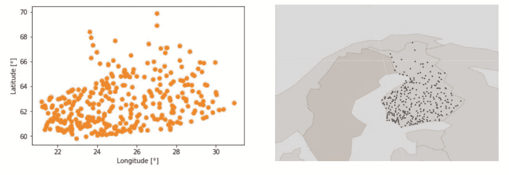
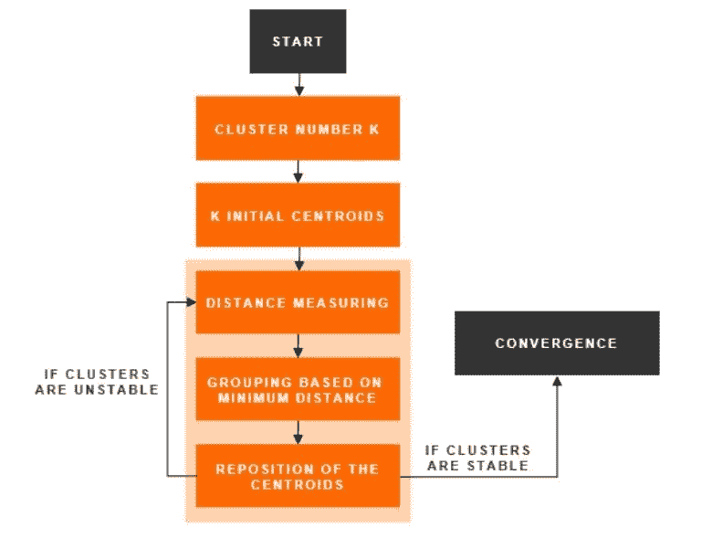
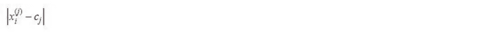
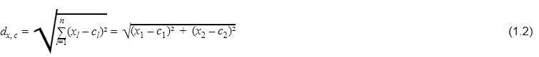
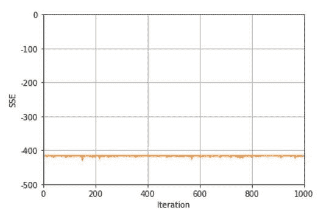
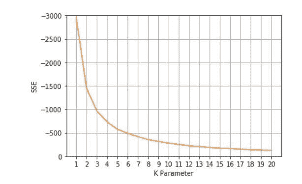
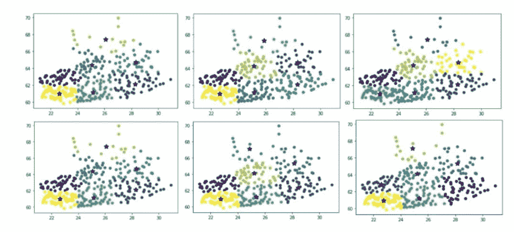
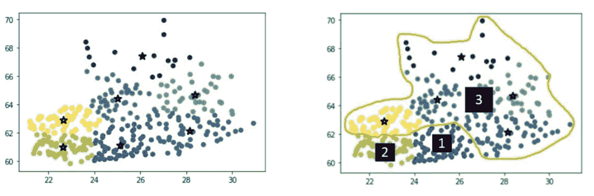

# Zalando 的营销 A/B 测试

> 原文：<https://towardsdatascience.com/marketing-a-b-testing-at-zalando-c069195bfe14?source=collection_archive---------15----------------------->

Zalando Office Tamara-Danz-Straße, Berlin-Friedrichshain

## [深入分析](https://medium.com/towards-data-science/in-depth-analysis/home)

## 使用聚类分析启用基于位置的 A/B 测试

供稿人:卡斯滕·拉希、托马斯·佩尔、马丁·卡斯滕、让·德·布雷西

Zalando 营销 A/B 测试分析的目标是得出营销行动的增量影响。这些分析的结果形成了在所有营销渠道中优化预算分配的基础，从而形成了高效的营销投资回报导向。这是我们在 Zalando 的*需求计划&分析*的 *A/B 测试团队*的任务。

我们的主要测试方法之一是地理实验，在这种实验中，我们将一个市场分成高度相关的区域组。测试组和控制组之间高度相关的销售行为是 geo A/B 实验的前提条件，因为测试和控制区域之间的低相关性会导致预测中的噪声，从而降低识别影响(如果有影响的话)的概率。芬兰是唯一一个营销渠道不以投资回报为导向的市场，因为基于地理位置的 A/B 测试在该国并不简单。这是因为大多数芬兰人生活在南部，仅乌西马地区就有约 30%的人口[1]。因此，订单总额的地区差异很大。芬兰北部地区的每日订单数量很少，因此在根据给定的地区总量(如联邦州、市)比较时间序列时，几乎不可能找到高度相关的组。

因此，我们需要为芬兰找到不同的位置定义。克服这个问题的一个解决方案是，与现有的区域定义相比，将国家分成更小的集群。以这种方式，可以增加区域分裂组合，因此也增加了发现“区域双生子”的可能性。这可以通过使用谷歌营销领域(GMA 的)来实现。但是，GMA 定义不适用于芬兰。

出于这个原因，我们创建了城市集群定义，以使芬兰可测试。这是通过 K-均值聚类分析方法实现的。

# 在城市位置数据中查找聚类

K-Means 聚类算法是在数据集中发现 K 个不同类别的相似对象的常用方法[2]。在这种情况下，聚类方法依赖于公开可用的城市位置数据[3]，包括带有芬兰 317 个城市的纬度和经度信息的 GPS 坐标[图 1]。

*Figure 1: GPS data of 317 Finnish locations, shown in a Cartesian coordinate system (left) and in a cylindrical projection map [4] (right).*

为了显示芬兰城市的区域分布，笛卡尔坐标被转换为柱坐标，并通过地理点绘图仪绘制在芬兰地图上[4]。所使用的数据集仅限于由广告投放系统控制的城市列表，如谷歌和脸书。如果输入数据还包括不可操纵的城市，则可能存在由于不干净的 A/B 测试分割而导致聚类结果不可用的风险，并且聚类内的观测值数量可能不足。

除了原始数据之外，算法[图 2]需要聚类数 K 作为输入。原因是，聚类是一种*无监督学习方法*【5】*，*意味着算法“从未标记的数据中发现[s]隐藏的结构”[6]，并且不会自动导出最佳 K 参数[7]。

*Figure 2: K-Means Clustering Algorithm.*

定义 K 参数后，K 均值聚类算法分 3 步进行[8]:

1.  在随机位置初始化 K 个聚类中心(质心);
2.  基于数据点和质心之间的最小欧几里德距离对数据进行分组；
3.  通过平均分配给相应聚类的所有数据点来重新计算聚类中心。

最后两步迭代重复，直到算法收敛到稳定的聚类分配。当簇内方差不能再降低时，达到收敛标准[7]，使得簇尽可能紧凑[9]。

更正式地说，给定 k 个簇的数据点{x1，…，xn}和质心{c1，…，ck}，这意味着“最小化[…]平方误差函数”[7]:

换句话说，等式 1.1 的目标是最小化所有组中聚类内距离平方和的总和。收敛的阈值是 1e-4 [10]。该表达式

上式中是欧氏距离函数，也可以写成[11]:

欧几里德距离是距离测量的常用度量，定义为“两个向量[11] x 和 c 的对应元素之间的平方差之和的平方根”。该度量用于根据数据点之间的最小距离将数据点分配到最近的质心[12]。

值得一提的是，该算法在任何情况下都收敛于局部最小值，而不一定是全局最小值[12]。这意味着不能保证当前结果是可能的最佳输出，因为初始质心的随机选择会导致每次运行的不同聚类结果。为了找到一个可能更好的结果，算法执行应该重复几次，如图 3 所示。

*Figure 3: Clustering score for a fixed K (K=7) after 1000 iterations.*

图 3 表明，平方距离之和(SSE)在 1000 次迭代步骤中并不完全稳定，这意味着由于随机起始参数，每次运行都可能产生略微不同的 SSE。

# 选择最佳聚类数

K 参数的值决定了聚类的数量，从而也决定了数据点向聚类的分配。在我们的例子中,“肘方法”被用作估计最佳聚类数 k 的常用技术。第二步，我们通过比较聚类之间的阶数来验证肘方法的结果。平衡聚类的订单量非常重要，因为太小的聚类产生的噪声数据会降低在 geo A/B 测试中获得显著结果的可能性。“弯管法”包括以下步骤[13]:

1.  针对不同的 K 值对数据集执行 K 均值算法，在这种情况下，K 的范围在 1 和 20 之间；
2.  计算每个 K 的城市和质心之间的 SSE
3.  在折线图中绘制结果。

SSE 随着 K 参数的增加而减小。所选择的 K 参数应该在它的值和 SSE 仍然很小的点。有一个 K，上证指数的下跌速度急剧变化，曲线开始变平。这是最佳的 K 参数，称为“肘点”。

*Figure 4: Clustering score for a range of different K parameters.*

图 4 显示，在这种情况下，拐点并不明显，但可以考虑 K 参数的范围，因为在曲线开始变平之前，从 1 到大约 8 的 K 值越小，SSE 下降的速率越高。为此，对不同 K 参数的这个值范围执行 K 均值算法。这样，通过比较相应的聚类结果并选择 K 值，可以找到最佳 K 参数，该 K 值产生总订单量的聚类内方差尽可能低的聚类分配。组内方差越低，高度相关组的概率越高，从而在 geo A/B 测试中检测到潜在影响的概率越高。

由于至少需要两个集群作为控制或测试组，K 参数 1 可以忽略。介于 2 和 6 之间的 k 值导致城市分组不理想，这反映在聚类之间的订单量差异很大。群集有序级别的高变化意味着该国被划分为人口密集的地区和农村地区。由于地区之间销售行为的差异较大，这可能导致较低的聚类内相关性，从而导致检测潜在影响的可能性较小。对于大于 6 的 K 值，最大的城市坦佩雷和赫尔辛基被单独分组，并且每个聚类的订单数更加均衡，这增加了高度相关的聚类的机会。

K 参数 K=7 被证明是所用数据集的最佳值，因为 K=8 的 K 参数不会导致聚类输出的进一步改善。原因是，这只是导致芬兰北部进一步分裂成一个额外的集群，这意味着该国人口较少的部分被分成更小的集群。结果是订单量的群内方差再次增加。

# K 参数的验证

由于初始质心是随机定位的，该算法每次运行都会产生不同的结果[14]。几次迭代之间的平方距离之和的偏差大小可以指示聚类算法的稳定性。为了弄清楚这一点，该算法已经执行了 1000 次，并且对每次运行都绘制了平方距离的总和(见图 3)。图 3 中绘制的线表明，虽然每次运行的算法输出不相同，但是 1000 次迭代之间的平方距离之和的变化很小。这意味着聚类结果仅略有不同，并且对于 K=7，聚类分数相当稳定。

为了分析几次运行的聚类结果之间的聚类分配的可变性，通过对 K=7 的固定 K 值重复该算法，产生了 6 个聚类输出(图 5)。

*Figure 5: Clustering results of 6 runs of the K-Means algorithm for K=7 with the 7 city clusters and their centroids (marked as stars).*

比较的角度是在 6 次算法运行中质心位置的可变性，以找出哪些聚类变化导致了聚类分数的小波动。聚类输出的比较表明，质心的位置在 6 次运行中保持相当稳定。这意味着聚类分配仅针对几个单独的城市而改变，最大比例的数据点在迭代中保持在同一个聚类中。

只有主要包括拉普兰地区的最北部集群显示出质心位置的可见变化。这是因为该区域的观测数量较少，导致它们之间的距离较大。因此，1000 次迭代之间的平方距离之和的变化(如上所述)可能主要是由位于北部的城市的相对不稳定的组分配引起的。如下所示，由于这些城市的聚类将与其相邻的聚类进行分组，因此可以忽略聚类分配的变化。

# 聚类结果:可测试的地理分割

K-Means 分类产生了七个城市集群及其中心(图 6 左侧)。为了确保每个聚类中的日订单量处于可测试的水平，五个较小的聚类被分组以形成一个较大的区域(图 6 右侧)。

*Figure 6: Result of the K-Means Cluster Analysis, showing the output with 7 clusters (left) and the final grouping into 3 geo testing regions (right).*

每日订单数量越少，数据中出现噪音的风险就越高。噪声数据的后果是聚类之间的相关性较低，因此检测潜在影响的概率较低。

结果，我们得到了三个地理分割区域:“赫尔辛基”(区域 1)、“坦佩雷”(区域 2)和“芬兰北部”(区域 3)。这种区域分割证明是一种可测试的设置，因为在 2018 年 10 月至 2019 年 1 月中旬的时间段内，区域时间序列之间的相关性达到约 98%的值(就总订单而言)。此外，在计算 2018 年全年的相关性时，这些值大致保持在相同的范围内(96%-98%)。

由于*赫尔辛基*是订单总量最大的地区，因此被分配到试验组，*坦佩雷*和*芬兰北部*被分配到对照组。测试区域应该具有最高的总订单份额，因为这是被测试通道被打开的组。这确保了测试活动在全国大部分地区运行，从而尽可能减少 geo A/B 测试的总印象数。这对于保证测试后的最佳活动范围非常重要，因为测试总是要求将一些地区从活动目标中排除。

为了验证这种分割，对这些区域进行了可能影响的测试。*赫尔辛基(试验组)*与两个地区*坦佩雷*和*芬兰北部(对照组)*之间的相对效应差异通过抬升分析进行测试。分析得出 0.2%的不显著效应(52%显著性)，两组之间的相关性为 99.5%。该结果证实了高度相关的总顺序行为，并且在测试之前，组之间没有显著差异，因为测量的效果接近于零，并且明显低于 90%的显著性水平。

聚类结果用于实施芬兰的首个地理分割设置。本次地理测试的目的是测量 2019 年 Zalando 赛季开始活动期间展示计划的增量性能。赫尔辛基*区域*被定义为测试组，在该测试组中，被测通道被打开并运行 4 周。另外两个区域*坦佩雷*和*芬兰北部*被设置为控制区域，这意味着在相应的城市中没有打开显示编程。测试停止后，可以计算对总订单的增量影响，这是测试组中观察到的数据和模型预测之间的累积每日差异。

这是 Zalando 芬兰投资回报指导的开始，因为该国的营销预算分配可能首次基于 A/B 测试结果。

# 局限性和后续步骤

在 2019 年 Zalando 赛季开始活动期间，对显示程序性地理分割测试的分析产生了重要而可信的结果。这意味着所示方法已被证明是在芬兰为 geo A/B 测试创建测试和控制区域的有用方法。尽管使用的测试设置产生了高度相关的组，但是仍然有优化集群的空间。考虑到当前的划分只包含 3 个组，并且尽管进行了测试，但仍应确保最佳的活动范围，因此重新分组的选项非常有限。这增加了发生系统性错误的风险，因为赫尔辛基地区可能会由于大都市和农村地区的人之间潜在的不同行为而导致大都市效应。重新聚类和使用具有更多可测试组的更可变的聚类有助于克服这个问题。为此，人口最稠密的地区*赫尔辛基*和*坦佩雷*可以进一步划分成更小的集群。更多数量的区域增加了区域分割组合，从而增加了 geo A/B 测试能力。

# 参考

[1]欧盟委员会， [*赫尔辛基-Uusimaa 地区*](https://ec.europa.eu/growth/tools-databases/regional-innovation-monitor/base-profile/helsinki-uusimaa-region)*(2019 年 2 月 15 日)，区域创新监测 Plus。*

*[2] M. Khan， [KMeans 聚类分类](/kmeans-clustering-for-classification-74b992405d0a)(2017 年 8 月 2 日)，走向数据科学。*

*[3] [*芬兰城市&城镇人口*](http://www.tageo.com/index-e-fi-cities-FI.htm)*(2004–2019)，Tageo -地理坐标信息。**

**[4] D .沃特金斯，[地理点绘图仪。*一个快速绘制出地理坐标列表的工具*](http://dwtkns.com/pointplotter/) (n. d.) *。***

**[5] P. Sayak，[*K-用 scikit 表示 Python 中的聚类-learn*](https://www.datacamp.com/community/tutorials/k-means-clustering-python)*(2018 年 7 月 5 日)，DataCamp 教程。***

***[6] G .塞尔丁， [*新课程:Python 中的无监督学习*](https://www.datacamp.com/community/blog/new-course-unsupervised-learning-in-python)*(2017 年 2 月 22 日)，DataCamp 教程。****

***[7] S. Sayad，[《数据科学导论》。*K-均值聚类*](https://www.saedsayad.com/clustering_kmeans.htm)*(2010–2019)。****

***[8] F. Doukkali， [*利用 K-means 算法进行聚类*](/clustering-using-k-means-algorithm-81da00f156f6) (12/19/2017)，走向数据科学。***

**[9] B. Boehmke， [UC 商业分析 R 编程指南。 *K-means 聚类分析*](https://uc-r.github.io/kmeans_clustering) (n. d .)，辛辛那提大学，大学讲座*。***

**[10]sci kit-学习开发者。[*sk learn . cluster . k means*](https://scikit-learn.org/stable/modules/generated/sklearn.cluster.KMeans.html)*(2007–2018)*。****

**[11] S. Borgatti， [*距离与相关性*](http://www.analytictech.com/mb876/handouts/distance_and_correlation.htm)*(2007 年春季)，多元统计，波士顿学院，大学讲座。***

***[12] A .特雷维尼奥，学习数据科学，[机器学习。*K-means 聚类简介*](https://www.datascience.com/blog/k-means-clustering)*(2016 年 12 月 6 日)。****

***[13] R. Gove， [*利用肘方法确定 k-means 聚类的最优聚类数*](https://bl.ocks.org/rpgove/0060ff3b656618e9136b)*(2017 年 12 月 26 日)，Robert Gove's Blocks。****

***[14] M. V. B. T. Santhi，V. R. N. Sai Leela，P. U. Anitha，& D. Nagamalleswari，[增强 K 均值聚类算法](https://pdfs.semanticscholar.org/0d42/74b71ad5ae9ec041e4b8dab06cc6deb5591a.pdf) (2011)。*国际计算机科学杂志&技术，IJCST* ， *2* (4)，73–77。***