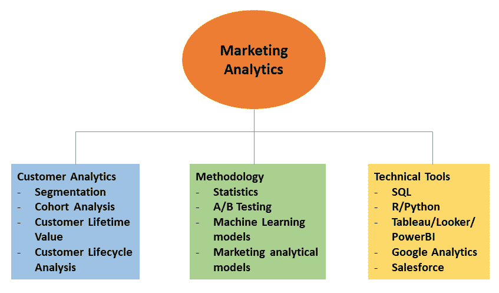

# 营销分析——任何人都可以做到

> 原文：<https://towardsdatascience.com/marketing-analytics-anyone-can-do-it-750d8ca63806?source=collection_archive---------9----------------------->

Marketing Analytics

就在几年前，与营销分析相关的工作还很少。那么现在，这个行业正在蓬勃发展，就业机会正在上升。原因可能是数据科学被广泛采用后，与市场营销自然结合。而且因为直接关系到一个公司的销售业绩，所以越来越受到重视。

我经常收到这些问题。营销分析是做什么的？我该怎么做？营销分析的职业道路是什么？本文就是要解决这些问题。

*   **营销分析通过分析营销数据优化公司投资回报率。**
*   **任何拥有数据分析技能、营销和产品意识的人都可以从事营销分析工作。**
*   **营销分析部门的工作范围很广，有能力领导一家公司的营销分析职能。**

这份工作主要服务于公司的营销部门。就是通过分析各类营销数据来优化回报率，以指导公司的资源配置。营销分析在我看来可以分为两个分支:**客户生命周期分析**和**营销渠道分析**(见下图)。

Image Copyright: Dr. Alan Zhang

营销的本质是面对和服务消费者。每个消费者都有他或她的生命周期。因此，营销分析的一个重要分支是客户生命周期分析。就是围绕消费者进行数据分析，产生洞察来指导营销活动。具体来说，它包括市场细分、消费者终身价值分析、获取新客户、维护老客户和提高客户参与度等分析。其中，企业对企业的营销(B2B 营销)，由于其购买过程的独特性，会有一些特定的分析，如需求漏斗分析，线索评分，等等。

营销分析的另一个重要分支是营销渠道分析。营销信息的传播依赖于渠道或媒介，如何高效地让消费者接收信息非常重要。信息的制作和渠道的部署需要资金和人力。因此，每个公司的当务之急是分配资源，使投资回报最大化。要做到这一点，需要一系列研究和分析的支持。

信息从渠道传播出去后，我们需要通过技术进行跟踪，衡量每一条信息/渠道的效果。一般来说，消费者在购买之前会通过多种渠道收到多种营销信息。我们需要准确地归因，以帮助公司获得正确的反馈。在这上面，我们会用一些统计模型比如营销组合建模，从各种因素中剔除无关信息，得到相应的影响参数。这些参数最终将用于优化资源分配的决策。

因为每个渠道/媒体都有其独特性，企业往往需要通过数据分析来优化渠道。例如，在电子邮件营销中，何时发送给哪些消费者会影响打开率和点击率。随着消费者在网上花费越来越多的时间，数字营销分析已经成为许多公司的首要任务，涉及搜索引擎优化、社交媒体优化等分析。程序化广告也是一个方向，目标是优化曝光，最大化转化率。

**相关技能有哪些？**

在最高级别，它是使用分析方法在复杂多样的数据中发现模式的能力，并生成可供营销人员决策使用的商业见解。我具体阐述如下(见下图)。

Image Copyright: Dr. Alan Zhang

第一，你要有分析常见营销问题的能力。与咨询行业的案例研究一样，它遵循一个特定的框架。例如，电子邮件营销团队需要您帮助开展一项活动。首先，你可能想确定事件的性质，是品牌曝光、促销还是事件。第二，你可以决定哪些指标需要优化，是打开率，点击率，购买率，还是用户参与度。再者，你可以确定目标群体是谁，是潜在客户还是长期不购买的老客户。还有，活动举办后，你需要确定用什么方法来分析活动的效果和影响范围。一些传统的分析方法是细分、群组分析、客户终身价值等。

第二，你应该具备基本的统计学知识，以及建立统计学或机器学习模型来解释和预测行为的能力。扎实的统计知识确保产生的业务洞察具有统计意义，例如 A/B 测试。各种类型的机器学习模型可以帮助你从数据中快速提取模式，预测未来的行为。仅仅知道如何使用一个包或者编写算法是不够的。更重要的是能够提出正确的业务问题，并使用这些工具来解决它们。此外，一些具体的营销分析方法，如营销组合模型和流失模型，也是很好的了解。

再者，你也要有技术能力。它包括使用 SQL 从数据库中提取有用的信息，以及使用 R 或 Python 处理数据和建立预测模型。知道数据可视化工具也是很可爱的，比如 Tableau，Looker，PowerBI 等。，并将分析结果呈现给职能合作伙伴。知道如何使用第三方管理工具更好，例如用于网站流量跟踪的 Google Analytics、用于 CRM 的 Salesforce 等等。

最后但同样重要的是，最关键的能力是向你的听众简明扼要地传达复杂的技术问题，以影响决策。如图 1 所示，营销分析服务于营销职能，但也需要与其他部门合作，如销售、产品、工程等。因此，你能否让招聘经理相信你能有效沟通，将是需要评估的软技能。

如何获得这些技能？

熟能生巧！你可以在网上找资源学习基础知识，比如网络课程、博客、书籍等。，并做一些相关的项目。如果你能找到在该领域更有经验的同行作为导师，学习将更有效率，并有助于避免一路上走弯路。

作者简介:Alan Zhang 博士以前是一名市场营销教授，他的研究兴趣是电子邮件营销、客户生命周期管理和客户终身价值。《哈佛商业评论》报道了他对[客户温贝克的研究。他现在是 GitHub 的营销分析经理。](https://hbr.org/2016/03/winning-back-lost-customers)

在业余时间，他教授营销分析的各种主题。他在 Udemy 上有一门关于[客户终身价值的入门课程。补充这篇文章的是 PASS(数据专业人士社区)邀请他做的一次演讲，主题是](https://www.udemy.com/course/customer-acquisition-cost-and-customer-lifetime-value/?referralCode=0B26513CB2EBD4E0341E)[营销分析:为什么、做什么和如何做](https://appdev.pass.org/MeetingDetails.aspx?EventID=14293)。