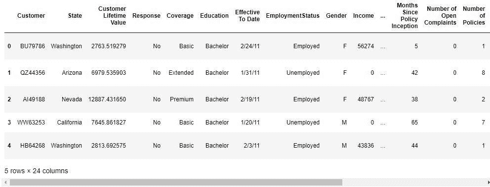
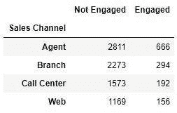
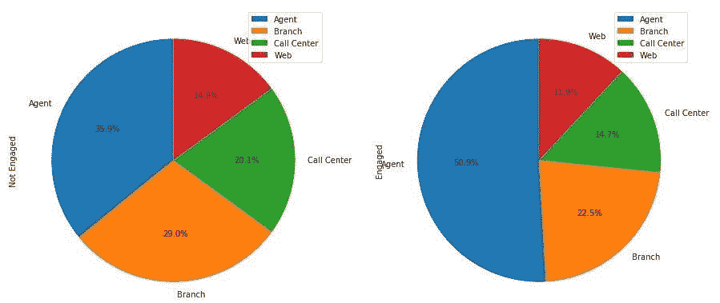
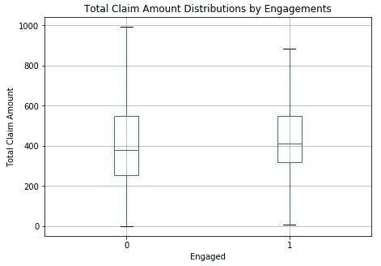
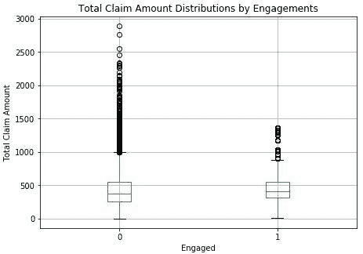
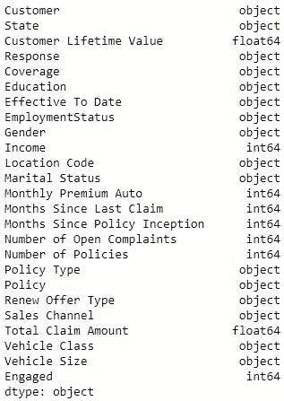
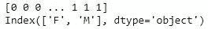

# 营销分析:客户 EDA 回归

> 原文：<https://towardsdatascience.com/marketing-analytics-customer-eda-regression-482e3191549a?source=collection_archive---------17----------------------->


最近，我一直在做一些数据科学营销咨询，并希望分享一些在此过程中应用的技能。在本文中，我们将回顾探索性数据分析(EDA ),以及应用逻辑回归对客户进行的营销活动。

在营销活动中，客户参与度是衡量营销努力的一个关键指标。例如，电子邮件客户参与度可以通过打开或未打开的电子邮件数量来衡量[1]。有利可图的营销活动将创造大量的参与度。另一方面，糟糕的营销会让顾客远离你的生意。我们都经历过——收到烦人的广告。有时，当我确实需要他们的服务时，我会从他们的直接竞争对手那里购买。

EDA 帮助我们理解为什么要使用数据。借助 EDA，您可以分析对结果至关重要的驱动因素。回归是一种工具，可以用来检查驱动因素和预期结果之间的关系。我们将回顾逻辑回归模型来分析是什么创造了更好的客户参与度。有趣的数据科学访谈事实上，逻辑回归是为寻找二元结果而创建的(例如，是/否、癌症/没有癌症、已购买/未购买等)。) [2].

*数据集取自:*[*https://www . ka ggle . com/pankajjsh 06/IBM-Watson-marketing-customer-value-data/downloads/IBM-Watson-marketing-customer-value-data . zip/1*](https://www.kaggle.com/pankajjsh06/ibm-watson-marketing-customer-value-data/downloads/ibm-watson-marketing-customer-value-data.zip/1)

# 加载数据

```
#Load up packages and data
import matplotlib.pyplot as plt
import pandas as pd
import statsmodels.api as smmdata = pd.read_csv('WA_Fn-UseC_-Marketing-Customer-Value-Analysis.csv')

#How big the data set is:
mdata.shape
```

(9134, 24)

```
#Taking a look at the values
mdata.head()
```



客户参与的期望输出是 Response 列，它不会被转换为数字。逻辑回归模型喜欢用数字来表示值，所以我们必须帮助它。

```
#Converting our target/output variable into a numerical
mdata['Engaged'] = mdata['Response'].apply(lambda x: 0 if x == 'No' else 1)
```

# 检查参与率

接下来，我们将检查参与率，即接触过我们营销的客户的百分比。

```
engagement_rate_mdata = pd.DataFrame(mdata.groupby('Engaged').count()['Response'] / mdata.shape[0] * 100.0)
engagement_rate_mdata
```



有更多的客户没有参与我们的营销，所以从原始数据进行分析是很困难的。为了使分析更容易，我们将构建饼图。

```
engagement_by_sales_channel_mdata.plot(kind='pie',figsize=(15, 7),startangle=90,
    subplots=True,autopct=lambda x: '%0.1f%%' % x)plt.show()
```



从这些图表中可以看出，约一半的参与客户来自代理商，而未参与客户分布在不同的渠道。

# 索赔总额

在我们开始回归分析之前，我们先来看看箱线图中的总索赔额。

```
ax = mdata[['Engaged', 'Total Claim Amount']].boxplot(
    by='Engaged',showfliers=False,figsize=(7,5))ax.set_xlabel('Engaged')
ax.set_ylabel('Total Claim Amount')
ax.set_title('Total Claim Amount Distributions by Engagements')plt.suptitle("")
plt.show()
```



箱线图是查看连续变量分布的好方法。矩形代表第一个四分位数到第三个四分位数，绿线代表中位数。末端是最小值和最大值。showfliers=False 允许我们发现可疑的异常值，如下所示:

```
ax = mdata[['Engaged', 'Total Claim Amount']].boxplot(
    by='Engaged',showfliers=True,figsize=(7,5))ax.set_xlabel('Engaged')
ax.set_ylabel('Total Claim Amount')
ax.set_title('Total Claim Amount Distributions by Engagements')plt.suptitle("")
plt.show()
```



圆点是基于四分位距(IQR)的可疑异常值。可疑异常值的公式是第三个四分位数以上 1.5 *IQR 或第一个四分位数以下 1.5* IQR。

# 回归分析

在回归中，特征变量需要是连续的，因此可以找到特征的线性组合来估计输出变量。现在，让我们检查一下特征变量，它们符合我们的逻辑回归模型。

```
mdata.dtypes
```



连续变量是没有“对象”数据类型的变量。

```
continuous_vars = ['Customer Lifetime Value', 'Income', 'Monthly Premium Auto', 
    'Months Since Last Claim', 'Months Since Policy Inception', 
    'Number of Open Complaints', 'Number of Policies', 'Total Claim Amount']
```

接下来，我们需要将分类变量转换成数字变量。一种方法是因式分解。

```
gender_values, gender_labels = mdata['Gender'].factorize()
print(gender_values)
print(gender_labels)
```



在因式分解中，变量变成了 1 或 0。但是如果顺序很重要呢？我们可以应用分类函数。

```
categories = pd.Categorical(
    mdata['Education'], categories=['High School or Below', 'Bachelor', 'College', 'Master', 'Doctor'])
```

现在，数字 0、1、2、3 和 4 分别适用于高中或以下、学士、大学、硕士和博士的教育。这将允许我们将数据放入逻辑模型中。

```
mdata['GenderFactorized'] = gender_values
mdata['EducationFactorized'] = categories.codes
```

让我们把分类变量和连续变量结合起来！

```
logit = sm.Logit(
    mdata['Engaged'], 
    mdata[['Customer Lifetime Value','Income','Monthly Premium Auto',
        'Months Since Last Claim','Months Since Policy Inception','Number of Open Complaints',
        'Number of Policies','Total Claim Amount','GenderFactorized','EducationFactorized']])logit_fit = logit.fit()logit_fit.summary()
```

z(z-score 的缩写)是平均值的标准偏差数[3]。P>|z|(表示 P 值)表示偶然观察到关系的可能性。通常，0.05 是 p 值的标准临界值，小于 0.05 的值意味着输入和输出变量之间的这种关系发生巧合的可能性较小。例如，在数字变量中，我们可以看到收入、每月保费汽车、自上次索赔以来的月数、自保单开始以来的月数以及保单数量变量与参与度(输出变量)有显著关系。如果我们观察自上次索赔以来的月份变量，它是显著的(p 值非常低),并且与敬业度负相关(z 值为负)。换句话说，随着索赔时间的推移，客户不太可能参与营销。

从分类变量中，我们可以看到男性(0)不太可能从事营销，这同样适用于较低的教育水平(0 代表高中，4 代表博士)。

# 结论

很好，现在你有了另一个 EDA 工具——逻辑回归。作为总结，我们以表格形式检查了接洽率，以饼图形式检查了销售渠道以便于解释，以箱线图形式检查了总索赔额以查看范围和潜在异常值，并通过回归分析发现了强劲的趋势。现在，您可以利用逻辑回归来隔离趋势，然后将其输入到另一个机器学习模型中，而不是在输出中使用逻辑回归作为预测模型！

*边注:如何堆叠机器学习模型的例子可以看这里:* [*https://towardsdatascience . com/machine-learning-pipelines-nonlinear-model-stacking-668 f2b 720344*](/machine-learning-pipelines-nonlinear-model-stacking-668f2b720344)

免责声明:本文陈述的所有内容都是我个人的观点，不代表任何雇主。

# 参考

[1] Marketo，参与营销(2019)，[https://www.marketo.com/engagement-marketing/](https://www.marketo.com/engagement-marketing/)

[2] S. Swaminathan，logistic Regression(2018)，[https://towards data science . com/logistic-Regression-detailed-overview-46 C4 da 4303 BC](/logistic-regression-detailed-overview-46c4da4303bc)

[3] Y. Hwang,《营销数据科学实践》( 2019 年),派克特出版社