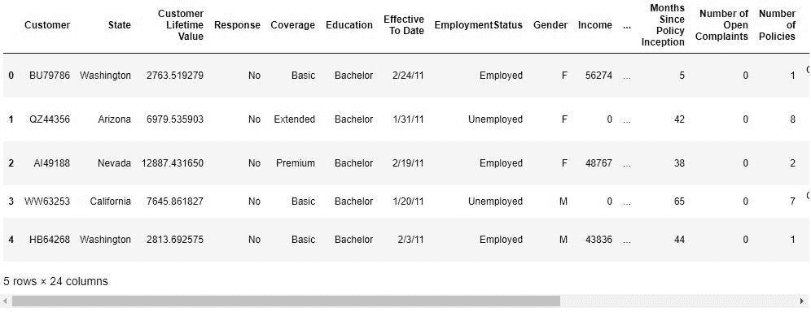
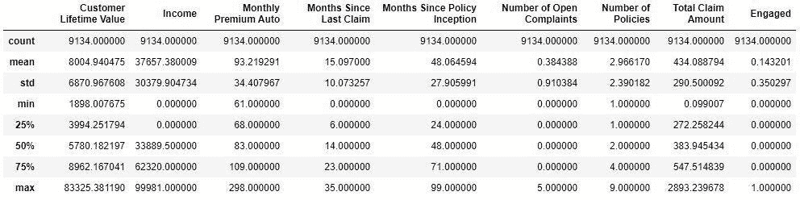
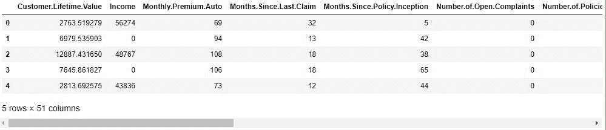
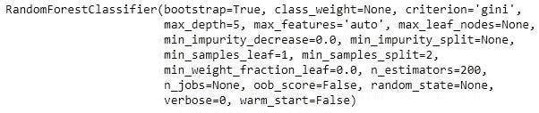
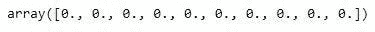
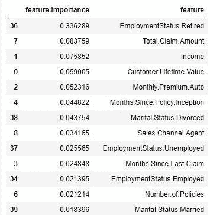
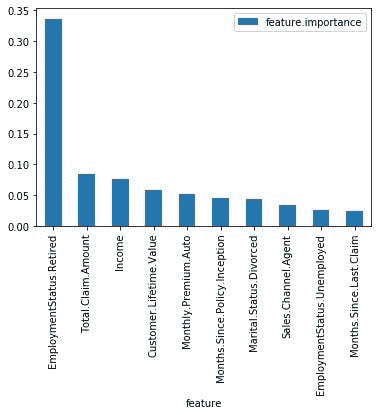
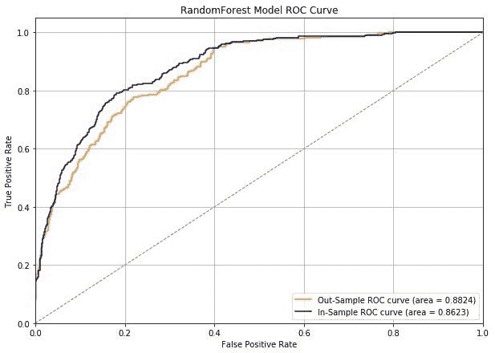

# 营销分析:客户参与，随机森林风格

> 原文：<https://towardsdatascience.com/marketing-analytics-customer-engagement-random-forest-style-7df06a390979?source=collection_archive---------11----------------------->


我们将讨论如何建立一个关于客户营销参与的随机森林预测模型。通过更好地预测客户将如何参与某些营销活动，营销人员可以为不同的受众量身定制策略[1]。我们在这里寻找的官方营销术语是“参与的可能性”一个具体的例子是区分哪种类型的客户会对哪种类型的广告做出反应(例如，20-39 岁的女性对脸书广告和谷歌广告的反应——完全是编造的)。

# 数据设置

今天的数据由 ka ggle[2]:
[*https://www . ka ggle . com/pankajjsh 06/IBM-Watson-marketing-customer-value-data/downloads/IBM-Watson-marketing-customer-value-data . zip/1*](https://www.kaggle.com/pankajjsh06/ibm-watson-marketing-customer-value-data/downloads/ibm-watson-marketing-customer-value-data.zip/1)慷慨提供

是时候导入所有的包了。

```
import matplotlib.pyplot as plt
import pandas as pd
%matplotlib inline
from sklearn.model_selection import train_test_split
from sklearn.ensemble import RandomForestClassifier
from sklearn.metrics import accuracy_score, precision_score, recall_score
from sklearn.metrics import roc_curve, auc
```

接下来，带来数据。

```
#load data
df = pd.read_csv('WA_Fn-UseC_-Marketing-Customer-Value-Analysis.csv')
custd.head()
```



作为模型输出的“响应”变量不是一个数字。这将被调整成一个数字，否则 Python 会发疯的。

```
#Encoding output variable
custd['Engaged'] = custd['Response'].apply(lambda x: 1 if x == 'Yes' else 0)
```

应用功能将“是”的回答转换为“1 ”,将其他所有回答转换为“0”。“是”表示客户参与了，而“否”表示没有参与。所以平均参与率是

```
custd['Engaged'].mean()
```

0.1432，意味着我们的平均参与率大约为 14%。现在，你知道为什么他们说销售是一个数字游戏。只有少数人说是。

# 特征工程

让我们来看看我们的客户参与模型的特性。

```
#Checking out features
custd.describe()
```



酷，我们用 describe 隔离了所有的数值或连续列。

```
continuous_features = ['Customer Lifetime Value', 'Income', 'Monthly Premium Auto',
'Months Since Last Claim', 'Months Since Policy Inception',
'Number of Open Complaints', 'Number of Policies', 'Total Claim Amount']
```

现在，来处理所有的分类栏目。

```
columns_to_encode = ['Sales Channel', 'Vehicle Size', 'Vehicle Class', 'Policy', 'Policy Type', 
    'EmploymentStatus', 'Marital Status', 'Education', 'Coverage']categorical_features = []
for col in columns_to_encode:
    encoded_df = pd.get_dummies(custd[col])
    encoded_df.columns = [col.replace(' ', '.') + '.' + x for x in encoded_df.columns]

    categorical_features += list(encoded_df.columns)

    custd = pd.concat([custd, encoded_df], axis=1)

custd['Is.Female'] = custd['Gender'].apply(lambda x: 1 if x == 'F' else 0)categorical_features.append('Is.Female')
```

在将所有需要的变量编码成数字后，我们需要将所有内容组合回一个数据框架中。

```
all_features = continuous_features + categorical_features
response = 'Engaged'
sample_custd = custd[all_features + [response]]
sample_custd.columns = [x.replace(' ', '.') for x in sample_custd.columns]
all_features = [x.replace(' ', '.') for x in all_features]

sample_custd.head()
```



在一些特征工程之后总是检查你的数据以确保你没有错过任何东西，这不是一个坏主意。在我们的例子中，看起来我们成功地将所有东西都转换成了数字。现在来看模型！

# 构建随机森林

我们需要做的第一件事是在训练集和测试集之间分割数据，以便稍后进行评估。

```
# model phase - train/test
x_train, x_test, y_train, y_test = train_test_split(sample_custd[all_features], sample_custd[response], test_size=0.3)
```

现在我们可以训练和拟合随机森林模型。请随意调整模型设置，以获得更好的解决方案。

```
#Building random forest model
rf_model = RandomForestClassifier(n_estimators=200,max_depth=5)#Features
X = x_train
#Output
y = y_train#Fit model to training data
rf_model.fit(X, y)
```



另外，在随机森林中，你可以看到一棵树是如何投票的。

```
#looking at individual trees
rf_model.estimators_

#individual tree setting
rf_model.estimators_[0]

#individual tree prediction
rf_model.estimators_[0].predict(x_test)[:10]
```



上面的数组是 0 号树对前 10 个样本的投票结果。很酷，对吧？回到 random forest，我们来看看模型是怎么想的，哪些功能对客户参与度最重要。

```
#Examining what RF thinks are important features
rf_model.feature_importances_

feature_importance_df = pd.DataFrame(list(zip(rf_model.feature_importances_, all_features)))
feature_importance_df.columns = ['feature.importance', 'feature']featsorted = feature_importance_df.sort_values(by='feature.importance', ascending=False)
featsorted
```



好吧，那是一张长桌子。让我们以图形的形式让它更容易阅读——十大最重要的特性。

```
featsortedtop10 = featsorted.head(10)featsortedtop10.plot(kind='bar', x='feature')
```



根据 random forest 模型，退休员工最倾向于参与我们的营销工作。这并不奇怪，因为我们的数据集是关于一家保险公司的营销。

# 模型评估

```
in_sample = rf_model.predict(x_train)
out_sample = rf_model.predict(x_test)print('In-Sample Accuracy: %0.4f' % accuracy_score(y_train, in_sample))
print('Out-of-Sample Accuracy: %0.4f' % accuracy_score(y_test, out_sample))
```

样本内精度:0.8746

样本外精度:0.8814

准确度是正确预测的数量除以预测的总数。基本上，随机森林模型在预测谁将参与营销活动方面是正确的。

```
print('In-Sample Precision: %0.4f' % precision_score(y_train, in_sample))
print('Out-of-Sample Precision: %0.4f' % precision_score(y_test, out_sample))
```

样本内精度:0.9574

样本外精度:0.8714

精度是真阳性的数量除以真阳性和假阳性的数量。当你想知道预测有多正确时，你需要精确。例如，有多少客户实际参与了 X 营销活动，而不是那些被预测参与和没有参与的客户。

```
print('In-Sample Recall: %0.4f' % recall_score(y_train, in_sample))
print('Out-of-Sample Recall: %0.4f' % recall_score(y_test, out_sample))
```

样本召回率:0.1450

样本外召回:0.1618

召回是真阳性的数量除以真阳性和假阴性的数量。换句话说，有多少模型正确地预测了与 X 活动接触的客户，而不是那些实际接触的客户。

当我学习精确和回忆的区别时，我有点困惑。对我有帮助的是看到一个好的和另一个坏的区别。例如，高精度和低召回率可以发现目标输出，但是会遗漏一些目标输出机会。另一方面，高召回率和低精确度可能导致发现所有目标输出，但是预测实际上没有的目标输出。

```
# ROC and AUC curves
in_sample = rf_model.predict_proba(x_train)[:,1]
out_sample = rf_model.predict_proba(x_test)[:,1]
in_sample_fpr, in_sample_tpr, in_sample_thresholds = roc_curve(y_train, in_sample)
out_sample_fpr, out_sample_tpr, out_sample_thresholds = roc_curve(y_test, out_sample)
in_sample_roc_auc = auc(in_sample_fpr, in_sample_tpr)
out_sample_roc_auc = auc(out_sample_fpr, out_sample_tpr)print('In-Sample AUC: %0.4f' % in_sample_roc_auc)
print('Out-Sample AUC: %0.4f' % out_sample_roc_auc)
```

样本内 AUC: 0.8824

样本外 AUC: 0.8623

```
plt.figure(figsize=(10,7))plt.plot(
    out_sample_fpr, out_sample_tpr, color='darkorange', label='Out-Sample ROC curve (area = %0.4f)' % in_sample_roc_auc
)
plt.plot(
    in_sample_fpr, in_sample_tpr, color='navy', label='In-Sample ROC curve (area = %0.4f)' % out_sample_roc_auc
)
plt.plot([0, 1], [0, 1], color='gray', lw=1, linestyle='--')
plt.grid()
plt.xlim([0.0, 1.0])
plt.ylim([0.0, 1.05])
plt.xlabel('False Positive Rate')
plt.ylabel('True Positive Rate')
plt.title('RandomForest Model ROC Curve')
plt.legend(loc="lower right")plt.show()
```



ROC 曲线显示了真阳性和假阳性的比率，您希望曲线最快到达左上角以获得最佳模型性能。我们的样本内和样本外曲线都没问题。如果两者之间的差距越来越大，那么这是一个迹象，表明该模型过于适合训练数据，而没有找到营销参与的一般模式[4]。

# 结论

恭喜，我们已经从头到尾建立了一个营销客户参与随机森林模型。首先，我们做了一些简单的数据探索，并对数据进行了特征工程处理，使之成为数值。接下来，我们创建了随机森林模型，并查看了各个决策树。之后，我们评估了训练集和测试集的数据，得到了一个非常好的 ROC 曲线。从我们的数据来看，客户退休似乎是一个关键特征，而总索赔和收入接近。向前发展的业务解决方案可以建议总是预先获取这些数据点。

免责声明:本文陈述的所有内容都是我个人的观点，不代表任何雇主。

# 参考

[1] A. McEachern，什么是客户参与，为什么它很重要？(2019)[https://blog . smile . io/什么是客户参与度以及它为什么重要](https://blog.smile.io/what-is-customer-engagement-and-why-is-it-important)

[2] IBM Watson，营销客户价值数据(n . d .)
https://www . ka ggle . com/pankajjsh 06/IBM-Watson-Marketing-Customer-Value-Data/downloads/IBM-Watson-Marketing-Customer-Value-Data . zip/1

[3] B. Mikulski，Precision vs . recall-explain(n . d .)[https://www . mikulskibartosz . name/Precision-vs-recall-explain/](https://www.mikulskibartosz.name/precision-vs-recall-explanation/)

[4] Y. Hwang,《营销数据科学实践》( 2019 年),派克特出版社