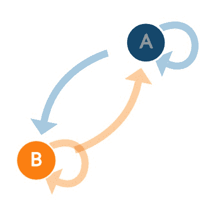
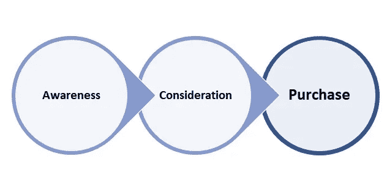
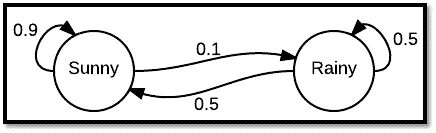
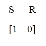
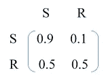
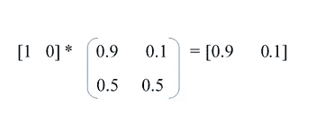
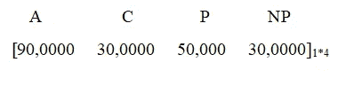
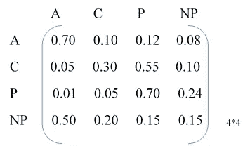
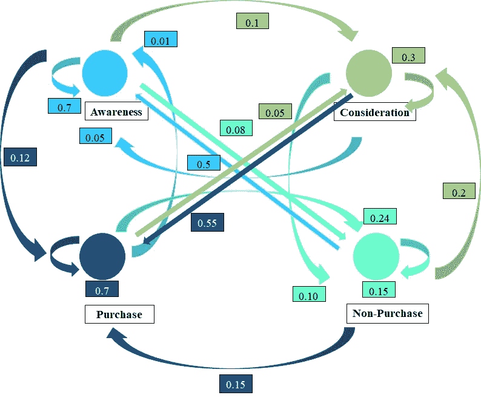
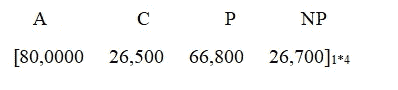

# 通过马尔可夫链进行营销分析

> 原文：<https://towardsdatascience.com/marketing-analytics-through-markov-chain-a9c7357da2e8?source=collection_archive---------11----------------------->

## 通过马尔可夫链了解客户的下一步行动

Image Source : [http://setosa.io/ev/markov-chains/](http://setosa.io/ev/markov-chains/)

假设你是一家在市场上销售快速消费品的公司。

让我们假设客户将遵循以下流程进行最终购买:

这些是客户在购买过程中的任何时候都会处于的状态。

现在，如何找出客户在 6 个月后会处于哪种状态？

马尔科夫链来救援了！！

我们先来了解一下什么是马尔可夫链。

# **马尔可夫链:**

**马尔可夫链**是描述一系列可能事件的随机模型，其中每个事件的概率仅取决于前一个事件达到的状态

> 马尔可夫链是在概率上彼此相关的连续事件。
> 
> 这些事件也称为状态
> 
> 这些状态一起形成了所谓的状态空间。
> 
> 下一个事件或下一个状态的概率只取决于当前状态，而不取决于先前的状态。马氏链的这个性质叫做无记忆性。它不关心过去发生了什么，只关注当前的信息来预测下一个状态会发生什么。

**马尔可夫链——状态、概率和转移矩阵**

让我们深入一点。

马尔可夫链提供了

> 关于当前状态的信息

&

> 从一种状态转移到另一种状态的转移概率

利用以上两个信息，我们可以预测下一个状态。

用数学术语来说，当前状态称为初始状态向量

所以，我们得到的是:

**最终状态=初始状态*转移矩阵**

## **经典例子**

马尔可夫链的一个经典例子是预测天气。我们有两种不同的天气状况:晴天和雨天。让我们假设今天是晴天。我们有以下可能性:

> 假设今天是晴天，明天是晴天的概率(处于相同状态的概率):0.9
> 
> 假设今天是晴天，明天下雨的概率:0.1
> 
> 假设今天下雨，明天是晴天的概率(处于相同状态的概率):0.5
> 
> 假设今天下雨，明天下雨的概率(处于相同状态的概率):0.5

Source: [Wikipedia](https://en.wikipedia.org/wiki/Examples_of_Markov_chains)

这里的初始向量是:

转换矩阵=

第二天的天气=

回忆一下**终态=初态*转移矩阵？**以上代表相同。

那么推论是什么呢？

第二天有 90%的可能性天气晴朗，10%的可能性下雨。

# **回到问题**

回到问题上来，我们需要知道产品发布 6 个月后客户的状态。

我们可以假设客户在任一时间点可能处于 4 种状态！！

1.意识

2.考虑

3.购买

4.不购买

**我们有以下信息:**

> 客户总数= 200，000
> 
> 每个州/类别的客户数量
> 
> 从一个状态转移到另一个状态的转移概率
> 
> 关于在这几个月开展的一些活动或广告的信息(活动/广告的目的是增加购买产品的客户数量)

# **营销分析目标:**

> 获得 6 个月后所有 4 个州的客户数量
> 
> 评估该活动在增加购买该产品的顾客数量方面是否有效

所以，让我们深入数学部分。

注:A —认知，C —考虑，P —购买，NP —不购买

初始状态向量=

转换矩阵=

可以更清楚地看到所有 4 个状态之间的运动:

顾客的最终状态=初始状态向量*转移矩阵

**结果评估**

现在让我们评估我们的结果。

起始向量

最终向量

我们可以注意到,“了解”和“考虑”的人数有所减少。这是一件好事，因为人们实际上从“意识”和“考虑”状态转移到了“购买”状态(增长了近 34%！！)还要注意，处于“不购买”状态的人数减少了(减少了 11%)。

**总的来说，我们的分析表明活动/广告奏效了！！**

马尔可夫链在营销分析和 NLP 等其他领域有许多其他应用。

敬请关注更多文章…

如果你喜欢我的文章，请给它几个掌声！！！

更多详情，请联系我:

网址:[https://www.arymalabs.com/](https://www.arymalabs.com/)

另外，一定要看看我们在 MMM 上的视频:

[领英](https://www.linkedin.com/in/ridhima-kumar7/)

[推特](https://twitter.com/kumar_ridhima)

**版权所有 2018**[https://www.arymalabs.com/](https://www.arymalabs.com/)**版权所有。**