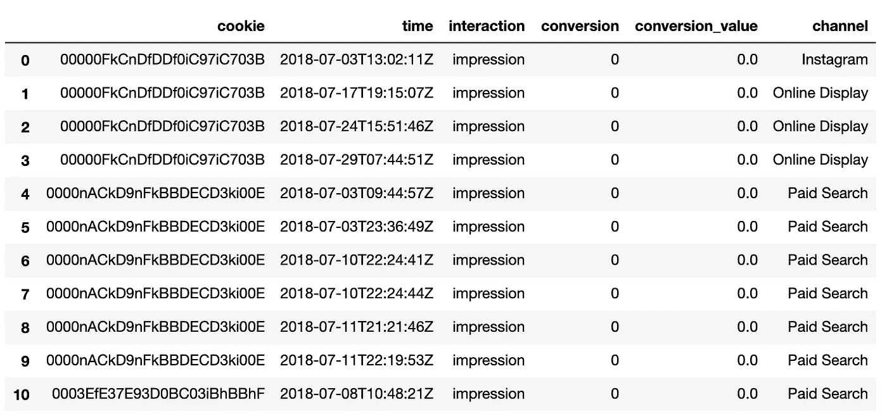
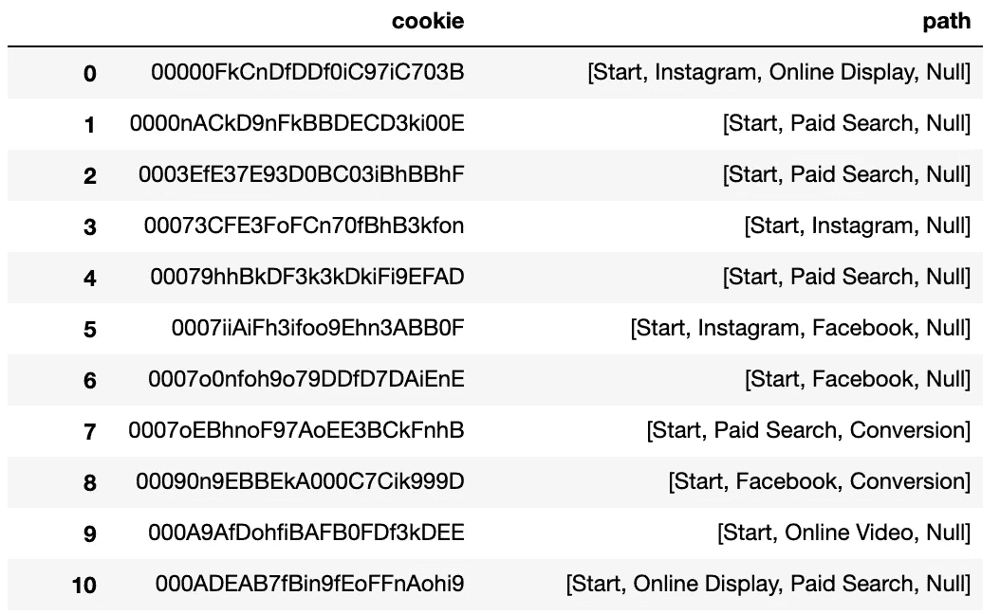
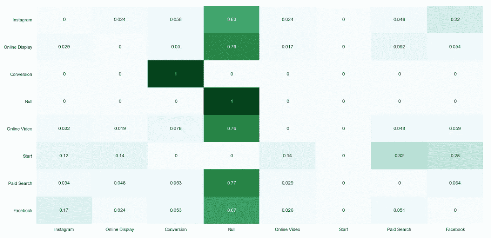
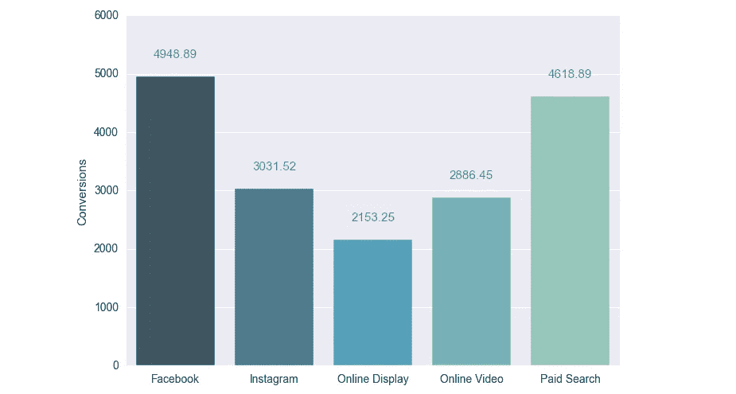

# Python 中 Markov 链的营销渠道属性——第 2 部分:完整演练

> 原文：<https://towardsdatascience.com/marketing-channel-attribution-with-markov-chains-in-python-part-2-the-complete-walkthrough-733c65b23323?source=collection_archive---------3----------------------->

在渠道属性的背景下，arkov chains 为我们提供了一个框架，以统计方式模拟用户旅程，以及每个渠道如何考虑用户从一个渠道到另一个渠道的旅行，最终转换(或不转换)。通过使用这些转移概率，我们可以确定单个渠道对我们总转化率的统计影响。

关于营销归因和马尔可夫链的更多细节，[参见第 1 部分](https://medium.com/@mortenhegewald/marketing-channel-attribution-using-markov-chains-101-in-python-78fb181ebf1e)。

[在关于这个](https://medium.com/@mortenhegewald/marketing-channel-attribution-using-markov-chains-101-in-python-78fb181ebf1e)主题的第一部分中，我们讨论了什么是营销归因，为什么准确和正确的归因越来越重要，以及马尔可夫链背后的理论如何应用于这个领域。

虽然那篇文章包含了如何以编程方式将马尔可夫链应用于 Python 中的示例客户数据集的实际例子，但它也涉及到对 R 包[channel attribute](https://cran.r-project.org/web/packages/ChannelAttribution/index.html)的严重依赖。

对于生产应用程序来说，这种对独立软件和语言的依赖程度并不理想，相反，我们希望将整个归属过程放在一个应用程序中——在本例中是 Python。

在本文中，我将通过实际的代码示例来说明如何实现这一点。

# 数据

对于这个更新的演练，我已经更新了数据集，以便与我们在实际生产环境中可能遇到的数据格式更加一致。**数据集可以在** **这里下载** [**。**](https://www.dropbox.com/sh/m5d8u7inolw32xu/AADuHNcGToa7ajTcF_JjEkcca?dl=0)

对于每一个独特的客户和访问我们的数据集这一次包含以下信息在每一行:

*   Cookie:随机生成的客户 id，使我们能够将后续访问与同一个客户联系起来
*   时间戳:访问发生的日期和时间
*   交互作用:分类变量，表示发生的交互作用的类型
*   Conversion:指示转换是否发生的布尔变量
*   转换值:潜在转换事件的值
*   渠道:将客户带到我们网站的营销渠道

该数据集包含约 240，000 名独立客户的约 586，000 个营销接触点，这些接触点产生了约 18，000，000 次转化事件。在表格格式中，数据集将如下所示:

# 数据预处理

为了将我们的数据转换成适用于马尔可夫链算法的理想格式，我们需要做一些预处理。

我们将从导入熊猫开始，加载我们的数据集，并创建一个列来指示每个用户的接触点顺序:

接下来，我们希望将数据框从长格式格式化为宽格式，因此我们最终将得到一个数据框，其中包含每个用户一行，以及一个接触点列表中按时间顺序排列的用户旅程总数。

我们首先将按时间顺序排列的接触点分组到一个列表中，将最终转换/非转换事件的列表合并到该数据框中，最后在用户旅程列表的末尾添加一个“空”或“转换”事件。

这将为我们提供一个如下所示的数据框架:

# 马尔可夫链

我们现在可以转向实际的马尔可夫链方法。

马尔可夫链的算法可以总结为两个步骤:

*   计算状态空间中所有状态之间的转移概率
*   计算移除效应(关于移除效应的更多信息，参见第 1 部分

我们将从定义所有用户旅程、总转化率和基础转化率的列表开始。所有我们以后会用到的东西:

接下来，我们将定义一个函数来识别所有潜在的状态转换，并输出包含这些转换的字典。在计算转移概率时，我们将使用它作为输入:

并且计算所有转移概率的函数可以定义为:

上面应该给我们留下一个字典，其中包含所有的转换以及给定历史数据时它们各自的转换概率。

最后一步是确定每个营销渠道的去除效果。为此，我们将利用线性代数和矩阵操作，因此让我们将上述转移概率字典转换为数据框架(矩阵):

我们刚刚制作的转换矩阵本身实际上包含了大量有价值的信息。它的一个直接衍生物将是生成一个方向图或转换热图来可视化典型的用户旅程。

Heat map for transition probabilities in our data set

使用历史背景和上面的热图，我们不仅可以深入了解每个营销渠道如何推动用户参与我们的转化活动，还可以获得营销渠道之间如何互动的关键信息。鉴于当今典型的多点接触转化之旅，这些信息可以证明是非常有价值的，并允许我们优化我们的多渠道客户转化之旅。

现在，我们可以迭代地遍历每个通道，并评估如果我们从状态空间中删除一个通道，它将对整体转换产生的影响。我们将这样做，并将产生的移除效果添加到输出词典中:

由此产生的移除效应字典可用于计算我们每个营销渠道的马尔可夫链属性:

为了更好地感受我们的劳动成果，让我们来看一下每个渠道的最终归因转换值。

如果您一直关注我们的原始数据集，您应该会看到下面的条形图，其中显示了通过马尔可夫链算法归属于每个渠道的总转化率:

重要的是要记住，虽然本例中的数据集包含大量数据，但它只包括 5 个营销渠道。在现实世界中，我们可能会使用数倍于此数量的渠道(如果我们应用更细粒度的模型，如特定于活动的归因模型，则数量会更多)，因此增加了典型用户旅程的复杂性，以及对支持这种复杂程度的归因模型的需求。

为营销渠道分配准确的信用可能是一项复杂但有益的任务。使用本文中概述的马尔可夫链方法，可以让你的属性更准确地反映你的用户是如何与你的营销互动的。

# 关于作者

Morten 是 Wealthsimple 的一名数据科学家，他利用数据科学帮助人们实现财务自由。

Wealthsimple 的数据科学团队一直在寻找新的创新、聪明和有抱负的人加入团队。查看我们的[职业页面](https://jobs.lever.co/wealthsimple?lever-via=7EOzZyGd_7)或联系 [LinkedIn](https://www.linkedin.com/in/morten-hegewald/) 。