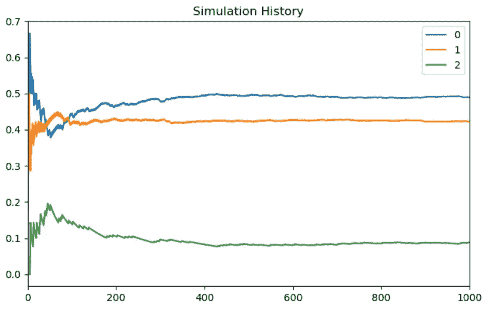

# 基于 Python 的马尔可夫链分析与仿真

> 原文：<https://towardsdatascience.com/markov-chain-analysis-and-simulation-using-python-4507cee0b06e?source=collection_archive---------1----------------------->

## 用概率解决现实世界的问题

马尔可夫链是一个离散时间的随机过程，它以一定的概率从一个状态前进到另一个状态，这可以用一个图和状态转移矩阵 P 来表示，如下所示:


这样的链，如果它们是一阶马尔可夫链，展示了马尔可夫性质，即下一个状态仅依赖于当前状态，而不依赖于它是如何到达那里的:


在这篇文章中，我们看两个不同的概念，一个是从马尔可夫链模拟，另一个是计算它的平稳分布。稳定分布是当样本数量接近无穷大时，系统在每个状态下花费的时间分数。如果我们有 *N* 个状态，平稳分布是一个长度为 N 的向量，其值总和为 1，因为它是一个概率分布。

我们还看两个例子，一个简单的玩具例子，以及一个可能的现实世界场景分析问题。

## 计算平稳分布

注意，在下面的第一个实现中，不是对状态转换的模拟，只是对稳定分布的计算。

让我们从计算分布的迭代方法开始。我们正在做的是将转移矩阵提升到迭代次数的幂:


平稳分布通常被称为π。

因此


```
import numpy as np
import pandas as pd
from random import seed
from random import random
import matplotlib.pyplot as plt
P = np.array([[0.2, 0.7, 0.1],
              [0.9, 0.0, 0.1],
              [0.2, 0.8, 0.0]])state=np.array([[1.0, 0.0, 0.0]])
stateHist=state
dfStateHist=pd.DataFrame(state)
distr_hist = [[0,0,0]]for x in range(50):
  state=np.dot(state,P)
  print(state)
  stateHist=np.append(stateHist,state,axis=0)
  dfDistrHist = pd.DataFrame(stateHist)
  dfDistrHist.plot()plt.show()
```

计算很快收敛到稳定分布:


如前所述，π是稳定分布。

在这种情况下，这也可以通过一组超定方程的线性代数解来实现:

```
A=np.append(transpose(P)-identity(3),[[1,1,1]],axis=0
b=transpose(np.array([0,0,0,1]))
np.linalg.solve(transpose(A).dot(A), transpose(A).dot(b)
```

这也返回[0.49，0.42，0.09]，平稳分布π。

我们是如何计算的，如下所示:

可以证明，如果πP=π，πi=1，马尔可夫链是平稳的，具有平稳分布π

其中 ***i*** 为单位列向量，即概率之和必须恰好为 1，也可以表示为


做一些代数运算:


结合π ***i*** =1:


而 **b** 是除最后一个元素外所有元素都为 0 的向量。

继鲁切-卡佩里之后，


假设增广矩阵[A|b]的秩等于系数矩阵 A 的秩，则 as 可以由此求解 Pi，即平稳分布。

同样，这个算法实现可以被通用化、扩展，并作为一个类来实现。

## 从马尔可夫链模拟

通过注意到来自任何给定状态(概率矩阵中的对应行)的移动集合形成多项式分布，可以从马尔可夫链进行模拟。因此，可以通过模拟多项式分布来模拟马尔可夫链。

从多项式分布进行模拟的一种方法是将长度为 1 的线分成与概率成比例的区间，然后根据 0 和 1 之间的均匀随机数选取一个区间。

参见维基百科这里[https://en.wikipedia.org/wiki/Multinomial_distribution](https://en.wikipedia.org/wiki/Multinomial_distribution)。

这在下面的函数 simulate_multinomial 中进行了说明。我们从


然后我们使用 *cs* ，即 *P* 中概率的累积和，以便按比例分配随机数。

```
import numpy as np
import pandas as pd
from random import seed
from random import random
import matplotlib.pyplot as pltP = np.array([[0.2, 0.7, 0.1],
              [0.9, 0.0, 0.1],
              [0.2, 0.8, 0.0]])stateChangeHist= np.array([[0.0,  0.0,  0.0],
                          [0.0, 0.0,  0.0],
                          [0.0, 0.0,  0.0]])state=np.array([[1.0, 0.0, 0.0]])
currentState=0
stateHist=state
dfStateHist=pd.DataFrame(state)
distr_hist = [[0,0,0]]
seed(4)# Simulate from multinomial distribution
def simulate_multinomial(vmultinomial):
  r=np.random.uniform(0.0, 1.0)
  CS=np.cumsum(vmultinomial)
  CS=np.insert(CS,0,0)
  m=(np.where(CS<r))[0]
  nextState=m[len(m)-1]
  return nextStatefor x in range(1000):
  currentRow=np.ma.masked_values((P[currentState]), 0.0)
  nextState=simulate_multinomial(currentRow) # Keep track of state changes stateChangeHist[currentState,nextState]+=1 # Keep track of the state vector itself
  state=np.array([[0,0,0]])
  state[0,nextState]=1.0 # Keep track of state history
  stateHist=np.append(stateHist,state,axis=0)
  currentState=nextState # calculate the actual distribution over the 3 states so far
  totals=np.sum(stateHist,axis=0)
  gt=np.sum(totals)
  distrib=totals/gt
  distrib=np.reshape(distrib,(1,3)
  distr_hist=np.append(distr_hist,distrib,axis=0)print(distrib)
P_hat=stateChangeHist/stateChangeHist.sum(axis=1)[:,None]
# Check estimated state transition probabilities based on history so far:print(P_hat)dfDistrHist = pd.DataFrame(distr_hist)# Plot the distribution as the simulation progresses over timedfDistrHist.plot(title="Simulation History")
plt.show()
```

从图中可以看出，在大约 400 个模拟步骤之后，分布开始收敛到稳定分布。



分布收敛到[0.47652348 0.41758242 0.10589411]:

该分布与我们之前通过求解马尔可夫链计算的平稳分布非常接近。其实四舍五入到两位小数是一样的:[0.49，0.42，0.09]。

正如我们在下面看到的，从转换历史中重建状态转换矩阵给了我们预期的结果:

[0.18，0.72，0.10]
【0.91，0.00，0.09】
【0.19，0.80，0.00】

这个算法实现可以是通用的、可扩展的，并作为一个类来实现。

它展示了如何用 Python 实现简洁紧凑的算法。

## 媒体、电信或类似行业的应用。

比方说，对于与高价值客户一致的特定人口统计，我们在订阅媒体市场(例如付费电视)中有 4 个“竞争对手”，分布相对稳定但不断变化[.55，0.2，0.1，0.15]，最后一组有 15%的人没有任何特定的订阅服务，更喜欢按需消费免费内容。


[https://www.livechatinc.com/blog/churn-rate/](https://www.livechatinc.com/blog/churn-rate/)

第二大竞争对手(b)刚刚推出了一款新的高端产品，现任者怀疑该产品正在侵蚀他们的市场份额。他们想知道如果他们不干预，最终会如何影响他们的市场份额。他们还想了解自己内部的客户流失动态，以及这与他们的市场份额之间的关系。

让我们假设他们知道他们有时会失去竞争对手的客户，包括免费内容，特别是随着他们的高平均每用户收入(ARPU)客户群的发展，他们有时会赢得客户，但他们不了解全貌。

所以，我们想象他们委托我们做一项研究。

为了简单起见，我们在这里对人口动态做了很多隐含的假设。例如，我们假设转移概率保持不变。

首先，我们进行一项市场调查，以了解消费者如何在不同的供应商之间移动，从那里我们可以构建一个概率矩阵如下:


a、b、c、d 代表我们的市场参与者。

市场研究表明，消费者从一个服务提供商转向另一个服务提供商的估计概率如下:


我们感兴趣的第一个问题是，考虑到所有其他流失概率，如果 A 继续以估计的速度流失客户到 B，将会发生什么。

使用我们之前导出的矩阵解，并用 Python 编码，我们可以计算新的平稳分布。

```
P = np.array([[0.9262, 0.0385, 0.01, 0.0253],
              [0.01, 0.94, 0.01, 0.04],
              [0.01, 0.035, 0.92, 0.04],
              [0.035, 0.035, 0.035, 0.895]])A=np.append(transpose(P)-identity(4),[[1,1,1,1]],axis=0)b=transpose(np.array([0,0,0,0,1]))np.linalg.solve(transpose(A).dot(A), transpose(A).dot(b))
```

这给了我们新的平稳分布[0.19，0.37，0.18，0.25]

然而，当我们检查系数矩阵和增广矩阵的秩时，我们注意到，与更简单的例子不同，它们并不对应。这意味着分析问题的公式可能没有唯一的解，所以我们想用另一种技术来检验它。

NP . linalg . matrix _ rank(NP . append(A，NP . transpose(b . shape(1，5))，axis=1))
5

np.linalg.matrix_rank(A)
4

可以看出，迭代解(其中我们将转移矩阵提升到 n 的幂)不收敛，这给我们留下了模拟选项。


从上面我们可以估计，长期来看，平稳分布会是这样的:[0.19，0.4，0.18，0.23]，实际上非常接近解析解。

换句话说，现有企业的市场份额预计将下降到 20%左右，而竞争对手的市场份额将上升到 40%左右。

由此也可以看出，对于更复杂的问题，现实世界中看似合理的解析解和模拟解，确实还是对应的。


我希望您喜欢这篇关于如何使用离散马尔可夫链解决现实世界问题的基本介绍，并鼓励您思考自己组织中可以用这种方式回答的问题。您还可以通过计算留住客户的价值来扩展这个示例，从而计算出在留住客户方面投资的价值。

> *版权所有 2020 Herman Scheepers*
> 
> *特此免费授予任何获得本条款中的代码和相关文档文件所暗示的本软件副本(“软件”)的人不受限制地经营本软件的权利，包括但不限于使用、复制、修改、合并、发布、分发、再许可和/或销售本软件副本的权利，并允许获得本软件的人根据以下条件这样做:*
> 
> *上述版权声明和本许可声明应包含在软件的所有副本或重要部分中。*
> 
> *本软件按“原样”提供，不含任何明示或暗示的担保，包括但不限于对适销性、特定用途适用性和不侵权的担保。在任何情况下，作者或版权所有者都不对任何索赔、损害或其他责任负责，无论是在合同诉讼、侵权诉讼或其他诉讼中，还是在与软件或软件的使用或其他交易相关的诉讼中。*