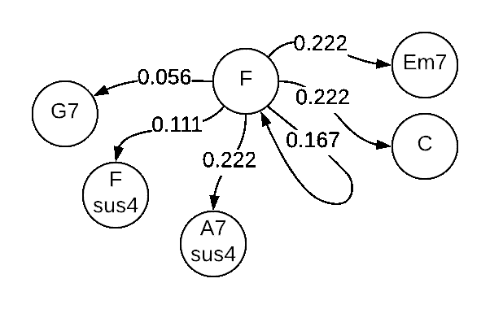

# 音乐生成的马尔可夫链

> 原文：<https://towardsdatascience.com/markov-chain-for-music-generation-932ea8a88305?source=collection_archive---------15----------------------->


从本文中，您将了解马尔可夫链模型，以及如何将它应用于音乐生成。

# 什么是马尔可夫链？

马尔可夫链是描述一系列可能事件的模型。这个序列需要满足马尔可夫假设——下一个状态的概率取决于前一个状态，而不是序列中的所有前一个状态。

这听起来像是对真实案例的简化。例如，为了应用马尔可夫链进行天气预测，我们需要假设明天的天气只取决于当前的天气，并假设没有其他因素，如一年中的时间等

尽管在许多情况下这种简化，我们将能够生成有用的预测，但同时，我们将能够通过降低计算成本来更快地解决我们的任务。

马尔可夫链模型在金融、自然语言处理和任何有时间序列数据的地方都有很多应用。

# 用马尔可夫链生成音乐

有很多优秀的论文和博客文章解释了马尔可夫链。所以不深究理论细节，让我们把这个模型应用到实践上！马尔可夫链最普遍的应用是语言和语音，例如，预测句子中的下一个单词。但是如果我们尝试创造音乐呢？

和自然语言一样，我们可以把音乐想象成一系列音符。但是因为我弹吉他，所以我会用[和弦](https://en.wikipedia.org/wiki/Chord_(music))来操作。如果我们研究和弦序列并学习它的模式，我们会发现某些和弦可能更多地跟随特定和弦，而其他和弦很少跟随那个和弦。我们将构建我们的模型来发现和理解这种模式。

## 好吧，计划是这样的:

1.  取和弦集
2.  计算和弦跟随特定和弦的概率分布
3.  定义第一个和弦或随机选择
4.  考虑概率分布，随机选择下一个和弦
5.  对生成的和弦重复步骤 4
6.  …
7.  随机音乐太棒了！

# 分步指南:

对于数据源，我准备了一个带有和弦序列的 CSV 文件，这些和弦序列来自利物浦的一个著名乐队。你可以在 [GitHub](https://github.com/subpath/Markov_chain_for_music_generation/tree/master/data) 上找到这个文件。

序列示例:

```
['F', 'Em7', 'A7', 'Dm', 'Dm7', 'Bb', 'C7', 'F', 'C', 'Dm7',...]
```

首先，我们制造二元模型:

```
['F Em7', 'Em7 A7', 'A7 Dm', 'Dm Dm7', 'Dm7 Bb', 'Bb C7', ...]
```

现在，如果我把和弦 F 作为一个序列中的初始和弦，其他和弦跟随它的概率是多少？

有 18 个以和弦 F 开头的二元组:

```
['F Em7', 'F C', 'F F', 'F Em7', 'F C', 'F A7sus4', 'F A7sus4', ...]
```

然后，我们将计算每个独特的二元模型在序列中出现的频率:

```
{'F Em7': 4, 'F C': 4, 'F F': 3, 'F A7sus4': 4, 'F Fsus4': 2, 'F G7': 1}
```

如果我们归一化，我们会得到概率:

```
{'F Em7': 0.222,
 'F C': 0.222,
 'F F': 0.167,
 'F A7sus4': 0.222,
 'F Fsus4': 0.111,
 'F G7': 0.056}
```

这通常可以用图表的形式来解释:



Weighted graph of possible next chord

这个图的每个节点，除了中间的初始节点 F，代表了我们的序列可以达到的可能状态，在我们的例子中，它们是可能跟随 F 的弦，一些弦比其他弦有更高的概率，一些弦根本不能跟随 F 弦，例如 Am，因为没有二元模型可以将这个弦与 F 组合。

现在，马尔可夫链是一个随机过程，或者你更喜欢随机过程。为了进入下一个状态，我们将随机选择和弦，但是根据概率分布，在我们的例子中，这意味着我们更有可能选择和弦 C 而不是 G7。

对于给定的和弦 F，下一个和弦有 6 个候选和弦:

```
options
>>> ['Em7', 'C', 'F', 'A7sus4', 'Fsus4', 'G7']
```

每个和弦都有相应的概率:

```
probabilities
>>> [0.222, 0.222, 0.167, 0.222, 0.111, 0.056]
```

[Numpy](https://pypi.org/project/numpy/) 由于 1.7.0 版本可以根据给定的概率分布执行随机采样，所以我们使用:

```
import numpy as npchoise = np.random.choice(options, p=probabilities)
```

假设我们随机选择的结果是 Em7。现在我们有了一个新的状态，可以再次重复整个过程。

整个工作流程如下所示:

```
# Our current state
chord = 'F'# create list of bigrams which stats with current chord
bigrams_with_current_chord = [bigram for bigram in bigrams if bigram.split(' ')[0]==chord]# count appearance of each bigram
count_appearance = dict(Counter(bigrams_with_current_chord))# convert apperance into probabilities
for ngram in count_appearance.keys():
  count_appearance[ngram] = count_appearance[ngram]/len(bigrams_with_current_chord)# create list of possible options for the next chord
options = [key.split(' ')[1] for key in count_appearance.keys()]
# create  list of probability distribution
probabilities = list(count_appearance.values())# Make random prediction
np.random.choice(options, p=probabilities)
```

因为这是一个随机过程，每次你运行这个模型，都会得到不同的结果。为了实现可重复性，您可以像这样设置种子:

```
np.random.seed(42)
```

我们可以将整个过程概括为两个功能:

```
def predict_next_state(chord:str, data:list=bigrams):
    """Predict next chord based on current state."""
    # create list of bigrams which stats with current chord
    bigrams_with_current_chord = [bigram for bigram in bigrams if bigram.split(' ')[0]==chord]
    # count appearance of each bigram
    count_appearance = dict(Counter(bigrams_with_current_chord))
    # convert apperance into probabilities
    for ngram in count_appearance.keys():
        count_appearance[ngram] = count_appearance[ngram]/len(bigrams_with_current_chord)
    # create list of possible options for the next chord
    options = [key.split(' ')[1] for key in count_appearance.keys()]
    # create  list of probability distribution
    probabilities = list(count_appearance.values())
    # return random prediction
    return np.random.choice(options, p=probabilities)def generate_sequence(chord:str=None, data:list=bigrams, length:int=30):
    """Generate sequence of defined length."""
    # create list to store future chords
    chords = []
    for n in range(length):
        # append next chord for the list
        chords.append(predict_next_state(chord, bigrams))
        # use last chord in sequence to predict next chord
        chord = chords[-1]
    return chords
```

现在我们可以生成一个我们想要的长度的序列:

```
generate_sequence('C')
```

序列示例:

```
['Bb',
 'Dm',
 'C',
 'Bb',
 'C7',
 'F',
 'Em7',
 'A7',
 'Dm',
 'Dm7',
 'Bb',
 'Dm',
 'Gm6'
 ...
 ]
```

我试着用吉他弹奏它，它听起来确实像一首来自利物浦的乐队可能写的歌。唯一缺少的是文本，但我们可以使用在文本语料库上训练的相同模型来为歌曲生成文本:)。

# 摘要

我们仅仅用简单的马尔可夫链触及了冰山一角，随机模型的世界是如此之大，包括隐马尔可夫链、马尔可夫链蒙特卡罗、哈密顿蒙特卡罗等等。但是在每个模型的本质上都有相同的马尔可夫假设——下一个状态依赖于当前状态，而不依赖于先前的状态序列。

因为这个简单而强大的规则，马尔可夫链模型在许多领域得到了应用，也可以成功地应用于音乐的产生。

这里最酷的事情之一是，我们将根据我们训练模型的语料库得到不同的结果。在来自电台司令和模型的语料库上训练将生成电台司令风格的和弦序列。

## **代码和数据集可以在我的** [**GitHub 资源库中找到。**](https://github.com/subpath/Markov_chain_for_music_generation)

# 参考资料:

1.  尤金·塞内塔。《马尔可夫和马尔可夫链的创建》(2006) [原始论文 PDF](https://www.csc2.ncsu.edu/conferences/nsmc/MAM2006/seneta.pdf)
2.  海因斯布莱恩。"马尔可夫链中的第一个环节."美国科学家 101.2 (2013): 252。[原稿 PDF](http://www.americanscientist.org/libraries/documents/201321152149545-2013-03Hayes.pdf)