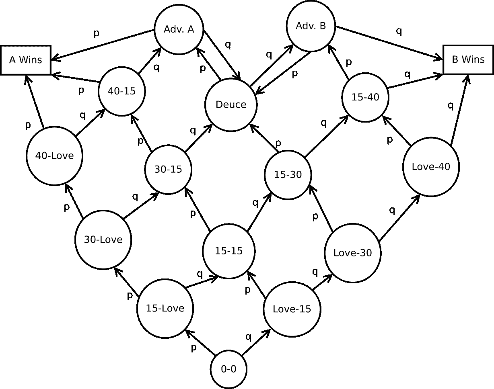

# 体育运动中的马尔可夫链模型

> 原文：<https://towardsdatascience.com/markov-chain-models-in-sports-7cb907a6c52f?source=collection_archive---------22----------------------->

*一个模型从数学上描述了我们对数据的期望——*在这种情况下，来自体育数据。一种简单类型的模型，称为马尔可夫链，在几种不同运动的分析中得到应用——每一种运动都有某种离散的性质，我很快会对此进行精确的解释。属于这一类的运动包括网球、棒球和排球。对于这篇博文，我会考虑网球。

Tennis star Serena Williams

如果一个模型描述了我们对数据的期望，我们必须承认所涉及的数据很难捕捉到游戏的一切。具体来说，网球的马尔可夫链模型描述了我们对有限数据的预期——这些数据只记录了哪个球员在比赛中赢得了每一分。关于其他一切的信息，如球的轨迹，甚至截击的长度或发球的失误，仍然是未知的。此外，数据只涉及两个玩家之间相遇的一小部分。网球比赛分成几组，几组分成几场比赛。所以如果小威赢得了她的第一场比赛，她将需要留下来赢得更多的比赛。我们的模型只关注这些游戏中的一个游戏的分数结果数据。

在网球比赛中，当一名选手达到两个目标时，每场比赛就赢了:她的得分(1)必须至少达到 4 分，并且(2)必须超过对手 2 分。分数以“爱”(0 分)开始，然后是“15”(1 分)、“30”(2 分)、“40”(3 分)。如果双方都至少得了 2 分，比分就是“平手”。如果两个玩家都至少得 2 分，但其中一个领先 1 分，则得分为“优势*【那个玩家】”。*

每打出一个点，只有两种情况可能发生:一个玩家(姑且称她为“A”)可以赢得该点，或者另一个玩家(姑且称她为“B”)可以赢得该点。该模型将值 *p* 分配给玩家 A 赢得一分的概率，并将值 *q* 分配给玩家 B 获胜的概率。对于每个点，不存在其他可能性，所以 *p + q* = 1。重要的是，该模型假设这些概率永远不会改变，无论游戏如何展开。此外，每个点的结果独立于其他点的结果。

我把游戏的每一个分数放在一个图表上(见下面)，并用箭头指出，哪个分数可以导致下一个分数，导致其他分数。在马尔可夫链术语中，每个分数代表游戏的一个*状态*，从这个状态可以发生零个或多个*转换*到其他状态。如上所述，从大多数状态来看，恰好存在两种可能的转换(A 赢得下一点，或者 B 赢得下一点)。在网球中，有 15 种这样的状态，显示为圆圈。马尔可夫链术语称它们为*瞬态*。从另外两个状态开始，游戏不再继续，也不会发生进一步的转换。我将这些异常的*吸收态*显示为矩形，分别标记为“A 赢”和“B 赢”我们的建模假设意味着，游戏最终肯定会离开所有的瞬态，进入一个吸收态(因此有了这个术语)。经验证实了这一预期。

A diagram of the Markov chain for tennis

在这个图中，每个圆都有两个箭头。如果玩家 A 赢得这一点，游戏向左转移，沿着标有 *p* (其概率)的箭头指向“A 赢”。然而，对于概率 *q，*游戏遵循另一个箭头，(记住 *p + q* = 1)，向右朝着“B 赢。”

是什么让这个模型成为马尔可夫链？首先，状态之间的特定转换仍然是不确定的，但是，像所有随机现象一样，服从可量化的概率规则。第二，该模型满足被称为*马尔可夫属性*的条件，该条件向分析师保证，为了预测关于游戏未来的任何事情，游戏的当前状态包括关于游戏的所有相关信息(过去和当前)，这些信息可以帮助做出这样的预测(未来)。

换句话说，Markov 属性断言，假设我们已经知道当前状态，那么通过图采取的先前路径不会给我们提供有用的额外信息来对游戏进行预测。例如，如果 A 赢得了前 3 分，但随后输掉了接下来的 3 分，游戏可能会进入平手状态。或者，A 可能会失去 3 个未回答的点，然后赶上。还存在许多其他平手的途径，实际上是无限的，因为游戏可能会在平手、优势 A 和优势 b 之间无限波动。马尔科夫属性表明，无论采取哪种途径，对未来的预测都只取决于当前状态平手，而不是游戏如何到达那里。

马尔可夫属性仍然只是一个建模假设。关于真正的网球是真的吗？模型不会告诉我们。只有从许多实际游戏中获得大量数据，我们才能评估支持或反对这一假设的证据的强度。相反，体育运动中流行的“动量”概念可能表明，最近得分更多的球员有更有利的未来——比马尔可夫链预测的更有利。或者，一个“重整旗鼓以东山再起的假设”可能暗示，最近输球的玩家比我们的模型所认为的更有机会获胜。不用说，马尔可夫性质明确地否定了这些可能性:根据我们编纂的假设，不存在这样的现象。

统计学家经常重复乔治·博克斯的话，说所有的模型都是错的，但有些是有用的。马尔可夫链可能不能完美地代表网球，但该模型仍然有用，因为它可以产生对比赛的宝贵见解。请注意，该模型只包含一个参数， *p* 或 *q* (一个参数，因为这两个量加起来等于 1——一旦知道了其中一个，就可以确定另一个)。有了这些知识，个人的结果仍然是不确定的，但你可以发现任何事件的概率，此外，任何与游戏相关的量的分布。

例如，知道了 *p* 不会让你知道 A 是否会赢得任何给定的分数，更不用说任何给定的游戏、盘或比赛。当然啦！也就是说，知道了 *p* ，模型将允许你确定 A 赢得游戏的*概率*，至少假设建模假设成立。此外，虽然您无法预先知道任何一个特定游戏将持续多长时间，但您可以发现，例如，在一个模型游戏中所玩点数的分布。事实上，您可以计算这种分布的相关统计数据——包括平均值、中值、标准差，甚至超过 10 分的游戏比例。事实上，所有这些计算都可以完成，不仅仅是对单个值的 *p* ，而是对任何可能的值，这使得模型真正有用，并给建模者带来了希望，即关于模型的一般事实将转化为关于游戏的深刻见解。如果我们碰巧观察到一场或多场比赛持续超过 50 分，在一场有 250 场比赛的锦标赛中，假设所有球员都旗鼓相当，我们应该有多惊讶？用我们的模型对网球进行分析，证实了 Box 的格言，尽管在许多细节上不可避免地存在错误，但仍可能证明是有启发性的。