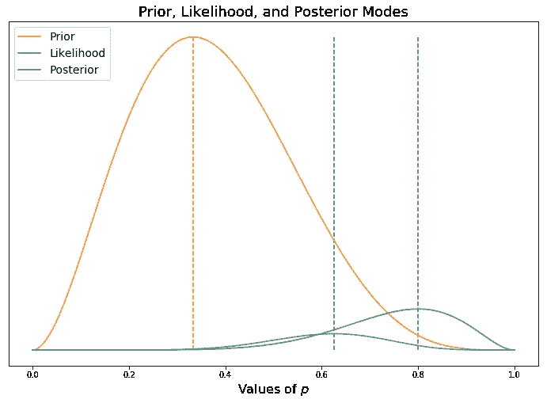
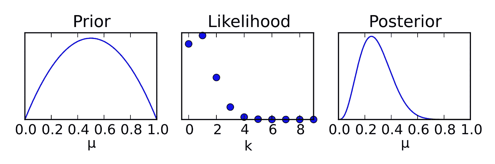
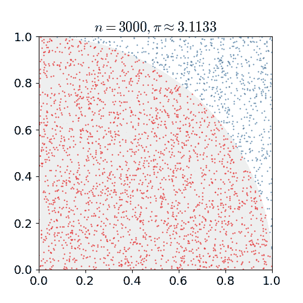
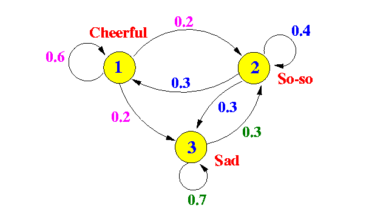
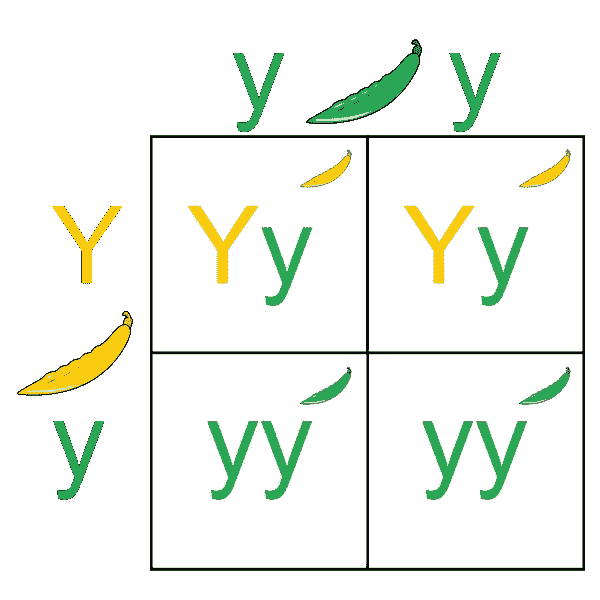

# 马尔可夫链蒙特卡罗

> 原文：<https://towardsdatascience.com/markov-chain-monte-carlo-291d8a5975ae?source=collection_archive---------6----------------------->

## 将您对 MCMC 的理解提升到中级水平

当我学习马尔可夫链蒙特卡罗(MCMC)时，我的导师告诉我们有三种方法来解释 MCMC。

*   基本知识:MCMC 允许我们利用计算机来做贝叶斯统计。
*   **中级** : MCMC 是一种可以找到我们感兴趣的参数的后验分布的方法。具体来说，这种类型的算法以一种依赖于马尔可夫属性的方式生成蒙特卡罗模拟，然后以一定的速率接受这些模拟以获得后验分布。"
*   **进阶**:一堂完整的统计学课。

我写这篇博客的目的是让你达到中级水平。

**先从基础的开始吧。**

MCMC 到底是什么？要回答这个问题，我们首先需要复习一下贝叶斯统计。贝叶斯统计是建立在这样一个理念上的，即一件事情发生的概率受事先假设的概率和数据显示的某件事情发生的可能性的影响。在贝叶斯统计中，概率用分布来表示。

如果先验和似然概率分布是正态分布，我们就能够用一个函数来描述后验分布。这被称为封闭解。这种类型的贝叶斯如下所示。正如你所看到的，后验分布是由先验分布和似然分布共同形成的，并在中间的某处结束。



Created in Matplotlib inspired by Matt Brems

但是当概率不是很大的时候呢？当概率看起来更像这样时会发生什么？



Rbb [CC BY-SA 3.0 ([https://creativecommons.org/licenses/by-sa/3.0](https://creativecommons.org/licenses/by-sa/3.0))], from Wikimedia Commons

在这种情况下，可能性没有正态分布，所以我们最终得到一个右偏后验分布。因为我们不能用公式来表达，我们必须使用马尔可夫链蒙特卡罗。

# 马尔可夫链蒙特卡罗的三个部分

# **一:蒙特卡洛**

*   蒙特卡罗模拟通过生成随机数来模拟复杂系统。
*   在下面的 gif 的情况下，蒙特卡洛生成一个参数为(0-1，0-1)的随机点，通过确定曲线下结束的点的数量，我们能够近似整个圆的面积，并从π开始。



nicoguaro [CC BY 3.0 ([https://creativecommons.org/licenses/by/3.0](https://creativecommons.org/licenses/by/3.0))], from Wikimedia Commons

# **二:马尔可夫链**

*   马尔可夫链本质上是一个变量如何在图中“行走”的表示，或者一个随机变量如何随时间从一种状态改变到另一种状态。



image source [http://www.mathcs.emory.edu/~cheung/](http://www.mathcs.emory.edu/~cheung/)

*   上图展示了情绪状态的马尔可夫链。在这个链条中，如果你很快乐，有 20%的几率你会把情绪状态变成一般，20%的几率你会变得悲伤，60%的几率你会保持快乐。

**马尔可夫链由马尔可夫属性**决定

```
F(Xt+1|Xt) = f(Xt+1|Xt,Xt-1,Xt-2,….)
```

如果我知道现在正在发生什么，知道发生了什么让我们走到这一步或前一步，等等。没给我提供更多信息。

这方面例子有:

*   孟德尔遗传学。在下面的例子中，子豆的颜色完全受父豆的颜色影响。第一代的豆子颜色受到前一代的影响，但在确定第二代的颜色时不需要考虑这一点。



Pbroks13 [CC BY-SA 3.0 ([https://creativecommons.org/licenses/by-sa/3.0](https://creativecommons.org/licenses/by-sa/3.0))]

*   棋盘游戏:当玩大富翁游戏并试图确定玩家去某个空间的概率时，你需要的唯一信息是玩家目前在哪里。玩家之前的回合在哪里并不影响它接下来的走向，除了它决定了这一回合在哪里。

# 三:接受-拒绝抽样

MCMC 的第三部分是接受-拒绝抽样。当我们对新的观察进行采样时，我们决定它是否在正确的方向上，然后决定我们是保留它还是丢弃它。

两种常见的接受-拒绝算法是 Metropolis-Hasting 算法和不掉头采样器。不准掉头的数学比我在这篇中等文章中解释的要复杂，但是如果你想深入研究，可以看看这篇[文章。](https://arxiv.org/abs/1111.4246)

这是我对大都市生活的高层次解释

*   我们在 x 点。
*   我们对下一步做一个猜测。我们称之为 x*
*   然后，我们计算 x*/x 的概率比。这是使用似然性和先验分布的乘积计算的。
*   如果 p(x*)/p(x)的比值(也称为接受概率)大于 1，我们接受 x*作为新位置。
*   即使接受概率小于 1，我们也不自动拒绝 x*。我们通过从均匀(0，1)分布中选择一个随机数来抛硬币。如果数字小于接受概率，我们接受 x*,如果数字大于接受概率，我们拒绝 x*,并重新开始这个过程。

# 把所有的放在一起

*   我们随机生成数字:这是蒙特卡罗部分
*   我们允许我们生成的数字影响下一个生成的数字:这就是马尔可夫链
*   然后我们决定生成的新数字是否“朝着正确的方向前进”:接受-拒绝算法
*   然后我们检查收敛性:我们确定我们的数据何时收敛到一个合理的分布。收敛点之后随机生成的值成为我们的后验分布

我希望这有助于您在中级水平上理解 MCMC。

1.(经允许)直接从[马特·布莱姆斯](https://medium.com/@matthew.w.brems)的演讲中借用。
2。一个很棒但是很数学的 MCMC 移植:[https://blog . stata . com/2016/11/15/Bayesian-statistics-introduction-to-part-2-MCMC-and-the-metropolis-Hastings-algorithm/](https://blog.stata.com/2016/11/15/introduction-to-bayesian-statistics-part-2-mcmc-and-the-metropolis-hastings-algorithm/)