# 马尔可夫链和 hmm

> 原文：<https://towardsdatascience.com/markov-chains-and-hmms-ceaf2c854788?source=collection_archive---------5----------------------->

## [内部 AI](https://medium.com/towards-data-science/inside-ai/home)

## 主要概念、属性和应用

Hidden Markov

在本文中，我们将关注马尔可夫模型，何时何地应该使用它们，以及隐马尔可夫模型。本文将着重于理论部分。在第二篇文章中，我将展示这些主题的 Python 实现。

马尔可夫模型，尤其是隐马尔可夫模型(HMM)用于:

*   语音识别
*   书写识别
*   物体或人脸检测
*   经济情景生成和特定财务任务
*   和几个 NLP 任务…

本文原载于我的个人博客:【https://maelfabien.github.io/machinelearning/HMM_1/#

我在这个资源库上发布我所有的文章和相应的代码:

 [## mael fabien/机器学习教程

### 本报告包含练习、代码、教程和我的个人博客文章

github.com](https://github.com/maelfabien/Machine_Learning_Tutorials) 

不要犹豫开始回购:)

# 一.随机模型

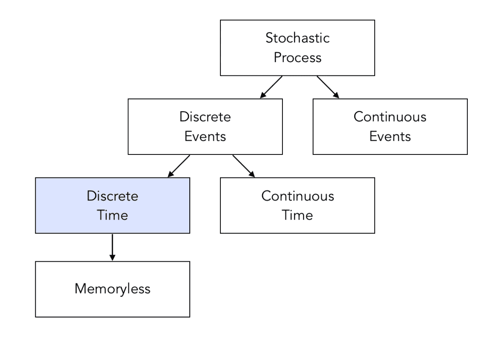

Discrete-Time Stochastic Process

让我们从定义什么是随机模型开始。它本质上是一个离散时间过程，在时间 1，2，…取值，称为“**状态**，观察到:q1，q2，…”。状态简单地对应于过程的实际值，通常由有限空间定义:S=1，…Q。

该过程从初始状态**开始** q1。然后，根据**转移概率**，我们在状态之间移动。我们可以使用**贝叶斯法则**计算状态序列的概率:

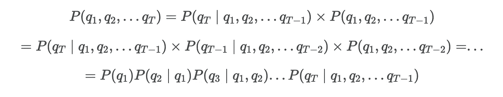

为了描述模型的特征，我们需要:

*   初始概率 P(q1)
*   所有的转移概率

正如你可能猜到的，这很难实现，因为我们需要知道很多参数。

# 二。离散时间马尔可夫链模型(DTMC)

## 1.什么是马尔可夫链？

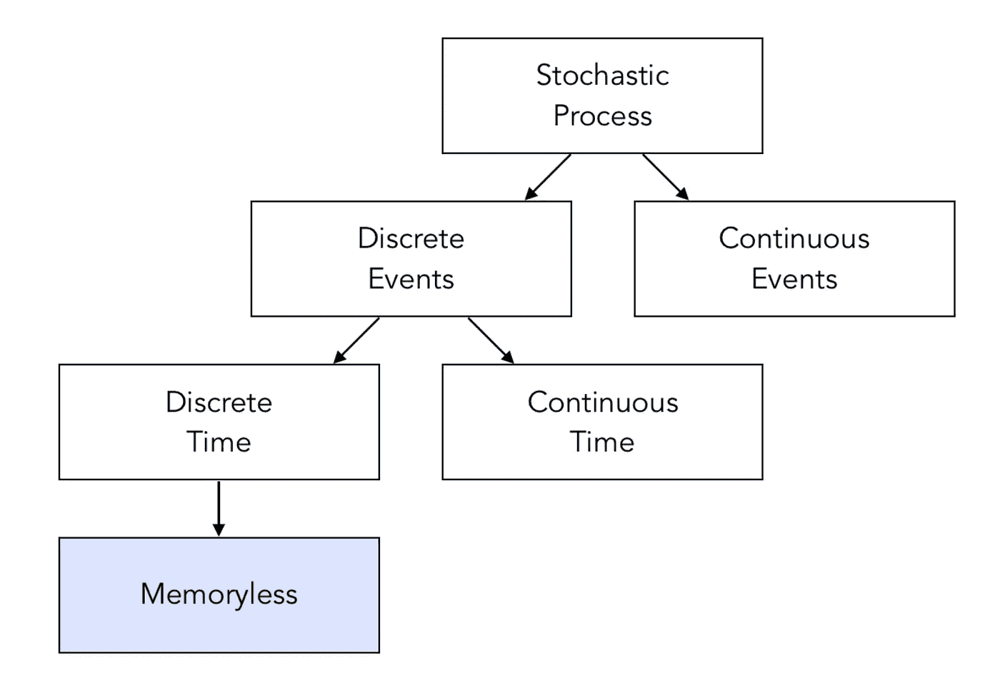

DTMC

离散时间马尔可夫链(DTMC)是*时间和事件的离散随机过程*。马尔可夫链依赖于马尔可夫特性，即在过程中有一个**有限的相关性**:

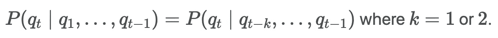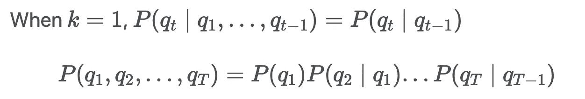

让我们来说明这一点:考虑一个简单的迷宫，其中有一只老鼠被困。我们将把 *qt 表示在 *t 步之后老鼠所处的迷宫的位置*。我们假设老鼠对它在迷宫中走过的路程没有记忆(T21)。它只是按照写在每一步棋旁边的概率，随机地走到那个位置。*

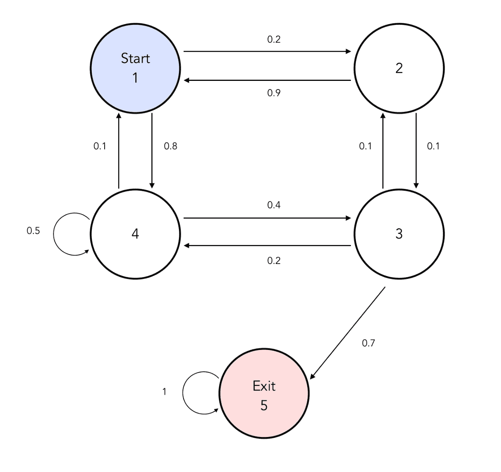

DTMC Illustration

这里的状态可以代表很多东西，包括在 NLP 中。例如，我们可以:

*   1 =名词，
*   2 =动词，
*   3 =形容词…

例如，我们会对名词后有动词的概率感兴趣。

## 2.转移概率

如果离散时间马尔可夫链的转移概率不依赖于时间 t，则称其为**齐次**:

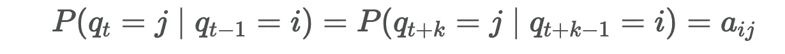

我们可以将该过程概括为一个**转移矩阵**，表示为 A =【AIJ】，i ∈ 1…Q，j ∈ 1…Q。如果:

*   所有条目都是非负的
*   每行总计为 1

在我们的例子中，转移矩阵是:

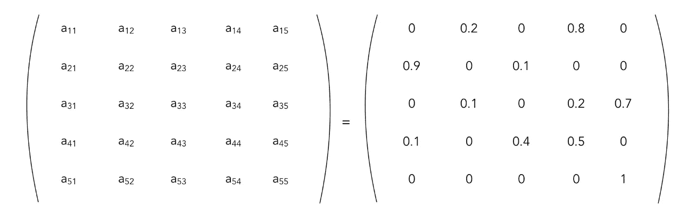

Transition matrix

注意，如果 a 是随机的，那么 A^n 也是随机的。

## 3.州

描述一个状态有几种方式。设 pii 为离开 I 后回到状态 I 的概率:

*   如果 pii <为 1，则状态 I 为**瞬态**
*   如果 pii=1，状态 I 是**循环的**
*   如果 aii=1，则状态 I 正在**吸收**

因此，如果返回到表示为 Tii 的相同状态之前的平均时间是有限的，则状态是正循环的。

如果一个状态 j 可以从任何其它状态 I 经过有限步到达，则 DTMC 是不可约的。不可约的 DTMC 实际上是一个强连通的图。

如果离散时间马尔可夫链只能在大于 1 的某个整数的倍数处返回状态，那么该链中的状态就是周期性的。

例如:

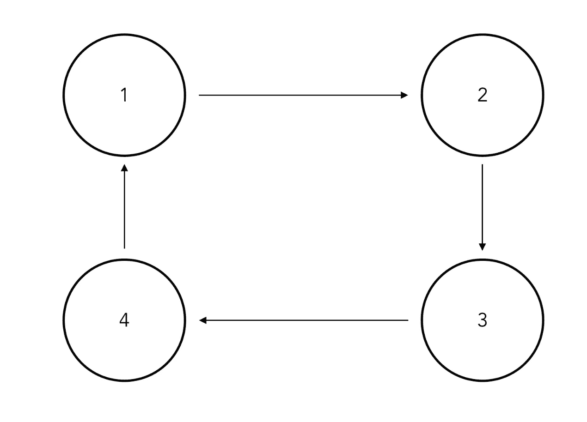

Periodic Markov Chain

否则称为**非周期性**。具有自循环的状态总是非周期性的。

## 4.逗留时间

设 Ti 是跳到其他状态之前在状态 I 花费的时间。

然后，Ti，即**逗留时间**，遵循**几何分布**:

预期花费的平均时间是 E(T)=1 / aii

## 5.m 步转换

在 m 个步骤中从 I 到 j 的概率表示为:

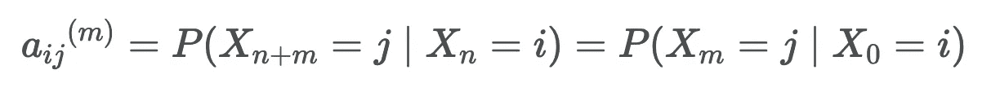

M-step transition

我们可以将 a22(4)视为时间 t=4 时鼠标位于位置 2 的概率。因此，从 I 到 j 正好 n 步的概率由 fij(n)给出，其中:

## 6.状态的概率分布

设πi(n)是在时间 n 处于状态 I 的**概率**:πI(n)= P(Xn = I)

那么，π(n)=[π1(n)，π2(n)，…]是概率分布的向量，它取决于:

*   初始转移矩阵 A
*   初始分布π(0)

注意π(n+1) = π(n)A，递归地:

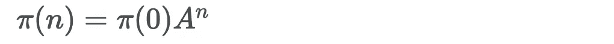

对于不可约/非周期 DTMC，分布π(n)收敛到一个极限向量π，它与π(0)无关，是π = πP 的唯一解

并且∑i πi = 1

πi 也叫**定态概率，稳态或均衡分布。**

## 7.生成序列

为了模拟老鼠在迷宫中的路径，我们可能希望**生成序列**。

当我们想产生一个序列时，我们从一个初始状态 q1=1 开始。总的想法是:

*   我们选择一个随机数来知道我们应该从哪个状态开始
*   然后，选择一个随机数来知道我们移动到哪个状态

假设我们有以下简单的模型:

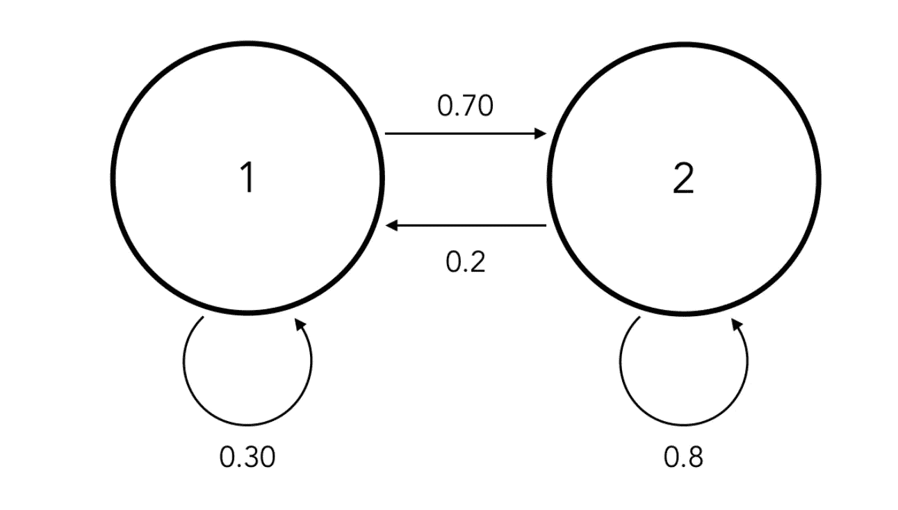

这对应于下面的矩阵 A 和初始概率向量π:

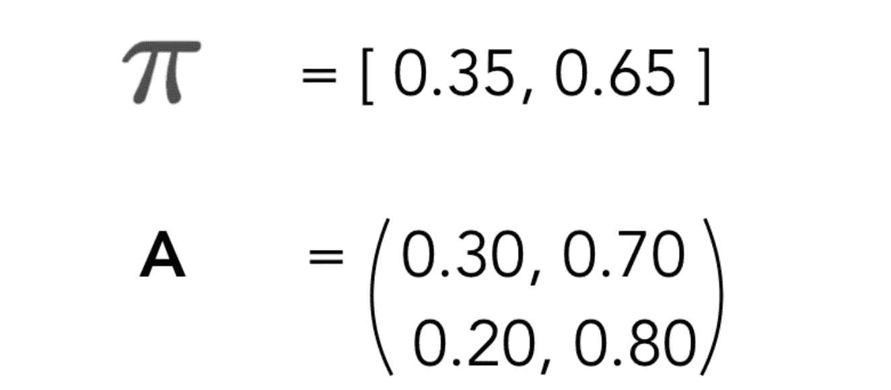

生成器的工作方式如下，通过连续抽取随机数来识别哪个过渡是指。

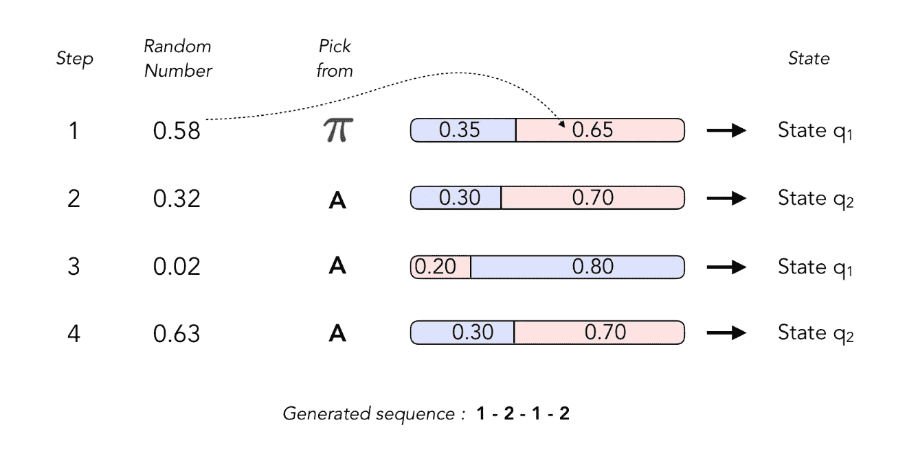

Sequence Generation, Step-by-step

第一步，我们选择一个随机数，看看它在初始概率向量中的位置。这给了我们第一个状态。

然后，我们选择下面的数字，它对应于状态 q1 的转移概率(矩阵 A 的第一行)。如果值小于 0.3，我们停留在 q1。否则，我们移到 q2。诸如此类…

## 8.解码序列

解码一个序列的目的是识别通向当前状态的最可能的路径。例如，如果鼠标处于状态 3，并经过 5 步到达那里，您需要确定最可能的路径。

## 9.用例

可以使用马尔可夫链:

*   通过解码字符序列并识别最可能的语言来识别句子的语言。
*   预测宏观经济形势，如市场崩溃和衰退与扩张之间的周期。
*   预测资产和期权价格，并计算信用风险。
*   …

# 三。隐马尔可夫模型

隐马尔可夫模型(HMM)广泛用于:

*   语音识别
*   书写识别
*   物体或人脸检测
*   词性标注和其他自然语言处理任务…

我推荐看看 Luis Serrano 在 HMM 上做的介绍。

我们将把重点放在词性标注上。词性标注是一个过程，通过这个过程，我们能够将一个给定的单词标注为名词、代词、动词、副词…

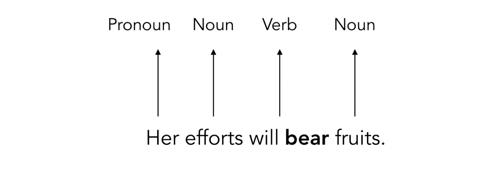

例如，PoS 可以用于文本到语音的转换或词义消歧。

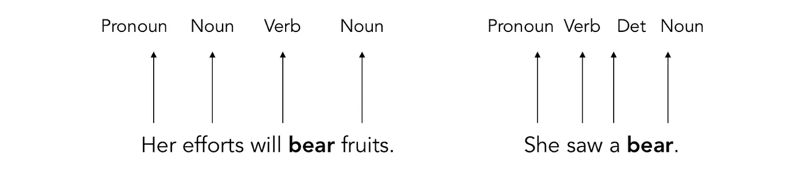

在这个具体情况下，同一个单词`bear`有完全不同的意思，对应的 PoS 也因此不同。

让我们考虑下面的场景。在你的办公室里，有两个同事经常聊天。你知道他们要么谈论工作**要么谈论假期**。因为他们看起来很酷，你想加入他们。但是你离理解整个对话太远了，你只能听到句子中的一些单词****

****在加入对话之前，为了不显得太怪异，你想猜猜他说的是**工作**还是**假期**。例如，你的朋友可能会说这样的句子:****

****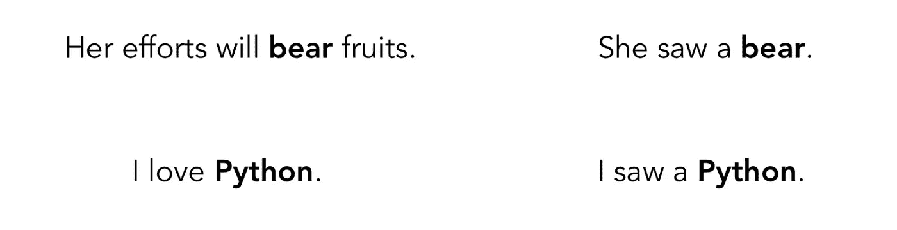****

## ****1.排放概率****

****你只听清楚 **python** 或 **bear** 这几个字，并试着猜测句子的上下文。由于你的朋友都是 Python 开发人员，所以当他们谈论工作时，他们 80%的时间都在谈论 Python。****

****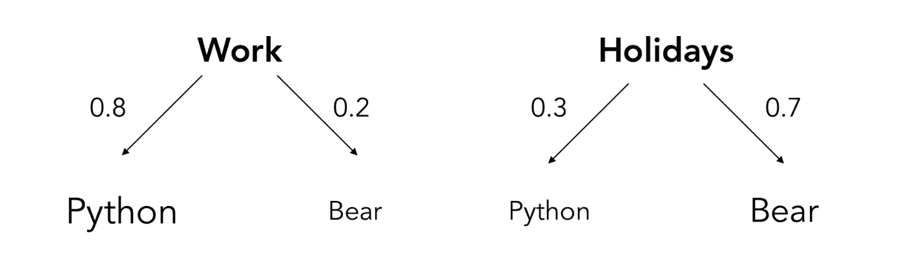****

****这些概率被称为**排放概率**。****

## ****2.转移概率****

****你听着他们的对话，每分钟都在试图理解这个话题。你朋友的谈话有某种连贯性。事实上，如果一个小时他们谈论工作，下一分钟他们谈论假期的可能性更低。****

****我们可以为这种情况定义我们称之为**的隐马尔可夫模型**:****

****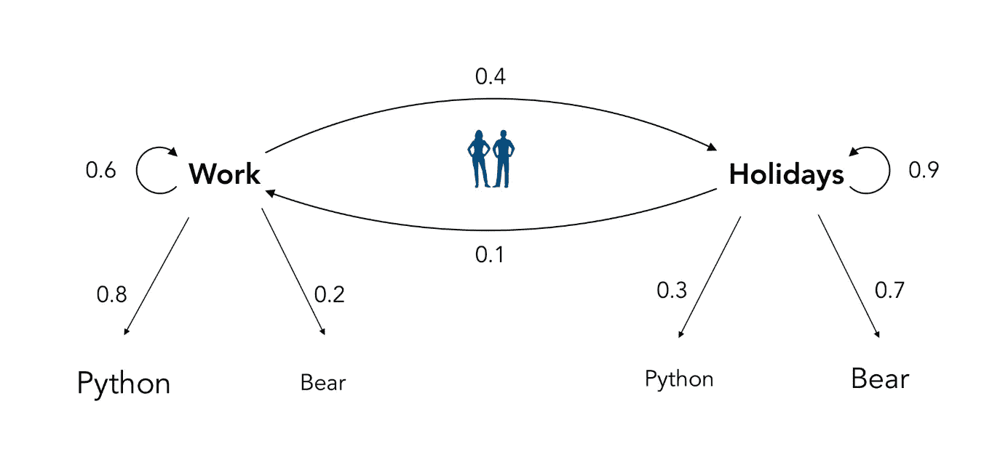****

****改变或不改变话题的概率被称为**转移概率**。****

*   ****你理解的词语被称为**观察**，因为你观察它们。****
*   ****他们谈论的主题被称为**隐藏状态**，因为你无法观察到它。****

## ****3.离散时间隐马尔可夫模型****

****HMM λ是由两个随机过程组合而成的序列:****

*   ****一个**观察到**一个:O=o1，o2，…，oT，这里的话****
*   ****一个**隐藏的**一:q=q1，q2，…qT，这里是谈话的话题。这被称为过程的状态。****

****HMM 模型由下式定义:****

*   ******初始概率的向量** π=[π1，…πq]，其中πi=P(q1=i)****
*   ******未观察到的**序列 a 的**转移矩阵**:a =[AIJ]= p(Qt = j∣qt1 = j)****
*   ******观察值的**概率**矩阵**b =【bki】= p(ot = sk∣Qt = I)****

**HMMs 背后的**主要假设**有哪些？**

*   ****观测值对隐藏态的条件独立性**:p(O1，…，ot，…，oT ∣ q1，…，qt，…，qT，λ) = ∏i P(ot ∣ qt，λ)**
*   ****平稳马尔可夫链** : P(q1，q2，…，Qt)= p(q1)p(q2∣q1)p(q3∣q2)…p(qt∣qt−1)**
*   ****观测值和状态序列的联合概率**:p(O1，o2，…oT，q1，…，qT ∣ λ) = P(o1，…，oT ∣ q1，…，qT，λ) P(q1，…，qT)**

**HMM 是*贝叶斯网络*的一个子案例。**

## **4.求转移概率**

**跃迁概率是基于我们所做的观察。我们可以假设，在仔细听完之后，每一分钟，我们都能理解他们谈论的话题。不过，这并没有给我们提供他们目前正在谈论的话题的全部信息。**

**在过去的 15 分钟里，你有 15 次观察， **W** 表示工作， **H** 表示假期。**

**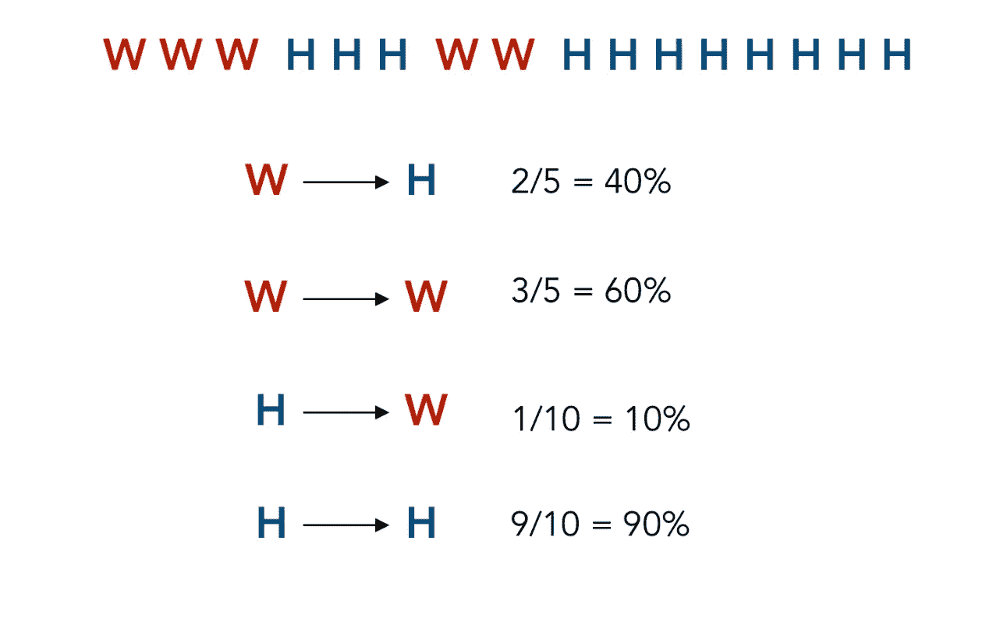**

**我们注意到，在五分之二的情况下，话题工作导致话题假期，这解释了上图中的转移概率。**

## **5.找出排放概率**

**因为我们对他们讨论的话题有观察，并且我们观察了讨论中使用的词语，我们可以定义*排放概率的估计值*:**

**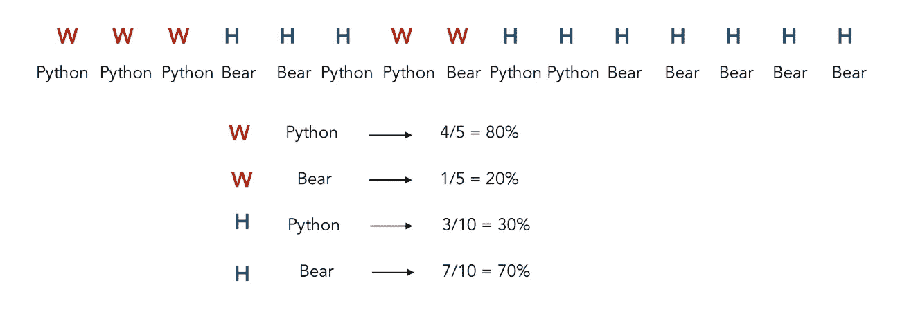**

## **6.随机时间内某个主题的概率**

**假设你要去喝咖啡，当你回来的时候，他们还在说话。你根本不知道他们在说什么！在那个随机时刻，他们谈论工作或假期的概率是多少？**

**我们可以从之前的观察中数出:10 次他们谈论假期，5 次谈论工作。因此，它表明我们有 1/3 的机会让他们谈论工作，2/3 的机会让他们谈论假期。**

## **7.如果听到“Python”这个词，每个题目的概率是多少？**

**如果你听到“Python”这个词，那么这个话题是工作还是假期的概率就是用贝叶斯定理定义的！**

**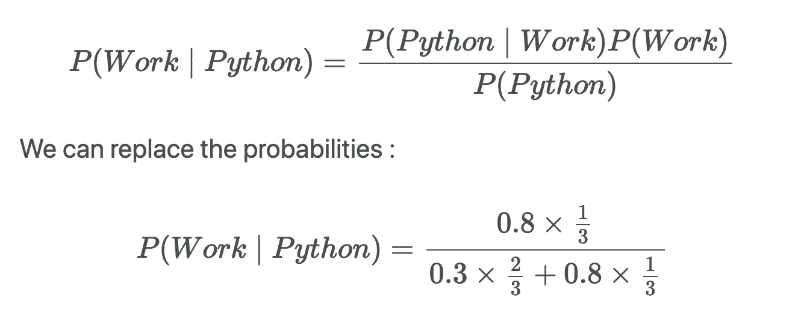**

**接近 57%。**

## **8.如果你听到一个单词序列，每个题目的概率是多少？**

**让我们从连续两次观察开始。假设我们连续听到“Python”和“Bear”这两个词。有哪些可能的组合？**

*   **巨蟒和工作联系在一起，熊和工作联系在一起**
*   **蟒蛇和假期联系在一起，熊和工作联系在一起**
*   **蟒蛇和假期联系在一起，熊和假期联系在一起**
*   **蟒蛇和工作联系在一起，熊和假期联系在一起**

**这些场景可以这样总结:**

**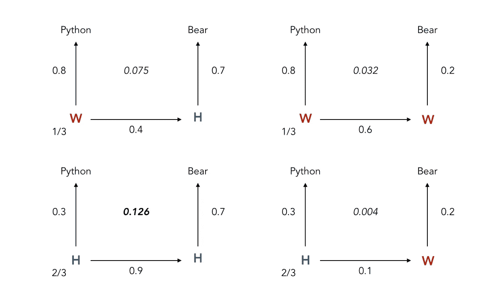**

**所以最有可能隐藏的状态就是节假日和假期。如果你听到两个以上的单词呢？假设是 50？计算所有可能的路径变得非常具有挑战性！这就是为什么**维特比算法**被引入，以克服这个问题。**

## **9.维特比算法解码**

****维特比算法**背后的主要思想是，当我们计算最优*解码*序列时，我们并不保留所有的潜在路径，而是*只保留最大似然对应的路径。***

**它是这样工作的。我们从一系列观察到的事件开始，比如说`Python, Python, Python, Bear, Bear, Python`。这个序列简单地对应于一个观察序列:P(o1，o2，…，oT ∣ λm)**

**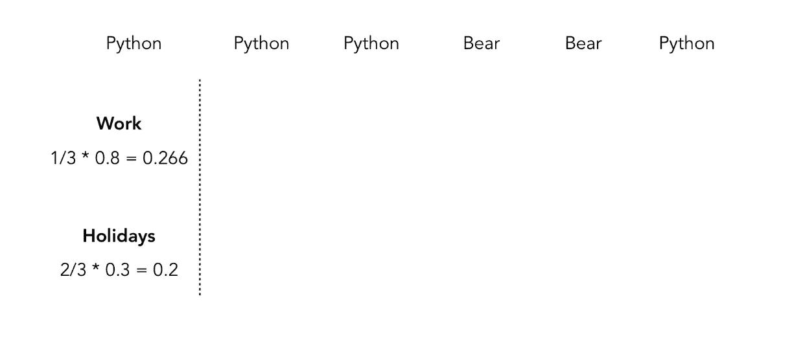**

**对于第一个观察，假设我们观察 Python，主题是 Work 的概率是它是 Work 的概率乘以假设它是 Work，它是 Python 的概率。**

**最可能的状态序列简单地对应于:**

**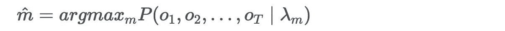**

**然后我们可以继续下一个观察。接下来会发生什么:**

**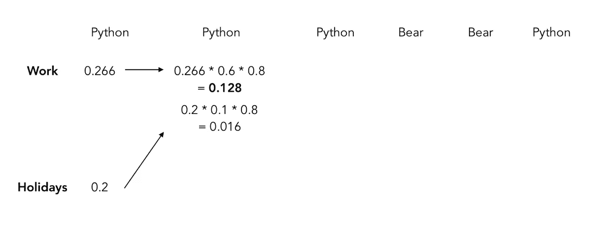**

**对于每个位置，我们使用前一个主题是工作或假期的事实来计算概率，对于每个情况，我们只保留最大值，因为我们的目标是找到最大可能性。因此，下一步是对假日主题进行同样的估计，并保持两条路径之间的最大值。**

**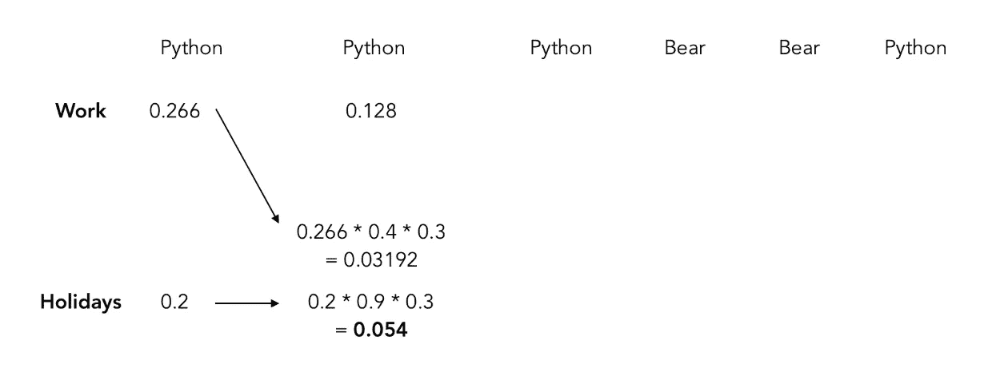**

**如果您解码整个序列，您应该会得到与此类似的东西(我已经对每一步的值进行了舍入，所以您可能会得到稍微不同的结果):**

**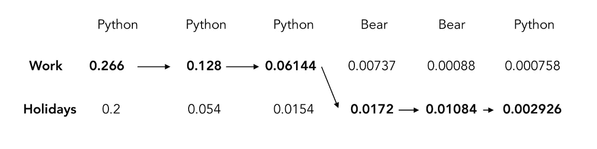**

**因此，当我们观察`Python, Python, Python, Bear, Bear, Python`时，最有可能的序列是`Work, Work, Work, Holidays, Holidays, Holidays`。**

**如果在这么长时间的跟踪之后，你终于去和你的同事聊天，你应该期待他们谈论假期:)**

**在时间 T 结束于状态 I 并且对应于观测 o1，…，oT 的潜在状态的最佳序列的**联合概率**由δT(i)表示。这是上述可能的途径之一。**

**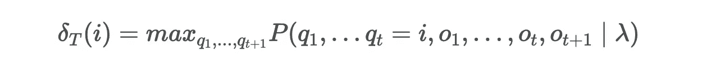**

**通过递归，可以表明:**

****

**其中 bj 表示观察矩阵 B 的概率，aij 表示未观察序列的转移矩阵的值。这些参数是从一系列观察值和可用状态中估计出来的。δ就是我们在前进的每一步中取的最大值。**

**我不会在这里详细讨论。你应该简单地记住有两种方法来解决维特比，*向前*(正如我们已经看到的)和*向后*。**

**当我们只观察到部分序列并且面对不完整的数据时，使用 EM 算法。**

## **10.生成序列**

**正如我们在马尔可夫链中看到的，我们可以用 hmm 生成序列。为此，我们需要:**

*   **首先产生隐藏状态 q1**
*   **从 q1 开始，生成 o1，例如 Work then Python**
*   **然后产生 q1 到 q2 的转换**
*   **从 q2 生成 o2**
*   **…**

**流程是如何运作的？如上所述，这是一个两步过程，我们首先生成状态，然后进行观察。**

**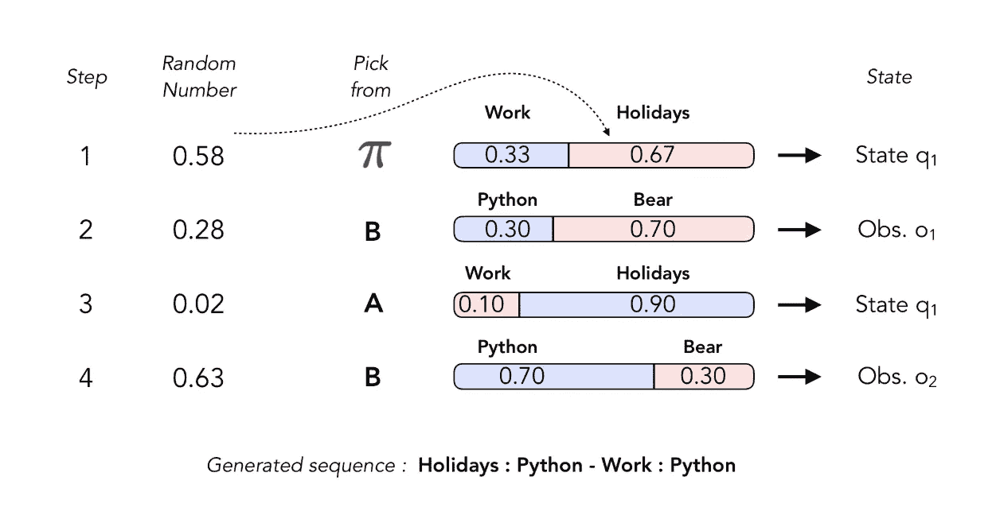**

**Sequence Generation**

# **结论:**

**👏👏👏**

**在本文中，我们介绍了马尔可夫链和 hmm 的基本理论，包括术语、假设、性质、序列生成和解码。**

**我希望这篇关于马尔可夫链和隐马尔可夫模型的介绍是有帮助的。我在下面的部分列出了我的消息来源。**

**在下一篇文章中，我将尝试用 Python 来说明这些概念。**

# **来源:**

*   **国家高级矿业学院:[https://www.emse.fr/~xie/SJTU/Ch4DMC.ppt](https://www.emse.fr/~xie/SJTU/Ch4DMC.ppt)**
*   **MVE220 财务风险:[http://www . math . chalmers . se/Stat/grund ub/CTH/mve 220/1617/reding projects 16-17/intromarkovchainsandapplications . pdf](http://www.math.chalmers.se/Stat/Grundutb/CTH/mve220/1617/redingprojects16-17/IntroMarkovChainsandApplications.pdf)**
*   **Udacity 的 HMMs:[https://www.youtube.com/watch?v=kqSzLo9fenk](https://www.youtube.com/watch?v=kqSzLo9fenk)**
*   **个人博客主持人:[https://maelfabien.github.io/machinelearning/HMM_1/#](https://maelfabien.github.io/machinelearning/HMM_1/#)**
*   **个人博客嗯:[https://maelfabien.github.io/machinelearning/HMM_2/#](https://maelfabien.github.io/machinelearning/HMM_2/#)**