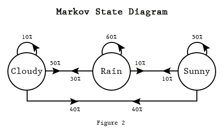
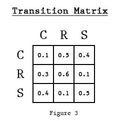
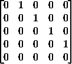

# 马尔可夫链:如何训练文本生成像乔治·马丁那样写作

> 原文：<https://towardsdatascience.com/markov-chains-how-to-train-text-generation-to-write-like-george-r-r-martin-cdc42786e4b6?source=collection_archive---------25----------------------->


马尔可夫链已经存在了一段时间，而且还会继续存在。从预测键盘到交易和生物学应用，它们已经被证明是多功能工具。

下面是一些马尔可夫链的行业应用:

*   文本生成(你是为此而来的)。
*   金融建模和预测(包括交易算法)。
*   物流:模拟未来的运输或行程。
*   搜索引擎:PageRank 可以看作是用马尔可夫链模拟一个随机的互联网冲浪者。

到目前为止，我们可以告诉这个算法是有用的，但到底什么是马尔可夫链？

# 什么是马尔可夫链？

马尔可夫链是一个**随机过程**，它模拟一组有限的**状态**，具有从一个给定状态跳到另一个状态的固定的**条件概率**。

这意味着，我们将有一个“代理”，它随机地在不同的状态之间跳跃，有一定的概率从一个状态跳到另一个状态。

为了展示马尔可夫链是什么样子，我们可以使用一个**有向图**，其中每个节点是一个状态(带有标签或相关数据)，从节点 *a* 到节点 *b* 的边的权重是从状态 *a* 跳到状态*b*的**概率。**

这里有一个例子，将天气建模为马尔可夫链。



[Source](http://techeffigytutorials.blogspot.com/2015/01/markov-chains-explained.html)

我们可以将从状态 *a* 到状态 *b* 的概率表示为**矩阵分量**，其中整个**矩阵表征了我们的马尔可夫链**过程，对应于**有向图的邻接矩阵**。



[Source](http://techeffigytutorials.blogspot.com/2015/01/markov-chains-explained.html)

然后，如果我们将当前状态表示为一个独热编码，我们可以通过获取当前状态并查看其对应的行来获得下一个状态的值的条件概率。

之后，如果我们重复采样由第 *n* 个状态的行描述的离散分布，我们可以模拟一系列任意长度的状态。

# 文本生成的马尔可夫链

为了用马尔可夫链生成文本，我们需要定义一些东西:

*   我们的国家会是什么样的？
*   从一个状态跳到另一个状态的概率是多少？

我们可以为文本生成做一个基于字符的模型，其中我们将我们的状态定义为我们看到的最后 *n* 个字符，并尝试预测下一个字符。

我已经在我的用于文本生成的[LSTM](http://www.datastuff.tech/machine-learning/lstm-how-to-train-neural-networks-to-write-like-lovecraft/)文章中对此进行了深入研究，结果喜忧参半。

在这个实验中，我将选择使用之前的 *k* 单词作为我的当前状态，并对下一个令牌的概率进行建模。

为了做到这一点，我将简单地为每一个由 *k 个*单词组成的不同序列创建一个向量，它有 N 个组成部分，其中 N 是我的语料库中不同单词的总数。

然后我会在第 *i* 个向量的第 *j* 个分量上加 1，其中 I 是第*I*k 个单词序列的索引， *j* 是下一个单词的索引。

如果我归一化每个单词向量，那么我将有下一个单词的概率分布，给定前面的 *k* 记号。

迷惑？让我们看一个小语料库的例子。

# 训练我们的链条:玩具例子。

假设我的语料库是下面这句话。

`This sentence has five words`

我们将首先选择 *k* :在采样/ **预测下一个**单词之前，我们的链将考虑的**单词量。对于这个例子，让我们使用 k=1。**

现在，我们的句子中有多少个不同的单词序列？它有 5 个，每个单词一个。如果它有重复的单词，他们不会添加到这个数字。

我们将首先初始化一个 5×5 的零矩阵。

之后，我们将在“this”行的“sentence”对应的列中加 1。然后在“句子”的行上加上 1，在“has”的列上加上 1。我们将继续这个过程，直到我们看完整个句子。

这将是生成的矩阵:



The diagonal pattern comes from the ordering of the words.

因为每个单词只出现一次，所以这个模型只是一遍又一遍地生成同一个句子，但是你可以看到添加更多的单词会使这个变得有趣。

我希望现在事情更清楚了。让我们跳到一些代码！

# 用 Python 编写我们的马尔可夫链

现在是有趣的部分！我们会在整个一首冰与火之歌文集上训练一个马尔可夫链(哈！你以为我会引用这部剧吗？太糟糕了，我是个爱看书的人！).

然后我们将为 *k* 生成不同值的句子。

在这个实验中，我决定将两个空格之间的任何内容都视为一个单词或*标记*。

按照惯例，在自然语言处理中，我们处理标点符号(如'，'或'.')作为令牌。为了解决这个问题，我将首先以两个空格的形式给每个标点符号添加填充。

下面是这个小预处理以及加载语料库的代码:

我们将立即开始训练我们的马尔可夫链，但首先让我们看看我们的数据集:

我们有超过 200 万个代币，代表超过 32000 个不同的单词！对于一个作家来说，这是一个相当大的语料库。

*要是他能多加 80 万就好了……*

# 训练我们的链条

继续，下面是我们如何为任意的 *k* (在本例中为 2)初始化我们的“k 序列后的单词”计数矩阵。

语料库中有 2185918 个单词，429582 个不同的 2 个单词的序列，每个序列后面都有 32663 个单词中的一个。

这意味着矩阵中只有 0.015%多一点的成分是非零的。

因此，我使用了 scipy 的 *dok_matrix* ( *dok* 代表键的字典)，一个稀疏矩阵实现，因为我们知道这个数据集将非常稀疏。

在初始化我们的矩阵后，采样是非常直观的。

下面是代码:

这里有两件事可能引起了你的注意。第一个是 *alpha* 超参数。

这是我们的链的*创造力*:一个(通常很小，或零)的机会，它会选择一个完全随机的单词，而不是语料库建议的那些。

如果数字很高，那么下一个单词的分布将接近均匀。如果为零或更接近，那么分布将更接近语料库中看到的分布。

对于我将展示的所有示例，我使用了值为 0 的 *alpha* 。

第二件事是加权选择函数。我必须实现它，因为 Python 的随机包不支持超过 32 个元素的列表的加权选择，更不用说 32000 个元素了。

# 结果:生成的句子

首先，作为基线，我尝试了一种确定性的方法:如果我们选择一个单词，使用 k=1，并总是跳到当前单词之后最有可能的单词，会发生什么？

至少可以说，结果并不令人满意。

```
**I** am not have been a man , and the Wall . " " " "
**he** was a man , and the Wall . " " " " " " "
**she** had been a man , and the Wall . " " " " " "
```

因为我们是确定性的，“a”后面总是跟着“man”，“the”后面总是跟着“Wall”(呵呵)等等。

这意味着我们的句子会很无聊，可预测，而且有点荒谬。

现在对于一些实际的世代，我尝试使用一个词的随机马尔可夫链，α值为 0。

# 一词马尔可夫链结果

以下是一些由 15 个单词组成的句子，种子单词用粗体表示。

```
'**the** Seven in front of whitefish in a huge blazes burning flesh . I had been' 
'**a** squire , slain , they thought . " He bathed in his head . The' 
'**Bran** said Melisandre had been in fear I've done . " It must needs you will' 
'**Melisandre** would have feared he'd squired for something else I put his place of Ser Meryn' 
'**Daenerys** is dead cat - TOOTH , AT THE GREAT , Asha , which fills our' 
'**Daenerys** Targaryen after Melara had worn rich grey sheep to encircle Stannis . " The deep'
```

正如你所看到的，产生的句子是非常荒谬的，尽管比前几个有趣得多。

每一对单词都有一定的意义，但整个序列完全没有意义。

这个模型确实学到了一些有趣的东西，比如丹妮莉丝后面通常跟着坦格利安，对于只知道前一个单词来说,“本该害怕”是一个很好的结构。

然而，总的来说，我认为这还远远没有达到它应有的水平。

当增加单词链的 alpha 值时，我得到的句子开始变得更加随机。

# 2 字马尔可夫链的结果

两个单词的链产生了一些更有趣的句子。

尽管它通常听起来完全随机，但它的大部分输出可能会在开始时愚弄你一会儿。

```
'**the world** . *And Ramsay loved the feel of grass* *welcomed them warmly* , the axehead flew' 
'**Jon Snow** . *You are to strike at him* . *The bold ones have had no sense*' 
'**Eddard Stark** had done his best to give her *the promise was broken* . By tradition the' 
'**The game** of thrones , so you must tell her the next buyer who comes running ,' 
'**The game** trail brought her messages , strange spices . *The Frey stronghold was not large enough*' 
'**heard the** scream of fear . I want to undress properly . Shae was there , fettered'
```

句子保持了局部的连贯性(*你要打击他*，或者*拉姆齐喜欢草的感觉*)，但随后将非常连贯的单词序列连接成一团乱麻。

任何句法、语法或语义的感觉都明显缺失。

顺便说一下，我根本没有挑选那些句子，这些是我采样的第一批输出。

随意[自己玩代码](https://github.com/StrikingLoo/ASOIAF-Markov)，你可以在评论里分享你得到的最古怪的句子！

作为最后一个实验，让我们看看用三个词的马尔可夫链能得到什么。

# 三字链结果

以下是模型在用 3 个单词的序列进行训练时生成的一些句子。

```
'**I am a** master armorer , lords of Westeros , sawing out each bay and peninsula until the' 
'**Jon Snow is** with the Night's Watch . I did not survive a broken hip , a leathern' 
'**Jon Snow is** with the Hound in the woods . He won't do it . " Please don't' 
'**Where are the** chains , and the Knight of Flowers to treat with you , Imp . "' 
'**Those were the** same . Arianne demurred . " So the fishwives say , " It was Tyrion's' 
'**He thought that** would be good or bad for their escape . If they can truly give us' 
'**I thought that** she was like to remember a young crow he'd met briefly years before . "'
```

好吧，我真的很喜欢其中的一些，尤其是最后一个。这听起来有点像你能在书中找到的真实句子。

# 结论

实现马尔可夫链比听起来容易得多，在真实语料库上训练它很有趣。

坦白地说，结果比我预期的要好，尽管在 LSTM 的小失败后，我可能把标准定得太低了。

在未来，我可能会尝试用更长的链或完全不同的语料库来训练这个模型。

在这种情况下，尝试一个 5 个单词的链又有了基本确定的结果，因为每个 5 个单词的序列几乎总是唯一的，所以我不认为 5 个单词和以上的链是感兴趣的。

你认为哪个语料库会产生更有趣的结果，尤其是对于更长的链？请在评论中告诉我！

*如果你想了解更多关于马尔可夫链的知识，可以考虑查看一下* [*这本深入的书*](https://amzn.to/31IDAHp) *。那是一个代销商链接，也就是说我从中获得一小笔佣金*。

*原载于 2019 年 10 月 25 日*[*http://www . data stuff . tech*](http://www.datastuff.tech/machine-learning/markov-chains-teaching-ai-to-write-game-of-thrones/)*。*