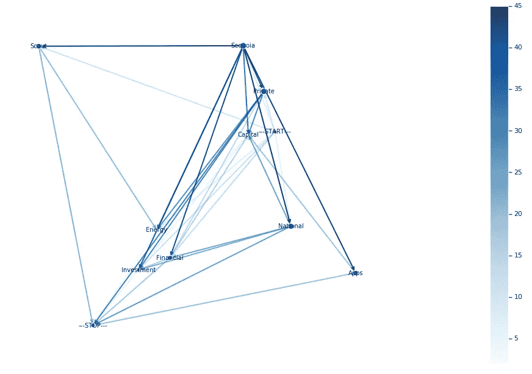

# 马尔科夫风险投资公司

> 原文：<https://towardsdatascience.com/markov-ventures-generating-venture-firms-using-markov-chains-d3e68295d154?source=collection_archive---------24----------------------->

## 利用马尔可夫链生成风险投资公司名称的探索

风险投资家在命名方面不是很有创意，所以我决定尝试使用马尔可夫链来生成一些名字。(我是帮手。)

首先，我尝试了数据科学[中描述的普通马尔可夫链](/simulating-text-with-markov-chains-in-python-1a27e6d13fc6)。基本上，我把我的投资者姓名数据集转化成一个配对列表。所以如果我们有:

```
Sequoia Capital
Union Square Ventures
GV (Google Ventures)
```

我们最终会得到:

```
('Sequoia', 'Capital')
('Union', 'Square')
('Square', 'Ventures')
('GV', '(Google')
('(Google', 'Ventures)')
```

然后我们根据第一个单词分组，找出所有可能的转换。例如，从我的未删节数据集:

```
'Sequoia': [
  'Capital',  
  'Financial',  
  'National',  
  'Capital',  
  'Capital',  
  'Capital',  
  'Capital',  
  'Scout', 
  'Apps',  
  'Investment',  
  'Capital',  
  'Energy',  
  'Private',
  'Capital',
  'Capital',
  'Apps',
  'Capital',
  'Capital',
  'Capital',
  'Capital'
]
```

当我等待循环突突地创建所有这些重复的列表时，我的眼睛开始抽搐。这可以做得更好。

不管怎样，现在您可以选择一个起始单词(比如“Benchmark”)，然后从列表中随机选择一个与“Benchmark”配对的单词，以获得名称中的下一个可能的单词。然后在某个时候你切断了它。

这种方法的结果并非不切实际:

```
Adler & Jack W. Baird Capital  # 5 words
Dongxing Capital Corp Equity  # 4 words
Sage Hill Angels  # 3 words
```

…但我认为我们可以做得更好。

# 改进算法

首先，我们随机选择第一个单词。由于大约 50%的风险投资家的名字中有“合伙人”、“资本”、“基金”或一些类似的样板词，很可能我们会以第一个词“LLC”或其他什么结束。因此，我们应该有一些“开始词”的概念，所以我们将来只从那个集合中选择。

同样困扰我的是，我必须明确地说出我希望名字有多长:当你到了“LP”的时候，你可以很确定这个名字已经结束了。因此，让我们添加一个“停用词”的概念。

最后，大部分代码和时间都花在了将<some word="">到<likely next="" word="">的图形硬塞进 dict 中。让我们使用 networkx，而不是我们自己来管理。</likely></some>

修改后的配对生成看起来像:

```
import networkx as nxgraph = nx.DiGraph()
START_WORD = '---START---'
STOP_WORD = '---STOP---'def AddPair(start, stop):
  """Add an edge to the graph (or increment the weight of an existing edge)."""
  if start in graph and stop in graph[start]:
    graph[start][stop]['weight'] = graph[start][stop]['weight'] + 1.0
  else:
    graph.add_edge(start, stop, weight=1.0)def AddName(name):
  words = name.split(' ')
  AddPair(START_WORD, words[0])
  for i in range(0, len(words)-1):
    AddPair(words[i], words[i+1])
  AddPair(words[-1], STOP_WORD)investors.name.apply(AddName)
```

…这只需要运行时间的一小部分。另一个好处是你可以生成漂亮的图表:



嗯，有点漂亮。

现在我们可以从`START_WORD`开始，随机选择一条路径，直到到达`STOP_WORD`:

```
def GenerateVc():
  name = []
  current_word = ChooseNext(START_WORD)
  while current_word != STOP_WORD:
    name.append(current_word)
    current_word = ChooseNext(current_word)
  return ' '.join(name)
```

`ChooseNext`会取一个词，根据边权重随机选择。`numpy`有一个很好的`np.random.choice`方法，它采用一个概率数组，但是这些概率的总和必须是 1。首先，我要遍历所有的边，缩小权重，作为概率。

```
def NormalizeWeights():
  for start in graph:
    total_weight = graph.out_degree(start, weight='weight')
    for stop in graph.successors(start):
      graph[start][stop]['weight'] = graph[start][stop]['weight'] / total_weight
```

然后使用这些权重实现`ChooseNext`:

```
def ChooseNext(word):
  next_words = list(graph.successors(word))
  weights = [graph[word][n]['weight'] for n in next_words]
  return np.random.choice(next_words, p=weights)
```

然后我们可以调用`GenerateVc`来创建一个不错的 VC 名称数组:

```
for i in range(0, 20):
  print(GenerateVc())# Produces:
Cream City Digital Farm Ventures LLC 
INESA Venture Fund LLC 
Koms Co. Ltd. 
Startup Lab 
Japan Securities Investment Management Co. Ltd. 
Novestra 
Desert Sky Venture Capital Partners Co Ltd 
Vuzix 
Warren Citrin Impact Partners 
Advantage Capital Partners 
Genesis Campus, a Day 
Denota Ventures LLC 
Main Street Capital 
Dry Canyon Creek Capital 
Cenes Immo 
Sheffield University of Iowa Capital Partners 
Hamilton Portfolio Ltd. 
CSC 
Brocade Communications 
BPL Global Health & Associates
```

听起来差不多。