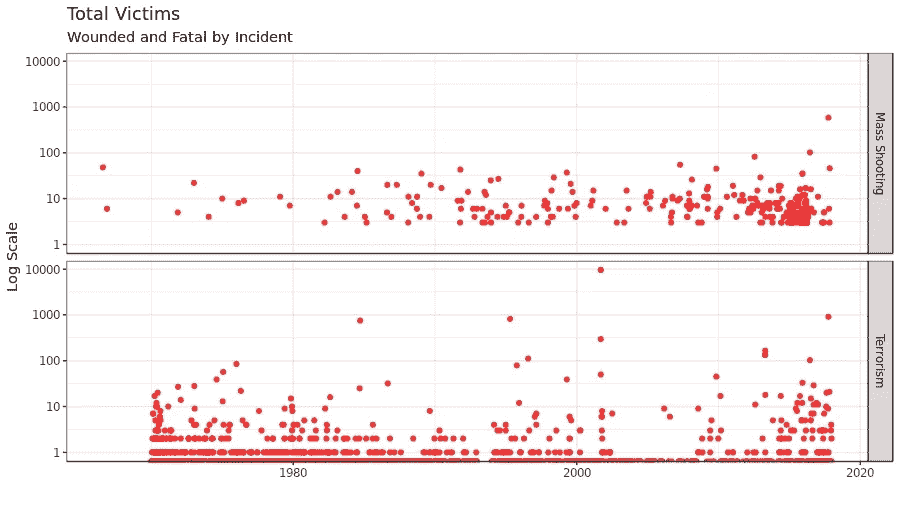
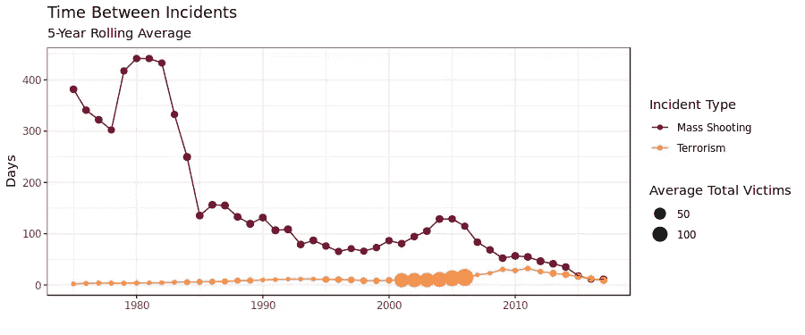
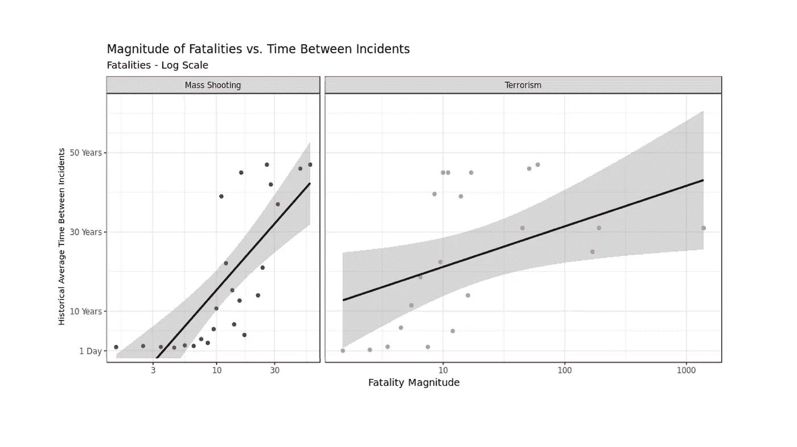

# 大规模枪击和恐怖主义

> 原文：<https://towardsdatascience.com/mass-shootings-and-terrorism-500dc969a1a6?source=collection_archive---------15----------------------->

## 我们对小概率和罕见事件的痴迷


我上个月在我父亲的忌日前后开始考虑这篇文章。即使是圣诞节，节日前后的几个星期也总是有些阴郁。死亡和死亡的想法与我的孩子们对圣诞老人的到来和新年的欢迎的天真兴奋交织在一起。我父亲于 2001 年去世，就在 911 事件后几个月。在与胃肠癌短暂斗争后，他去世了。在他的治疗过程中，我们有机会思考恐怖分子是如何改变世界的。

我没有理解这个悖论。我和我父亲认为，美国面临的最大威胁已经显现。但是，当时我也坚信他的癌症是个异数。也许这要归咎于他年轻时的暴露；反常的事情。多年以后，我开始意识到我的想法是多么简单。比起死于恐怖袭击，我更有可能与癌症抗争。

我现在明白了暴力，就像恐怖主义和大规模枪击事件一样，在我们的生活中扮演了一个很小的角色。我在经历了我应得的那份死亡后发表了这个声明。在过去的 16 年里，我一直是美国陆军的一名士兵，我可以证明，在 2:1 的比例下，战斗并不是军人葬礼的主要原因。

事实上，上周末我刚刚参加了另一场非战斗军事葬礼。自杀、摩托车事故、车祸、癌症和心脏病比巡逻队从地球上夺走了更多的朋友。这显然不会是每个士兵的经历，但对大多数人来说是这样的，而且与数据一致。

事实是，你可能不会死于大规模枪击或恐怖事件。它们是极其罕见的事件。你可能以前被告知过这一点，但这与此类事件获得的新闻报道和政治关注形成了鲜明的对比。在过去的半个世纪里，美国人口中受害者的平均数量接近下面列出的数值。

```
+ — — — — — — — — + — — — — — — — — — - — — — — — — +
| Incident Type   | Avg Annual Victims              |
+ — — — — — — — — + — — — — — — — — — - — — — — — — +
| Mass Shootings  | 2.5 per 10 mil in population    |
| Terrorism       | 18.8 per 10 mil in population   |
+ — — — — — — — — + — — — — — — — — — - — — — — — — +
```

我们关注这些事件有很多原因。也许是因为它们非常适合政治叙事。或者，也许暴力是我们祖先最关心的问题，而我们的生物线路没有文明变化得那么快。

然而，有基于数据的理由来证明罕见事件的困扰。它们(罕见事件)可能是更大事件的前兆。有时草丛中无法解释的运动是一只狮子。也许偶尔发生的涉及枪支和恐怖主义的事件是流行病迅速蔓延的征兆，而不仅仅是偶发的社会背景噪音。从数据科学的角度来看，此类事件的影响是非线性的。简单来说，这些事件是指数级恶化还是频率快速增加？

我几乎总是发现忽视人类的直觉是一个错误。通常，人们持有特定的信仰是有充分理由的。在大规模枪击和恐怖主义的情况下，数据的一些特征可能解释了我们的痴迷。看看美国，这是每起事故中受害者总数的视图。



这些事件类型中的每一种都有一个故事要讲述。通常对于离散的罕见事件，使用[泊松过程](https://en.wikipedia.org/wiki/Poisson_point_process)进行建模和预测。这就是，例如，T2，地震通常是如何被理解的。然而，泊松过程具有稳定的到达间隔时间(事件之间的平均时间)的无记忆假设。可视化统计到达间隔时间显示大规模枪击事件变得越来越常见(目前与恐怖主义一样常见)，从 80 年代开始频率急剧增加。



令人欣慰的是，大规模枪击事件的平均受害者总数逐年稳定。另一方面，恐怖主义在到达间隔方面是稳定的，但在每次事件的受害者总数方面有很大的变化。观察这两种罕见事件之间差异的另一种方法是比较事件之间的平均时间与死亡人数。



大规模枪击事件的死亡人数似乎被限制在 100 人左右，而不管事件之间的时间间隔。然而，在恐怖主义问题上，引人注目的局外人讲述了一个不同的故事。趋势线(不可否认是粗略的)表明，事件之间的时间间隔越长，可能的死亡人数就越多。事实上，死亡人数呈非线性增长。因此，举例来说，每增加 10 年的平均间隔时间，死亡人数就会增加 10 倍。

从这个角度来看，一个真正大规模的恐怖主义事件，杀死 10 万到 100 万人，不仅是可能的，而且是可能的。根据这个基本模型的极端界限，我们可以预期这样的事件每 50-100 年发生一次。

这些类型的罕见事件趋势可以被我们的心理所识别，甚至在我们有意识地意识到它之前。大规模枪击事件的频率正在加快，低影响力恐怖主义是一个更大事件的指标。这两个问题都在我们的脑海中，因为我们的直觉告诉我们要注意，数据也是如此。

[用于创建本文的所有数据和代码都可以在这个 MatrixDS 项目中找到。](https://community.platform.matrixds.com/community/project/5c37c68d21b33b4fc65c42ad/files)

[在 LinkedIn 上关注我](https://www.linkedin.com/in/isaacfaber/)

[跟着我上 MatrixDS](https://community.platform.matrixds.com/community/isaacfab/overview)