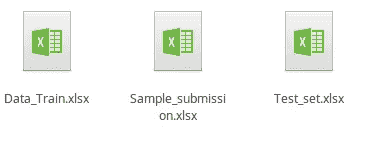
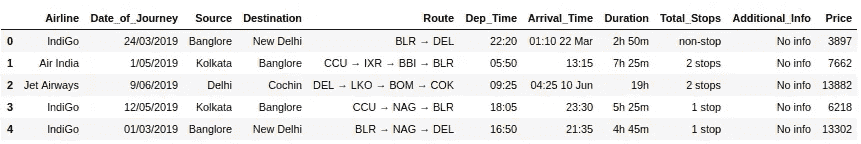
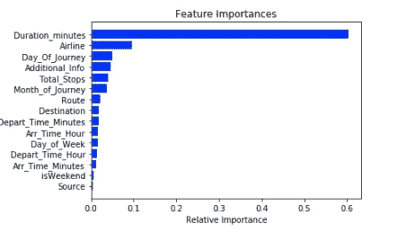
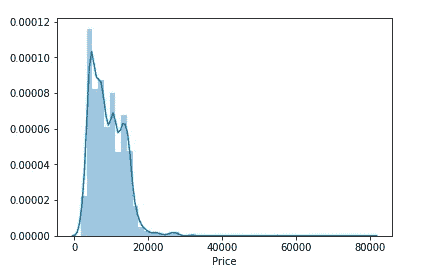
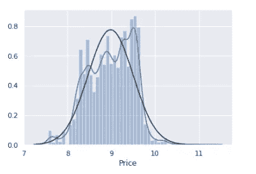
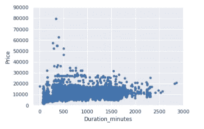
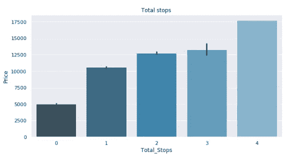
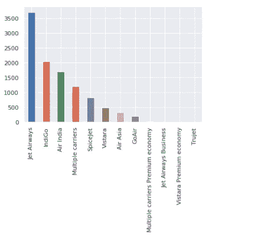
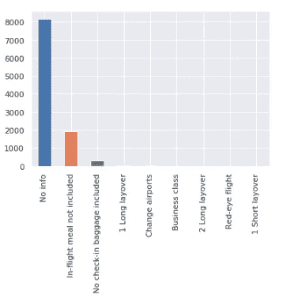
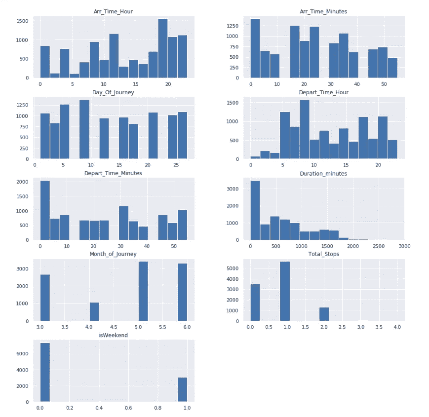

# 通过解决黑客马拉松问题掌握机器学习的基础知识

> 原文：<https://towardsdatascience.com/master-basics-of-machine-learning-by-solving-a-hackathon-problem-fca16768083e?source=collection_archive---------6----------------------->

## 了解如何一步一步解决回归问题，并在黑客马拉松排行榜中获得体面的排名

黑客马拉松是在短时间内学习和实现新概念的好方法。今天，我们将讨论机器学习的基本步骤，以及如何在试图使用 MachineHack 黑客马拉松的数据集获得体面排名的同时，获得回归问题的良好准确性。

解决任何机器学习问题的基本步骤是

1.  **识别目标和独立特征**
2.  **清理数据集**
3.  **特征工程**
4.  **特征编码和缩放**
5.  **功能选择**
6.  **检查目标变量的分布**
7.  **从图表中获得微调特性的洞察力**
8.  **模型应用和超参数整定**
9.  **组合不同的模型**

唷…要涵盖很多步骤，初学者很容易被吓倒…所以让我们深入这个问题，一步一步来…

您可以通过在 [MachineHack](https://www.machinehack.com/register/) 网站上创建帐户来下载数据集，并通过注册以下黑客马拉松来下载数据集:- [机票价格预测](https://www.machinehack.com/course/predict-the-flight-ticket-price-hackathon/)

现在，您从黑客马拉松获得的 zip 文件中提供了 3 个文件:-



Files provided in the dataset: 1)Data_train.xlsx 2)Sample_submission 3)Test_set

这里的`Data_Train.xlsx`包含我们需要用来训练模型的数据集，`Sample_submission`顾名思义指定了在黑客马拉松中需要提交的输出的格式，`Test_set`是我们需要应用我们的模型来预测机票价格的数据集，我们在黑客马拉松中的分数将基于该数据集进行评估。

现在，我们需要记住的一件事是，无论我们将对`Data_Train`数据集特征应用何种转换，都需要对`Test_set`数据集应用相同的转换，以便模型从两者获得相似类型的输入。

接下来，从 GitHub 资源库下载 juptyer 笔记本，该资源库详细介绍了上述所有步骤:

[黑客马拉松问题解决方案](https://github.com/saurabhnative/MachineHack-2019-Flight-Price-Prediction-Hackathon)

好吧，如果你已经走到这一步，这意味着你对学习新事物是认真的，那么在另一个标签中开始一些好听的音乐，进入 ***区*** 让我们开始吧…

1.**识别目标和独立特征**

解决任何机器学习问题的第一步是识别源变量(自变量)和目标变量(因变量)。

在机器学习环境中，目标变量是应该输出的变量。例如，如果进行分类，它可以是二进制 0 或 1；如果进行回归，它可以是连续变量。

独立变量*(也称为特征)*是被分析过程的输入。

我们在官方网站上获得了关于数据集的以下信息:-

训练集的大小:10683 条记录

测试集大小:2671 条记录

**特性** :
航空公司:航空公司的名称。

旅行日期:旅行的日期

Source:服务开始的来源。

目的地:服务结束的目的地。

路线:航班到达目的地所采用的路线。

Dep_Time:旅程从源头开始的时间。

到达时间:到达目的地的时间。

持续时间:飞行的总持续时间。

Total_Stops:出发地和目的地之间的总停靠站数。

Additional_Info:关于航班的附加信息

价格:门票的价格

让我们使用`pd.read_excel`命令在 jupyter 笔记本中导入数据集。你可以在这里找到关于在熊猫[中导入各种文件的信息。](https://pandas.pydata.org/pandas-docs/stable/reference/io.html)

让我们在 pandas 中使用`df.head()`命令来了解数据集中的列。请记住，我已经将我们用来训练模型的数据集的名称保留为`df_train`



df.head() is used to print first 5 rows of the dataset

在这里，我们可以看到价格列是目标变量，因为它有连续的值，也就是说，它不能被分类到特定的类别，这个问题是一个监督回归问题。

**2。清理数据集:**

首先，让我们使用`df.isnull()`命令检查数据集中缺失值的数量:-

Check null values

由于我们的数据集中只有一个空值，我只是简单地删除它，因为试图估算一个值似乎不是一个好的选择。

但是请记住，一般的经验法则是，如果任何特定列中超过 30%的值丢失，那么我们可以排除该列。

在 pandas 中，通过运行下面的命令很容易删除空值:-

此处`inplace`参数用于隐式执行操作，即将操作直接应用于指定的数据帧。

接下来，我们应该检查我们的数据集是否有任何重复的行并删除它们:-

`df.duplicated()`用于查找数据帧中重复条目的总数。

Check duplicate rows

接下来，我们需要通过运行以下命令删除重复的条目:-

```
#remove duplicate rows in training dataset
df_train.drop_duplicates(keep='first',inplace=True)
```

在上面的`drop_duplicates`命令中，`keep='first'`选项允许我们保留第一次出现的行值，同时删除所有后续出现的行值。

现在，您还可以只通过在这一步查看数据集来删除不必要的列。在当前的数据集中，没有这样的列，所以我们可以继续。

如果您观察笔记本的 ***数据清理*** 部分中采取的步骤，我们已经合并了`Additional_Info`列中的重复值，并重命名了 ***Total_Stops*** 列中的值。

3) **特征工程:-**

特征工程是使用问题的领域知识和一点常识来创建新特征的过程，这些新特征可以增加机器学习模型的预测能力。这一步确实需要相当多的想象力，对输入特性的批判性思考，以及运用你的创造性。

`Date_of_Journey`列本身并不十分有用，但我们可以从中创建新的功能，如航班是否在周末、星期几和月份。

Feature engineering

惊叹声...这看起来像是一段很难理解的复杂代码…相信我，这不是我一个人想出来的，可能永远也不会。但这就是 StackOverflow 前来救援的地方。你可以从下面的链接中进一步阅读代码，因为这将有助于你

a)理解在 python 中完成相同任务的各种方式

b)以防明天这段代码变得多余或对你不起作用，猜猜哪个网站会帮助你找到解决方案😉

链接:-

1) [用 python 获取星期几](https://stackoverflow.com/questions/9847213/how-do-i-get-the-day-of-week-given-a-date-in-python)

查看熊猫的某一天是否是周末

从熊猫的日期时间变量中获取年、月和日

然后，我们将持续时间列的值转换为分钟:-

Feature engineering on duration column

如果您看一下`Duration`列，值的格式类似于`2h 50m`,一些行只包含小时值，而一些行只包含分钟值(就像某人如何享受不到一小时就结束的飞行，但这是改天讨论的问题)

所以在上面的代码中，最初的 for 循环将小时和分钟部分分开，而第二个 for 循环用于将持续时间转换为分钟。

我甚至试着转换成秒来提高准确度，但是请不要遵循这些愚蠢的步骤，除非你有大量的空闲时间，并且一心想要提高排行榜上的排名👻

接下来，我们创建了一个名为`Duration_minutes`的新列，并从 dataframe 中删除了原来的`Duration`列。

我也在 Arrival_Time 列执行了类似的步骤，您可以在笔记本中跟进。

4) **特征编码和缩放:-**

我们通常对独立的输入变量进行特征缩放和编码，因此让我们在数据帧中将目标变量和输入变量彼此分开。

Split the dataset

这里`X`包含输入特征的数据框，而`y`是我们的目标变量。我将在下一节介绍对`y`应用对数转换的原因。现在，让我们关注我们的输入变量 dataframe，即`X`

第一步是将输入变量分为分类变量和数字变量。

分类变量包含有限数量的类别或不同的组。分类数据可能没有逻辑顺序。例如，分类预测包括性别、材料类型和支付方式。

数值变量顾名思义包含连续或离散的数值。

我们可以使用`df.select_dtypes()`方法进行拆分:-

select_dtypes is used to separate numerical and categorical features

在分类特征的情况下，我们可以应用标签编码或一个热编码。

您可以在这里进一步了解这两种技术:

[实施](https://medium.com/@contactsunny/label-encoder-vs-one-hot-encoder-in-machine-learning-3fc273365621)

[何时使用标签编码 vs 标签编码器](https://datascience.stackexchange.com/questions/9443/when-to-use-one-hot-encoding-vs-labelencoder-vs-dictvectorizor)

在当前数据集中，我们已经对分类要素进行了标注编码。

Label encoding variables

对于数字特征，我们可以执行不同类型的缩放，如[最小最大](https://machinelearningmastery.com/prepare-data-machine-learning-python-scikit-learn/)、[标准缩放器](https://machinelearningmastery.com/prepare-data-machine-learning-python-scikit-learn/)或 [BoxCox](https://nickcdryan.com/2017/04/19/the-box-cox-transformation/) 变换。

我尝试了各种标准缩放、最小-最大缩放和数字的 boxcox 变换。最终，boxcox 变换给出了最好的准确度分数。

Boxcox transformation

Box-Cox 变换是一系列幂变换函数，用于稳定方差并使数据集看起来更像正态分布。关于 box-cox 变换的解释可以在这里找到[。](http://dataunderthehood.com/2018/01/15/box-cox-transformation-with-python/)

`lam`变量指定要应用的转换类型:-

*   *λ*=-1。是一种互易变换。
*   *λ*=-0.5 是倒数平方根变换。
*   *λ*= 0.0 是对数变换。
*   *λ*= 0.5 是平方根变换。
*   *λ*= 1.0 就是没有变换。

完成上述转换后，我们将分类和数字特征连接起来，得到一组转换后的输入变量。

5) **功能选择** :-

我们可以应用基于树的回归模型，如随机森林回归器、额外树和 xgboost，来获得特性的重要性。

例如，RandomForestRegressor 模型可应用于数据集，如下所示

Random Forest

我们首先使用`train_test_split`方法将数据集分成训练和测试样本。`test_size`参数指定了训练和测试数据的比例。值为 0.3(即 30%)会将数据分为 70:30 的训练数据和测试数据。然后，我们定义了 RandomForestRegressor 模型，并将其应用于训练样本(X_train，y_train)。

然后对测试输入样本(X_test)进行预测，并与原始目标样本(y_test)进行比较，得到各种精度指标。我将在本文的后续部分讨论准确性度量。

现在，让我们使用下面的函数来看看模型预测的特征重要性:-

Feature Importances

在上面的函数中，我们根据模型提供的特征重要性，按照重要性降序创建了一个新的数据框架。

然后，我们使用 matplotlib 库创建一个水平条形图，以直观地查看特性的重要性。

在随机森林回归的情况下，函数的输出为:-



Feature Importances

正如我们所看到的，持续时间列具有最高的重要性，而航班始发的来源城市具有最低的特征重要性。

我们可以从上面生成的图表中手动选择特性，也可以使用`sklearn`中的`SelectFromModel`模块自动选择最合适的特性。

我尝试根据上述功能的重要性在选定的功能上运行该模型，但准确性略有下降，如果我们在现实世界中部署该模型，这可能会很好，因为该模型现在有点更健壮，但对于黑客马拉松来说，准确性最重要，所以我最终保留了所有功能。

7) **检查目标变量**的分布:-

我们应该使用分布图来检查回归问题中目标变量的分布。如果它是偏斜的，那么对数、指数或 sqrt 变换的应用可以帮助减少偏斜以获得正态分布。

在我们的例子中，目标变量的分布最初有点向右倾斜



应用对数变换后，它呈正态分布:-



Normalized distribution

最后，对数转换确实提高了模型的整体准确性，这也是我在上面第 4 步开始时对目标输入应用对数转换的原因。

8) **从图表中获得洞察力:-**

检查目标列相对于输入变量的变化以及各种输入变量的分布:-



Scatter plot

价格应该随着持续时间的增加而增加，但这里的情况并非如此。

接下来，我们检查价格相对于停靠点总数的变化:-



Total stops vs Price

从上图中可以看出:-
正如所料，经停次数越多，机票价格越高

数字特征的分布可以使用直方图来检查，而分类特征的分布可以使用条形图或箱线图来检查。

在分类特征的情况下，检查是否有任何列值可以组合在一起，而在数字特征的情况下，检查分布是否可以归一化，即均匀分布。



Airlines frequency bar plot

后来，我回到分类特征，把最后四个航空公司分类组合在一起。

对`Additional_Info`列执行类似的步骤:-



Additional Info frequency bar plot

您可以在 jupyter 笔记本中找到数值特征的直方图，并根据需要进行必要的转换。



9) **模型应用和超参数调整:-**

在尝试了不同类型的回归模型后，我发现 ExtraTrees、RandomForest 和 XGboost 比其他模型的精度略高，因此是时候对所有 3 个模型进行超参数调整以进一步提高精度了。

在机器学习中，**超参数**是在学习过程开始之前设置其值的参数。我们需要得出超参数的最佳值，因为这些值在模型之外，并且它们的值不能从数据中估计。

超参数调整是为学习算法选择一组最佳超参数的过程。进行超参数调优的两种常见方法是 GridSearchCV 和 RandomisedSearchCV。

虽然 GridSearchCV 是详尽的，但 RandomisedSearchCV 有助于快速获得一系列相关值。更多关于他们的信息可以在[这里](https://www.analyticsindiamag.com/why-is-random-search-better-than-grid-search-for-machine-learning/)找到。

Randomized Search CV

在 RandomForest 算法的例子中，下面这篇来自《走向数据科学》的文章有助于我们理解如何正确地进行超参数调优:- [文章链接](/hyperparameter-tuning-the-random-forest-in-python-using-scikit-learn-28d2aa77dd74)

类似的方法可以应用于 ExtraTrees 和 XGBoost 回归模型。

10) **组合不同型号**

堆叠是一种集成学习技术，其中我们可以通过元分类器或元回归器来组合多个回归模型。基于完整的训练集来训练基础级模型，然后基于基础级模型的输出作为输入特征来训练元模型。

在最后一步中，我使用叠加技术将上述三个模型结合起来，以提高整体准确性

Stacked model

这里使用的基本模型是 ExtraTrees、Random Forest 和 XGBoost 回归器，而使用的元模型是 Lasso。你可以在这里了解更多关于如何实现堆栈[的信息。](https://www.kaggle.com/serigne/stacked-regressions-top-4-on-leaderboard)

接下来，我们拟合堆叠模型，并对测试数据样本进行预测

Fit the model

接下来，我创建了一个简单的函数来打印回归模型中所有可用的准确性指标

Print accuracy report

一旦我们训练了堆叠模型，我们只需将模型应用于预测数据集，并将值提交给 hackathon 网站，这就完成了解决机器学习问题所需的所有基本步骤。

堆叠模型的最终指标是:-

**R** - **平方**在 0-1 范围内测量模型和因变量之间的关系强度。关于其他指标的信息可以在[这里](https://www.dataquest.io/blog/understanding-regression-error-metrics/)找到。

希望在完成上述所有步骤后，你至少对如何处理有监督的机器学习问题有了一点了解。如果你有任何疑问、建议或更正，请在评论区提出来，如果你喜欢这篇文章，请与他人分享，以示欣赏。

最后但并非最不愉快的编码🤓