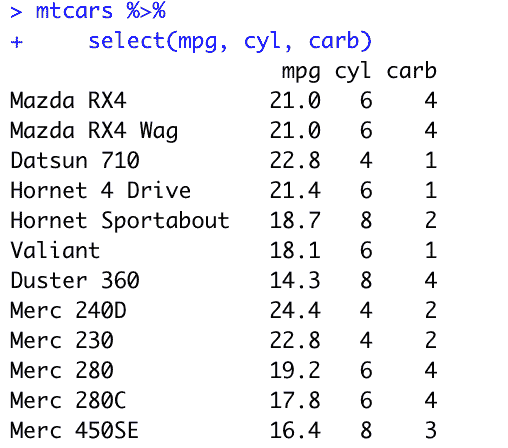
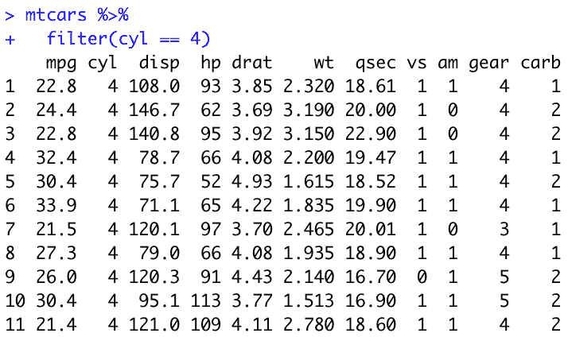
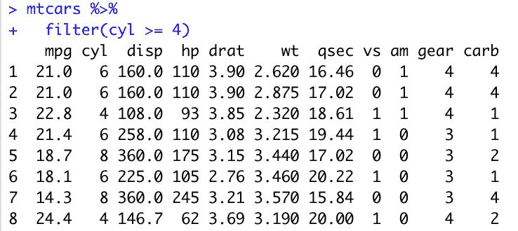
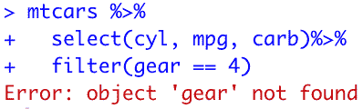
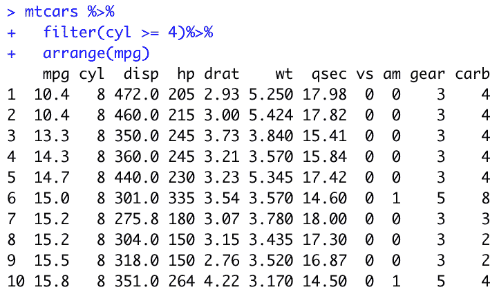
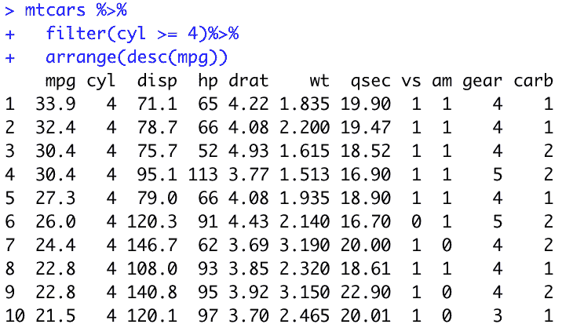
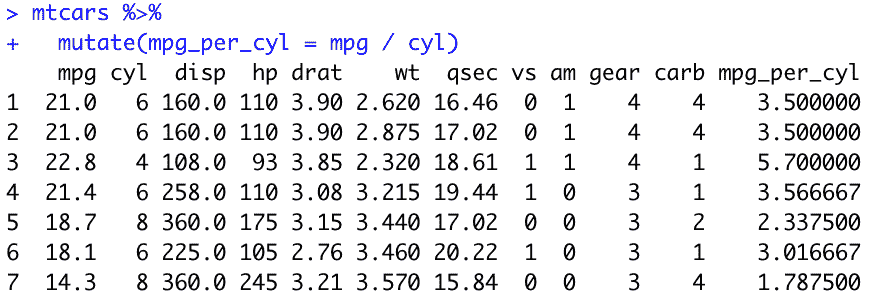
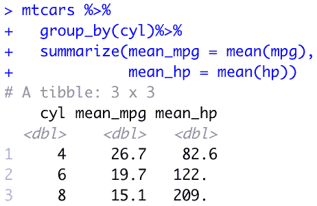

# 最好的数据科学家每天使用的数据操作工具

> 原文：<https://towardsdatascience.com/master-data-wrangling-in-r-fa74dd05b540?source=collection_archive---------28----------------------->


Photo by [Simon Matzinger](https://www.pexels.com/@8moments?utm_content=attributionCopyText&utm_medium=referral&utm_source=pexels) from [Pexels](https://www.pexels.com/photo/herb-of-goat-beside-mountain-735002/?utm_content=attributionCopyText&utm_medium=referral&utm_source=pexels)

# 作为数据科学家，您所做的一切都是从数据操作开始的

dplyr 包有一组丰富的工具和函数，您可以使用它们进行数据辩论、探索性数据分析、特性工程等。

在接下来的几分钟里，我们将介绍一些绝对重要的函数，作为一名数据科学家，您会发现自己每天都在使用这些函数。

# 选择:展现重要的变量

dplyr 中可用的函数与您在 SQL 甚至 Python 中使用的函数密切相关，这取决于您正在执行的任务。

这里的主要区别是，使用 sql，您的代码可能看起来像这样……(并且您不会在`dplyr select`中包含聚合函数，但稍后会详细介绍)

```
SELECT mpg, cyl, carb 
FROM mtcars
```

相反，使用`dplyr`我们首先指定想要操作的数据集，然后使用管道操作符`%>%`有效地说，“嘿，这是我们的数据集，我调用的下一个动作或函数应该对它执行！”

因此，我们将有效地看到语法略有变化的函数翻转。继续这个例子，“嘿，mtcars 是我的数据集，我想从中选择 mpg、cyl 和 carb。”

您可以通过管道从一个函数传递到另一个函数。超级方便，容易习惯。稍后会有更多的介绍。

```
mtcars %>% 
   select(mpg, cyl, carb)
```

说到数据操作，我个人更喜欢 dplyr 的方法。对您可能正在执行或检查的任何数据操作进行逻辑分解要容易得多，因为您通过管道函数来有效地在每一行中重新创建数据集。

使用`R`或`SQL`，您的输出将如下所示:



# 过滤器:给我我想要的！

您可以将 filter 看作是 dplyr 对 SQL 的 where 语句的回答。如果你不用 SQL 来思考，这差不多就是你如何去掉任何不符合你想要的标准的东西。

例如，假设您只想查看 4 缸汽车。

您可以声明`mtcars %>%`，然后调用包含您所关心的标准的`filter`函数。

```
mtcars %>% 
   filter(cyl == 4)
```

您的输出将如下所示:



您将看到所有记录都包含 4 个柱面。

# 其他条件运算符

您也可以使用其他条件操作符，比如`<`或`>`。您可以在字符串、逻辑等上这样做。

```
mtcars %>% 
   filter(cyl >= 4)
```



我们现在可以看到各种各样的例子，其中`cyl`列大于或等于 4。

# 组合过滤器

想象这样一个场景，是的，您想要过滤掉`cyl`大于或等于 4 的记录...太好了；但是您还想过滤掉那些`mpg`小于 20 的记录。

您可以使用`&`或`|`来组合这些标准。`&`表示两个标准都必须满足，而`|`将包括至少满足两个标准之一的记录。

你不局限于两个或三个或四个标准。您可以将任意数量的过滤器链接在一起！

看看这些例子！

```
mtcars %>% 
   filter(cyl >= 4 & mpg < 20)mtcars %>% 
   filter(cyl >= 4 | mpg < 20)
```

# 突击测验

您认为哪个代码片段会返回更多的记录？

第二个将总是返回更多(除非所有 4 缸或更多的车辆都少于 20 个`mpg`，那么它们将返回相同数量的记录。)

这是因为过滤器不太严格。只需满足两个标准中的一个，而`&`则需要满足两个标准。

您也可以使用逗号分隔标准，其行为与`&`操作符相同。

# 不要忘了把你的函数放在一起

到目前为止，你已经学习了两个关键函数，`select` & `filter`。您很可能想要连续组合输出。这个秘密就是管道操作员。

在执行了`select`操作之后，您现在有了一个新的数据集。它是`mtcars`加上你在上面做的任何操作。当您使用管道操作符(`%>%`)时，您实际上告诉了`R`下一个函数将作为该行输出的延续！看看下面我们是如何结合最后两个动作的。

```
mtcars %>% 
   select(cyl, mpg, carb)%>% 
   filter(cyl >= 4 & mpg < 20)
```



# 保存你的创作！

在我们讨论其他可以使用的函数之前，告诉您如何有效地保存数据集也是值得的。

你可以像在`R`中声明任何变量一样做这件事。`<-`

```
mtcars_sub <- mtcars %>% 
   select(cyl, mpg, carb)%>% 
   filter(cyl >= 4 & mpg < 20)
```

# 安排:让我们井然有序！

好了，现在这已经不碍事了...让我们进入`arrange`功能。

```
mtcars %>% 
   filter(cyl >= 4)%>% 
   arrange(mpg)
```



现在，假设您想颠倒顺序，从最高到最低查看`mpg`。你所要做的就是扔进一个`desc()`。

```
mtcars %>% 
   filter(cyl >= 4)%>% 
   arrange(desc(mpg))
```



我们现在看到同样的输出从大到小排序`mpg`。

# 变异:创建新变量

`mutate`函数是我们创建新列的方法。这可能是将多个列值相加，根据一个列的值创建分类桶，将宁滨分类细化，或者为其他任何内容创建额外的列。

我将在这里跳到一个例子中，但请记住，我对汽车的熟悉程度是有限的…因此，我对我即将创建的指标的效用的理解有点天真。

假设你想知道每缸的马力是多少。您需要声明新的变量名，然后包含如何计算这个新字段的逻辑。

```
mtcars %>% 
   mutate(hp_per_cyl = hp / cyl)
```



# 分组依据和汇总

总结一下，最后要涉及的主要`dplyr`操作是它的分组&聚合功能。

在 SQL 中执行聚合时，使用`GROUP BY`来声明分组变量。但是，聚合逻辑(平均值、总和、最大值、最小值、计数等。)位于`SELECT`语句中——我们在开始时讨论过。

对于这个例子，让我们按气缸数分组&然后看看平均每加仑英里数和马力。

```
mtcars %>% 
   group_by(cyl)%>% 
   summarize(mean_mpg = mean(mpg), mean_hp = mean(hp))
```



正如你可能已经猜到的，更高的气缸数与每加仑英里数成反比，与马力密切相关。

实际上，您可能只是评估这些特定变量之间的相关性，但这足以显示`group_by` & `summarize`的操作。

# 结论

`Dplyr`是一个非常有用的库，它包含了其他数据争论语言的功能，并且它将一个函数传输到另一个函数的格式允许您跟踪否则可能会非常混乱的查询。

`Dplyr`还提供了更多我们没有机会在这里详述的东西，但我们所涵盖的内容将为您扩展到`dplyr`的一些更复杂的功能(如`mutate_each`、`summarise_if`以及许多其他功能)打下良好的基础。

让我知道你喜欢什么，你想了解更多！

在 [@datasciencelessons](https://medium.com/@datasciencelessons) 查看我的其他媒体帖子，并在 Twitter 上关注我 [@data_lessons](https://twitter.com/data_lessons) 。

一如既往，祝数据科学快乐！

*原载于 2019 年 12 月 23 日*[*http://datasciencelessons.com*](https://datasciencelessons.com/2019/12/23/become-a-master-of-data-wrangling-in-r/)*。*