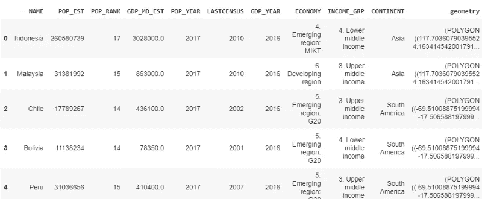
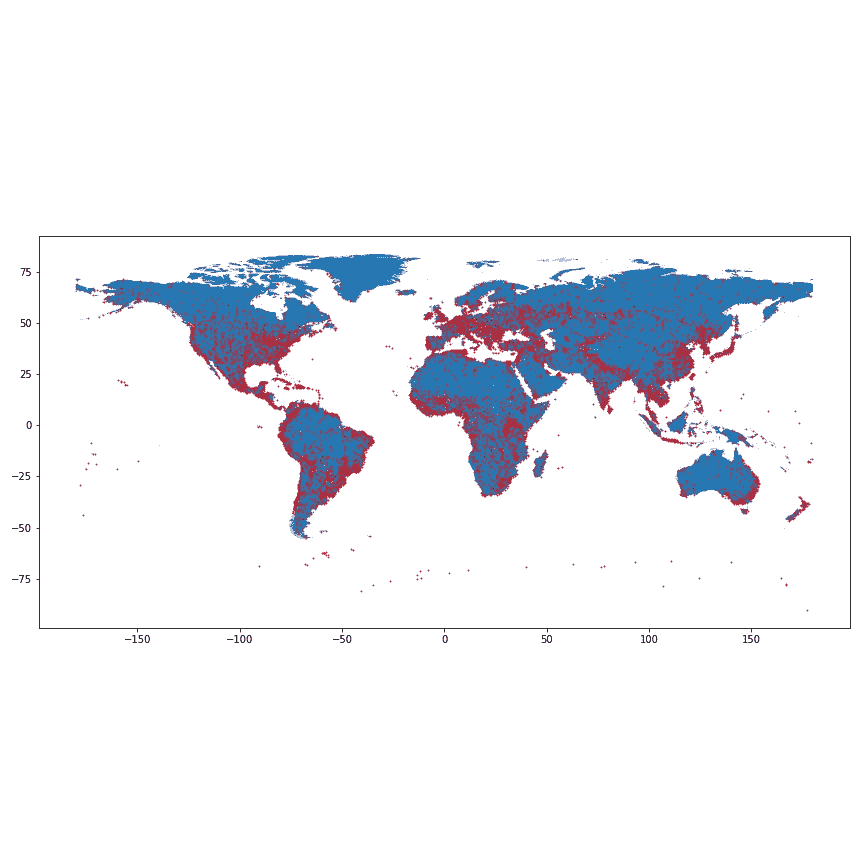
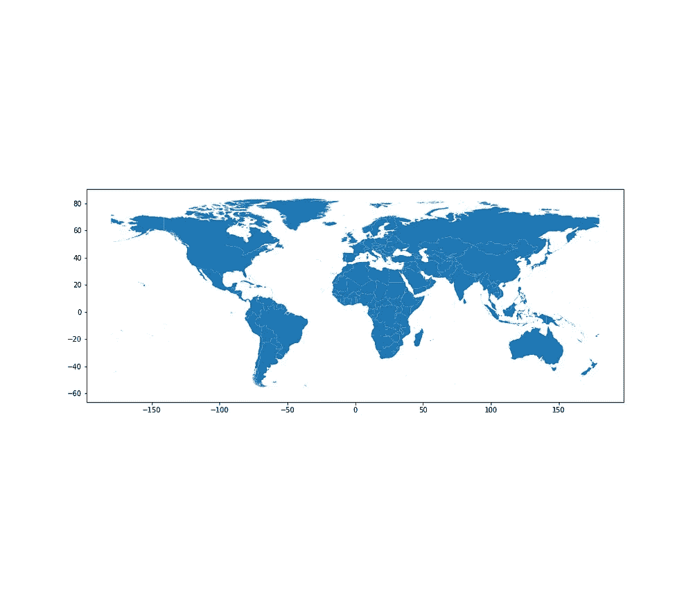
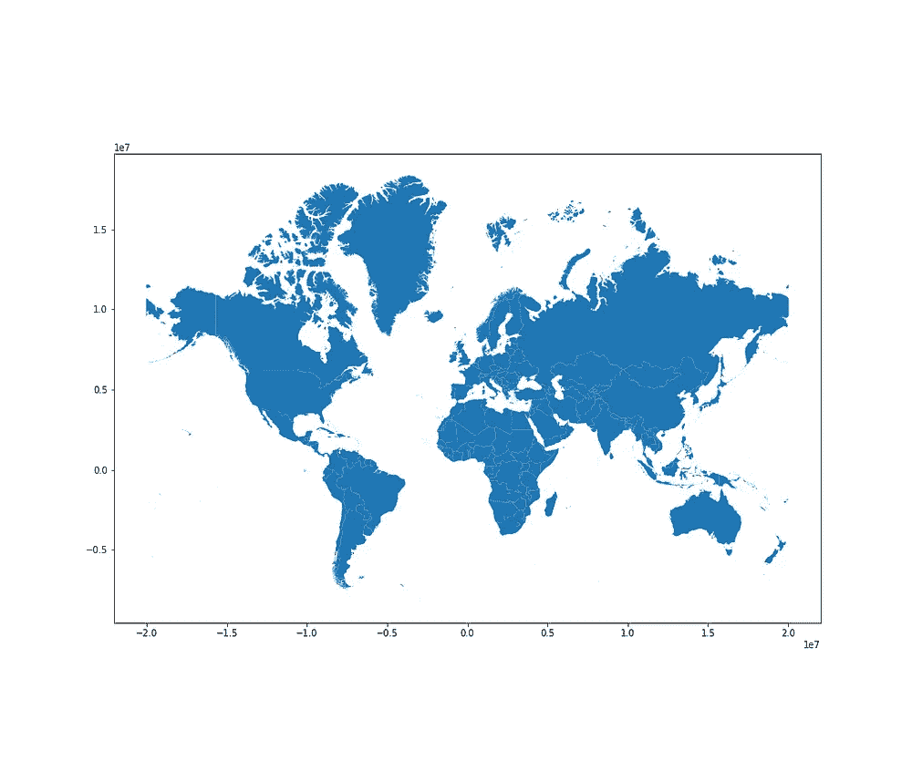
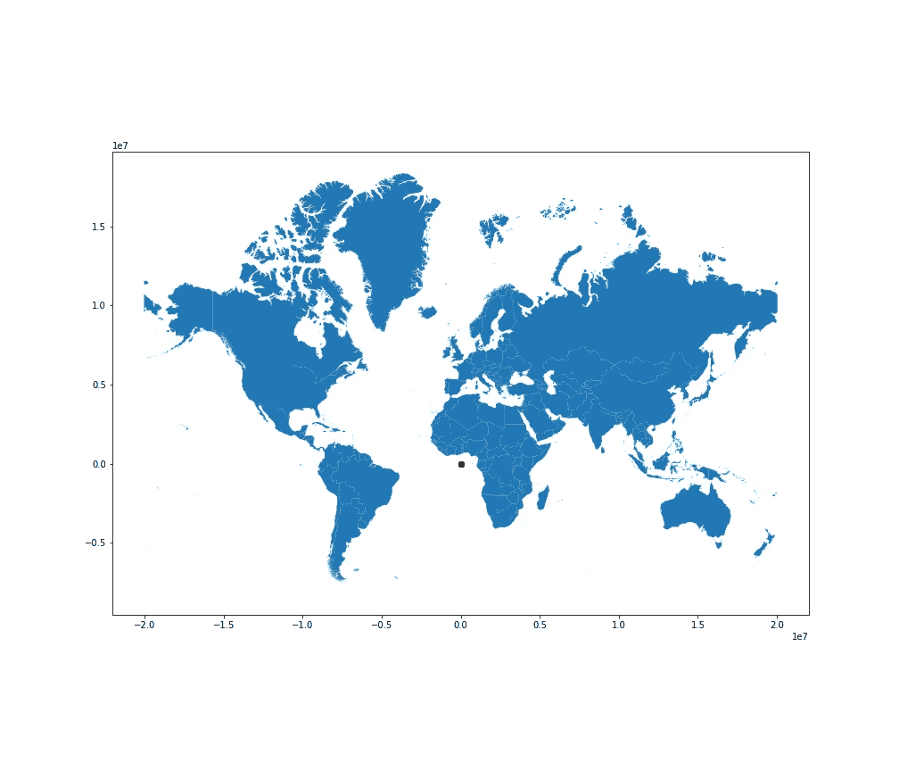

# Python 地理数据科学入门

> 原文：<https://towardsdatascience.com/master-geographic-data-science-with-real-world-projects-exercises-96ac1ad14e63?source=collection_archive---------5----------------------->

## 教程、真实世界项目和练习

World countries GPD 2007 map

这是 Python 地理数据科学入门系列文章的第一篇，该系列文章由三部分组成。您将学习如何用 Python 阅读、操作和分析地理数据。本系列中的文章按顺序排列，第一篇文章奠定基础，第二篇文章介绍中级和高级地理数据科学主题。第三部分涵盖了一个相关的真实世界的项目，总结巩固你的学习。每个教程也有一些简单的练习来帮助你学习和练习。所有代码、数据集和 Google Colab Jupyter 笔记本都可以从本文末尾的链接获得。

在本系列中，我将只关注地理矢量数据。在下一个系列中，我们将学习卫星图像和栅格数据分析。

该系列包含三个部分:

1.  地理数据科学导论
2.  地理数据处理
3.  地理数据科学项目

这是第一部分。在本教程中，我们将学习使用 Geopandas 加载和处理地理数据的基础知识。Geopandas 是 Python 中地理数据科学的主力，它建立在 pandas 和 Numpy 库之上。与 Pandas 数据框架一样，Geopandas 数据结构包含地理数据框架和地理系列。Geopandas 不仅提供了轻松读取和操作地理数据的能力，还可以执行许多基本的地理空间操作，包括其他几何操作、投影和地理分析。您还可以使用 Geopandas 可视化和绘制地图——它为 Matplotlib 库提供了一个高级接口——方法是在 GeodataFrame/GeoSeries 上使用`.plot()`方法。

这些是本部分“地理数据科学简介”的学习目标:

1.  在 Geopandas 中读写地理数据。
2.  投影并设置坐标参考系统(CRS)。
3.  可视化地图

# 1.读取地理数据

在本教程中，我们将主要使用 3 个数据集:

*   国家
*   城市
*   河

地理(矢量)数据有不同的格式(Shapefiles、Geopackage、Geojson 等)。使用 Geopandas 加载大多数地理数据格式非常简单。我们可以使用`.read_file().`

让我们看一个读取数据的例子。在这种情况下，我们将读取国家数据集。

首先，我们创建了一个变量来保存文件路径，然后我们使用 Geopandas，`.read_file()` 方法来读取国家数据集。Geopandas 负责几何列，使我们能够执行地理处理任务，例如绘制地图。

开始数据探索的一个好方法是查看前几行、数据的形状以及数据的一般统计信息。这可以通过以下命令来实现。

*   方法返回前 5 行。如果需要，可以调整要返回的行数，例如，`.head(8)`表示数据集中的前 8 行。
*   `.shape()`返回数据的行数和列数
*   `.describe()`可用于探索一些基本的统计细节，例如，平均值、标准差和百分位数。

这是前 5 行数据的样子。

countries Geodataframe — first 5 rows

另一个在 Geopandas 中读取数据的例子，这次我们将读取城市数据集。它以 Geojson 文件的形式出现，但我们用来读取国家/地区数据集的技术同样适用于此处。

我们也可以使用`.head()`、`.shape()`和`.describe()`进行同样的探索，以了解这个数据集是关于什么的。一旦我们进行了探索，我们就可以开始绘制地图了。

通过`.plot()`功能，在 Geopandas 中绘制地图很容易。由于我们有两个数据集国家和城市数据，我们可以将它们叠加并显示为地图。在这里，我们使用 Matplotlib 设置子情节，并将轴传递给 Geopandas `.plot()`函数。

这是输出图。只需两到三行代码，我们就能生成这张漂亮的地图。

Countries and cities of the world map — Change picture

> 你该做些小运动了。
> 
> 练习 1.1:读取河流数据
> 
> 练习 1.2:阅读河流数据集的前 5 行
> 
> 练习 1.3:可视化河流数据集。

# 2.坐标系和投影

坐标参考系统表示我们的二维(平面)数据如何与地球上的实际位置相关联。它是将属性保持在各自位置的粘合剂。地理数据框架有。crs 属性，它可以给出数据中使用的原始 CRS。这些坐标很容易变换和投影。但是，要执行投影，必须有相同的 CRS，以便执行地理分析并从分析中获得正确的值。国家、城市和河流有相同的 CRS。让我们检查一下各国的客户登记系统。

这是上面代码{'init': 'epsg:4326'}的输出。EPSG 代表欧洲石油测量组织，是维护空间参考系统的权威机构。代码 4326 指示使用的地理坐标系，在本例中为 1984 年世界大地测量系统(WGS84)。

不同的 CRS 有不同的测量值。有些坐标以十进制度定义，有些则以米定义。在地理数据处理中，将数据从一种格式转换为另一种格式是很常见的。该源对于可视化和比较不同的投影非常有用:

 [## 墨卡托 vs .罗宾逊:比较地图投影

### 比较墨卡托和罗宾逊的地图投影

map-projections.net](https://map-projections.net/compare.php?p1=mercator-84&p2=robinson&sps=1) 

我们将把数据投射到墨卡托。当您远离赤道时，墨卡托投影、经纬度四边形会沿 x 轴和 y 轴拉伸。但首先，让我们看看国家数据集的几何列。

这是上面代码的输出。它只是打印出多边形的纬度和经度。这些坐标现在是十进制度。

0(多边形((117.7036079039552 4.163414542001791…
)1(多边形((117.703603607903955 2 4.163414544 420017…
)2(多边形((-69.6964699994-17.5996

让我们投射这些数据，看看变化。在本例中，我们投影到 EPSG:3395，这是广泛使用的墨卡托投影。

现在我们的几何列数据如下所示:

0(多边形((13102705.69639943 460777.6522179524…
)1(多边形((13102705.696399943 460777.6522179 524…
)2(多边形((-7737727-1963777.

由于投影，几何图形不再以十进制样式点测量，而是以米为单位。更容易理解地图的区别。让我们画出原始国家和预计国家。

Left WGS84 World map. Right World Mercator Projection map

请注意两张地图中 x 和 y 的不同比例。随着我们从赤道到两极越走越远，墨卡托投影扭曲了物体的大小。这就是为什么非洲看起来很小，而格陵兰岛看起来比它的面积大得多。

如果您尝试用未投影的数据覆盖投影的数据，那么您的数据将不会正确对齐。让我们看看我们是否能在投影国家的顶部绘制城市。请记住，我们没有规划城市。

Overlay Projected countries and unprojected cities

如您所见，城市在投影国家数据集中没有正确叠加。他们落在非洲附近，那不是他们该去的地方。为了正确地对齐它们，我们还需要对国家数据集进行相同的投影，EPSG:3395，这是一个练习。

> 练习 2.1:将城市数据转换为 EPSG:3395 投影，并在 countries_proj 的顶部绘制城市。

# 3.写入地理数据

我们可以轻松地将任何新创建的数据保存到本地磁盘。当您希望在其他时间访问该文件而不再次执行相同的操作时，这很有帮助。让我们拯救我们预测的国家。记住我们已经计划好了。Geopandas 有`.to_file()`方法。

这将保存您的文件。你可能想下载这个文件，因为我们正在使用 collab，没有用 Google drive 配置它。当您在 Google Colab 中关闭您的会话时，这将被删除。

如果您已经猜到我们还需要保存练习 2.1 中的预测城市，那么您是对的。这是本部分的最后一个练习。

> 练习 3.1:将在练习 2.1 中创建的投影城市文件保存到一个文件中

# 结论

在本教程中，我们已经讲述了加载和写入地理数据以及地理坐标系和投影的基础知识。在下一教程中，我们将学习使用 Geopandas 对地理数据进行地理处理和操作。该代码可从以下 GitHub 存储库中获得:

 [## 沙卡姆/GDS

### 地理数据科学教程系列。在 GitHub 上创建一个帐户，为 shakasom/GDS 的发展做出贡献。

github.com](https://github.com/shakasom/GDS) 

您也可以直接从以下链接运行 Google Collaboraty Jupyter 笔记本:

 [## 谷歌联合实验室

### 编辑描述

colab.research.google.com](https://colab.research.google.com/github/shakasom/GDS/blob/master/Part1%20-%20Introduction.ipynb)