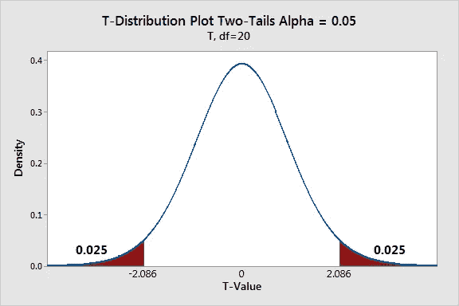
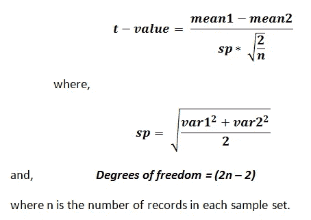

# 掌握你的假设检验

> 原文：<https://towardsdatascience.com/master-your-hypothesis-test-a-tutorial-on-power-bootstrapping-sample-selection-and-outcome-273d6739d3e5?source=collection_archive---------11----------------------->

## 关于电源、自举、样本选择和结果分析的教程。


Photo by Vienna Reyes

在本教程中，我们将浏览一个 [FIFA '19 球员属性数据集](https://www.kaggle.com/karangadiya/fifa19)以回答一个简单的问题:哪个国家出产更好的足球运动员？英格兰或西班牙。

**本教程将涵盖哪些内容:**

1.  清理和设置数据
2.  定义无效假设和替代假设，并确定α
3.  功率和样本大小，以及自举
4.  计算 T 值
5.  计算 P 值
6.  评估测试并得出结论

在我们开始之前，我想包括一个小备忘单，里面有一些与假设检验相关的常用术语和概念。当我阅读那些期望你已经了解你的主题的所有东西的教程时，这总是让我有点恼火…因为如果你知道，你可能就不需要教程了。

# **迷你测试小抄**

# **P 值**:

当研究问题的零假设(H 0)为真时, **P 值**或计算概率是发现观察到的或更极端的结果的概率——“极端”的**定义**取决于假设如何被检验

*   当试图决定是否拒绝你的零假设时，p 值真的很有用。

# **Z 值(Z 分数):**

“从技术上来说，一个 **z** - **分数**是参考人群(一个已知**值**已被记录的人群，就像 CDC 编制的这些关于人的体重的图表)的平均值**的标准偏差数。A **z** - **得分**为 1 比平均值高 1 个标准差。”**

# **T 值:**

**t** - **值**测量相对于样本数据变化的差异大小。

# **类型错误:**

在统计假设检验中，一个**型** I **错误**是拒绝一个真的零假设(也称为“假阳性”发现或结论)，而一个**型 II 错误**是拒绝一个假的零假设的失败(也称为“假阴性”发现或结论)。

# **理论**

这一节希望有助于澄清围绕假设检验的一些困惑。T 检验有两种类型:单尾和双尾。

单尾:

*   单尾检验要求样本之间的差异在特定方向上。例如，如果我们想测试一个新的电子邮件营销策略。如果我们原来的策略有 30%的成功率，我们想看看我们的新策略是否更好，这意味着它的成功率高于 30%，我们将不得不使用单尾测试。

双尾:

*   双尾检验要求样本之间的差异在**任一方向**。
*   当您想要找出两个样本平均值之间是否存在统计差异时使用。这与单尾检验不同，因为我们不关心差异是高还是低。
*   非常适合我们在这个例子中所做的比较。

当执行双尾检验时，有一些事情需要考虑。

1.  有没有两类可以比较？

例如:最初，我想比较重量和速度。但是为了进行假设检验，您需要为这些属性中的每一个属性建立一个类别。体重和速度与类别(即团队或国家)没有任何联系，因此很难对它们进行*统计测试*，而如果你想用这些模型建立*线性回归*将会非常容易。

2.两个数据集必须是独立的

为了收集有意义的数据，这两个数据集必须相互独立，这就是为什么重量和速度不起作用的原因，因为速度与重量成线性关系。

因此，对于这个例子，我们将使用基于两个独立数据集的双尾假设检验，希望找到每个国家生产的球员质量的统计差异。

既然我们已经想好了如何从概念上接近我们的测试，那么是时候实际制作东西了！

# 假设检验的步骤:

1.  **收集数据:**

首要任务是收集有用的数据。对于这个例子，我使用的是来自视频游戏 *FIFA 19 的玩家属性数据。*数据需要被清理和组织，以便您以后在执行假设检验时可以方便地访问它。我使用 python、pandas、Numpy 和 Sci-kit learn 来执行这些测试。为了在 Jupyter 笔记本中使用这些工具，您必须导入它们。

```
import pandas as pd
import numpy as np
import seaborn as sns
import scipy
import matplotlib.pyplot as plt
from scipy import stats
from statsmodels.stats.power import TTestIndPower
```

根据我最初的问题，我知道我需要来自英格兰和西班牙球员的包含总体属性的数据。

注意:选择英格兰和西班牙是因为数据集中有大量来自这两个国家的球员。

```
fifa_df['Nationality'].value_counts().head()England      1662
Germany      1198
Spain        1072
Argentina     937
France        914
```

在下面的代码中，我使用 FIFA 19 数据创建了一个 DataFrame 然后将它们分成 Numpy 数组，我可以用它们来执行我的假设测试。

```
fifa_df = pd.read_csv('data 2.csv')fifa_df = fifa_df.drop(['Photo', 'Flag', 'Club Logo'], axis =1)overall_df= fifa_df[['Overall', 'Nationality']].dropna()finishing_df = fifa_df[['Finishing', 'Nationality']].dropna() #Selects Overall From English Born Players
overall_eng = overall_df[overall_df['Nationality'].str.contains("England")==True]#Selects Overall From Spanish Born Players
overall_spa = overall_df[overall_df['Nationality'].str.contains("Spain")==True]
```

我上面创建的是熊猫系列，包含了所有分别出生在英格兰和西班牙的玩家的核心。为了让我们的生活更轻松，让我们把这些系列变成 Numpy 数组。Numpy 数组非常通用，Numpy 库有大量有用的函数。

```
#Englishenglish_ov_df = overall_eng['Overall']
english_overall = np.array(english_ov_df)
english_overall#Spanishspanish_ov_df = overall_spa['Overall']
spanish_overall = np.array(spanish_ov_df)
spanish_overall
```

完美！因此，现在我们已经将我们的数据浓缩成一些东西，我们可以将它们输入到下面将要创建的函数中

**2。定义无效假设和替代假设。**

创建假设检验时，您需要定义一个空假设和替代假设。我喜欢这么想。

*空:第一个数据集的* ***表示*** *与第二个数据集的* ***表示*** *相比没有任何统计差异。*

*Alt:第一个数据集的* ***表示*** *与第二个数据集的* ***表示*** *相比，确实有统计学差异。*

那么我们应该如何写这个例子呢？

零:在英格兰出生的球员和在西班牙出生的球员在整体技能上没有统计学差异。

Alt:一个出生在英格兰的球员和一个出生在西班牙的球员在整体技能上有统计学上的差异。

**Alpha** :定义为。 *05。*通常，当运行双尾测试时，选择α值 0.05 作为误差的标准度量。如果你看下面的图表，两个尾端是阿尔法值。



Alpha = .05, but since it’s two-tailed- the alpha is split in half

**3。功率、尺寸和自举**

抽样是假设检验的主要部分。抽样背后的哲学很简单；利用真实人口实际上是不可能的(这将花费太多的时间和金钱),因此为了得出结论，我们必须从人口中取样，并得出结论，这些发现代表了整个人口。为了找到本例中的样本大小，我们将找到*效果大小*，我们可以用它来找到我们测试的*功效*。然后，power 将给出我们必须收集的样本的最小值，以满足约束条件。

```
from statsmodels.stats.power import TTestIndPower
```

***科恩的 d*** :在计算幂之前，我们需要求解两个不同国家之间的科恩的 d。科恩的 d 效应大小衡量的是两组球员的 ***表示*** 之间的差异(在这种情况下，英格兰球员的*整体技能*vs 西班牙球员的*整体技能*)。这让我们对两组之间实际发生了多少变化有了一些了解。Cohen's d 效应大小的结果用标准差来衡量。在下面的代码中，您可以看到如何使用 python 函数计算 Cohen 的 d。

```
def calc_cohen_d(group1, group2):
    """Calculate and Define Cohen's d"""# group1: Series or NumPy array
# group2: Series or NumPy array# returns a floating point numberdiff = group1.mean() - group2.mean()n1, n2 = len(group1), len(group2)
    var1 = group1.var()
    var2 = group2.var()# Calculate the pooled threshold as shown earlier
    pooled_var = (n1 * var1 + n2 * var2) / (n1 + n2)

    # Calculate Cohen's d statistic
    d = diff / np.sqrt(pooled_var)

    return d# To use our function, we simply call it using the numpy arrays we created earlier. cohens_d = calc_cohen_d(english_overall, spanish_overall)
abs(cohens_d)0.939861699762249
```

评估测试的效果分为三个部分:

0.0–0.20 =小影响

0.20–0.50 =中等效果

0.50 + =大效果

***科恩的 d 应该总是正的，这也是我们取绝对值的原因***

根据我们的计算，我们的测试应该有很大的影响。下一步是通过确定我们的测试能力来计算我们的最小样本量:这也可以通过几行 python 代码来完成，如下所示:

```
# Define Variables 
effect = cohens_d
alpha = 0.05
power = 1
# sample 2 / sample 1   
ratio = len(spanish_overall) / len(english_overall)# Perform power analysis
analysis = TTestIndPower()
result = analysis.solve_power(effect, power=power, nobs1=None,ratio=ratio, alpha=alpha)print(f"The minimum sample size: {result}")
print(f"Number of players:{len(spanish_overall)}")The minimum sample size: 500.0
Number of players:1072
```

我们的能量测试结果很有希望。由于我们有很高的能级，当我们计算它们时，我们能够自信地得出结论。

关于电源的简短说明:

*   功效用于确定测试出现 II 型错误的可能性。
*   功效越高，测试出现第二类错误的几率越低，反之亦然。
*   功率值介于 0 和 1 之间
*   功率低于 0.80 的测试通常被认为太低。

该函数的输出告诉我们，为了获得 1.0 的功率水平，我们只需要使用 500 个样本。幸运的是，我们有 1072 个，有很多可以玩！

所以我们最终得到了样本量。我们对 ***采样*** 了解多少？

*   它应该是随机的，以确保它能代表总体。
*   我们的数据应该服从正态分布
*   我们的价值观应该相互独立。

但是如果不是或者我们不确定呢？如果我们不确定，有一个非常有用的工具叫做 bootstrapping。自举模拟*新的数据收集*，我的意思是它从**原始样本中随机抽取替换的新样本，**计算平均值并创建现在可以用于运行测试的新数据。

这是因为假设您的**原始样本**已经代表了 ***人口*** 。所以只要你从**原始样本**中取样，它就应该模仿收集新的 ***真实*** 数据的动作，这些数据代表 ***总体*** 。比方说，你有一个完整的 cookie(群体)，然后你掰下那个 cookie 的一半(原始样本)。然后从原始样本中分离出 2 个较小的片段(引导样本)。bootstrapping 背后的想法是(bootstrap samples)只是原始样本的一部分，尝起来就像原始 cookie 被分开之前的味道。下面的代码向您展示了如何做到这一点。

```
sample_means_overall_eng = []
for _ in range(1000):
    sample_mean = np.random.choice(english_overall,size=500).mean()
    sample_means_overall_eng.append(sample_mean)
len(sample_means_overall_eng)sample_means_overall_french = []
for _ in range(1000):
    sample_mean = np.random.choice(english_overall,size=500).mean()
    sample_means_overall_french.append(sample_mean)
len(sample_means_overall_french)
```

基本上，我们使用我们计算的样本大小(500)并根据随机抽样创建了 1000 个新样本。这在概念上就像我们去英格兰和西班牙，从每个国家的另外 1000 名玩家那里收集数据一样。

到了第四步，我们终于开始发现这些工作是否真的重要了！

**4。计算 T 值(长距离):**

这是看起来很吓人的 T-Stat(T 值)公式。



This is ugly…. so we broke it up into formulas!

这太难看了…所以我们把它分解成更小更简单的公式！

```
def calc_variance(sample):
    '''Computes the variance a list of values'''
    sample_mean = np.mean(sample)
    return sum([(i - sample_mean)**2 for i in sample])
```

上面的公式计算 Numpy 数组中的方差。

```
def calc_sample_variance(sample1, sample2):
    '''Computes the pooled variance 2 lists of values, using the calc_variance function'''
    n_1, n_2 = len(sample1), len(sample2)
    var1, var2 = calc_variance(sample1), calc_variance(sample2)
    return (var1 + var2) / ((n_1 + n_2) - 2)
```

此公式计算两个样本平均值的混合方差。

```
def calc_twosample_tstatistic(expr, ctrl):
    '''Computes the 2-sample T-stat of 2 lists of values, using the calc_sample_variance function'''
    expr_mean, ctrl_mean = np.mean(expr), np.mean(ctrl)
    n_e, n_c = len(expr), len(ctrl)
    samp_var = calc_sample_variance(expr,ctrl)
    t = (expr_mean - ctrl_mean) / np.sqrt(samp_var * ((1/n_e)+(1/n_c)))
    return t
```

这是泰姬陵。这个函数使用上面定义的两个函数来计算 T-Stat。

```
t_stat = calc_twosample_tstatistic(sample_means_overall_eng, sample_means_overall_spanish)t_stat-480.6580710651087
```

**5。计算 T-Stat 和 P-Value(最简单的方法):**

为了计算我们的 P 值并再次检查 T-Stat，我们将使用另一个导入的库。这个公式接受我们的两个样本均值，这两个均值与我们使用自举方法创建的数组相同，并输出一个 T 值和一个 P 值。

```
stats.ttest_ind(sample_means_overall_eng,
sample_means_overall_spanish)Ttest_indResult(statistic=-480.6580710651088, pvalue=0.0)
```

如您所见，T-Stat 与我们之前计算的完全相同！这是一个非常好的健全性检查，公式也给了我们一个 P 值。

6。评估我们的 P 值

当我们想要接受或拒绝我们的零假设时，我们想要参考我们的 p 值。在本教程的前面，我们将 alpha 定义为. 05。这意味着我们期望假设我们的零假设是正确的，我们的测试在 95%的情况下是正确的，而另外 5%是不正确的，因为*随机机会*。由于这是一个我们上面定义的 ***双尾检验*** ，我们就把 **alpha** 误差一分为二，放在我们分布的两边。这意味着我们要寻找的 p 值是 0.025，也就是 2.5%。如果我们的 p 值小于或等于我们的预期误差，那么我们将拒绝我们的零假设。

这背后的逻辑有点反直觉。p 值是我们得到超出 95%置信区间的随机结果的可能性。如果 p 值小于我们的 alpha，这意味着超出 95%的结果不太可能是随机的，这意味着它是显著的，不应该作为错误被忽略。然而，如果 p 值高于我们的α值，这意味着在我们的 95%区间之外的结果很可能是随机的，所以我们不应该惊慌失措，也不会拒绝(也就是保持)我们的零假设。

# **结论:**

对于我们的例子，由于我们的 p 值为零，这意味着我们将接受我们的替代假设，并得出结论，英格兰或西班牙球员的整体技能存在差异。

***根据 FIFA 球员 19 数据集显示，西班牙球员明显优于英国球员。所以，如果你想成为一名职业足球运动员，或者你想让你的孩子成为下一个莱昂内尔·梅西，也许西班牙是你应该训练他们的地方。***

# 一些旁注:

效应大小对功效/样本大小:效应大小和功效有负的线性关系。Power 帮助您确定样品的尺寸，以满足其要求。根据您的能力，您需要的样本数量将根据效果大小而变化。例如，如果您有一个大的效果尺寸，那么为了满足您的功率要求所需的样本数将会更少。就像上面的例子一样，如果我取 0.90 的幂而不是 1，那么最小样本量应该是 30 左右。这是因为两个样本平均值的效应大小非常接近于 1。

p 值与效应大小:评估假设检验的结果时，p 值是一个有用的工具。效应大小可以预测 p 值的结果。如果影响大小非常大，就像我们的测试中一样，那么有理由认为两个样本组的平均值之间存在显著的统计学差异。如果存在统计学上的显著差异，那么 p 值将非常接近于零，这意味着您将拒绝零假设。因此，您应该记住，如果您运行一个效应大小在 0.6 到 1.0 之间的测试，并且 p 值高于您的 alpha 值，您可能需要重新检查您的测试并确保没有出现错误。(我知道这一点，因为我在编写本教程时犯了这个错误)

Bootstrapping: Bootstrapping 并不总是必要的，事实上，它是一种被采用的方法，因为计算机几乎可以瞬间创建新数据。如果您有大量正态分布的数据，那么您不必进行引导。Bootstrapping 是一种在数据有限且可能无法完美分布时使用的工具。

我希望这篇教程有所帮助。我介绍了一些不同的策略，这些策略对于假设检验来说并不完全必要，但是我认为介绍更复杂的想法会有所帮助。如果你对代码感到好奇，想看看我的回购，它的链接 [**在这里**](https://github.com/ConnorAnderson29/fifa_player_hypothesis_testing) **！**在 [**LinkedIn**](https://www.linkedin.com/in/connor-anderson29/) 上联系我！

还有，查一个我参与的 [**近期项目**](https://github.com/ConnorAnderson29/hypothesis-testing-european-soccer-data) 。我们用足球数据按联赛得出了主场优势、阵型优化、球队属性的一些结论！

**参考文献**:

p 值定义:[https://www.statsdirect.com/help/basics/p_values.htm](https://www.statsdirect.com/help/basics/p_values.htm)

z 值定义:[https://www . statistics show to . data science central . com/probability-and-statistics/z-score/](https://www.statisticshowto.datasciencecentral.com/probability-and-statistics/z-score/)

实力:[https://www.statisticsteacher.org/2017/09/15/what-is-power/](https://www.statisticsteacher.org/2017/09/15/what-is-power/)

类型错误:[https://en.wikipedia.org/wiki/Type_I_and_type_II_errors](https://en.wikipedia.org/wiki/Type_I_and_type_II_errors)