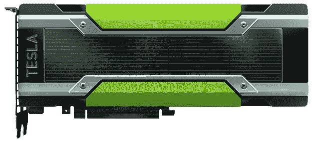
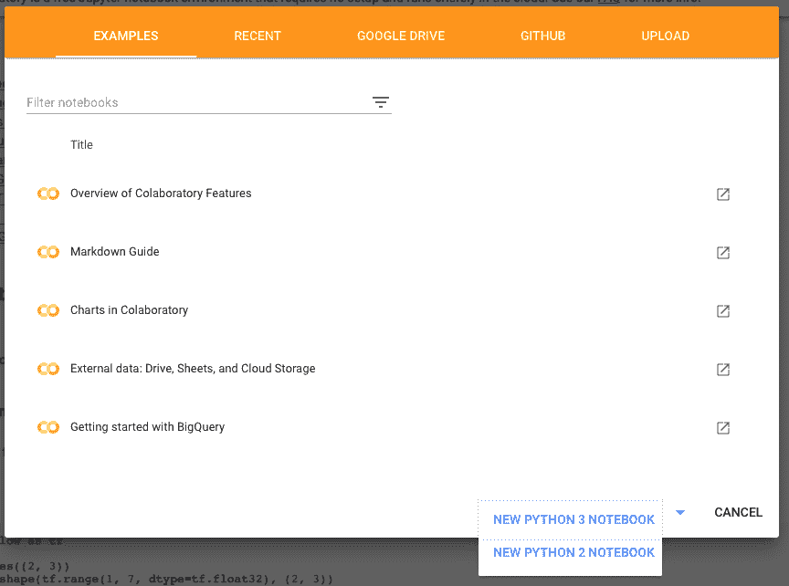
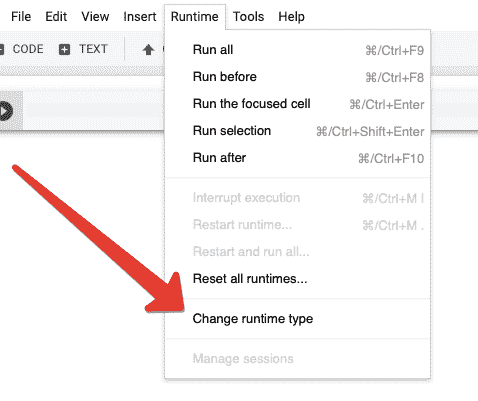
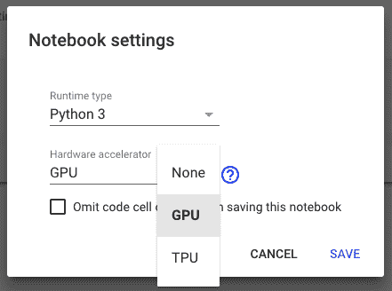
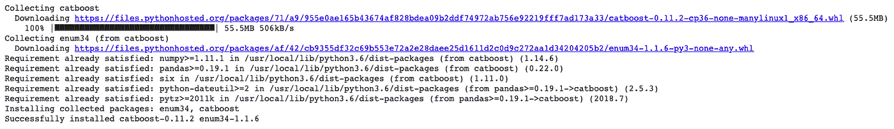
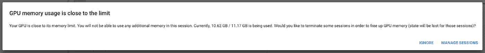

# 使用免费 GPU 在 Google Colaboratory 上掌握快速梯度提升

> 原文：<https://towardsdatascience.com/mastering-fast-gradient-boosting-on-google-colaboratory-with-free-gpu-65c1dd47d1c5?source=collection_archive---------8----------------------->

On the photo NVIDIA K80 GPU, [https://www.nvidia.com/ru-ru/data-center/tesla-k80/](https://www.nvidia.com/ru-ru/data-center/tesla-k80/)

**决策树上的梯度推进** (GBDT)是一个最先进的机器学习工具，用于处理异构或结构化数据。处理数据时，完美算法的选择在很大程度上取决于数据的类型。对于同类数据，如图像、声音或文本，最佳解决方案是神经网络。对于结构化数据，例如信用评分、推荐或任何其他表格数据，最佳解决方案是 GBDT。

正因如此， [Kaggle](https://www.kaggle.com/) 比赛的大量获奖方案都是基于 GBDT。GBDT 也大量用于不同的推荐系统、搜索引擎和许多金融机构。

许多人认为 GBDT 无法通过 GPU 有效加速，但事实并非如此。在这篇文章中，我解释了如何使用 GPU 加速 GBDT。

对于 GBDT 实现，我将使用 [**CatBoost**](http://catboost.ai) 。CatBoost 以其分类特性支持和高效的 GPU 实现而闻名。它不仅适用于分类数据，而且适用于任何数据，在许多情况下，它的性能优于其他 GBDT 图书馆。

该库是为领先的俄罗斯科技公司 [Yandex](https://yandex.com) 的生产需求开发的，后来大约一年半前在 [Apache 2 许可](https://en.wikipedia.org/wiki/Apache_License)下开源。

C[atBoost](http://catboost.ai)

我的演示的测试环境将是 [**Google 联合实验室**](https://colab.research.google.com/) 。这是一个免费访问 GPU 运行时的机器学习研究工具。这是一个 Jupyter 笔记本电脑环境，不需要设置即可使用。

谷歌合作实验室免费提供相当老的 GPU——一个大约 11GB 内存的特斯拉 K80 GPU。随着新的 GPU，速度的提高将更加显著。但即使使用这种旧的 GPU，你也会看到令人印象深刻的速度差异。

下面你会发现在 Colab 中设置 CatBoost 的几个简单步骤，下载数据集，在 CPU 和 GPU 上训练模型，以及比较执行时间。

# 创建笔记本

导航到[协同实验室](https://colab.research.google.com)并创建一个新的 Python 3 笔记本。

# 将 GPU 设置为硬件加速器

选择 GPU 作为硬件加速器有两个简单的步骤:

第一步。导航到“运行时”菜单并选择“更改运行时类型”

第二步。选择“GPU”作为硬件加速器。

# 导入 CatBoost

下一步是在环境中导入 CatBoost。大多数库都可以通过简单的*快速安装在 Colaboratyro 中！pip 安装*命令。

请注意，每次启动新的 Colab 会话时，都需要重新导入库。

> *！pip 安装 catboost*

从 pypi 安装的 CatBoost 库支持 GPU，因此您可以直接使用它。要让它在你的机器上工作，你只需要安装一个 NVIDIA 驱动程序，其他一切都可以开箱即用。对于 Windows 来说也是如此，这使得想要在 GPU 上训练模型的 Windows 用户更加容易。

# 下载并准备数据集

是时候编码了！配置好环境后，下一步是下载和准备数据集。对于 GPU 训练来说，数据集越大，加速就越大。对一千个样本或更少的数据集使用 GPU 训练没有太大意义，但从大约 10，000 个样本开始，你将获得很好的加速。

我们需要一个大型数据集来展示 GPU 在 GBDT 任务中的能力。我们将使用 [Epsilon](https://www.csie.ntu.edu.tw/~cjlin/libsvmtools/datasets/binary.html) ，它有 50 万个样本和 2000 个特征，包含在 catboost.datasets 中

下面的代码下载数据集大约需要 10-15 分钟。请耐心等待。

# CPU 培训

为了消除关于 GBDT 在 GPU 上没有表现出大的速度增益的神话，我想比较一下 GBDT 在 CPU 和 GPU 上的训练时间。先说 CPU。下面的代码创建一个模型，对其进行训练，并测量训练的执行时间。它使用默认参数，因为它们在许多情况下提供了相当好的基线。

我们将首先训练我们所有的模型 100 次迭代(因为在 CPU 上训练它需要很长时间)。

运行此代码后，您可以将其更改为默认值 1000 或更多次迭代，以获得更好的质量结果。

CatBoost 将需要大约 15 分钟在 CPU 上训练 100 次迭代。

> *在 CPU 上拟合模型的时间:877 秒*

# 关于 GPU 的培训

所有以前的代码执行都是在 CPU 上完成的。现在该用 GPU 了！

要启用 GPU 训练，您需要使用 *task_type='GPU'* 参数。

让我们在 GPU 上重新运行实验，看看结果会是什么时间。

如果 Colab 会给你显示“GPU 内存使用接近极限”的警告，按“忽略”即可。

> *在 GPU 上适应模型的时间:199 秒
> GPU 比 CPU 加速:4.41 倍*

如你所见，GPU 比 CPU 快 4 倍。它只需要 3-4 分钟，而 CPU 需要 14-15 分钟来适应模型。此外，学习过程仅需 30 秒，而不是 12 分钟。

当我们训练 100 次迭代时，瓶颈是预处理而不是训练本身。但是对于在大型数据集上获得最佳质量所必需的数千次迭代来说，这个瓶颈将是不可见的。你可以尝试在 CPU 和 GPU 上训练 5000 次迭代，再比较一次。

# 密码

上面所有的代码你都可以在 CatBoost 仓库找到，作为谷歌合作实验室的 [**教程**](https://colab.research.google.com/github/catboost/tutorials/blob/master/tools/google_colaboratory_cpu_vs_gpu_tutorial.ipynb) 。

# 摘要

*   GBDT 训练在 GPU 上完美运行。
*   CatBoost 是一个超快速的 GBDT 实现，具有 GPU 开箱即用的支持。
*   Google Colaboratory 是一个有免费 GPU 支持的有用工具。

# 进一步阅读

[1] V .埃尔绍夫， [CatBoost 使用 GPU 在决策树上实现快速梯度提升](https://devblogs.nvidia.com/catboost-fast-gradient-boosting-decision-trees/)，NVIDIA 博客文章

[2] [CatBoost GitHub](https://github.com/catboost)

[3] R. Mitchell，[梯度增强，决策树和 XGBoost 与 CUDA](https://devblogs.nvidia.com/gradient-boosting-decision-trees-xgboost-cuda/) ，NVIDIA 博客文章

[4] [LightGBM GPU 教程](https://lightgbm.readthedocs.io/en/latest/GPU-Tutorial.html)