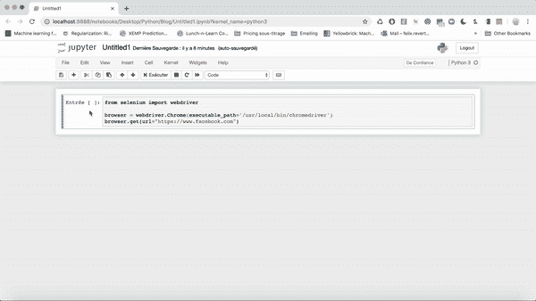
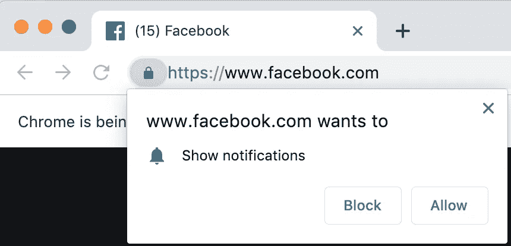
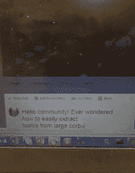
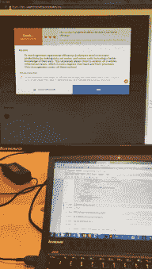

# 使用 Selenium 和 Python 掌握 web 抓取艺术(第 1/2 部分)

> 原文：<https://towardsdatascience.com/mastering-the-art-of-web-scraping-with-selenium-and-python-part-1-2-90a216199873?source=collection_archive---------24----------------------->

## Selenium 是与网站进行高级交互的强大工具:登录、点击…让我们用它来抓取网页

Using Selenium to do web scraping requires a specific strategy to access the data you seek

或者 90%的网站，你不需要硒。事实上，简单的**请求**和**美丽组合**组合就能完成任务。我写了一篇关于如何做到这一点的文章。

但是如果网站要求你在访问它的内容之前登录呢？如果您想要抓取的页面没有特定的 url，而您需要点击按钮并触发 javascript 操作才能到达正确的页面，该怎么办？

这就是本文的目标:在不简单抓取的网站上实现网页抓取。

# 安装 Selenium

Selenium 模拟 web 浏览器。实际上，你不仅可以模仿 Chrome，还可以模仿 Firefox、Safari 和 Edge。你需要在这里安装需要的组件。在本文的其余部分，我将使用 Chrome 模拟器。

使用以下内容安装 Python 包:

> **pip**安装硒

# 用 Python 运行 Selenium

好了，现在让我们打开一个 Jupyter 笔记本，尝试运行以下代码:

> **从**硒**导入** webdriver
> 
> 浏览器= webdriver。chrome(executable _ path = '/usr/local/bin/chrome driver ')
> browser . get(URL = " https://www . Facebook . com ")

Selenium opens a new Chrome window and goes to facebook.com

请注意，*'/usr/local/bin/chrome driver '*可能会为您而改变，无论您是在 Mac、PC 等设备上。

让我们登录:

> browser . find _ element _ by _ XPath("//input[@ type = ' email ']")。send _ keys('**your _ email _ address _ here**')
> browser . find _ element _ by _ XPath("//input[@ type = ' password ']")。send _ keys('**your _ password _ here**')
> browser . find _ element _ by _ id(" log in button ")。单击()

这应该很好！如果弹出窗口出现，您可以在以后使用以下命令禁用它。

替换

> 浏览器= webdriver。chrome(executable _ path = '/usr/local/bin/chrome driver ')

与以下内容

> 选项=网络驱动程序。chrome options()
> option . add _ experimental _ option(" prefs "，{ " profile . default _ content _ setting _ values . notifications ":2 })
> browser = web driver。chrome(executable _ path = '/usr/local/bin/chrome driver '**，chrome_options=option** )

There can be a notification just after you logged in. You can automatically disable pop-ups with Selenium.

# 结论

硒入门没那么难。棘手的是提前准备好网页抓取方案。在下一篇文章中，我们将关注一个真实的 web 抓取用例，并设计一个具体的方案来实现它。

# 奖金

## 几个关于我如何使用 Selenium + Python 的例子

Selenium posting on Facebook

= >我自动在 70 多个脸书小组上发表了关于机器学习的文章。不幸的是，我最近重新运行了代码，发现脸书更新了网站以避免这种行为:/

Selenium filling an online quiz

= >我完成了之前公司的在线培训(约 40 次培训，每次约 120 个不同的问题)，并在排行榜上获得第一名

= >我收集了多个网站的在线电影评论(千兆字节的文本数据，真的很酷，可以训练 ML 模型！)

而这只是冰山一角。你还可以做很多其他很酷的事情。