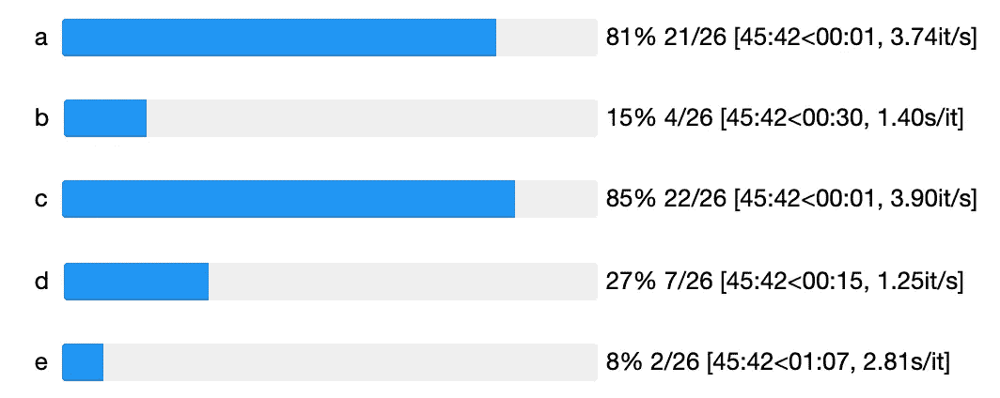

# 使用 Selenium 和 Python 掌握 web 抓取的艺术[第 2/2 部分]

> 原文：<https://towardsdatascience.com/mastering-the-art-of-web-scraping-with-selenium-and-python-part-2-2-66ee4f3b5f44?source=collection_archive---------19----------------------->

## Selenium 是与网站进行高级交互的强大工具:登录、点击…让我们用它来抓取网页

好吧，让我们做一些简单的事情:**收集 Spotify 上所有可用的艺术家**。

That’s a robot scrolling through Spotify’s catalog of artists

⚠️Obviously，我需要在这里放一个免责声明⚠️
*不要用这种方法倒卖你收集的数据，这些都是公司私有的。特别是，不要转售 Spotify 数据或对其做任何非法的事情。*

第二点备注:既然 Spotify 有一个 [API](https://developer.spotify.com/documentation/web-api/) ，那么从网站获取数据就有点蠢了。然而，这是一个很好的练习*和*你通常可以从网络抓取中获得比使用受限 API 更多(但更慢)的东西(虽然不确定 Spotify 是否如此)。

如果您错过了关于 Selenium 和 Python 的第一篇文章，请点击这里:

 [## 使用 Selenium 和 Python 掌握 web 抓取艺术(第 1/2 部分)

### Selenium 是与网站进行高级交互的强大工具:登录、点击…让我们用它来抓取网页

towardsdatascience.com](/mastering-the-art-of-web-scraping-with-selenium-and-python-part-1-2-90a216199873) 

# 首先，了解网站是如何运作的

Spotify’s page when “a” was typed in the search bar

1.  您需要登录才能看到艺术家
2.  搜索时不会显示所有艺术家——否则你的浏览器会因加载的大量数据而崩溃……所以你需要发挥创造力，在避免浏览器溢出的同时获得比显示更多的内容
3.  你需要以某种方式召集所有的艺术家。同样，这里需要一些创造力

## 研究 html

打开 Chrome 开发者工具，深入研究 html。艺术家的名字和相关联的 url 位于一个“div”标记中，该标记具有一个等于“Search__content”的类

现在您需要向下滚动，因为只显示了 50 位艺术家。我花了相当多的时间在这里，因为滚动不是在整个窗口，而是在艺术家标签。想法是:取最后一个加载的艺术家并滚动到它。

## 最后，回顾任务

如前一篇文章所见，登录部分很简单。

**正常**

搜索部分应该不是最难的:只需在搜索栏中写些东西，然后按回车键。有一个关于搜索完成后向下滚动的问题，以及你需要向下滚动多少次。
**~还好好歹**

彻底搜索似乎是最棘手的部分。我们不知道我们是否会得到 Spotify 上艺术家的完整列表，没有什么会告诉我们我们已经达到了 Spotify 上艺术家的最大数量。从[这个](https://www.quora.com/What-are-the-total-number-of-artists-on-Spotify)，看起来有 100 万到 100 万 2M 艺术家。
**~好吧总之**

让我们言归正传。

# 然后设计你的网页抓取方案

## Bot 指南

我们将为我们的网页抓取机器人设定两条准则:

1.  它将滚动 4̶0̶ 100 次[ *更新:尝试了 40 次，但得到了太多的重复，搜索后改为 100 次*
2.  它将在目录中搜索两个字母的所有可能组合

我们可以估计大约 26x26 个搜索，大约 50 个结果/滚动导致
26 x 26 x 50 x 100 = 3 380 000 最大独特艺术家。注意，我们可能会有很多副本。

## 并行运行

您想要做的另一件事是将流程设置为并行执行。您不希望等待一个 python 脚本来完成所有工作，而是希望有多个 python 脚本来完成这项工作。

在这种情况下，我们可以设置 *2̵6̵* 4bots [ *更新:试过 26 我的电脑死机了，还注意到打开 5 个以上窗口后页面停止刷新；我把它改成了 4 个机器人*，每个机器人从一个不同的字母开始，第二个字母尝试 26 个字母。例:*机器人 1 会尝试‘aa’，‘ab’，‘AC’，…，‘az’。*注意，26 个[ *4* ] Chrome 会话将运行我的 Mac(我可怜的 Mac…)。不确定 Spotify 是否会自动检测同一个用户的多个活动会话并断开我的连接[ *更新:它不关心多个会话* ]。生活是有风险的，有时候你只能盲目去相信。

## 实时监控

在创建和运行脚本之前，您还需要实时监控流程的进展情况。我不知道如何做到这一点，但我可以想到看到所有机器人的进度条，他们完成的预期剩余时间，当前收集的艺术家数量…因此，多一个 Python 脚本将进行实时监控。

The Jupyter Notebook is monitoring in real-time the 5 web scraping bots. Note they have really different speed.

The number of artists found gets updated in real-time as well as the number of duplicates

还要估计一下需要的时间。滚动 1 次后，您将等待 1 秒钟加载结果。所以~2 分钟/搜。26 次搜索 x 2 分钟 x 6 次运行(4 个机器人同时运行)，因此我可以在最乐观的情况下预计整个网页抓取方案将在 3 小时内完成。

# 让表演开始吧

[1 Python script to search some artists, scroll down and save the list in a txt file](https://gist.github.com/FelixChop/952d5988ba70102db9e3e140b3893d39)

[Launcher of multiple bots](https://gist.github.com/FelixChop/fffaffeff37153a6858e5ba7920ac973)

[Jupyter Notebook to monitor everything](https://gist.github.com/FelixChop/b3993a33d99634d2a3880c2b97e66356)

我不得不承认我没有完成练习。我的电脑声音比机场还大，我知道我有足够的时间完成它，但无论如何，你得到的想法。

在 2 个小时内，我得到了 38174 个独特的艺术家，其中有 AC/DC，克里斯蒂娜·阿奎莱拉，暴力反抗机器，但没有蕾哈娜或阿姆。