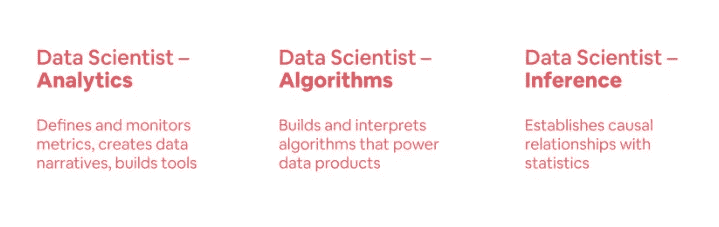
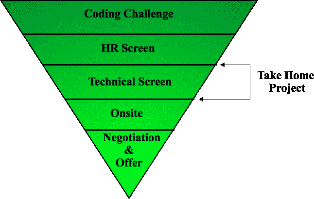

# 掌握数据科学面试循环

> 原文：<https://towardsdatascience.com/mastering-the-data-science-interview-15f9c0a558a7?source=collection_archive---------1----------------------->

2012 年，《哈佛商业评论》宣布[数据科学将是 21 世纪最性感的工作](https://hbr.org/2012/10/data-scientist-the-sexiest-job-of-the-21st-century)。从那以后，围绕数据科学的炒作只增不减。最近的报告显示[对数据科学家的需求远远超过供给](https://insidebigdata.com/2018/08/19/infographic-data-scientist-shortage/)。

然而，现实是这些工作大部分是为那些已经有经验的人准备的。另一方面，由于供求关系的变化，入门级的数据科学工作竞争非常激烈。数据科学家来自各种背景，从社会科学到传统的计算机科学背景。许多人还将数据科学视为重塑自我的机会，这将导致大量人员涌入，寻求获得他们的第一个角色。

让事情变得更复杂的是，与拥有更标准化面试流程的软件开发职位不同，数据科学面试可能会有巨大的变化。这部分是因为作为一个行业，仍然没有对数据科学家达成一致的定义。Airbnb 认识到了这一点，并决定将他们的[数据科学家分成三路](https://www.linkedin.com/pulse/one-data-science-job-doesnt-fit-all-elena-grewal/):算法、推理和分析。

[https://www.linkedin.com/pulse/one-data-science-job-doesnt-fit-all-elena-grewal/](https://www.linkedin.com/pulse/one-data-science-job-doesnt-fit-all-elena-grewal/)

因此，在开始寻找角色之前，确定什么样的数据科学吸引你是很重要的。基于你对此的回答，你所学的内容和你将被问到的问题会有所不同。尽管类型不同，但一般来说，他们会遵循类似的面试循环，尽管问的特定问题可能会有所不同。在这篇文章中，我们将探讨在面试过程的每一步会遇到什么，以及一些技巧和准备方法。如果你在寻找一份可能在面试中出现的数据科学问题清单，你应该考虑阅读[这个](/data-science-interview-guide-4ee9f5dc778)和[这个](https://www.analyticsvidhya.com/blog/2018/06/comprehensive-data-science-machine-learning-interview-guide/)。

# **编码挑战**

编码挑战可以从简单的 Fizzbuzz 问题到更复杂的问题，例如使用杂乱的数据建立时间序列预测模型。这些挑战将根据问题的复杂程度进行计时(从 30 分钟到一周不等)。挑战可以在诸如 [HackerRank](https://www.hackerrank.com/) 、 [CoderByte](https://coderbyte.com/) 等网站上进行，甚至可以在公司内部解决方案上进行。

通常情况下，你会得到书面的测试案例，告诉你是否通过了一个问题。这通常会考虑正确性和复杂性(例如，运行代码需要多长时间)。如果没有提供测试，编写自己的测试是个好主意。面对数据科学编码挑战，你甚至可能会遇到统计方面的选择题，所以一定要问招聘人员你到底要考什么。

当你面临编码挑战时，记住公司并不总是在寻找“正确”的解决方案是很重要的。他们可能还在寻找代码可读性、良好的设计，甚至是特定的最佳解决方案。所以，即使通过了所有的测试案例，你也没有进入面试过程的下一个阶段，不要太在意。

*准备:*

1.  [Leetcode](https://leetcode.com/) 上的练习题，既有 SQL 也有传统的数据结构/算法题
2.  复习[数学和统计题的精彩](https://brilliant.org/)。
3.  [SQL Zoo](https://sqlzoo.net/) 和 [Mode Analytics](https://mode.com/sql-tutorial/introduction-to-sql/) 都提供了各种可以在浏览器中解决的 SQL 练习。

*温馨提示:*

1.  开始编码之前，通读所有问题。这让你的潜意识开始在后台处理问题。
2.  先从最难的问题开始，当你遇到困难时，先处理简单的问题，然后再处理较难的问题。
3.  首先关注通过所有的测试用例，然后再考虑提高复杂性和可读性。
4.  如果你做完了，还剩下几分钟，去喝一杯，试着清醒一下头脑。最后一次通读你的答案，然后提交。
5.  没有完成编码挑战也没关系。有时，公司会在一周的时间限制内创造出不合理的乏味的编码挑战，需要 5-10 个小时才能完成。除非你绝望了，否则你可以走开，花时间准备下一次面试。

# **人力资源屏幕**

人力资源筛选将包括行为问题，要求你解释简历的某些部分，你为什么想申请这家公司，以及你可能不得不在工作场所处理特定情况的例子。偶尔你可能会被问到一些简单的技术问题，也许是一个 SQL 或者一个基本的计算机科学理论问题。之后，你们将有几分钟时间提出自己的问题。

请记住，与你交谈的人不太可能是技术人员，所以他们可能对组织的角色或技术方面没有深刻的理解。记住这一点，试着把你的问题集中在公司，这个人在那里的经历，以及逻辑问题上，比如面试循环通常是如何进行的。如果你有他们无法回答的具体问题，你可以随时要求招聘人员将你的问题转给能够回答这些问题的人。

记住，面试是双向的，所以在投入更多时间去面试这家公司之前，找出任何危险信号对你最有利。

*准备:*

1.  阅读角色和公司描述。
2.  查找谁将是你的面试对象，并试图找到融洽的领域。也许你们都在某个特定的城市工作，或者在类似的非营利组织做志愿者。
3.  在打电话之前仔细阅读你的简历。

*温馨提示:*

1.  带着问题准备好。
2.  让你的简历清晰可见。
3.  找一个安静的地方接受采访。如果不可能，重新安排面试。
4.  在通话的前几分钟，专注于建立融洽的关系。如果招聘人员想花几分钟谈论昨晚的篮球比赛，让他们去吧。
5.  不要说你现在或过去公司的坏话。即使你工作的地方很糟糕，它也不会让你受益。

# **技术呼叫**

在面试过程的这一阶段，你将有机会接受团队技术成员的面试。诸如此类的调用通常使用诸如 [Coderpad](https://coderpad.io/) 之类的平台进行，它包括一个代码编辑器以及一种运行代码的方式。偶尔你可能会被要求在谷歌文档中写代码。因此，您应该能够轻松地进行编码，而不需要任何语法突出显示或代码补全。就语言而言，Python 和 SQL 通常是您需要编写的两种语言，但是，这可能会因角色和公司而异。

这个阶段的问题复杂程度不一，从用 windows 函数解决的简单 SQL 问题到涉及动态编程的问题。不管有多难，你都应该在开始编码之前问清楚问题。一旦你对问题和期望有了很好的理解，就从一个强力的解决方案开始，这样你至少有东西可以用了。然而，一定要告诉你的面试官，在考虑优化之前，你首先是在用一种非最优的方式解决这个问题。在你做了一些工作之后，开始优化你的解决方案，让你的代码更具可读性。在整个过程中，用语言描述你的方法是有帮助的，因为面试官可能偶尔会帮你指引正确的方向。

如果你在面试结束时有几分钟时间，利用你正在和团队中的一名技术人员交谈这一事实。询问他们编码标准和过程，团队如何处理工作，以及他们的日常工作是什么样子。

*准备:*

1.  如果你面试的数据科学职位是工程组织的一部分，确保阅读[破解编码面试](https://www.amazon.com/Cracking-Coding-Interview-Programming-Questions/dp/0984782850)和[编程面试要素](https://www.amazon.com/Elements-Programming-Interviews-Insiders-Guide/dp/1479274836)，因为你可能有一个软件工程师进行技术筛选。
2.  抽认卡通常是复习在这个阶段可能出现的机器学习理论的最佳方式。你可以自己制作，也可以花 12 美元购买[这套。](https://machinelearningflashcards.com/)[机器学习备忘单](https://ml-cheatsheet.readthedocs.io/en/latest/)也是很好的复习资源。
3.  查看 Glassdoor，了解可能出现的问题类型。
4.  研究谁将面试你。拥有博士学位的机器学习工程师对你的面试会和数据分析师不一样。

*温馨提示:*

1.  如果你被困住了，寻求帮助是没问题的。
2.  和朋友一起练习模拟技术电话，或者使用像[interview . io](http://www.interviewing.io)这样的平台。
3.  在开始解决问题之前，不要害怕要求一两分钟来思考问题。一旦你开始了，向面试官介绍你的方法是很重要的。

# **带回家的项目**

“带回家”在数据科学面试环节中越来越受欢迎，因为它们往往与你开始工作后将要做的事情联系得更紧密。它们可以出现在技术筛选之前的第一次人力资源筛选之后，也可以作为现场交付内容。公司可能会测试你处理模糊问题的能力(例如，这里有一个数据集，找到一些见解并向业务利益相关者推销)，或者专注于更具体的交付成果(例如，这里有一些数据，建立一个分类器)。

如果可能的话，试着问一些澄清性的问题，以确保你知道他们在测试你什么，你的听众是谁。如果你带回家的观众是商业利益相关者，用技术术语填充你的幻灯片不是一个好主意。相反，把重点放在可行的见解和建议上，把技术术语留给附录。

虽然所有带回家的目标可能不同，但共同点是你将从公司接收数据。所以不管他们让你做什么，第一步总是探索性的数据分析。幸运的是有一些自动化的 EDA 解决方案，比如 [SpeedML](https://speedml.com/automate-exploratory-data-analysis/) 。这里你主要想做的是调查数据中的异常。通常情况下，公司会综合生成数据，留下特定的复活节彩蛋供您寻找(例如，客户收入的幂律分布)。

一旦你完成了你的任务，试着从朋友或导师那里得到一些反馈。通常，如果你在一个带回家的项目上工作了足够长的时间，你可能会开始只见树木不见森林，所以从一个不了解你的背景的人那里得到反馈总是好的。

*准备:*

1.  练习带回家的挑战，你可以从 [datamasked](https://datamasked.com/) 购买，或者通过查看这个 [Github repo](https://github.com/JifuZhao/DS-Take-Home) 上没有问题的答案。
2.  复习可能对你的工作有帮助的库和工具。例如用于快速数据可视化的 SpeedML 或 Tableau。

*温馨提示:*

1.  一些公司故意提供一个带回家的东西，要求你发邮件给他们以获得额外的信息，所以不要害怕联系！
2.  一个好的带回家通常可以抵消现场的任何不良表现。理由是，尽管你不知道如何解决特定的面试问题，但你已经展示了解决他们日常可能遇到的问题的能力。因此，如果在做更多的 Leetcode 问题和润色你的现场演示之间做出选择，关注后者是值得的。
3.  确保保存您所做的每个现场挑战。您永远不知道在未来的挑战中什么时候可能需要重用一个组件。
4.  只要你陈述出来，就可以做出假设。在这种情况下，信息不对称是必然的，做一个假设比不断地用问题轰炸你的招聘人员要好。

# **现场**

现场面试将由一整天的一系列面试组成，包括午餐面试，这通常是评估你的“文化契合度”。

重要的是要记住，任何让你走到这一步的公司都希望看到你成功。他们已经花了大量的金钱和时间面试候选人，将范围缩小到现场候选人，所以对你的能力要有信心！

确保向招聘人员要一份将要面试你的人的名单，这样你就有机会提前做一些调查。如果你面试的是一位主管，你应该集中精力准备更高层次的问题，比如公司战略和文化。另一方面，如果你面试的是一名软件工程师，他们很可能会让你在白板上写下一个编程问题。如前所述，这个人的背景会影响他们会问的问题类型。

*准备:*

1.  尽可能多地阅读关于这家公司的资料。公司网站、[、CrunchBase](https://www.crunchbase.com/) 、维基百科、最近的新闻文章、[盲人](https://www.teamblind.com/articles/Topics)、[玻璃门](https://www.glassdoor.com/)，都是收集信息的绝佳资源。
2.  和一个朋友进行一些模拟面试，这个朋友可以对你可能表现出的任何言语上的抽搐或回答中的漏洞给予反馈。如果你要在现场做一个带回家的演示，这尤其有用。
3.  为常见的行为面试问题准备好故事，比如“说说你自己吧”、“为什么选择这家公司？”“告诉我一次你不得不与一个难相处的同事打交道的经历”。
4.  如果你有软件工程师在现场，你很有可能需要温习一下你的数据结构和算法。

*温馨提示:*

1.  不要太认真。这些面试官中的大多数宁愿回到他们的办公桌前做他们被分配的项目。所以，尽你所能让你的面试官有一次愉快的经历。
2.  确保修整该部分。如果你去东海岸的一家财富 500 强公司面试，你可能需要比去西海岸的一家初创公司面试时穿得保守得多。
3.  利用浴室和休息时间来调整自己。
4.  问一些你真正感兴趣的问题。你在面试这家公司，就像他们在面试你一样。
5.  现场结束后，给你的招聘人员和招聘经理发一封简短的感谢信。

# **要约和谈判**

对于许多人来说，谈判可能看起来不舒服，尤其是对于那些没有行业经验的人。然而，现实是谈判几乎没有坏处(只要你礼貌对待)，还有很多好处。

通常情况下，公司会通过电话通知你他们打算给你一份工作。在这一点上，当场承诺并接受提议可能很有诱惑力。相反，你应该表达你对这份工作的兴奋，并要求他们给你一些时间与你的另一半或朋友讨论。你也可以提前告诉他们你还在面试其他几家公司，你会很快回复他们。有时这些提议有截止日期，然而，这些通常是相当随意的，可以由你的一个简单请求来推动。

你的谈判能力最终取决于多种因素，但最大的因素是选择性。如果你手上有两个很好的报价，谈判会容易得多，因为你可以选择离开。当你在谈判时，有各种各样的杠杆可以利用。三个主要的是你的基本工资、股票期权和签约/搬迁奖金。每个公司都有不同的政策，这意味着一些杠杆可能比其他杠杆更容易拉动。一般来说，签约/调动是最容易谈成的，其次是股票期权，然后是底薪。因此，如果你处于弱势，要求更高的签约/搬迁奖金。然而，如果你处于强势地位，增加基本工资可能对你最有利。原因是，它不仅会在你加薪时起到更高的乘数作用，还会对公司福利产生影响，如 401k 匹配和员工股票购买计划。也就是说，每种情况都是不同的，所以一定要根据需要重新安排谈判的优先顺序。

*准备:*

1.  关于谈判的最佳资源之一是 Haseeb Qureshi 写的一篇文章，详细描述了他如何从新兵训练营毕业生到收到来自谷歌、Airbnb 和许多其他公司的邀请。

*温馨提示:*

1.  如果你不擅长即兴演讲，让招聘人员的电话转到语音信箱可能会有好处，这样你可以在给他们回电之前冷静下来。你不太可能会接到拒绝电话，因为这些通常是通过电子邮件完成的。这意味着当你给他们回电话时，你应该在心里预演当他们告诉你他们想给你一个机会时你会说什么。
2.  对公司表现出真正的兴奋。招聘人员可以感觉到候选人只是为了钱，他们可能不太可能在谈判过程中帮助你。
3.  总是把事情做得很好！即使你没有接受一家公司的邀请，对招聘人员保持礼貌和坦诚也是很重要的。科技行业可能是一个小得惊人的地方，你的声誉很重要。
4.  不要拒绝其他公司或停止面试，直到你得到一份真正的工作。口头提议有被收回的历史，所以不要庆祝，直到你有书面的东西。

记住，面试是一种可以学习的技能，就像其他任何事情一样。希望这篇文章能让你对数据科学面试有所了解。

这个过程也不是完美的，有时你会因为不具备一些晦涩的知识而无法给面试官留下深刻印象。然而，通过反复的坚持和充分的准备，你很快就能找到一份数据科学的工作！