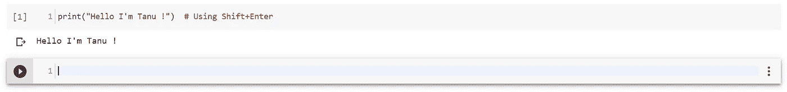
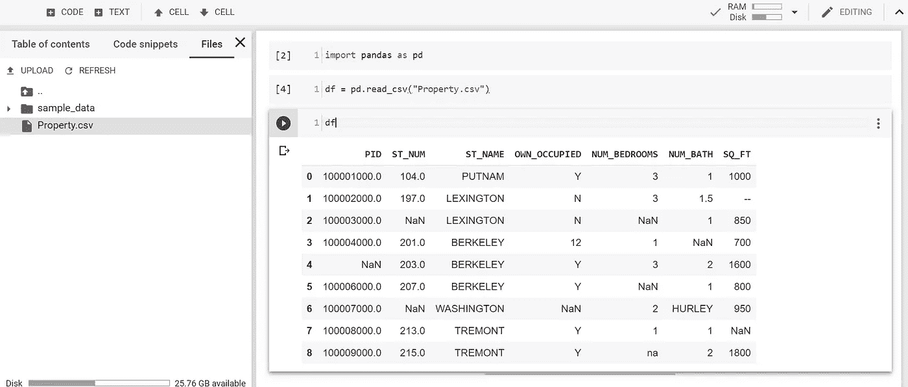
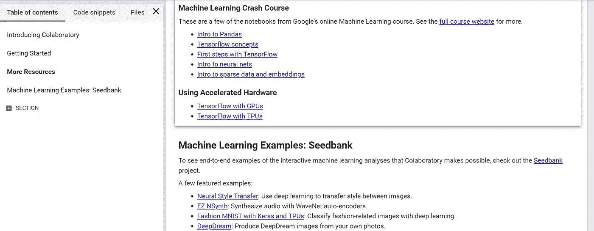
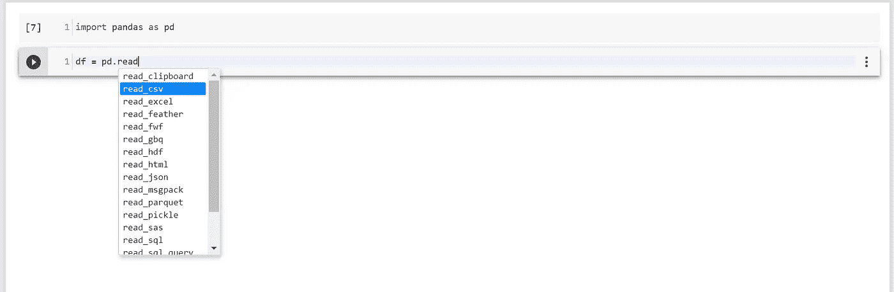
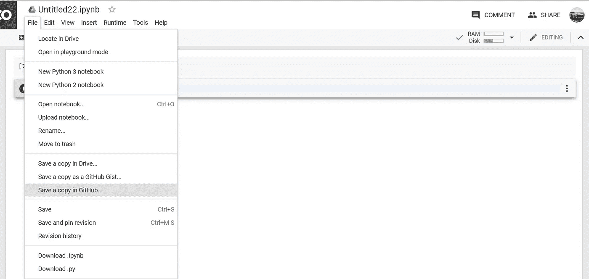
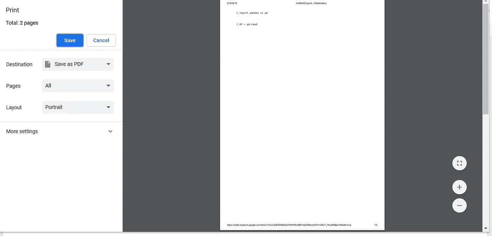
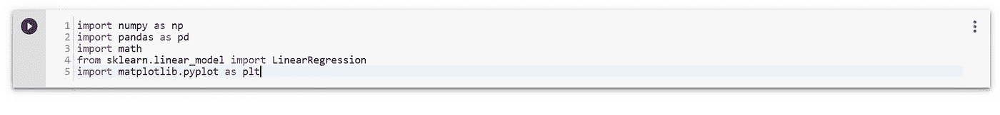

# 掌握 Google Colab 的功能

> 原文：<https://towardsdatascience.com/mastering-the-features-of-google-colaboratory-92850e75701?source=collection_archive---------15----------------------->

## 在本文中，让我们了解更多关于 Google Colab 的信息，并测试它的特性。

**Photo by** [**Hrishikesh Mane**](https://medium.com/@iHrishi_mane/what-is-google-colab-eb1e718646ce) **on** [**Medium**](https://medium.com/@iHrishi_mane/what-is-google-colab-eb1e718646ce)

# 介绍

## 什么是 Google Colab 及其用法？

Google Colab 是一个数据科学和机器学习的研究工具。这是一个 Jupyter 笔记本电脑环境，不需要设置即可使用。它是迄今为止最顶级的工具之一，尤其是对于数据科学家来说，因为你不需要手动安装大部分的包和库，只需要通过调用它们直接导入即可。而在普通的 IDE 中，你需要安装库。Jupyter notebook 主要用于代码文档，它通常看起来像一篇博客文章。在过去的两个月里，我一直在使用 Google Colab，它对我来说是最好的工具。在这篇博客中，我会给你们一些掌握 Google Colab 的技巧和窍门。敬请关注，阅读所有要点。这些特性甚至是我一开始也很难实现的，现在我掌握了它们。让我们来看看谷歌 Colab 笔记本的最佳功能。

> **你可以在这里** **访问 Google Colab** [**。去输入你的第一个程序。**](https://colab.research.google.com/notebooks/welcome.ipynb)

# 特征

## 1)运行电池:

要“**运行单元格**”(单元格是您输入要执行的代码或文本的地方)，您可以按“ **Ctrl+Enter** ”或“ **Shift+Enter** ”。我个人使用“ **Shift+Enter** ”是因为当你按下“ **Shift+Enter** ”时，它会运行那个特定的单元格并自动创建一个新的单元格，这是一个方便的功能，可以快速完成工作。

Using “Ctrl+Enter”

Using “Shift+Enter”

## 2)上传文件

如果你遵循一些随机的在线教程的步骤，这可能是一个非常痛苦的任务。但我有一个简单的解决方案，这是一个一步到位的过程，你不需要写额外的代码，或执行一些额外的任务，而你只需要手动上传到 Colab。这是做这件事的方法。

下图清楚地表明，您必须右键单击单元格左侧看起来像“ **>** ”的箭头标记。当你点击它时，你会发现一个有三个选项的标签，你只需要选择“**文件**”。然后，您可以在“**上传**选项的帮助下轻松上传您的文件。有一件事你要注意，你应该把文件上传到“ **Samples** 文件夹之外。给你，你的任务完成了。

Click on the **Files** tab to upload.

这是你上传文件到 colab 时的样子。

After uploading your file to the Colab.

## Colab 中的教程

你知道 Google Colab 不仅用于输入代码，还是学习机器学习、熊猫和神经网络概念的好地方吗？确实可以在 Colab 找到一堆可以提升技能的教程。要找到这些教程，只需点击你左手边的 **>** ，然后点击“**目录”**->“**更多资源**”你就可以在那里找到一堆教程。

You can find many **tutorials** in Colab.

## 4)在笔记本中上传图片。

有时候你需要上传图片到笔记本上，只是为了把事情说清楚。当您按照在线教程操作时，添加图像有时会很困难。一个简单的方法，我发现，显然你必须使用一个免费的图像托管网站，以便在笔记本上呈现你的图像。要做到这一点，请使用“ [**TinyPic**](http://tinypic.com/) ”，这是上传图片的最佳网站，它提供了一系列链接供您选择，如 HTML、Url 等。你也可以上传**视频**到这个网站。

Choose one of the above links that fit your needs.

一旦你将图片上传到 TinyPic，那么你只需要根据你的要求复制链接，然后粘贴到“**文本**部分。给你，你的任务完成了。

Paste the link in the **Text** section

## 5)使用 Tab 完成代码。

这是 Colab 中最好的特性之一，称为“**制表符补全**”。制表符补全非常有用，尤其是当您不确定函数的方法时。它显示所有列出的方法，然后您可以选择您需要的方法。为此，您只需按下键盘上的“ **Tab** 键，就可以看到所有等效方法的完整列表。

Press the Tab key to use this option.

## 6)直接保存到 GitHub

Google Colab 为您提供了一个将项目保存到 GitHub 资源库的选项，这是一个非常方便的选项。这个选项有助于手动上传你的项目到你的 GitHub，而不是自动保存你的项目到你的库。为此，只需点击屏幕上方的“**文件**”选项卡，然后点击选项“**在 GitHub** 中保存一份副本”。

Click on the **File Tab** to upload to your GitHub

## 7)将您的项目保存为 PDF

这对我来说是一项痛苦的任务，除非我的教授教我如何去做。因为有时为了提高可读性，您可能需要发送笔记本的 PDF 文档。因为这个 IPYNB 文件是不可读的，除非您有一个解析器。因此，为了保存为 PDF 文档，你只需点击“ **Ctrl-P** ”，然后点击另存为“ **PDF** ”。给你，你的任务完成了。我知道这是一个简单的过程，但有时如果你不知道如何去做，这些简单的过程可能会令人头疼。

Press **Ctrl-P** or **Print** option.

## 8)导入库而不安装它们。

Google Colab 给了你一个独特的功能，甚至是最好的 IDE 都没有提供，比如"**在没有安装**的情况下导入库"，你不需要在导入库之前手动安装任何库，你所要做的只是告诉例如 **import pandas as pd** ，然后你的工作就完成了，那些你必须在命令提示符中键入 **pip install pandas** 的日子已经一去不复返了，这很恶心。这确实是 Google Colab 最好的功能之一。**但是有时你可能想要手动安装一些外部库。**

以上是使用 Google Colab 的突出特点或提示，Google Colab 中的一切都是可用的，你只需动动脑筋就能实现它们。此外，我希望阅读这篇博客已经让你更好地了解如何像专业人士一样使用 Google Colab。感谢你们花时间阅读我的博客，请关注更多更新。请在下面的评论区告诉我你对这篇文章的看法。如果你对这篇文章有任何疑问，评论区都是你的。祝你有愉快的一天。