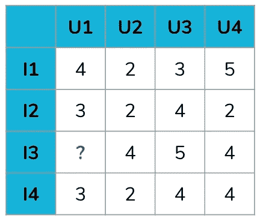
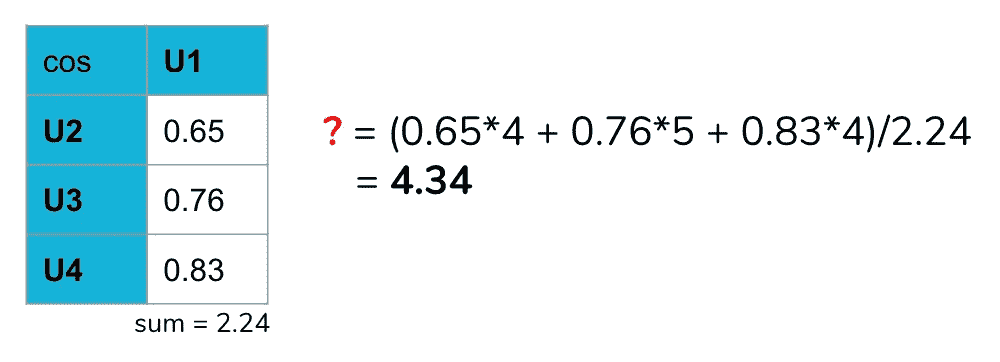
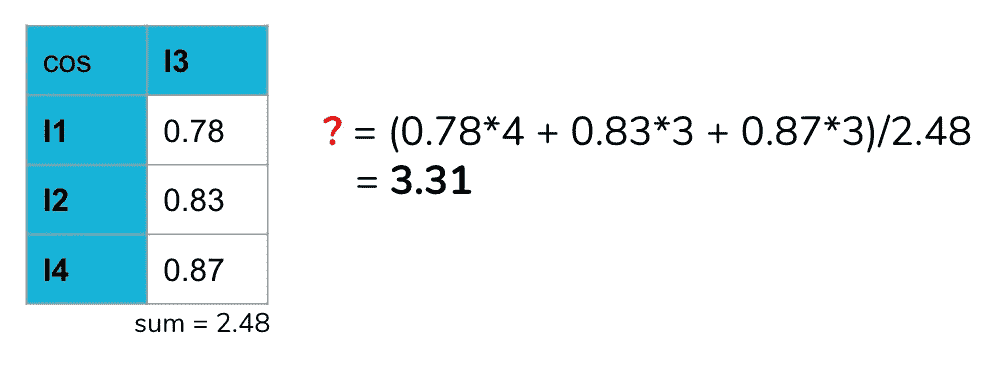
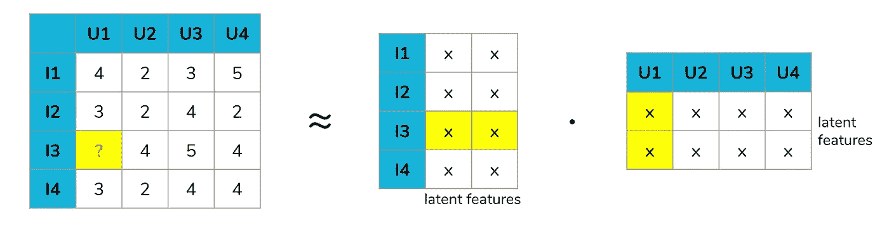
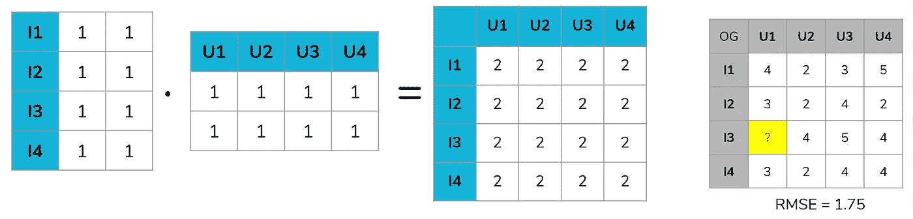
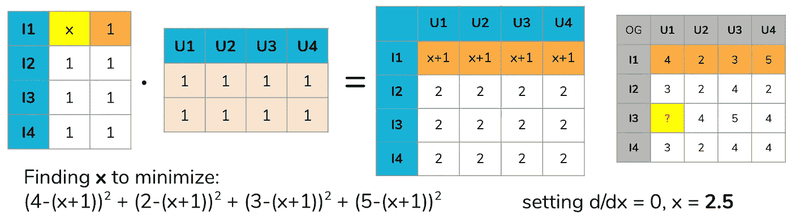
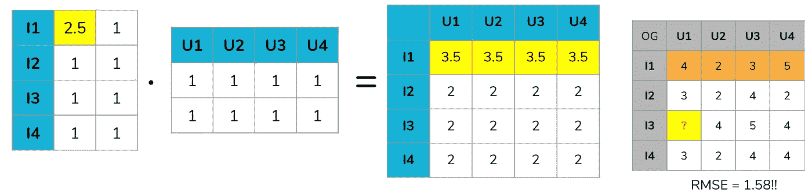
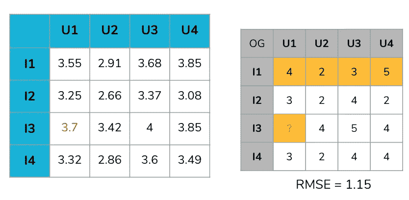

# 数据科学的数学:效用矩阵上的协同过滤

> 原文：<https://towardsdatascience.com/math-for-data-science-collaborative-filtering-on-utility-matrices-e62fa9badaab?source=collection_archive---------16----------------------->

## 理解推荐引擎协同过滤模型背后的数学原理

我强烈*推荐*看看我的另一篇文章，作为推荐引擎的介绍:

 [## 推荐引擎入门

### 它们是什么，它们是如何工作的，以及它们为什么伟大。

towardsdatascience.com](/a-primer-to-recommendation-engines-49bd12ed849f) 

## 概述:什么是协同过滤？

协同过滤是一种使用用户和项目数据的推荐引擎。更具体地说，是个人用户对单个商品的**评分**。这样，基于来自其他用户的评级来推荐项目，因此，*协作*。这些数据可以用**效用矩阵**来表示，其中一个轴是用户，另一个轴是项目。协同过滤推荐引擎的目标是**填补效用矩阵**中的空白，因为不是每个用户都对每个项目进行了评级，然后输出评级最高的、先前未评级的项目作为推荐。

A simple utility matrix, with 4 users (columns) and 4 items (rows).

填充效用矩阵有三种主要技术:用户-用户、项目-项目和 SVD。我们将使用上面的简单效用矩阵逐一分析，尝试并**预测用户 1 对项目 3** 的评价。

# 用户对用户

计算效用矩阵的缺失值有两个主要步骤:

1.  计算 U1 和所有其他用户之间的**相似度**
2.  通过对其他用户的 I3 评分取平均值**，计算 U1 对 I3 的评分，根据用户与 U1 的相似度对每个用户的评分进行加权**

在这里，我们快速讨论一下**相似性度量**。常见的有:`euclidean distance`(T1 的一种具体形式)`cosine similarity``Pearson correlation``Jaccard index`等。从实验上来看，皮尔逊相关性被证明是最好的。对于这篇文章中的例子，我们将使用余弦相似度。

Left: cosine similarity of U1 to all other users; Right: weighted average of ratings for I3

因此，我们对 U1 和 I3 的预测评级是 4.34！另请注意，不同的相似性度量会给出略微不同的结果。

# 项目对项目

项目-项目协同过滤与用户-用户非常相似，但不是计算用户之间的相似性，而是计算项目之间的相似性。你想要的最终值是 U1 其他评分的平均值，**用 I3 和其他项目的相似度加权**。

Left: cosine similarity of I3 to all other items; Right: weighted average of ratings for U1

采用这种逐项计算的方法，我们最终得到的预测值为 3.31——与我们之前的预测值 4.34 大相径庭。

需要注意几件事:

*   当计算相似性时，一些来源说将缺失值视为 0，而一些来源在计算相似性时简单地忽略缺失值的整个行/列。
*   一般来说，由于用户的独特品味，逐项方法更有效。
*   在决定是使用用户-用户还是项目-项目时，您可能要考虑算法的复杂性。如果你有 **m** 个用户和 **n** 个项目，那么用户-用户的时间复杂度是 O(m ^ n ),项目-项目的时间复杂度是 O(m n)。如果你有更多的用户，你可能会选择**条目，反之亦然。**

# 奇异值分解

我们必须从一点点理论开始，来理解这些概念从何而来。奇异值分解(SVD)是矩阵分解的一种形式。矩阵分解是将一个矩阵分解成(通常是三个)矩阵的乘积。如果你还记得代数的话，当我们把二次方程分解成它们的线性部分(即 *x + 2x + 1 = (x+1)(x+1)* )时，也是类似的思路。

SVD 是由西蒙·芬克在 2007 年 Netflix 奖竞赛中一举成名的型号。如果你学过线性代数课程，奇异值分解通常是利用矩阵的特征值和特征向量将其分解为三个分量矩阵。Python 库中用于解决推荐引擎的算法名为*SVD*，但它并不完全分解你的效用矩阵。取而代之的是，它在做 SVD 的**逆**，并试图**使用两个分量矩阵**而不是三个分量矩阵**来重建**你的效用矩阵。如下所示，这两个矩阵可以被解释为项目矩阵和用户矩阵。

Decomposing the utility matrix into an item matrix and a user matrix.

潜在特征指的是所有物品或用户特征的某种抽象。只要你有**相同数量的物品和用户的潜在特征**，你就可以将矩阵相乘，得到一个与你的效用矩阵维数相同的矩阵。潜在特征的数量是一个可以在模型中调整的超参数。基于矩阵乘法，我们还可以看到，U1 对 I3 的评级值受到项目矩阵的 I3 行和用户矩阵的 U1 列的影响。

因为我们不能分解有缺失值的矩阵，所以我们必须采取另一种方法。这就是机器学习的用武之地。如前所述，我们现在将尝试**用我们的项目矩阵和用户矩阵**重新创建效用矩阵。这是使用梯度下降的方法完成的:**交替最小二乘法**。

## 1.初始化

与所有使用梯度下降的模型一样，您必须从一些初始值开始。我们正在初始化两个分量矩阵。在这个例子中，我已经用全 1 初始化了我们的分量矩阵。

In blue: After initializing the component matrices with 1s, the **recreated utility matrix** is all 2s. In grey: the original utility matrix for comparison.

## 2.价值函数

在这个模型中，**成本函数**是允许我们**比较我们原始效用矩阵和我们重新创建的效用矩阵中的相应值**的任何度量。这意味着，我正在比较我的原始效用矩阵 4 中的 **U1-I1 的评级与我重新创建的矩阵**2 中的 **U1-I1 的评级，并对矩阵中的所有值进行同样的操作。在这里，我使用均方根误差( *RMSE:对每个个体的差值求平方，取平均值，然后求平方根*)并在计算 RMSE 时将缺失值视为 0。**

## 3.交替最小二乘法梯度下降

这种梯度下降的工作原理是通过一次改变一个分量矩阵中的一个值来尝试最小化成本函数(RMSE)。让我们从寻找项目矩阵中 I1 的第一个潜在特征的最优值开始。

如上图所示，通过改变这个第一个值(现在表示为未知的 *x* ，我们**更新了我们重新创建的效用矩阵的整个第一行**。通过矩阵乘法，这整个第一行变成 *x* + 1。因为矩阵的其余部分是静态的，我们可以通过第一行最小化我们的成本函数。因此，我们只是最小化那个二次方程，以得到 2.5 的最优 *x* ！

Our RMSE goes down!

用 2.5 替换 *x* ，我们重新创建的效用矩阵的第一行变成了 3.5，我们的 RMSE 从 1.75 下降到 1.58！这个过程一遍又一遍地重复，直到 RMSE 再也好不起来。需要注意的是，改变项目或用户矩阵中的一个值，**会改变重新创建的效用矩阵的整个行或列**。这维护了用户和项目之间的关系，这个过程被称为**并行化**。一遍又一遍地做这个过程(我是用 Python 库 **Surprise** 做的，我将在另一篇文章中介绍)，我们最终得到 1.15 的 RMSE，这就是我们重新创建的效用矩阵的样子:

## 4.估价

基于此，我们可以猜测 U1 对 I3 的评分是 3.7！在一个更稀疏的矩阵中，每个用户有多个未知的评分，然后你会推荐以前最高的未评分项目。有趣的是，与我们的用户-用户(4.34)和项目-项目(3.31)预测相比，我们的 SVD 值 3.7 介于使用两个不同轴的相似性之间。

在实际操作中，如果有更多的数据，你可以对你的已知评分做一个`train-test-split`，然后测量 **RMSE 在你的测试集中的实际评分值和它们在模型**中的预测值。RMSE 将用于评估模型，**不要与在执行此交替最小二乘梯度下降时用作成本函数的 RMSE**混淆。RMSE 可以解释为你的预测评级与实际评级的平均偏差，即你的预测平均偏离多少颗星。

# 我喜欢的资源:

*   推荐系统的矩阵分解技术:[https://data jobs . com/data-science-repo/Recommender-Systems-[网飞]。pdf](https://datajobs.com/data-science-repo/Recommender-Systems-[Netflix].pdf)
*   给你推荐:Netflix 奖和哈利南与 Striphas 制作的算法文化:[https://journals . sage pub . com/doi/pdf/10.1177/1461444814538646](https://journals.sagepub.com/doi/pdf/10.1177/1461444814538646)
*   莱斯科维克、拉贾拉曼和乌尔曼对大规模数据集的挖掘:[http://infolab.stanford.edu/~ullman/mmds/book.pdf](http://infolab.stanford.edu/~ullman/mmds/book.pdf)(特别是第 9 章对理解奇异值分解非常有帮助)
*   给*惊喜*的文档，我用于 SVD 的库:[https://surprise.readthedocs.io/en/stable/index.html](https://surprise.readthedocs.io/en/stable/index.html)