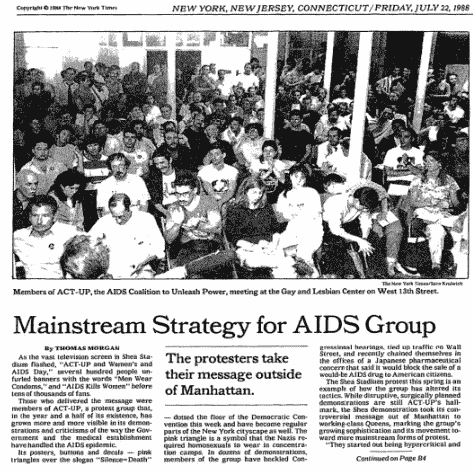

# “数学人”对数据科学和 STEM 是一种威胁

> 原文：<https://towardsdatascience.com/math-people-are-a-danger-to-data-science-and-stem-20d6f920ccbf?source=collection_archive---------33----------------------->

## 为什么 STEM 似乎不是所有人都能接触到的，为什么它必须是。

## 关键要点

*   你质疑所见的能力是你成为一个有价值的社区成员的原因。为了追求清晰，我们需要赞美问题。
*   专家和非专家需要能够质疑科学程序和结果，以防止和纠正不良科学。
*   在像数据科学这样的新领域，这两者都是如此，在这个领域，演示和可视化是传达信息的核心。

当我们小的时候，我们总是被问到这个问题“你是一个数学爱好者吗？”这种对儿童的分类意味着一些人会做数学，而另一些人不会，不管付出多少努力、时间或经验。问题是，我们谈论干细胞领域的这种简单而基本的方式会使重要的研究变得不直观，甚至不可想象。

至关重要的是，关于科学过程的失败和透明度的意义与我们谈论 STEM 领域的方式之间存在差异。我想讨论两个案例，它们以各自的方式至关重要，取决于提出问题、要求答案以及对研究过程和科学应用进行批判性思考的重要性。

从这些案例中吸取的经验教训可以应用于各个研究领域，但在考虑新兴的数据科学领域时具有独特的重要性。当我们面临迷恋数据可视化和时髦词汇的风险时，我们必须更加小心，不要停下来质疑这个过程的每一步。我们对待“失败”和误解的方式对于 STEM 教育、数据的道德使用和跨学科工作具有持久的重要性。

## 案例 1:拉库尔和格林(2014 年)

Figure 1 from LaCour and Green, 2014.

(这项研究已被广泛报道，所以这里是一个简短的概述。)

迈克尔·拉库尔是 2014 年加州大学洛杉矶分校政治科学系的一名有前途的研究生。他与唐纳德·格林合著了一项令人印象深刻的研究，唐纳德·格林目前是哥伦比亚大学伯吉斯政治学教授。这项研究的问题很简单:有没有可能通过一次对话改变选民对一个有争议问题的看法？拉票员被派出去拜访两个选民的家庭，谈论同性婚姻或回收(一个控制)。一些拉票者会谈论他们在同性群体中认识的人。其他游说者会透露他们是同性恋，并希望结婚。结果令人震惊。选民的想法变了。这是不朽的。拉库尔得到了一份普林斯顿大学助理教授的工作。

发表后不久，两名研究生大卫·布鲁克曼和约书亚·卡拉想要复制和扩展拉库尔和格林的工作。但是他们遇到了一些问题。这项研究在经济上怎么可能是可行的？此外，数据太完美了。2015 年 5 月，唐纳德·格林撤回了这篇文章。

Broockman and Kalla, 2016

但故事并不全是苦涩的。布鲁克曼和卡拉找到了一种方法，实际上正确地进行研究，关于变性恐惧症。他们的研究证明更加严谨。他们公布了他们的数据。他们公布了他们的代码。一切都是透明的。

他们于 2016 年在科学杂志上发表了他们的研究。2017 年，他们和 Jasjeet S. Sekhon 一起发表了他们关于改变这类田间实验设计的工作。这些学者坚持不懈地质疑和批判性地思考进行实验的过程，产生了令人难以置信的工作，不仅对学术界，而且对非学术界都有影响。

## 插曲:论专长

上面的例子说明，有时即使是专家也可能进行糟糕的科学研究。此外，当糟糕的科学发生时，其他专家有时没有抓住——拉库尔和格林的原始研究发表在*科学*上！当然，*科学*有严格的同行评议程序，但即使是专家也会漏掉一些东西。但是数字看起来不错。从所提供的一切来看，这看起来像是很好的科学。此外，人们希望拉库尔的结果是真实的。

同一领域的人需要对解释他们的方法、数据和思维过程负责。质疑事物是如何工作的，事物是如何被书写的，这是推动科学前进的唯一途径。我们必须考虑每一项个人工作能为更大的社区提供什么，以及它将如何影响其他研究人员和科学家。

尽管专家之间的对话对所有 STEM 领域的发展都很重要，但这些讨论似乎离那些认为自己不是技术人员或外行的人很远。专家们努力工作来赢得他们的证书和信誉。但是“专家”的标签也可能成为一个非专家真正应该参与的对话的障碍。布鲁克曼和卡拉能够部分建立在先前的研究基础上，是因为他们处于被尊重和倾听的地位。有时候，非专家的声音会产生真正的、持久的影响。这让我们回到了几十年前医疗保健的一个重要时期。

## 案例 2:行动起来和 1980 年代的艾滋病行动主义

美国医疗行业的各个方面都充满了争议，从医疗保险到医疗事故。临床试验是医学研究的一个关键部分，因此新药和新疗法可以(安全地)提供给病人。

*The New York Times, July 22, 1998, page B1*

在 20 世纪 80 年代，艾滋病是一个巨大的、致命的公共问题。医疗行业正在争先恐后地寻找治疗方法，同时遵循他们的方案:长时间的小型临床试验。人们不应该同时参加多个试验，这样结果就不会被污染……但是人们正在死去。他们不知道他们是否服用安慰剂或实际药物。

公开的同性恋群体及其盟友动员了他们的社会资本和金融资本，以一种“非专家”以前没有真正做过的方式介入医疗领域。他们去参加医学会议；他们自学成才。最重要的是，他们与医疗专业人员分享了他们的生活经验。虽然现在患者理解医疗过程似乎很正常，但这在当时并不规范。

这些被认为是该领域之外的人，不可逆转地改变了激进主义和医学研究，尤其是在公共危机时期。他们能够利用自己的“非专家”经验——基本数据——来说，医疗专业人员遗漏了一个非常重要的部分。生命比一部分人精心设计的协议更重要。作为非专家，他们看到了问题，并努力成为解决方案的一部分。

## 数据科学的含义:“你是一个数学人吗？”

专家和非专家之间清晰的交流是科学探索和进步的核心。但是这个问题，“你是一个数学人吗”掩盖了局外人知识在追求理解非常小众的概念中的重要性。我们不都是这么聊着 STEM 长大的吗？“他们是数学界的人。”“我只是不是一个学数学的人。”

有些人似乎对事物有诀窍。然而，即使像西蒙妮·比尔斯这样的明星运动员也必须在健身房里投入大量时间。一名歌手花费数年时间磨练自己的声音。厨师在厨房工作，完善每一种调料，每一种酱料。

那么，为什么我们坚持告诉人们我们所有人都有一个天生的 STEM 门槛呢？

当我们延续“数学人”和“非数学人”之间的这种划分时，我们就阻止了个人认识到科学是建立在失败和误解之上的。我们允许人们迷恋科学，认为*看起来*不错，但实际上并不好。

如果布鲁克曼和卡拉没有想过如何进一步推动拉库尔和格林的研究，他们可能永远也不会找到一种方法来使实地实验更加高效和有效。如果行动积极分子没有相信并争取成为医学研究对话的一部分，不清楚艾滋病研究需要多长时间才能赶上。

越来越多的公司现在正在雇用数据科学家，专注于花哨的可视化、大数据和机器学习。在这种环境下，问一个问题，尤其是作为一个非技术人员，会让人觉得你在拿自己的名誉冒险。问一个在这个行业工作了很长时间的人一个问题，会让人感到害怕。我看起来无知吗？我看起来落伍了吗？但这是这些问题最重要的时候。我们不能因为别人的模型或数字有一定的可信度，就认为他们是绝对可靠的。

与以往任何时候相比，不知道事物是如何组合在一起的力量更大。失败可能会产生难以置信的成效和影响。这不同于仅仅敲打键盘直到你的代码工作，或者运行每一个可以想象的测试直到它“工作”——因为从概率上来说，至少有一个测试可能成功。

这是关于系统的提问，对社区贡献的严格忠诚，而不是吹捧任何个人的荣誉，并在别人还没有想到的地方寻找答案。当研究一个技术领域时，如果你的非技术朋友有问题，批判性地思考它们，因为他们可能会发现一些你永远不可能发现的东西。对于那些认为自己不是技术人员或外行，并对某些事情有疑问的人。大声点。你可能会对结果感到惊讶。

## 参考资料和进一步阅读

*   《行动起来:艾滋病的治疗和外行专家意见》(哈里·柯林斯和特雷弗·平奇，2002 年)
*   [《数据科学的再现性危机》](/data-sciences-reproducibility-crisis-b87792d88513)(扎克·斯科特 2019 年 5 月 17 日)
*   [“具有调查结果的现场实验设计:选择更高效、更稳健和更道德设计的框架”](https://papers.ssrn.com/sol3/papers.cfm?abstract_id=2742869)(大卫·e·布鲁克曼、约书亚·卡拉和贾斯吉特·s·塞孔，2017 年)
*   [“持久减少变性恐惧症:上门拉票的现场实验”](https://science.sciencemag.org/content/352/6282/220)(大卫·布鲁克曼和约书亚·卡拉 2016)
*   [《如何要求医学突破:艾滋病斗争的教训》](https://www.npr.org/sections/health-shots/2019/02/09/689924838/how-to-demand-a-medical-breakthrough-lessons-from-the-aids-fight) (NPR *愤怒的另一面*，2019 年 2 月 9 日)
*   [《走向可复制性:平衡隐私与出版》](/toward-reproducibility-balancing-privacy-and-publication-77fee2366eee)(扎克·斯科特 2018 年 5 月 31 日)
*   “我们发现了社会科学最大的骗局之一。以下是我们学到的东西。”(大卫·布鲁克曼和约书亚·卡拉 2015 年 7 月 22 日)
*   [“当接触改变思想:一个传递对同性恋平等支持的实验](https://science.sciencemag.org/content/346/6215/1366/tab-pdf)”(迈克尔·拉库尔和唐纳德·p·格林，2014)