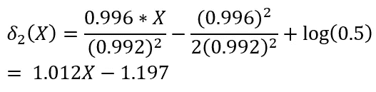

# 线性判别分析是如何得名的？

> 原文：<https://towardsdatascience.com/mathematical-insights-into-classification-using-linear-discriminant-analysis-9c822ad2fce2?source=collection_archive---------25----------------------->

Photo by [Franck V.](https://unsplash.com/@franckinjapan?utm_source=unsplash&utm_medium=referral&utm_content=creditCopyText) on [Unsplash](https://unsplash.com/search/photos/separation?utm_source=unsplash&utm_medium=referral&utm_content=creditCopyText)

尽管是宣传最差的机器学习分类工具之一，但线性判别分析(LDA)在各种设置中可以匹配甚至优于逻辑回归。LDA 经常在机器学习中用于降维，但它也可以有效地用于分类。在本文中，我们将深入研究 LDA 的数学基础分类。

在分类中，我们考虑 K 个类{1，2，3，…，K}和一个输入向量 X。我们将 X 分类为属于使 P(Y=i | X)最大化的类 I。

LDA 分类依赖于贝叶斯定理，该定理规定:

这个公式表明，我们可以将 X 属于每个类的概率与输入在每个类中取值的概率联系起来。为了简单起见，我们假设只有一个输入变量，在这种情况下，X 只是一个数字。

我们可以将 P(X|Y)视为一个概率密度函数，如下图所示，其高度告诉我们输入值为 X 的概率，我们有 K 个图，每个类一个。如果图的高度很大，则获得值 X 的概率很高，如果高度很低，则概率很小。

因为我们希望上述公式易于使用，所以我们选择了一个具有良好数学特性的概率密度函数——由以下等式给出的正态分布:

这是 LDA 的一个关键假设。如果输入变量来自近似正态分布，该技术将更好地工作，并且该近似值越小，性能就越差。

将正态分布代入贝叶斯定理，我们得到

为了简单起见，我们还假设只有 2 个类，所以 i=0 或 1，并且这些类对于 x 共享相同的方差。

我们想找到最大化这个值的类。

看到指数会让我们想到对数，因为对数不会改变集合的排列顺序，所以我们继续简化

这些项中的许多项在不同的类中保持不变，因此无助于确定哪个类具有最大的概率。我们可以把它们去掉，只剩下判别函数

我们可以将 X 分类为产生最大判别函数值的那一类。注意，公式在 X 轴上是线性的，这也是 LDA 这个名字的由来。

现在让我们来看一个简单的例子！

将种子设置为 10(这对可再现性很重要)，我们使用 R 从均值为 1、方差为 1 的正态分布中随机生成 10000 个点，我们将其指定为组 1(红色)。我们还从均值为+1、方差为 1 的正态分布中随机生成 10000 个点，我们将其指定为第 2 组(蓝色)。我们希望使用 LDA 将一个输入分类为属于这两个组中的一个。从下图中，我们看到 X=0 很好地将两个组分开。

在这种情况下，每组有 10000 个，因此每个组都有均等的机会获得输入。因此 P(Y=0) = P(Y=1) = 0.5。同样，第 1 组的平均值为-1.002，第 2 组的平均值为 0.996。计算我们得到的标准差的估计值

将这些值代入组 1 的判别函数，我们得到

对于第二组，我们得到

我们可以看到，当 X>0.003 时，X 将被分类为属于第 2 组，否则被分类为属于第 2 组。这非常接近理论上存在于两个这样的正态分布之间的 X>0 的真实截止值。

注意我们可以放宽 K=2 的要求，将 X 设为多维向量，导出类似的判别公式。我们只需要计算鉴别函数 K 次，而不是两次。

如果我们放松 Var(X)在 K 个类中是常数的约束，我们会得到一种稍微不同的技术，称为二次判别分析或 QDA。但这是另一篇文章的主题。

感谢您的阅读，并在下面留下您的意见或问题！