# 梯度下降背后的数学直觉

> 原文：<https://towardsdatascience.com/mathematical-intuition-behind-gradient-descent-f1b959a59e6d?source=collection_archive---------9----------------------->

## 梯度下降中更新规则的数学推导——机器学习和深度学习中最流行的优化算法

> 梯度下降是一种寻找函数最小值的迭代优化算法，最常用于机器学习和深度学习。

# 介绍

如果你在生活中曾见过或听说过“梯度下降”这个术语，你肯定会遇到下面这个等式:

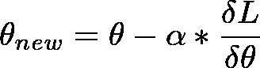

Gradient Descent - parameter update step

和下图:

Cost vs Weight in Gradient Descent

在上式中，L 是损失函数(或成本函数)，而 *θ* 是成本函数所依赖的任何参数。在神经网络(或深度学习)的情况下，这些是权重( *W* )和偏差( *b* )。

目标是找到损失函数的全局最小值。这些参数在训练算法的每次迭代期间被更新，直到我们达到损失函数的最小值。

在深度学习(或神经网络)的背景下，我们根据权重和偏差写出上述等式，如下:

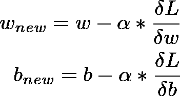

weight and bias update in gradient descent

这是梯度下降优化算法中的基本步骤，在训练的每次迭代期间执行。
我们来数学推导一下这个方程(不要慌！你只需要高中基础微积分就可以做到这一点)。这样做之后，无论何时你遇到参数更新步骤，你都会知道它的起源，并且感觉更有力量！

# 通用学习算法

让我们首先快速回顾一下一般的学习算法:

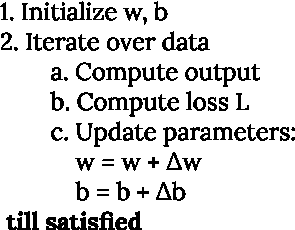

general learning algorithm

这里的“直到满意”是一个主观条件，可以是许多停止标准中的一个，如达到阈值损失值或重复某个固定次数等。

## 参数更新步骤

注意，更新步骤包括添加一些变化δ*w*，δ*b*到 *w* ， *b* 。我们很快就会发现那些确实是损失的**负偏导数** w.r.t *w* ， *b* 分别是**-****𝛿l/𝛿*w***和 **- 𝛿L/𝛿 *b*** 其中 L = f( *w* ， *b* )。

让我们用数学公式来表达这些:

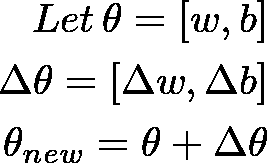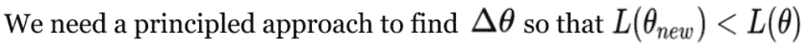

注意，我们还没有引入学习率α。我们先来了解一下学习率的需求。

# 需要学习率

我们知道 *θ* 是向量，δ*θ*也是向量。
让我们考虑这两个向量的和:

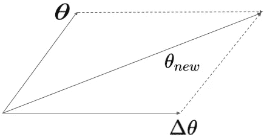

vector sum of *θ* and Δ*θ*

很明显，与单个矢量相比，两个矢量的合成和相当大。这是因为我们迈出了一大步δ*θ*。我们需要在这个方向上迈出一小步，这样向量和就很小。这也很重要，因为如果我们对参数 *θ* 进行如此大的更新(δ*θ*，我们可能会错过损失函数 l 的全局最小值。因此，我们引入学习率来限制我们对参数 *θ* 进行更新的大小。

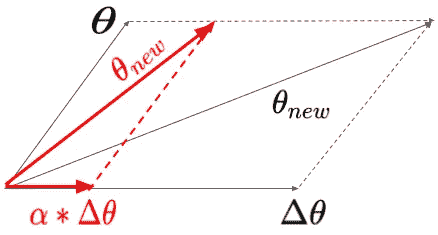

vector sum of *θ* and αΔ*θ*

注意如何借助学习率α < 1, we limit the amount of update we make to *θ* 。

现在让我们找出δ*θ*的正确值，它将减少损失值。

在我们继续之前，让我介绍一下著名的泰勒级数，我们将用它来求δw，δb，从而得到δ*θ*

# 泰勒级数及其在梯度下降中的应用

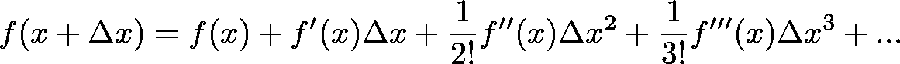

Taylor series

[泰勒级数](https://en.wikipedia.org/wiki/Taylor_series)用于找出距离 x 点δx 处的函数值，已知该函数在该点的导数。

让我们用泰勒级数来求δw 的值。
在这种情况下，函数 f 将是损失函数 L，我们对 L 进行级数展开(*w*+α*δ*w*)。
我们必须找到一个δ*w*的值，使得 L(*w*+α*δ*w*)<L(*w*)。

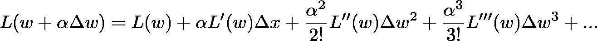

Taylor series for loss function in terms of w

在这一步，我们可以推断，我们需要第二项为负，新的损失小于旧的损失。

但是 Loss *L(θ)* 是一个多元函数。它不仅是重量 *w* 的函数，也是偏差 *b* 的函数。我们将它们表示为一个向量 *θ* = [ *w* ， *b* 。
所以我们需要写下泰勒级数的向量形式来求δ*θ。*

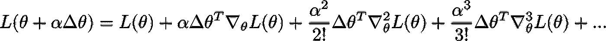

vector form of Taylor series for parameter vector θ

这里∇ *L(θ)* 代表损耗 w.r.t *θ的一阶梯度。* 梯度无非是函数 w.r.t 对其每个参数的偏导数的向量。
类似地∇将是一个向量的二阶偏导数等等。

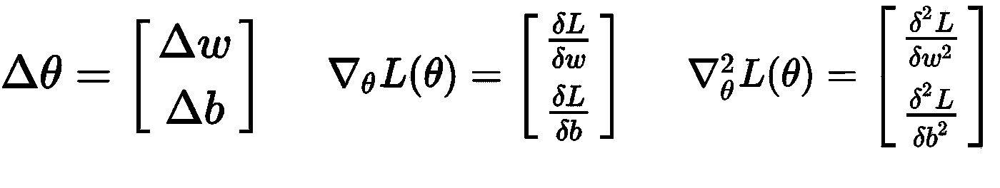

实际上，学习率α非常小(0.001，0.00001 等。)，所以α，α，…将非常小，它们对损耗 L 的贡献可以忽略不计。因此它们可以从等式中忽略。最后的等式将变成

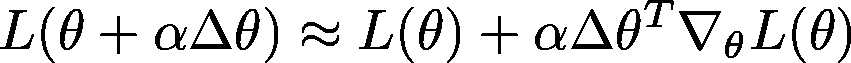

updated equation for loss

# 寻找δθ的最佳值

由于我们希望更新后的损耗*L(θ+α*δ*θ)*小于之前的损耗 *L(θ)* ，并且由于损耗是一个正的量，上述等式中的第二项必须是负的。
所以我们需要这样的δ值 *θ* 所以*使得第二项的点积为负，即我们需要*

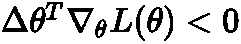

condition for new loss to be negative

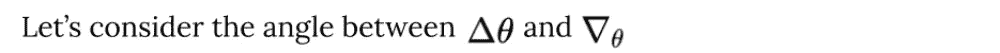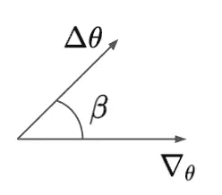

我们知道这一点

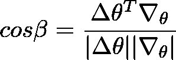

cosine of angle between 2 vectors is their dot product divided by product of their magnitudes

我们还知道 cos *β* 位于-1 和 1 之间，即-1 ⩽ cos *β* ⩽ +1。
因此，

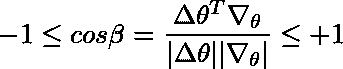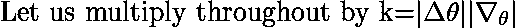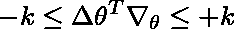

现在我们希望点积尽可能的负(这样损耗可以尽可能的低)
但是从上面的不等式可以看出，它能获得的最大负值是-k。

现在，为了使点积为-k，cos *β* 必须等于-1。
cos *β* = -1 对应 *β* = 180

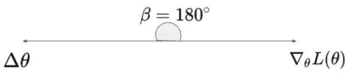

由于这两个矢量方向相反，从矢量的性质我们知道

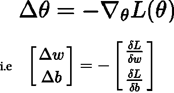

## 最终参数更新步骤

现在，如果我们在[通用学习算法](https://medium.com/p/f1b959a59e6d#b45d)的参数更新步骤中替换这些值，它变成

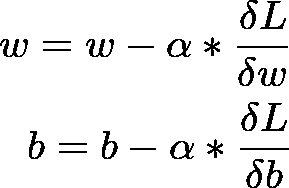

updated parameter update step in learning algorithm

现在，我的朋友，这个等式与我们开始推导的完全相似。
每次使用此规则更新参数(w 和 b)时，训练集的损失将会减少，直到不能再减少，即当斜率(或偏导数)变为 0 时。

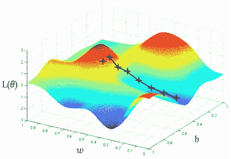

Result in decrease of loss due to iterative update steps

# 多重权重和偏差的梯度下降规则(矢量化符号)

我们已经导出了单个权重和偏差的更新规则。
在现实中，深度神经网络具有许多权重和偏差，它们被表示为矩阵(或张量)，因此我们的更新规则也应该被修改，以同时更新网络的所有权重和偏差。

> 注意，大多数深度学习文本使用符号δ而不是∇来表示方程中的梯度。

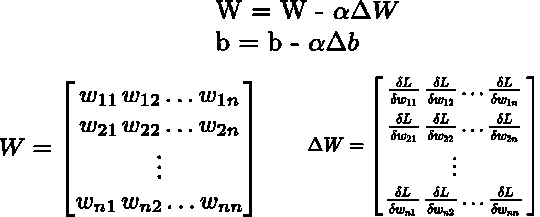

gradient descent update rule for deep neural network

# 结尾部分

这一个就到此为止。希望看完这些，你对梯度下降算法有了更直观的认识。