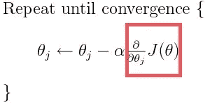
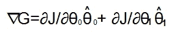
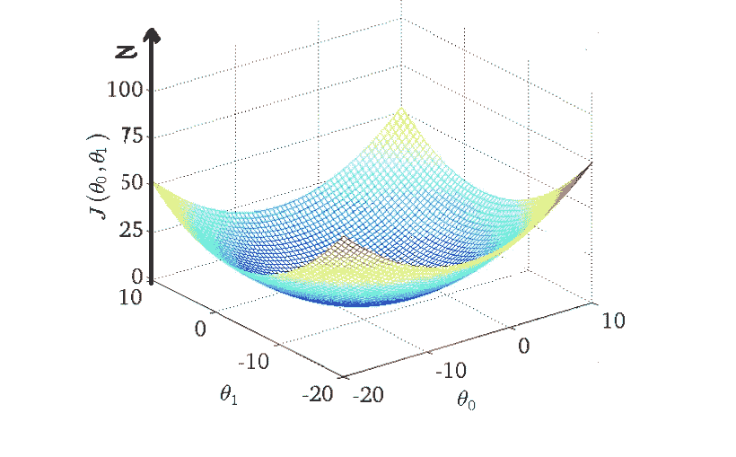
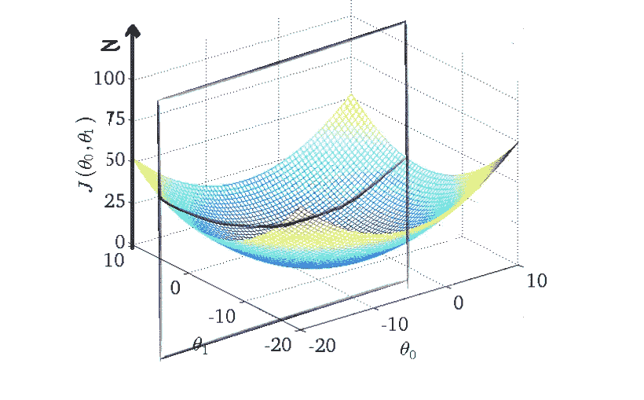
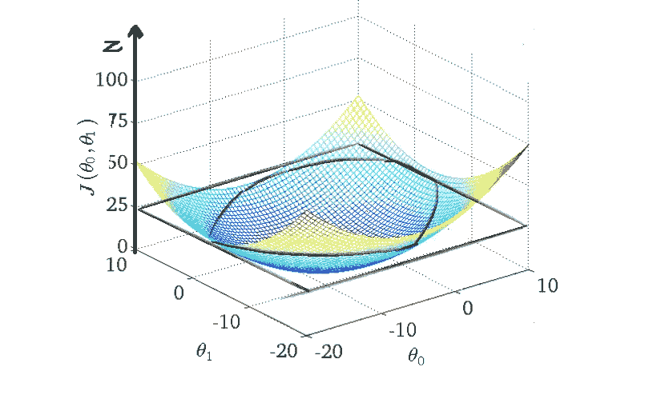
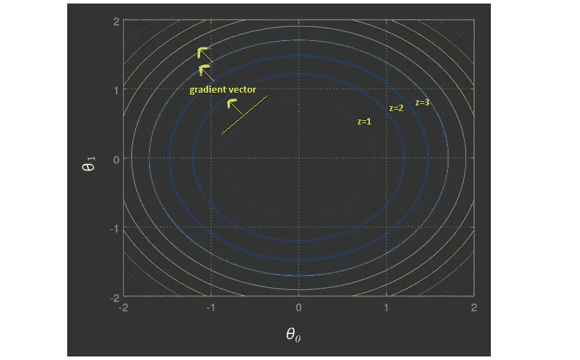
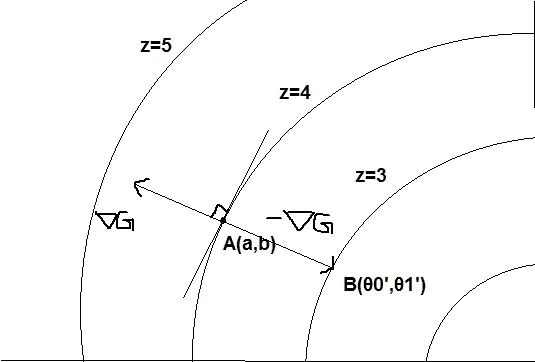

# 梯度下降的数学直觉

> 原文：<https://towardsdatascience.com/mathematical-intuition-of-gradient-descent-3d593c561da2?source=collection_archive---------25----------------------->

数学推理可以被看作是两种能力的结合，我们可以称之为直觉和独创性

这是给好奇的人的。每个人都知道梯度下降以及如何将其应用于成本函数的公式:

**for j=0 to n**

但是在本文中，我们将关注上面公式中突出显示的部分，以理解梯度下降背后的直觉:为什么从θ的每个分量中减去这个因子会引导我们最终达到最佳θ？所以，基本理解“梯度下降是如何工作的？”。

指导步骤:

1.  **渐变矢量**
2.  **梯度向量代表什么？**
3.  **将梯度向量应用于成本函数**

# 1.渐变向量:

假设我们有一个成本函数 J，它依赖于两个独立变量θ0 和θ1。那么 J 的梯度向量:

∇G= < ∂J ∕ ∂θ0 , ∂J / ∂θ1 >

在哪里，

函数的∂J ∕ ∂θ0=导数保持θ1 不变。

∂J ∕ ∂θ1 =函数 j w r tθ1 保持θ0 不变的导数。

我们来分析一下。假设函数 J 相对于θ0 和θ1 的曲线如下所示:

如果碗形三维图形被平行于 zθ0 平面的一个平面以特定的θ1 值切割，它将产生一个二维抛物线，如下所示:

偏导数∂J ∕ ∂θ0 表示特定θ1 的二维抛物线的切线斜率，反之亦然，∂J ∕ ∂θ1.也是如此特定(θ0，θ1)处的梯度向量是以这些斜率作为其分量的向量。

# 2.**梯度向量代表什么？**

在我们得到答案之前，我们需要了解等高线图的概念。如果 J 的上图被平行于θ0θ1 平面的平面在特定的 z=z1 水平上切割，它将产生一个二维圆，使得对于圆上的每个点，函数 J 将给出一个常数 z1 值。许多这样的图在不同的 z 水平给出了多维曲线的等高线图。

slicing at z=25

Contour Plot of J(θ0 ,θ1)

在等高线图中，梯度向量垂直于水平面，并始终指向更高的水平面，即指向 j 值更高的水平面。这种行为有其逻辑原因，但这需要另一篇关于多变量微积分概念的文章。

# 3.**将梯度向量应用于成本函数**

因为我们需要找到使 J 值最小的θ0 和θ1 的值，所以我们在与梯度向量相反的方向上移动与梯度向量的大小成比例的距离(因为它是到下一个水平表面的垂直距离，所以它是到下一个水平表面的最短距离)。

假设我们在 A 点，坐标θ0=a，θ1=b，水平面 z=4。我们想移动到下一个更低水平的表面，比如 z=3。我们有带方向和大小的梯度向量来引导我们到这个较低水平表面 z=3 处的新的点(θ0’，θ1’)。因此通过简单的向量数学，

**θ0’= a+(-∂j∕∂θ0)= a-∂j∕∂θ0**

**θ1' = b + (-∂J ∕ ∂θ1) = b - ∂J ∕ ∂θ1**

这是我们开始用的梯度下降公式。重复该过程，直到收敛，即，直到我们到达最低水平表面。Alpha 是学习率乘以梯度向量，以减少达到最低级别表面所需的步骤数。

如你所见，最终的汇聚点很大程度上取决于初始点。

我希望你有直觉。当你被一个又一个的公式轰炸时，这似乎有点令人不知所措。但是，每件事背后都有一个数学推导的逻辑。你只需要好奇。