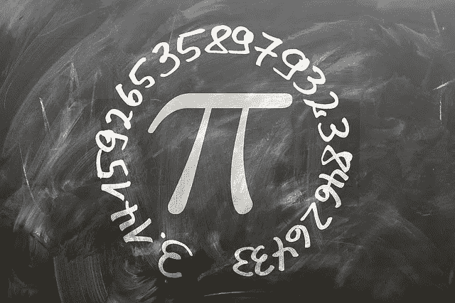
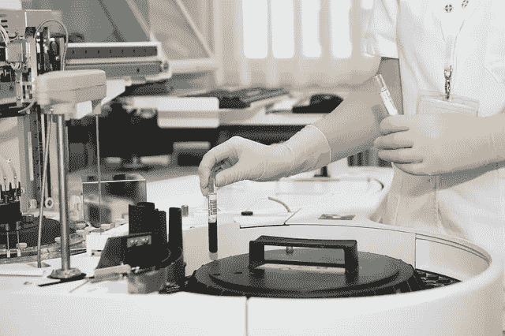
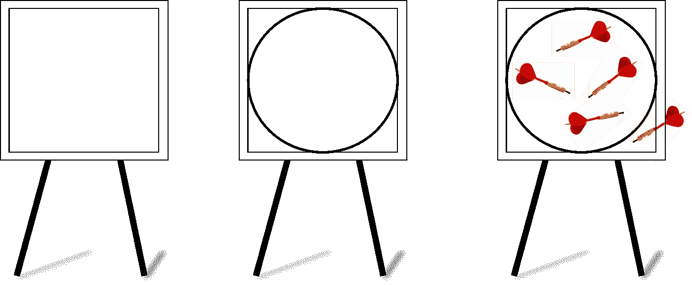
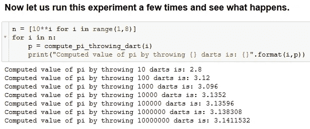
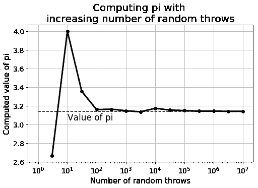

# 数学编程——数据科学进步的关键习惯

> 原文：<https://towardsdatascience.com/mathematical-programming-a-key-habit-to-built-up-for-advancing-in-data-science-c6d5c29533be?source=collection_archive---------5----------------------->

## 我们展示了如何通过模拟飞镖的随机投掷来近似计算圆周率的值。这是建立数学编程习惯的一小步，而数学编程应该是初露头角的数据科学家必备的一项关键技能。

# 注意

这个[故事也被](https://www.kdnuggets.com/2019/05/mathematical-programming-key-habit-advancing-data-science.html)列为 KDnuggets 平台上点击率最高的故事之一。

# 介绍

***数学编程*** 的精髓在于你建立了一种习惯，将数学概念编码起来，尤其是那些涉及到一系列计算任务的系统化的概念。

**这种编程习惯对于从事分析和数据科学**的职业非常有用，因为人们每天都要遇到各种各样的数字模式并理解它们。数学编程的能力有助于快速数字分析的快速原型化，这通常是建立数据模型的第一步。

# 几个例子

那么，我所说的数学规划是什么意思呢？不是已经在各种 Python 库中内置和优化了一堆数学函数吗，比如 [NumPy](/lets-talk-about-numpy-for-datascience-beginners-b8088722309f) 和 [SciPy](https://scipy-lectures.org/intro/language/python_language.html) ？

是的，但这不应该阻止你从头开始编写各种数值计算任务，并养成数学编程的习惯。

这里有一些随机的例子，

*   通过[蒙特卡罗实验](https://www.palisade.com/risk/monte_carlo_simulation.asp)计算圆周率——模拟随机向棋盘投掷飞镖
*   构建一个包含所有处理复数的方法的函数或类(Python 已经有了这样一个模块，但是你能模仿它吗？)
*   给定每只股票的方差，通过模拟多种经济情景，计算投资组合的平均回报率
*   [模拟并绘制随机行走事件](https://www.geeksforgeeks.org/random-walk-implementation-python/)
*   模拟两个球的[碰撞，并根据随机的起点和方向计算其轨迹](https://github.com/yoyoberenguer/2DElasticCollision)

如您所见，这些示例可以非常有趣，并且接近真实生活场景。因此，这种技术也带来了为离散或随机模拟编写代码的能力。

> 当你在网上浏览一些数学性质或概念时，你是否有一种冲动，想用你最喜欢的编程语言编写一段简单的代码来快速测试这个概念？

如果是，那么恭喜你！你有数学编程的根深蒂固的习惯，这将带你在追求令人满意的数据科学职业生涯中走得更远。

# 为什么数学编程是数据科学的关键技能？

数据科学的实践需要与数字和数字分析建立极其友好的关系。然而，这并不意味着要记忆复杂的公式和方程式。

发现数字模式的能力，以及通过编写简单代码快速检验想法的能力，对一名初露头角的数据科学家大有裨益。

这类似于电子工程师亲自操作实验室设备和自动化脚本，运行这些设备来捕捉电信号中的隐藏模式。

或者，想想一位年轻的生物学家，她擅长在载玻片上制作细胞横截面样本，并在显微镜下快速运行自动化测试，以收集数据来测试她的想法。

> 重点是，虽然整个数据科学企业可能由许多不同的组件组成，如数据争论、文本处理、文件处理、数据库处理、机器学习和统计建模、可视化、演示等。—对想法的快速实验通常只需要扎实的数学编程能力。

很难准确指出发展数学编程技能所需的所有必要元素，但是一些常见的元素是，

*   模块化编程的习惯，
*   对各种**随机化技术**的清晰认识
*   能够阅读和理解**线性代数、微积分和离散数学**的基本主题，
*   熟悉基本的**描述性和推断性统计**，
*   关于**离散和连续优化方法**(如线性规划)的初步想法
*   基本熟练掌握核心**数字库和函数**所选择的语言，其中数据科学家想要测试她的想法

您可以参考这篇文章，它讨论了在数据科学的基本动手数学中应该学习什么。

 [## 数据科学的基本数学

### 成为更好的数据科学家需要掌握的关键主题

towardsdatascience.com](/essential-math-for-data-science-why-and-how-e88271367fbd) 

在本文中，我们将通过讨论一个非常简单的例子来说明数学编程，这个例子使用向棋盘投掷随机飞镖的[蒙特卡罗方法](https://www.palisade.com/risk/monte_carlo_simulation.asp)来计算圆周率的近似值。

# 通过投掷(许多)飞镖来计算圆周率

这是一种通过模拟向棋盘投掷飞镖的随机过程来计算圆周率值的有趣方法。它不使用任何复杂的数学分析或公式，而是试图从纯物理(但 [***随机***](https://en.wikipedia.org/wiki/Stochastic_process) )过程的仿真中计算圆周率的近似值。

> 这种技术属于**蒙特卡罗方法**的范畴，其基本概念是模拟随机过程，当重复大量次数时，会产生一些感兴趣的数学量的近似值。

想象一个正方形的镖靶。

然后，里面画了一个圆的镖靶接触到它的所有边。

然后，你朝它扔飞镖。**随机**。这意味着有些落在圈里，有些落在圈外。但是假设没有飞镖落在棋盘之外。

在投掷飞镖游戏结束时，你计算落在圆圈内的飞镖占投掷的飞镖总数的百分比。将这个数字乘以 4。

结果数字应该是圆周率。或者，如果你投了很多飞镖，这是一个很接近的近似值。

## 有什么想法？

这个想法非常简单。如果你投出大量的飞镖，那么一个飞镖落在圆内的**概率正好是圆的面积与方板的面积之比**。在基础数学的帮助下，你可以证明这个比例是π/4。所以，要得到圆周率，你只需要把这个数乘以 4。

这里的关键是模拟投掷许多飞镖，以便**使(落在圆圈内的飞镖的)分数等于概率，这一断言仅在这一随机事件的大量试验**的限度内有效。这来自大数定律或概率的频率主义定义。

## Python 代码

在我的 Github repo 中给出了一个 Jupyter 笔记本，展示了 Python 代码。请随意复制或叉。步骤很简单。

首先，创建一个函数来模拟飞镖的随机投掷。

然后，编写一个函数，根据给定的落点坐标，确定一个飞镖是否落在圆内，

最后，写一个函数，模拟大量的飞镖投掷，从累积结果中计算出圆周率的值。

但是规划不能就此停止。我们必须测试近似值有多好，以及它如何随着随机投掷的次数而变化。与任何蒙特卡洛实验一样，我们希望随着实验次数的增加，近似值会变得更好。

> 这是数据科学和分析的核心。仅仅编写一个打印出预期输出并停止在那里的函数是不够的。必要的编程可能已经完成，但科学实验不会在没有进一步探索和测试假设的情况下就此停止。

我们可以看到大量的随机投掷可以重复几次来计算一个平均值，得到一个更好的近似值。

# 简单的代码，丰富的思想

这项技术背后的理论和代码看起来非常简单。然而，在这个简单练习的表象背后，隐藏着一些非常有趣的想法。

**函数式编程方法**:技术的描述可以用一个整体代码块来编码。然而，我们展示了任务应该如何被划分成模拟真实人类行为的简单功能

*   扔飞镖，
*   检查镖的落点坐标并确定它是否落在圆圈内，
*   重复这个过程任意次

为大型程序编写高质量的代码，使用这种 [**模块化编程**](https://www.geeksforgeeks.org/modular-approach-in-programming/) 风格是有指导意义的。

**突现行为**:在这段代码中，没有使用任何涉及圆周率或圆的性质的公式。不知何故，圆周率的值出现在集体行动中，集体行动是向一块木板随机投掷一串飞镖，然后计算一个分数。这是 [**涌现行为**](http://wiki.c2.com/?EmergentBehavior) 的一个例子，其中*一个数学模式通过它们之间的相互作用从一组大量重复的同类实验中涌现出来。*

**频率主义者对概率的定义**:概率的定义有两大类，两个激烈对立的阵营——频率主义者和贝叶斯主义者。作为一个频率主义者，很容易将概率定义为一个事件的频率(作为随机试验总数的一部分)。在这个编码练习中，我们可以看到这种特殊的概率概念是如何从大量重复的随机试验中产生的。

[**随机模拟**](https://www.andata.at/en/stochastic-simulation.htmlhttps://www.andata.at/en/stochastic-simulation.html) **:** 飞镖的核心功能在其核心使用了一个随机生成器。现在，计算机生成的随机数并不是真正的随机，但出于所有实际目的，它可以被假设为一。在这个编程练习中，我们使用了 Python 的`random`模块中的统一随机生成器函数。这种随机化方法的使用是随机模拟的核心，它是数据科学实践中使用的一种强有力的方法。

**通过重复模拟和可视化来测试断言**:通常，在数据科学中，我们会处理随机过程和概率模型，这些都必须基于大量的模拟/实验来测试。因此，当务之急是以渐进的方式思考，并以统计上合理的方式测试数据模型或科学论断的有效性。

# 摘要(也是对读者的挑战)

我们展示了培养数学规划的习惯意味着什么。本质上，它是从编程的角度来思考，以测试您在头脑中开发的数学属性或数据模式。这个简单的习惯可以帮助未来的数据科学家发展良好的实践。

用简单的几何恒等式、随机模拟的概念和概率的频率主义定义演示了一个例子。

如果你想寻求更多的挑战，

> 可以通过模拟一个[随机行走事件](https://en.wikipedia.org/wiki/Random_walk)来计算圆周率吗？

如果你想叉这个趣味练习的代码， [**请叉这个回购**](https://github.com/tirthajyoti/Stats-Maths-with-Python) 。

如果您有任何问题或想法要分享，请联系作者在[**tirthajyoti【AT】Gmail . com**](mailto:tirthajyoti@gmail.com)。另外，你可以查看作者的 [**GitHub**](https://github.com/tirthajyoti?tab=repositories) **资源库**中其他有趣的 Python、R 或 MATLAB 代码片段和机器学习资源。如果你像我一样对机器学习/数据科学充满热情，请随时[在 LinkedIn 上添加我](https://www.linkedin.com/in/tirthajyoti-sarkar-2127aa7/)或[在 Twitter 上关注我。](https://twitter.com/tirthajyotiS)

 [## Tirthajyoti Sarkar - Sr .首席工程师-半导体、人工智能、机器学习- ON…

### 佐治亚理工学院理学硕士- MS，分析这一 MS 计划传授理论和实践…

www.linkedin.com](https://www.linkedin.com/in/tirthajyoti-sarkar-2127aa7/)