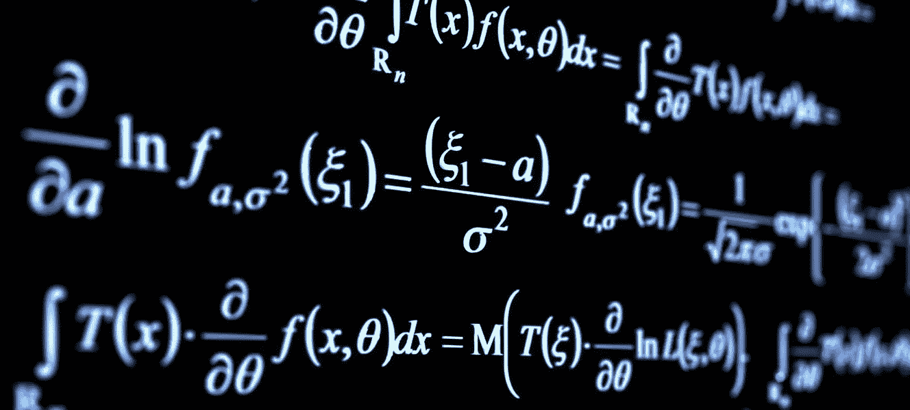

# 数据科学数学

> 原文：<https://towardsdatascience.com/mathematics-for-data-science-e53939ee8306?source=collection_archive---------5----------------------->

## 你是否被寻找资源来理解数据科学和机器学习背后的数学所淹没？我们掩护你。

# 动机

学习数据科学或机器学习的理论背景可能是一次令人畏惧的经历，因为它涉及多个数学领域和一长串在线资源。

在这篇文章中，我的目标是建议一些资源来建立必要的数学背景，以便开始并运行数据科学实践/研究工作。这些建议源自我自己在数据科学领域的经验，以及对社区建议的最新资源的跟进。

然而，假设你是机器学习的初学者，并希望在该行业找到一份工作。在这种情况下，我不建议在开始实际工作之前学习所有的数学知识。你可能会感到气馁，因为你一开始就提出了这个理论？)之前的练习(*好玩！*)。这种自下而上的方法适得其反。

我的建议是反过来做(自顶向下的方法)，学习如何编码，使用 PyData 栈(Pandas，sklearn，Keras 等)。)，动手构建真实世界的项目，使用库文档和 YouTube/Medium 教程。**然后**，你会开始看到更大的画面，注意到你缺乏理论背景，去理解那些算法是如何工作的；那一刻，学数学对你来说就有意义多了！

这是神奇的 fast.ai 团队的一篇文章，支持自上而下的学习方法

 [## 提供深度学习的良好教育 fast.ai

### 不幸的是，这是几个关于深度学习的资源开始的地方——要求学习者跟随…

www.fast.ai](https://www.fast.ai/2016/10/08/teaching-philosophy/) 

另一个是 Jason Brownlee 在他的金矿“机器学习大师”博客中写的

 [## 你做错了。为什么机器学习没那么难

### 像数学、物理、甚至计算机科学这样的技术课题都是采用自下而上的方法来教授的。这个…

machinelearningmastery.com](https://machinelearningmastery.com/youre-wrong-machine-learning-not-hard/) 

# 资源

我会把资源分成三个板块(线性代数、微积分、统计&概率)；资源列表没有特定的顺序。资源多样化，包括视频教程、书籍、博客和在线课程。

## 线性代数

线性代数用于机器学习，以理解算法如何在引擎盖下工作。都是关于向量/矩阵/张量运算；不涉及黑魔法！

1.  [可汗学院线性代数系列](https://www.khanacademy.org/math/linear-algebra)(初学者友好)。
2.  [编码矩阵教程](http://codingthematrix.com/)(和书)。
3.  [3Blue1Brown 线性代数系列](https://www.youtube.com/playlist?list=PLZHQObOWTQDPD3MizzM2xVFitgF8hE_ab&fbclid=IwAR0aMT4mHp-BAy5viaJyggcQqgBCTbP0VVm3ZaiGTDeyGKHn7cK_Hi-LpFA) [。](https://www.youtube.com/playlist?list=PLZHQObOWTQDPD3MizzM2xVFitgF8hE_ab&fbclid=IwAR2k6eUtl9kfQe__DrbcOAZj69nTAHriXb_0zYOaY6SbBa2TDnFsEALItbk)
4.  [fast.ai 线性代数 for coders 课程](https://github.com/fastai/numerical-linear-algebra/blob/master/README.md)，与现代 ML 工作流程高度关联。
5.  Coursera 第一门课程[机器学习专精的数学](https://www.coursera.org/specializations/mathematics-machine-learning)。
6.  [《应用线性代数导论——向量、矩阵和最小二乘》一书。](https://web.stanford.edu/~boyd/vmls/)
7.  [麻省理工线性代数课程](https://ocw.mit.edu/courses/mathematics/18-06-linear-algebra-spring-2010/index.htm)，综合性很强。
8.  [斯坦福 CS229 线性代数复习](http://cs229.stanford.edu/section/cs229-linalg.pdf)。

## 结石

在机器学习中利用微积分来制定用于训练算法以达到其目标的函数，即损失/成本/目标函数。

1.  [可汗学院微积分系列](https://www.khanacademy.org/math/multivariable-calculus)(初学者友好)。
2.  [3Blue1Brown 牙石系列](https://www.youtube.com/playlist?list=PLZHQObOWTQDMsr9K-rj53DwVRMYO3t5Yr&fbclid=IwAR2tbiSGEvuPqI5RMWvINEFIj88DcobnFX58KWacjPLxTo2VNgTpHHtrUkc)。
3.  Coursera 第二门课程[机器学习专业化的数学](https://www.coursera.org/specializations/mathematics-machine-learning)。
4.  [深度学习论文需要的矩阵演算](https://arxiv.org/abs/1802.01528)。
5.  [MIT 单变量微积分](https://ocw.mit.edu/courses/mathematics/18-01sc-single-variable-calculus-fall-2010/?fbclid=IwAR0LKFiV32uCutWWaDFj2J-be7kbt3S6UvXjYqd3Iml_ofwTHMXE96y4m3U)。
6.  [麻省理工学院多元微积分](https://ocw.mit.edu/courses/mathematics/18-02sc-multivariable-calculus-fall-2010/)。
7.  [斯坦福 CS224n 微分学复习](http://web.stanford.edu/class/cs224n/readings/review-differential-calculus.pdf)。

## 统计与概率

两者都用于机器学习和数据科学，以分析和理解数据，发现和推断有价值的见解和隐藏的模式。

1.  [可汗学院统计与概率系列](https://www.khanacademy.org/math/statistics-probability)(初学者友好)。
2.  [看理论:概率统计的直观介绍](https://seeing-theory.brown.edu/)。
3.  [介绍来自 Udacity 的描述性统计](https://mena.udacity.com/course/intro-to-descriptive-statistics--ud827)。
4.  [来自 Udacity 的推断统计简介](https://in.udacity.com/course/intro-to-inferential-statistics--ud201)。
5.  [来自 Coursera](https://www.coursera.org/specializations/statistics) 的 R 专门化统计。
6.  [斯坦福 CS229 概率论复习](http://web.stanford.edu/class/cs224n/readings/cs229-prob.pdf)。

## 额外材料

1.  [深度学习书](http://www.deeplearningbook.org/)第一部分。
2.  [CMU 数学背景为 ML 课程](https://www.youtube.com/playlist?list=PL7y-1rk2cCsA339crwXMWUaBRuLBvPBCg)。
3.  [机器学习用数学书](https://mml-book.github.io/)。

所以，这就是我为了公共利益放弃我精心策划的数学书签文件夹！我希望这有助于您扩展您的机器学习知识，并消除您对发现 sklearn/Keras/pandas import 语句背后发生的事情的恐惧。

我们非常欢迎您通过查看所列资源或添加新的显著资源来投稿。