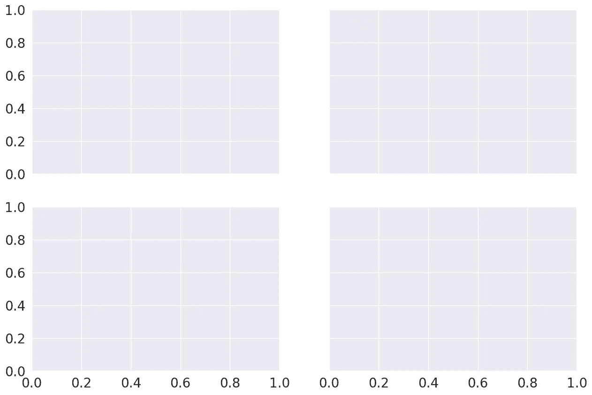

# Matplotlib+ Seaborn + Pandas:统计数据可视化的理想融合

> 原文：<https://towardsdatascience.com/matplotlib-seaborn-pandas-an-ideal-amalgamation-for-statistical-data-visualisation-f619c8e8baa3?source=collection_archive---------4----------------------->

探索性数据分析包括两个基本步骤

1.  数据分析(数据预处理、清理和处理)。
2.  数据可视化(使用不同类型的图来可视化数据中的关系)。

Pandas 是 python 中最常用的数据分析库。python 中有大量用于数据可视化的库，其中 matplotlib 是最常用的。Matplotlib 提供了对情节的完全控制，使情节定制变得容易，但它缺乏对熊猫的支持。Seaborn 是一个构建在 matplotlib 之上的数据可视化库，与 pandas 紧密集成。

这个职位将负责，

1.  seaborn 有不同类型的地块。
2.  熊猫和 seaborn 的整合如何帮助用最少的代码制作复杂的多维情节？
3.  如何在 matplotlib 的帮助下定制使用 seaborn 制作的情节？

## 谁应该阅读这篇文章？

如果你有 matplotlib 和 pandas 的工作知识，并且想探索 seaborn，这是一个很好的起点。如果你刚刚开始学习 python，我建议在对 matplotlib 和 pandas 有了基本的了解之后再回到这里。

# 1.Matplotlib

尽管许多任务仅使用 seaborn 函数就可以完成，但理解 matplotlib 的基础知识是必不可少的，原因有两个:

1.  在幕后，seaborn 使用 matplotlib 绘制情节。
2.  一些定制可能需要直接使用 matplotlib。

下面是 matplotlib 基础知识的快速回顾。下图显示了 matplotlib ***的解剖图。***


要理解的三个主要类是 ***图形*** 、 ***轴*** 和 ***轴***



## 数字

它指的是你看到的整个图形。在同一个图中可以有多个子图(轴)。在上面的例子中，我们在一个图中有四个子图(轴)。

## 轴线

坐标轴指的是图中的实际点。一个图形可以有多个轴，但给定的轴只能是一个图形的一部分。在上面的例子中，我们把四个*轴放在一个 ***图*** 中*

## *轴*

*轴是指特定图中的实际轴(x 轴/y 轴)。*

*本文中的每个例子都假设所需的模块和数据集已经被加载，如下所示*

*让我们试着用一个例子来理解 ***图*** 和 ***轴*** 类*

*plt.subplots()创建单个 ***人物*** 实例，(***nrows*******ncols)轴*** 实例，并返回创建的 ***人物*** 和 ***轴*** 实例。在上面的例子中，由于我们已经传递了 *nrows=1* 和 *ncols=1* ，所以它只创建了一个 ***轴*** 实例。如果 ***nrows > 1*** 或 ***ncols > 1*** ，它会创建一个轴网格，并将它们返回到一个( *nrows * ncols)* 形 ***numpy*** 数组中。*

**

*定制轴类最常用的方法有*

*这里有一个例子，使用上述一些方法进行一些定制*

**

*现在我们已经回顾了 matplotlib 的基础知识，让我们继续学习 seaborn*

# *2.海生的*

*seaborn 中的每个绘图函数要么是一个 ***图形级*** 函数，要么是一个 ***轴级*** 函数，了解两者的区别是必不可少的。如前所述，一个图形指的是你看到的整个图形，而 Axes 指的是图形中的一个特定的子图。 ***轴级*** 函数绘制到单个 matplotlib 轴上，不影响图形的其余部分。另一方面，一个 ***图形级*** 函数控制整个图形。一种思考方式是，一个 ***人物级*** 函数可以调用不同的 ***轴级*** 函数在不同的轴上绘制不同类型的支线剧情*

# *2.1 轴级功能*

*以下是 seaborn 中所有轴级函数的详尽列表*

*要使用任何轴级函数，有两点需要理解*

1.  *向轴级函数提供输入数据的不同方式。*
2.  *指定用于绘图的轴。*

## *2.1.1 向轴级功能提供输入数据的不同方式*

*有三种不同的方法将数据传递给轴级函数*

1.  *列表、数组或系列*

*将数据传递给轴级函数的最常见方式是使用列表、数组或序列等可迭代对象*

****

*2.使用熊猫数据帧和列名。*

*seaborn 受欢迎的主要原因之一是它能够直接处理熊猫数据帧。在这个传递数据的方法中，列名应该传递给 ***x*** 和 ***y*** 参数，数据帧应该传递给 ***数据*** 参数*

****

*3.仅传递数据帧*

*在这种传递数据的方法中，只有 Dataframe 被传递给 ***data*** 参数。将使用此方法绘制数据集中的每个数值列。该方法只能用于以下轴级功能*

*这种传递输入数据的方法的一个具体用例是使用上面提到的任何轴级函数比较数据集中多个数值变量的分布*

```
*sns.boxplot(data=iris)*
```

**

## *2.1.2 指定用于绘图的轴*

*seaborn 中的每个轴级函数都有一个显式的 ***ax*** 参数。传递给 ***ax*** 参数的轴将被用于绘图。这在控制哪些轴用于绘图方面提供了很大的灵活性。
例如，假设我们想要查看账单总额和小费之间的关系(使用散点图)以及它们在同一张图中不同轴上的分布(使用箱线图)。*

**

*每个轴级函数还会返回绘图所在的轴。如果一个 Axes 已经被传递给 ***ax*** 自变量，将返回相同的 Axes 对象。然后，返回的 Axes 对象可用于使用不同方法(如 Axes.set_xlabel()、Axes.set_ylabel()等)的进一步定制*

*如果没有轴传递给 ax 参数，seaborn 将使用当前(活动)轴进行绘图。*

*在上面的例子中，即使我们没有明确地将 curr_axes(当前活动的轴)传递给 ***ax*** 参数，seaborn 仍然使用它来绘图，因为它是当前活动的轴。
id(curr _ Axes)= = id(scatter _ plot _ Axes)返回 ***True*** 表示它们是相同的轴。*

*如果没有轴被传递给 ***ax*** 参数，并且没有当前活动的轴对象，seaborn 创建一个**新的**轴对象进行绘图，然后返回该轴对象*

*seaborn 中的轴级函数没有任何控制图形大小的直接参数。但是，由于我们可以指定哪些轴用于绘图，通过在 ***ax*** 参数中传递轴，我们可以如下控制图形大小*

# *2.2 图形级功能*

*在探索多维数据集时，数据可视化最常见的用例之一是在不同的数据子集上绘制同一图表的多个实例。seaborn 中的 ***图级*** 函数就是为这个用例量身定制的。一个 ***图形级*** 函数可以完全控制整个图形，并且每次调用一个图形级函数时，它都会创建一个新的图形，该图形可以包括多个轴，所有这些都以有意义的方式组织起来。seaborn 中三个最通用的图形级函数是 ***FacetGrid、PairGrid、JointGrid****

## *2.2.1 面网格*

*考虑以下用例，我们希望在不同的数据子集上可视化总账单和小费之间的关系(通过散点图)。每个数据子集通过以下变量
1 的值的唯一组合进行分类。日(星期四，Fri 星期六，太阳)
2。吸烟者(不管这个人是不是吸烟者)。性别(男性或女性)
这在 matplotlib 中很容易做到，如下所示*

**

*上述代码可以分为三个步骤:*

1.  *为每个数据子集创建一个轴(子图)*
2.  *将数据集划分为子集*
3.  *在每个轴上，使用对应于该轴的数据子集
    绘制散点图*

*步骤 1 可以在 seaborn 中使用 FacetGrid()
完成，步骤 2 和步骤 3 可以使用 FacetGrid.map()完成*

*使用 FacetGrid，我们可以使用 ***行*** 、 ***列*** 和 ***色调*** 参数创建将数据集分割成三维的轴。
一旦我们创建了 FacetGrid，我们可以使用 FacetGrid.map()在所有轴上绘制相同类型的图，方法是将图的类型作为参数传递。我们还需要传递用于绘图的列的名称。*

**

*因此，“Matplotlib 提供了很好的支持来制作具有多个轴的图，但是 seaborn 通过将图的结构与数据集的结构直接链接来构建它”。使用 FacetGrid，我们既不必为每个子集显式创建轴，也不必将数据显式划分为子集。这分别由 FacetGrid()和 FacetGrid.map()在内部完成。
我们可以将不同的轴级函数传递给 FacetGrid.map()。*

*此外，seaborn 提供了三个图形级函数(高级接口),它们在后台使用 FacetGrid()和 FacetGrid.map()。
1。relplot()
2。catplot()
3。lmplot()
上面的每个图级函数都使用 FacetGrid()创建多个轴，并在 ***种类*** 参数中取一个轴级函数，然后在内部传递给 FacetGrid.map()。因此，上述三个函数在可以传递给它们中的每一个的轴级函数方面是不同的。*

*显式使用 FacetGrid 比直接使用 relplot()、catplot()或 lmplot()等高级接口提供了更多的灵活性；例如，使用 FacetGrid()，我们还可以将自定义函数传递给 FacetGrid.map()，但是对于高级接口，您只能使用 ***种类*** 参数中内置的轴级函数。如果不需要这种灵活性，可以直接使用高级接口*

******

*上述三个图形级函数以及 FacetGrid 都返回 FacetGrid 的一个实例。使用 FacetGrid 实例，我们可以访问各个轴，然后可以使用这些轴来调整绘图(如添加轴标签、标题等)。此外，与控制 matplotlib 图形的大小相比，控制图形级别函数的大小是不同的。我们可以使用 ***高度*** 和 ***纵横比*** 参数来设置每个面(子情节)的高度和纵横比，而不是设置整体的图形大小。*

**

*更多示例请参考 [FacetGrid](http://seaborn.pydata.org/generated/seaborn.FacetGrid.html) 。*

## *配对网格*

*PairGrid 用于绘制数据集中变量之间的成对关系。每个子图显示了一对变量之间的关系。考虑以下用例，我们想要可视化每对变量之间的关系(通过散点图)。这可以在 matplotlib 中轻松完成，如下所示*

**

*上面的代码可以分为两步*

1.  *为每对变量创建一个轴*
2.  *在每个轴上，使用对应于该变量对的数据
    绘制散点图*

*步骤 1 可以使用 PairGrid()
完成，步骤 2 可以使用 PairGrid.map()完成。*

*因此，PairGrid()为每对变量创建轴，PairGrid.map()使用对应于该对变量的数据在每个轴上绘制绘图。我们可以将不同的轴级函数传递给 PairGrid.map()*

**

*在对角线轴上绘制散点图是没有意义的。可以在对角线轴上绘制一种图形，在非对角线轴上绘制另一种图形。*

**

*还可以在上三角轴、对角轴和下三角轴上绘制不同种类的图。*

**

*如果您不需要 PairGrid()的所有灵活性，Seaborn 还提供了一个高级接口 pairplot()来绘制变量的成对关系。它在后台使用 PairGrid()和 PairGrid.map()。*

```
*sns.pairplot(data=iris)*
```

**

*PairGrid()和 PairPlot()都返回 PairGrid()的一个实例。使用 PairGrid()实例，我们可以访问各个轴，然后可以使用这些轴来调整绘图，如添加轴标签、标题等*

**

*更多示例请参考[对网格](https://seaborn.pydata.org/generated/seaborn.PairGrid.html)*

## *接缝网格*

*当我们想要在同一个图中绘制双变量分布和边际分布时，使用 JointGrid。两个变量的联合分布可以使用 ***散点图***/**/*regplo***t 或 ***kdeplot*** 可视化。变量的边际分布可以通过 ***直方图*** 和/或 ***kde 图可视化。*** 用于关节分布的轴级函数必须传递给 JointGrid.plot_joint()。用于边际分布的轴级函数必须传递给 JointGrid.plot_marginals()*

**

*如果你不需要 JointGrid()的所有灵活性，seaborn 还提供了一个高级接口 ***jointplot()*** 来绘制双变量分布和边际分布。它在后台使用 JointGrid()和 JointGrid.plot_joint()。*

**

*JointGrid()和 jointplot()都返回 JointGrid()的一个实例。使用 JointGrid()实例，我们可以访问单个轴，然后可以使用这些轴来调整绘图，如添加标签、标题等*

**

*更多例子请参考[接合栅格](https://seaborn.pydata.org/generated/seaborn.JointGrid.html)*

# *摘要*

*将 ***seaborn*** 与 ***pandas*** 整合在一起，有助于用最少的代码制作复杂的多维情节。seaborn 中的每个绘图函数要么是一个 ***轴级*** 函数，要么是一个 ***图形级*** 函数。 ***一个轴级*** 函数绘制到单个 matplotlib 轴上，不影响图形的其余部分。另一方面， ***图形级*** 功能控制整个图形。她的是轴级和图形级函数的快速总结*

## *轴级别*

## *数字级*

*欢迎提供使本文更好的建议/技巧。感谢阅读！！！*