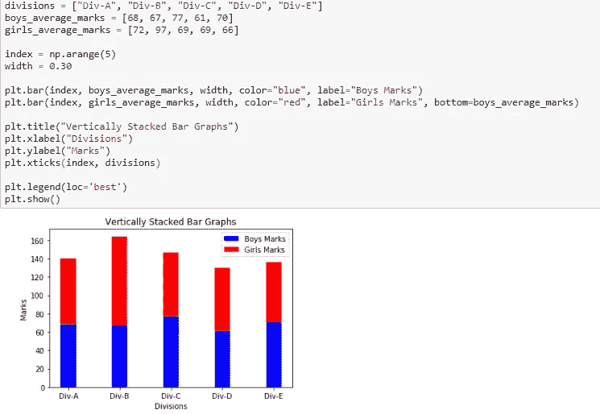

# Matplotlib 教程:学习 Python 强大的绘图库的基础知识

> 原文：<https://towardsdatascience.com/matplotlib-tutorial-learn-basics-of-pythons-powerful-plotting-library-b5d1b8f67596?source=collection_archive---------3----------------------->


Photo by [rawpixel](https://unsplash.com/@rawpixel?utm_source=medium&utm_medium=referral) on [Unsplash](https://unsplash.com?utm_source=medium&utm_medium=referral)

# 什么是 Matplotlib

为了进行必要的统计推断，有必要可视化您的数据，Matplotlib 是 Python 用户的一个解决方案。对于那些使用 Python 和 NumPy 的人来说，这是一个非常强大的绘图库。Matplotib 最常用的模块是 Pyplot，它提供了一个类似 MATLAB 的接口，但它使用 Python，并且是开源的。

# 安装 Matplotlib

要在本地计算机上安装 Matplotlib，请打开 Python 命令提示符并输入以下命令:

```
python -m pip install -U pip
python -m pip install -U matplotlib
```

我假设你希望涉足数据科学和机器学习的世界，因此我建议你从[这里](https://www.anaconda.com/download/)下载 anaconda 包发行版。它安装了 python，Jupyter notebook 和其他重要的 python 库，包括 Matplotlib，Numpy，Pandas，scikit-learn。Anaconda 支持 Windows、MacOS 和 Linux。要快速开始使用 Matplotlib 而无需在本地机器上安装任何东西，请查看 [Google Colab](https://colab.research.google.com/) 。它免费提供与你的 Google Drive 账户相关联的云端 Jupyter 笔记本，并且预装了所有重要的软件包。您也可以在 GPU 上运行您的代码，这有助于加快计算速度，尽管我们在本教程中不需要 GPU 计算。要快速开始使用 Google Colab，请查看这篇令人惊叹的[文章](https://medium.com/deep-learning-turkey/google-colab-free-gpu-tutorial-e113627b9f5d)。

# 一般概念

Matplotlib 图形可以分为以下几个部分:

**图形:**是一个完整的图形，可以包含一个或多个轴(图)。你可以把**图形**想象成一块包含情节的画布。

**轴:**就是我们一般认为的剧情。一个**图形**可以包含多个轴。它包含两个或三个**轴对象(在 3D 的情况下)。每个轴都有一个标题、一个 x 标签和一个 y 标签。**

****轴:**它们是像数字线一样的物体，负责生成图形界限。**

****艺术家:**图上能看到的一切都是艺术家，比如`Text`物体、`Line2D`物体、`collection`物体。大多数艺术家都被绑在斧头上。**

# **Pyplot 入门**

**Pyplot 是 Matplotlib 的一个模块，它提供了简单的功能来添加绘图元素，如线条、图像、文本等。当前图形中的当前轴。**

## **制作一个简单的情节**

```
import matplotlib.pyplot as plt
import numpy as np
```

**这里我们导入 Matplotlib 的 Pyplot 模块和 Numpy 库，因为我们将要处理的大部分数据都是以数组的形式出现的。**

****

**我们将两个数组作为输入参数传递给 Pyplot 的`plot()` 方法，并使用`show()`方法调用所需的绘图。请注意，第一个数组出现在图的 x 轴上，第二个数组出现在 y 轴上。现在我们的第一个图已经准备好了，让我们添加标题，并分别使用方法`title()`、`xlabel()`和`ylabel()`命名 x 轴和 y 轴。**

****

**我们还可以使用方法`figure()`指定图形的大小，并将值作为行和列长度的元组传递给参数`figsize`**

****

**对于每个 X 和 Y 参数，您还可以以字符串的形式传递可选的第三个参数，该参数指示绘图的颜色和线型。默认格式是 **b-** ，表示蓝色实线。在下图中，我们使用 **go** 表示绿色圆圈。同样，我们可以进行许多这样的组合来格式化我们的情节。**

****

**我们也可以通过在`plot()`方法中传递 X 和 Y 轴的多组参数来绘制多组数据，如图所示。**

****

## **一个图形中的多个图:**

**我们可以使用`subplot()`方法在一个图形中添加多个图。在下图中，我们使用这种方法来分离两个图形，这两个图形在前面的例子中绘制在相同的轴上。`subplot()`方法有三个参数:它们是`nrows`、`ncols`和`index`。它们表示行数、列数和子图的索引号。例如，在我们的例子中，我们想要在一个图中创建两个子图，这样它就在一行两列中出现，因此我们在`subplot()`方法中传递参数`(1,2,1)`和`(1,2,2)`。请注意，我们已经为两个支线剧情分别使用了`title()`方法。我们用`suptitle()`的方法给图做一个集中的标题。**

****

**如果我们希望我们的子图在两行和一列中，我们可以传递参数`(2,1,1)`和`(2,1,2)`**

****

**当我们想要很多支线剧情的时候，上面的制作支线剧情的方法就变得有点乏味了。更方便的方法是使用`subpltots()`方法。注意两种方法中**的**的不同。该方法采用两个参数`nrows`和`ncols`分别作为行数和列数。该方法创建了两个对象:`figure`和`axes`，我们将它们存储在变量 fig 和 ax 中，这两个变量分别用于更改图形和轴级别的属性。请注意，这些变量名是任意选择的。**

****

# **用 Pyplot 创建不同类型的图形**

## **1)条形图**

**条形图是最常见的图形类型之一，用于显示与分类变量相关的数据。Pyplot 提供了一个方法`bar()`来制作带参数的条形图:分类变量、它们的值和颜色(如果你想指定的话)。**

****

**为了使用方法`barh()`制作水平条形图，我们还可以传递一个参数(及其值)`xerr`或`yerr`(在上述垂直条形图的情况下)来描述数据中的差异，如下所示:**

****

**为了创建水平堆叠的条形图，我们使用了两次`bar()`方法，并在提到条形图的索引和宽度时传递参数，以便将它们水平堆叠在一起。另外，请注意使用了另外两种方法`legend()`来显示图表的图例，以及`xticks()`来根据条形的位置标记 x 轴。**

****

**类似地，为了将条形图垂直堆叠在一起，我们可以使用参数`bottom`并在下面提到我们想要堆叠的条形图作为它的值。**

****

## **2)饼图**

**另一种基本类型的图表是饼图，可以使用方法`pie()`制作。我们也可以传入参数来定制饼图，以显示阴影、分解一部分、倾斜一个角度，如下所示:**

****

## **3)直方图**

**当我们在查看像身高和体重、股票价格、顾客等待时间等本质上连续的数据时，直方图是一种非常常见的图表类型。直方图的数据在其频率范围内绘制。直方图是概率和统计中非常常见的图形，是各种分布(如正态分布、t 分布等)的基础。在下面的例子中，我们生成了一个包含 1000 个条目的随机连续数据，并将其划分为 10 个相等的层，根据其频率进行绘制。我们使用了 NumPy 的`random.randn()`方法，该方法生成的数据具有标准正态分布的特性，即均值= 0，标准差= 1，因此直方图看起来像正态分布曲线。**

****

## **4)散点图和三维绘图**

**散点图是广泛使用的图形，尤其是在可视化回归问题时非常方便。在下面的例子中，我们输入任意创建的身高和体重数据，并将它们绘制成图表。我们使用`xlim()`和`ylim()`方法分别设置 X 轴和 Y 轴的极限。**

****

**上面的散射也可以三维可视化。为了使用该功能，我们首先导入模块`mplot3d`，如下所示:**

```
from mpl_toolkits import mplot3d
```

**一旦模块被导入，通过将关键字`projection='3d'`传递给 Pyplot 模块的`axes()`方法就创建了一个三维轴。一旦创建了对象实例，我们就将我们的参数高度和重量传递给`scatter3D()`方法。**

****

**我们还可以创建其他类型的三维图形，如线图、曲面图、线框图、等高线图等。上面的例子以简单的线图的形式如下:这里我们使用方法`plot3D()`而不是`scatter3D()`**

****

# **摘要**

**希望这篇文章对你有用。如果你喜欢这篇文章，请表达你的赞赏。在我们结束这篇文章之前，这里列出了所有出现的方法。**

*   **plot(x 轴值，y 轴值)-绘制一个简单的折线图，其中 x 轴值对应 y 轴值**
*   **show()-显示图形**
*   **title(" string ")-按照字符串的指定设置绘图的标题**
*   **xlabel(" string ")-按照字符串的指定设置 x 轴的标签**
*   **y label(" string ")-按照字符串的指定设置 y 轴的标签**
*   **figure()-用于控制一个图形的级别属性**
*   **subplot(nrows，ncols，index)-向当前图形添加一个 subplot**
*   **sup title(" string ")-它为字符串指定的图形添加一个公共标题**
*   **支线剧情(nrows，ncols，figsize)——一个在单一调用中创建支线剧情的便捷方式。它返回一个图形和轴数的元组。**
*   **set _ title(" string ")-一种轴级方法，用于设置图形中支线剧情的标题**
*   **条形图(分类变量、值、颜色)-用于创建垂直条形图**
*   **barh(分类变量、值、颜色)-用于创建水平条形图**
*   **图例(loc)-用于制作图表的图例**
*   **xticks(索引，分类变量)—获取或设置 x 轴的当前刻度位置和标签**
*   **饼图(数值，分类变量)-用于创建饼图**
*   **hist(值，箱数)-用于创建直方图**
*   **xlim(起始值，结束值)-用于设置 x 轴值的限制**
*   **ylim(起始值，结束值)-用于设置 y 轴值的限制**
*   **散点图(x 轴值，y 轴值)-绘制 x 轴值与 y 轴值的散点图**
*   **轴()-将轴添加到当前图形中**
*   **set _ xlabel(" string ")-用于设置指定为字符串的绘图的 x 标签的轴级别方法**
*   **set _ y label(" string ")-用于设置指定为字符串的绘图的 y 标签的轴级别方法**
*   **散点图 3D(x 轴值，y 轴值)-绘制三维散点图，其中 x 轴值与 y 轴值相对应**
*   **plot3D(x 轴值，y 轴值)-用 x 轴值与 y 轴值绘制三维折线图**