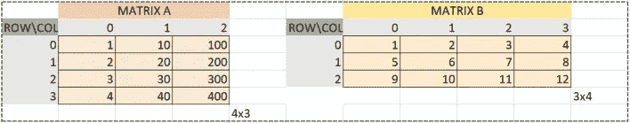

# 在 Excel 中做矩阵乘法的三种方法— fastai 第二部分，第八课

> 原文：<https://towardsdatascience.com/matrix-multiplication-part2-lesson8-34c9b77855c4?source=collection_archive---------26----------------------->

fastai“从基础开始”的第二部分终于出来了。我不记得上一次对 MOOC 这么兴奋是什么时候了。课程一对外发布，我就开始深入挖掘，加深对深度学习和底层概念的理解。

这次我决定听从杰里米和雷切尔的建议，写博客。这篇特别的文章解释了杰里米在第八课中实现的各种矩阵乘法方法。我将使用**微软 Excel** 进行说明。

所以让我们开始吧！

## 矩阵乘法

了解 Jeremy 提到的矩阵乘法的一个很好的互动场所是:


[matrixmultiplication.xyz](http://matrixmultiplication.xyz/)

从图中可以看出，我们对第二个矩阵进行转置，将元素相乘并相加，得到结果。例如，结果矩阵中的第一项`15`来自`1*2 + 6*2 + 1*1 = 2 + 12 + 1 = 15`。

虽然这种解释在视觉上令人愉悦，但以我的拙见，很难将其转换为代码。所以还是用 Excel，换一种方式理解矩阵乘法吧！

## EXCEL 中的矩阵乘法

考虑大小为`4x3`和`3x4`的两个矩阵 **A** 和 **B** 。
注意:在本文中，我将使用粗体符号 **A** 和 **B** 来指代矩阵。使用粗体符号引用向量和矩阵是常见的做法。



Matrices A and B

从我们之前看到的图像中，如果你还记得的话，我们对 **B** 进行了转置，并将 **A** 的行与 **B** 的列相乘，得到了结果矩阵。相反，这次让我们跳过转置这一步，直接将行和列相乘。

因此， **A** 的第 0 行与 **B** 的第 0 列逐元素相乘，得到的逐元素乘积相加得到结果矩阵 **C** 中位置`[0][0]`处的第一项。

下面是它在 Excel 中的样子:


C[0][0] = 1*1 + 10*5 + 100*9 = 1 + 50 + 900 = 951

类似地，我们通过将 **A** 的第 0 行和**b**的第 3 列逐元素相乘得到`C[0][3]`。在 excel 中，它看起来像:


C[0][3] = 1*4 + 10*8 + 100*12 = 4 + 80 + 1200 = 1284

最后我们按照同样的过程遍历 **C** 中的每个空盒子，得到最终结果。


C[3][3] = 4*4 + 40*8 + 400*12 = 16 + 320 + 4800 = 5136

我们走吧！我们就是这么做矩阵乘法的！那很容易，不是吗？我们现在不仅理解了矩阵乘法，而且还在 Excel 中实现了它！多酷啊。

我个人认为现在你已经准备好处理一些与矩阵乘法相关的规则了(或者简而言之 **MatMul** ):

1.  设`ar,ac`为 **A.** 中的行数和列数，同样，设`br, bc`为 **B.** 中的行数和列数，那么为了执行矩阵乘法，需要`ac == br`。为什么？嗯，正如你在 excel 中看到的，我们将行和列元素相乘，然后将中间乘积相加，得到最终结果。如果维数不匹配，并且一个向量比另一个向量长，我们就不能再进行元素乘法了！
2.  生成的矩阵的维数将总是`ar,bc`。即行数来自 **A** ，列数来自 **B.**

## 方法 1:使用 3 进行循环

这里有另一个免责声明，在 Excel 中实现矩阵乘法时，我们不仅理解了它，而且还复制了 Jeremy 的第一个使用 3 进行循环的方法。下面是它在代码中的样子:

```
def matmul1(a,b):
    ar,ac = a.shape
    br,bc = b.shape
    assert ac==br
    c = torch.zeros(ar, bc)
    for i in range(ar):
        for j in range(bc):
            for k in range(ac): #or br
                c[i,j] += a[i,k]*b[k,j]
    return c
```

希望你现在能更好地理解它。如果没有，这将是一个很好的时机，可以停下来试验一下代码，看看到底发生了什么。我保证，和我们 Excel 版本一样！

好吧，我假设你花了一些时间思考代码，那么，让我们来讨论一下吧！

*   为什么前两个循环在`range(ar)` 和`range(bc)`？嗯，正如你在**规则 2** 中所记得的，我们得到的矩阵将会有维度`ar,bc`。从 Excel 中我们看到，我们逐个遍历了 **C** 的每个元素，因此，要遍历`ar`行和`bc`列，我们需要 2 个用于`range(ar)` 和`range(bc)`中的循环。
*   那么，为什么第三个 FOR 循环在`range(ac) #or br`里呢？从**规则-1** 中，我们知道`ac==br`，所以我们是否将`range(ac)`或`range(br)`放在第三个循环中并不重要。本质上，这是单个元素相乘并相加的地方。根据我们之前的 Excel 示例，对于`C[0][0]`，这是步骤`C[0][0] = 1*1 + 10*5 + 100*9 = 1 + 50 + 900 = 951`发生的地方，最后我们将继续下一个框。相乘并相加的项数等于`ac or br`。

真的是这样！这是给你的方法 1！这里有一首记住矩阵乘法的歌。(这个我最早是从 fast.ai 上了解到的，原作者不详)


希望现在你已经明白两个矩阵是如何相乘的了。如果没有，这里的[是可汗学院的另一个教程。](https://www.khanacademy.org/math/precalculus/precalc-matrices/multiplying-matrices-by-matrices/v/matrix-multiplication-intro)

## 方法 2:使用逐元素乘法

所以到目前为止，我们一直在解析结果矩阵 **C 中的每个位置，**寻找单个元素的乘积，然后将它们求和。如果你记得的话，类似于，`C[0][0] = 1*1 + 10*5 + 100*9 = 1 + 50 + 900 = 951`。当然，肯定有别的办法吧？如果我们不做单个乘积，然后求和，而是一次将向量相乘，得到一个结果向量，然后将结果向量求和，得到最终元素，会怎么样？

```
m = tensor([1, 2, 3])
n = tensor([10, 10, 10])
m*n>>tensor([10, 20, 30])
```

到目前为止，我们一直在寻找单个产品`10, 20, 30`并将它们组合在一起`10 + 20 + 30 = 60`。但是，真的，所有这些都可以替换为:

```
m = tensor([1, 2, 3])
n = tensor([10, 10, 10])
(m*n).sum()>>tensor(60)
```

如果您还记得的话，在`range(ac) #or br`中最里面的循环是找到单个产品并添加它们。好吧，我们可以替换这个循环来执行向量元素方式的乘积，并在最后放一个`.sum()`，PyTorch/NumPy 有能力为我们执行元素方式的运算！

下面是它在 excel 中的样子:


C[0][0] = sum(A[row 0] * B[col 0])

类似地，我们通过将 **A** 的第 0 行的向量与 **B** 的第 3 列的向量相乘，并将结果向量相加，得到`C[0][3]`。


C[0][3] = sum(A[row 0] * B[col 3])

最后我们按照同样的过程遍历 **C** 中的每个空盒子，得到最终结果。


C[3][3] = sum(A[row 3] * B[col 3])

注意这和**方法-1** 有什么不同吗？这一次，我们只是说，要想出类拔萃或 PyTorch，请将 **A** 的第 0 行与 **B** 的第 0 列相乘，并对结果向量求和，得到答案。而不是做`1*1 + 10*5 + 100*9`。例如:对于`C[0][0]`，该方法将 **A** `tensor([1,10,100])`第 0 行的矢量与 **B** `tensor{[1,5,9])`第 0 列的矢量相乘，得到中间积矢量`tensor([1,50,900])`，并求和得到`C[0][0]`位置的结果为`tensor(951)`。

在代码中，它看起来像:

```
def matmul2(a,b):
    ar,ac = a.shape
    br,bc = b.shape
    assert ac==br
    c = torch.zeros(ar,bc)
    for i in range(ar):
        for j in range(bc):
            c[i,j] = (a[i,:]*b[:,j]).sum()
    return c
```

因此，我们只需使用两个 FOR 循环来解析 **C、**的每个位置，并在该位置输入相应的结果。如果`i,j`代表 **C** 中的行和列位置，这看起来像..

```
i:0,j:0
a:tensor([  1,  10, 100]),b:tensor([1, 5, 9])
tensor([[951.,   0.,   0.,   0.],
        [  0.,   0.,   0.,   0.],
        [  0.,   0.,   0.,   0.],
        [  0.,   0.,   0.,   0.]])
---
i:0,j:1
a:tensor([  1,  10, 100]),b:tensor([ 2,  6, 10])
tensor([[ 951., 1062.,    0.,    0.],
        [   0.,    0.,    0.,    0.],
        [   0.,    0.,    0.,    0.],
        [   0.,    0.,    0.,    0.]])
---
i:0,j:2
a:tensor([  1,  10, 100]),b:tensor([ 3,  7, 11])
tensor([[ 951., 1062., 1173.,    0.],
        [   0.,    0.,    0.,    0.],
        [   0.,    0.,    0.,    0.],
        [   0.,    0.,    0.,    0.]])
---
i:0,j:3
a:tensor([  1,  10, 100]),b:tensor([ 4,  8, 12])
tensor([[ 951., 1062., 1173., 1284.],
        [   0.,    0.,    0.,    0.],
        [   0.,    0.,    0.,    0.],
        [   0.,    0.,    0.,    0.]])
---
i:1,j:0
a:tensor([  2,  20, 200]),b:tensor([1, 5, 9])
tensor([[ 951., 1062., 1173., 1284.],
        [1902.,    0.,    0.,    0.],
        [   0.,    0.,    0.,    0.],
        [   0.,    0.,    0.,    0.]])
```

等等..直到我们得到完整的矩阵 **C** 。

```
tensor([[ 951., 1062., 1173., 1284.],
        [1902., 2124., 2346., 2568.],
        [2853., 3186., 3519., 3852.],
        [3804., 4248., 4692., 5136.]])
```

## 方法-3:广播

注意到一个共同的主题了吗？每次都要将每一行 **A** 与每一列 **B** 相乘，得到 **C** 。你注意到重复了吗？我们正在将 **A** `bc`中同一行的向量乘以！我们重复这个过程`ar`次！

有没有办法将 **A** 的行向量与 **B** 的所有列相乘，得到 **C 中的相应行？**是的，有！进入广播……
注意:我不会解释广播，杰里米在这里做得很好。

相反，让我们看看这段神奇的代码

```
for i in range(ar):
        c[i] = (a[i,:].unsqueeze(-1).expand_as(b)*b).sum(dim=0)
```

像往常一样，让我们在 Excel 中复制！这会让事情变得非常简单。让我们分步骤做吧。

**步骤-1)** 选择第一行的 **A** `a[i,:]`。我们选择第 0 行作为示例。


Select row 0 of **A**

**步骤-2)** 取其**转置** `a[i,:].unsqueeze(-1)`


Take transpose of row 0 of A

**步骤-3)** 将柱矩阵展开为 **B** `a[i,:].unsqueeze(-1).expand_as(b)`


Expand column matrix as B

**步骤-4)** 元素乘以 **B** `a[i,:].unsqueeze(-1).expand_as(b)*b`


Element wise multiply with B

**步骤-5)** 沿行求和，得到 C 的第 0 行


Sum along side row dimension to get row 0 of C

每排**一个**的完整广播过程看起来像这样:


Broadcasting as a whole

我希望现在你能收到**的广播**！那么，让我们看看它在代码中是什么样子的..

```
def matmul3(a,b):
    ar,ac = a.shape
    br,bc = b.shape
    assert ac==br
    c = torch.zeros(ar,bc)
    for i in range(ar):
        c[i] = (a[i,:].unsqueeze(-1).expand_as(b)*b).sum(dim=0)
        print(f"i:{i}")
        print(c)
    return c
```

输出如下所示:

```
i:0
tensor([[ 951., 1062., 1173., 1284.],
        [   0.,    0.,    0.,    0.],
        [   0.,    0.,    0.,    0.],
        [   0.,    0.,    0.,    0.]])
i:1
tensor([[ 951., 1062., 1173., 1284.],
        [1902., 2124., 2346., 2568.],
        [   0.,    0.,    0.,    0.],
        [   0.,    0.,    0.,    0.]])
i:2
tensor([[ 951., 1062., 1173., 1284.],
        [1902., 2124., 2346., 2568.],
        [2853., 3186., 3519., 3852.],
        [   0.,    0.,    0.,    0.]])
i:3
tensor([[ 951., 1062., 1173., 1284.],
        [1902., 2124., 2346., 2568.],
        [2853., 3186., 3519., 3852.],
        [3804., 4248., 4692., 5136.]])
```

这正是我们所期望的，并且与我们的 **Excel 版本**相同！

仅此而已！我们已经成功地介绍了包括广播在内的三种矩阵乘法方法。

**Google sheet 上图可以在** [**这里找到**](https://docs.google.com/spreadsheets/d/1gIhBBtDWwif1wLueY4gx1ybPfNluDJqUETy8KcqX-vE/edit?usp=sharing) 。感谢阅读！如果您有任何问题，请随时拨打[https://linkedin.com/in/aroraaman/](https://linkedin.com/in/aroraaman/)联系我。