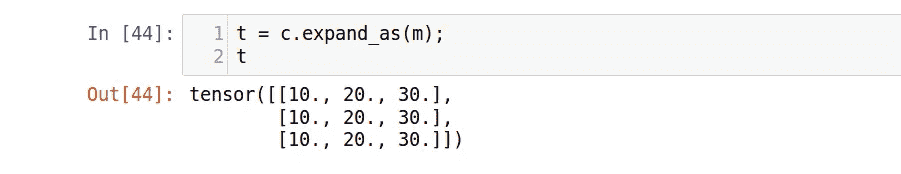

# 加速矩阵乘法

> 原文：<https://towardsdatascience.com/matrix-multiplication-the-pytorch-way-c0ad724402ed?source=collection_archive---------12----------------------->

让我们用 Python 写一个矩阵乘法的函数。

我们首先找到两个矩阵的形状，并检查它们是否可以相乘。(matrix_1 的列数应该等于 matrix_2 的行数)。

然后我们写 3 个循环来逐元素地乘矩阵。最终矩阵的形状将是(矩阵 _1 的行数)乘以(矩阵 _2 的列数)。

现在让我们创建一个基本的神经网络，我们将使用这个函数。

在本文中，我们将使用 MNIST 数据集进行演示。它包含 50，000 个手写数字样本。这些数字本来就是 28*28 的矩阵(或者拆包后一个线性向量中的 784 个值)。

因此，我们的神经网络将 784 个值作为输入，并将 10 个类作为输出。

现在让我们从 MNIST 验证集中提取 5 个元素，并在这个模型中运行它们。

我们看到，对于仅仅 5 个元素，我们花费了`650 milliseconds`来执行矩阵乘法。这个比较慢。让我们试着加快速度。

## 为什么速度很重要？

矩阵乘法构成了神经网络的基础。训练神经网络时，大多数操作都需要某种形式的矩阵乘法。因此，做得好、做得快真的很重要。

source: fast.ai course: Deep learning from the foundations

我们将通过消除循环并用 PyTorch 函数代替它们来加速矩阵乘法。这将给我们 C 速度(PyTorch 之下)而不是 Python 速度。让我们看看它是如何工作的。

## 消除最里面的循环

我们从消除最里面的循环开始。消除这种循环背后的想法是，我们可以一次对一行(或一列)进行操作，而不是一次对一个元素进行操作。看看下面的图片。

我们有两个张量，我们想把它们的元素加在一起。我们可以写一个循环来实现，或者我们可以使用 PyTorch 的 ***elementwise 操作*** (直接 a + b)来实现。

用同样的想法，我们将消除最里面的循环

我们直接做

我们的函数现在看起来如下:

运行大约需要`1.55 milliseconds`，这是一个巨大的改进！

如果您不熟悉索引语法，`a[i,:]`意味着选择`ith`行和所有列，而`b[:,j]`意味着选择所有行和`jth`列。

我们可以编写一个小测试来确认我们更新后的函数给出的输出与原始函数相同。

确实如此。

## 消除第二个循环

我们现在可以继续消除第二个循环。这是最激动人心的部分，因为这一次，我们将从这里开始

去做

为此，我们需要了解一些被称为 ***的广播*** 。

## 广播

假设您想要从数据集中的每个数据点减去平均值。同样，你可以写一个循环来这样做，或者你可以利用广播。

在广播中，我们取较小的张量，并通过较大的张量进行广播，使它们具有可比较的形状。一旦它们有了可比较的形状，我们就可以对它们执行 ***元素运算*** 。让我们看另一个例子。

你看到那里发生了什么吗？张量 **c** 被广播，因此它的行数与 **m 的行数相同。**我们可以通过`expand_as()`函数找到广播后张量的样子。

这是最精彩的部分。PyTorch 实际上并不复制值。它只是假装这样做。我们来看看`t`的收纳和造型

张量 **t** 仍然只存储为[10，20，30],但是它知道它的形状应该是 3*3。这使得广播内存高效。

使用广播，我们将广播 matrix_1 的第一行，并用 matrix_2 的整体进行操作。我们的函数现在看起来如下:

而且只需要`402 micro seconds`跑！

这是我们能以灵活的方式做的最好的事情。如果你想做得更好，你可以用 ***爱因斯坦求和*** 来做。

但是最快的方法是使用 PyTorch 的`matmul`功能。

它之所以这么快是因为它在底层也使用汇编语言代码。

这就是本文的全部内容。

如果你想了解更多关于深度学习的知识，你可以看看我下面的深度学习系列。

 [## 深度学习系列

### 我所有关于深度学习的文章的系统列表

medium.com](https://medium.com/@dipam44/deep-learning-series-30ad108fbe2b) 

## **参考**:

从基础开始深度学习:fastai 。