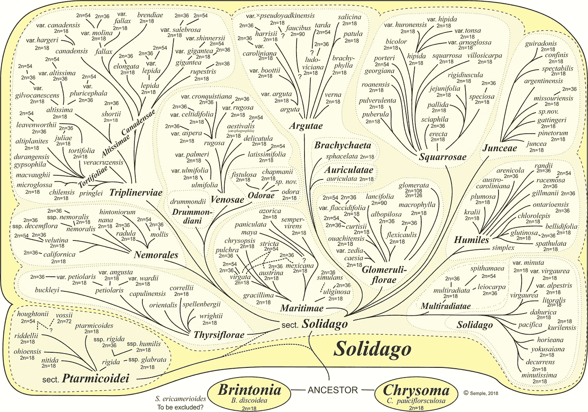
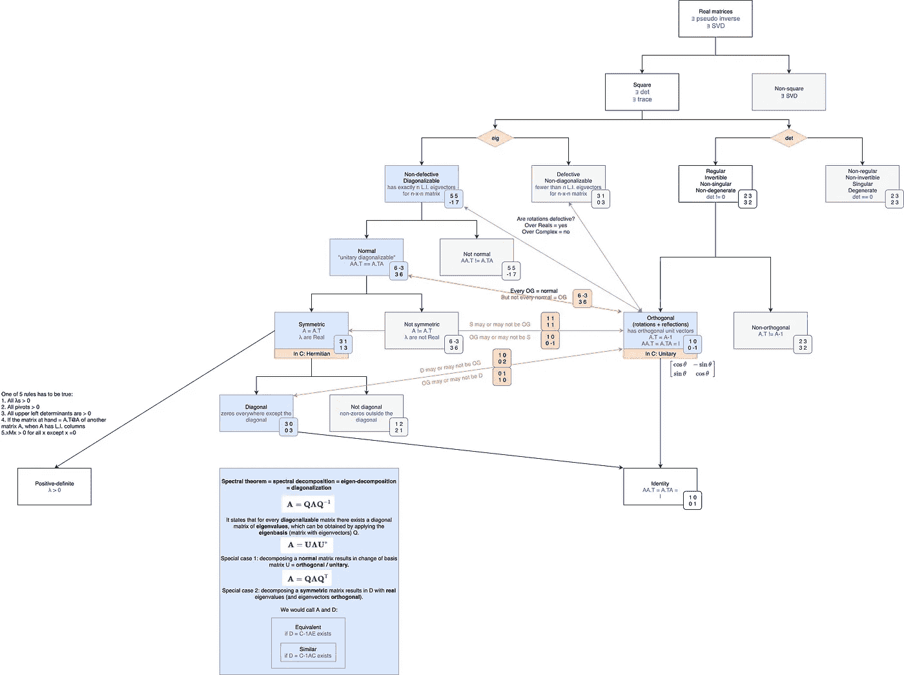
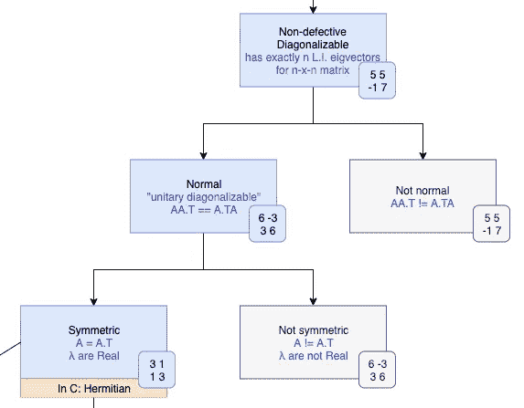
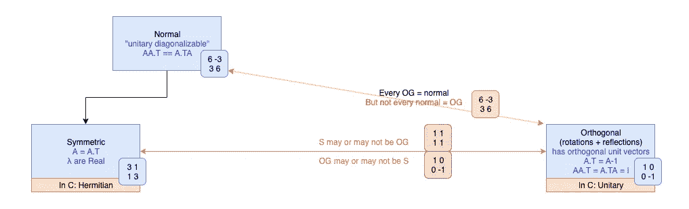
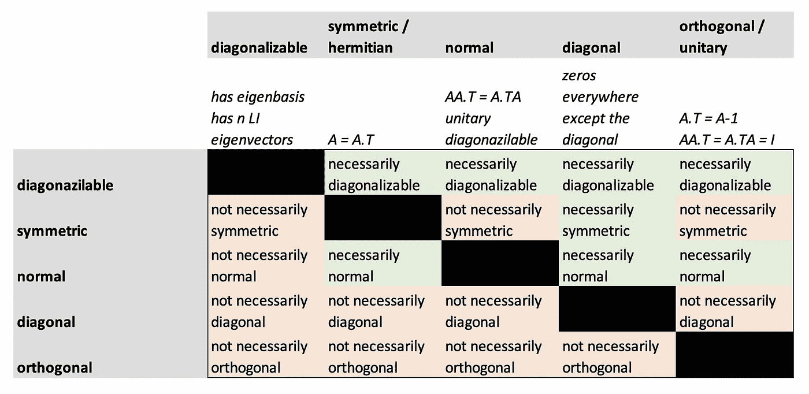

# 机器学习的矩阵发展

> 原文：<https://towardsdatascience.com/matrix-phylogeny-for-machine-learning-7a9e65b8f8aa?source=collection_archive---------28----------------------->

## 线性代数术语，可视化

[Source.](https://uwaterloo.ca/astereae-lab/research/goldenrods/intuitive-phylogeny-solidago-0)

如果你像我一样，你用图片思考，而不是文字。

在我自学数学的时候，我不断被各种线性代数术语轰炸:*对称*矩阵这个，*正常*矩阵那个，*正规*矩阵这个和那个。

在某个时候，我屈服了，做了我在这个世界上最喜欢的事情——制作了一个所有事情如何组合在一起的图表:)我将把它贴在这里，以防其他人需要帮助消除歧义，并且是像我一样的视觉人。

事不宜迟，我们开始吧:

Right click and “save image as” to download.

# 自述文件

这张图应该从上到下阅读。我真的建造了它，主要是正方形矩阵。

我做的第一个也是最关键的一个分离是，我根据 a)它们的特征值/向量(“eig”)和 b)它们的行列式行为(“det”)将矩阵分成两种类型。这给了我们两个独立的分支去探索(分别是左和右)。

方框之间的黑色(垂直)箭头表示遗传关系。任何盒子*必然*是其正上方盒子的子类型，并且*必然*继承其父的任何属性。例如，每个正规矩阵必然可对角化，每个对称矩阵必然正规。这也意味着每个对称矩阵都有 *n* 个线性无关(L.I .)特征向量(继承自可对角化矩阵)和与其共轭转置矩阵交换(继承自正常矩阵)。

彩色(非垂直)箭头填充矩阵类型的关系间隙，否则矩阵类型不会位于另一个矩阵类型之下。例如，因为正交矩阵位于不同的分支，比如说正常和对称，所以仅跟随黑色垂直箭头不足以理解它们之间的关系。所有正规矩阵都是正交的吗？正交矩阵都是正规的吗？

我没有费心去填写每一段可能的关系，只是那些感觉重要的。顺便说一下，如果你更喜欢表格，这是我在画箭头之前填写的表格:

(matrices on top defined *through matrices on the left)*

接下来，颜色。方框内的蓝色文字是我能为每种矩阵类型找到的最好/最简洁的定义。有时，我还用蓝色包含了有用的知识属性，例如“λ是实数”(特征值是实数)或“∃奇异值分解”(存在一个对角形式，可以通过[奇异值分解](https://en.wikipedia.org/wiki/Singular_value_decomposition)到达)。

方框颜色:

*   灰色方框=终端和不太有趣的方框。
*   蓝框=通过光谱定理连接(见图表底部)。
*   橙色细框=复杂等价物(该图是关于真实矩阵的，但我忍不住包括了一些流行的复杂版本)。
*   白盒=正常，不属于以上。

箭头颜色:

*   红色=双向“不一定”关系
*   橙色=单向“不一定”关系
*   绿色=旋转矩阵既有缺陷又无缺陷的特殊情况(分别在实数和复数上)

最后几件事:

*   右下角的数字代表每种类型的示例矩阵。
*   我在底部加入了谱定理，并列出它是如何根据 A =恰好可对角化、正常还是对称而变化的。这应该是不言自明的。
*   我还包括了正定矩阵的 5 个规则(从吉尔伯特·斯特朗令人敬畏的 YT 讲座[这里](https://www.youtube.com/watch?v=ojUQk_GNQbQ)偷来的)，因为为什么不呢。

# 活文档

这张图已经尽我所能的完整了，但是我确信我遗漏了一些东西(甚至可能弄错了一些东西🤭🤭🤭).

把这当作一个活的文档——如果你在下面评论任何想法/修正，我会添加修改并更新帖子。

快乐学习！

*大声喊出来* [*机器学习的数学*](https://mml-book.github.io/)*——如果你对 ML 背后的数学比 MOOCs 通常进入的更详细，这是一个惊人的自学资源。完全公开:我从那里偷了树的总布局:)*