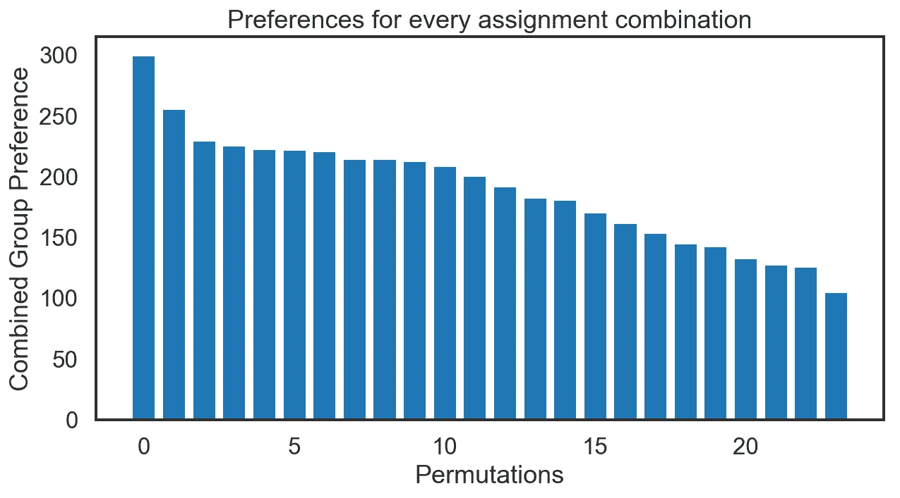

# 使用匈牙利最优分配算法最大化白象中的群体幸福

> 原文：<https://towardsdatascience.com/maximizing-group-happiness-in-white-elephants-using-the-hungarian-optimal-assignment-algorithm-17be4f112746?source=collection_archive---------24----------------------->

## 了解带有 Python 示例代码的匈牙利(Munkres)最优分配算法，以最大化群体优先于个人的偏好。


It’s July so we can talk about Christmas, right? Photo by [Kira auf der Heide](https://unsplash.com/@kadh?utm_source=medium&utm_medium=referral) on [Unsplash](https://unsplash.com?utm_source=medium&utm_medium=referral)

如果你曾在圣诞节前后参加过一次“白象”活动，你可能会感到焦虑，因为你最终得到了一份你不想要的礼物。问题是，有些人带着他们真正喜欢的礼物回家，而有些人可能带着他们不想要的礼物回家，即使这些礼物对其他人来说可能更有价值！在经历了几个累赘之后，我不得不考虑是否有一个更好的方式来分配礼物，以便最大化群体的*满意度，而不是少数幸运儿的满意度。也就是说，你可能得不到你的首选礼物，但是*团队作为一个整体*会更开心，这样下一年就会有另一个累赘。毫不奇怪，有一个有效的图论算法设计来解决这个问题。*

让我们考虑一个简单的场景，其中四个玩家(Alex、Brad、Chloe 和 Daisy)正在参与一个白象。按顺序打开礼物后，每个人都觉得礼物的分配不是很理想。他们觉得如果他们知道每个人有多喜欢每份礼物，他们就可以重新分配礼物，以确保整个团队在一段时间内最满意。为此，每个人都要写下自己对每件礼物的喜爱程度，分数范围是 1-100，100 是最喜欢的，结果可能是这样的:

```
╔════════════╦══════╦══════╦══════╗══════╗
║ Person\Gift║ Apron║ Beer ║Candle║ Dart ║
╠════════════╬══════╬══════╬══════╣══════╣
║   Alex     ║ 100  ║ 20   ║ 13   ║ 41   ║
║   Brad     ║ 14   ║ 100  ║ 21   ║ 99   ║
║   Chloe    ║ 31   ║ 43   ║ 100  ║ 21   ║
║   Daisy    ║ 52   ║ 50   ║ 41   ║ 100  ║
╚════════════╩══════╩══════╩══════╝══════╝
```

在这种情况下，很明显亚历克斯喜欢围裙，布拉德喜欢啤酒，克洛伊喜欢蜡烛，黛西喜欢飞镖。通过如此分配礼物，该组的总快乐(喜好偏好)最大化到 400。然而，让我们考虑一个更复杂的场景，其中人们最喜欢的项目重叠:

```
╔════════════╦══════╦══════╦══════╗══════╗
║ Person\Gift║ Apron║ Beer ║Candle║ Dart ║
╠════════════╬══════╬══════╬══════╣══════╣
║   Alex     ║ 99   ║ 99   ║ 13   ║ 41   ║
║   Brad     ║ 14   ║ 99   ║ 21   ║ 11   ║
║   Chloe    ║ 31   ║ 95   ║ 21   ║ 51   ║
║   Daisy    ║ 52   ║ 50   ║ 51   ║ 11   ║
╚════════════╩══════╩══════╩══════╝══════╝
```

在这种(可能)更现实的情况下，最大化群体幸福的最佳任务应该是什么并不那么直观。亚历克斯、布拉德和克洛伊都喜欢啤酒，但不清楚谁应该喝啤酒，以最大限度地提高群体偏好，而不是只有一个人？我们可以通过置换当前分配的所有可能组合并搜索哪个组合提供组的最高偏好值来以强力方式解决这个问题。

这是上面代码的输出。我们得到行和列的索引，使组的偏好最大化到 300。指数表明亚历克斯应该有围裙，布拉德啤酒，克洛伊飞镖，黛西蜡烛。

```
>> 
Total preference: 300
Row: [0, 1, 2, 3] Col: (0, 1, 3, 2)
```



上图显示了所有组合的首选项。上面的暴力代码在人少的时候运行得很快，但是它的伸缩性很差，求解时间为 O(N！)。当我们以 10 个人和 10 件物品的团队规模运行模拟时，我们可以计时可能需要多长时间。

```
>>
Total preference: 8.555711154285648
Row: [0, 1, 2, 3, 4, 5, 6, 7, 8, 9] Col: (7, 3, 0, 8, 5, 2, 6, 4, 9, 1)
1 loop, best of 3: 37.2 s per loop
```

在我的 Macbook Pro 上，这花了 37.3 秒，非常慢。它所花费的时间呈指数增长，所以想象一下，如果你试图为一个 20 人的大白象解决这个问题，需要多长时间！。

幸运的是，这个问题在几十年前就已经解决了，被称为[匈牙利算法](https://en.wikipedia.org/wiki/Hungarian_algorithm)。它也被称为 Munkres 算法，第一个解决方案实际上可以追溯到 19 世纪 90 年代。匈牙利算法在 *O(N⁴)* 多项式时间内解决问题，甚至下降到 *O(N)。*这个算法是在 Scipy 包中实现的[，但是它解决的是*最小化*一个成本矩阵，而不是像我们的场景那样最大化一个值。虽然我们可以简单地对成本矩阵求逆(乘-1)，但这里有一个稍加修改的版本，以便于选择是否求解偏好最大化。让我们看看使用这个函数需要多长时间。](https://github.com/scipy/scipy/blob/v0.18.1/scipy/optimize/_hungarian.py)

```
>>
Total preference: 8.555711154285648
Row: [0 1 2 3 4 5 6 7 8 9] Col: [7 3 0 8 5 2 6 4 9 1]
100 loops, best of 3: 2.74 ms per loop
```

与运行蛮力方法所需的 37.3 秒相比，匈牙利算法实现在不到 3 毫秒的时间内解决了问题！让我们看看引擎盖下，了解发生了什么事。


Under the hood. Photo by [Erik Mclean](https://unsplash.com/@introspectivedsgn?utm_source=medium&utm_medium=referral) on [Unsplash](https://unsplash.com?utm_source=medium&utm_medium=referral)

上面的代码实现基于 Bob Pilgrim 的[描述，该描述将该方法分为 6 个步骤。然而，该算法的要点可以用以下 5 个步骤来解释。](http://csclab.murraystate.edu/~bob.pilgrim/445/munkres.html)

第一步:遍历每一行，从该行的所有项目中减去最大值项目。这将使每行中最大的项目等于 0。

第二步:检查每一列，从该列的所有项目中减去最大值项目。这也将使列中最大的项目等于 0。

第三步:画出穿过所有 0 的最少的线。

第四步:如果在 *n* x *n* 矩阵中画出了 *n* 条线，则有可能进行最优分配，算法结束。如果行数小于 *n* ，则转到步骤 5。

第五步:找到没有被任何行覆盖的最大条目，从没有被划掉的每一行中减去这个条目，并把它加到被划掉的每一列中。回到步骤 3。

让我们用我们的示例矩阵来逐步实现这一点。

```
╔════════════╦══════╦══════╦══════╗══════╗
║ Person\Gift║ Apron║ Beer ║Candle║ Dart ║
╠════════════╬══════╬══════╬══════╣══════╣
║   Alex     ║ 99   ║ 99   ║ 13   ║ 41   ║
║   Brad     ║ 14   ║ 99   ║ 21   ║ 11   ║
║   Chloe    ║ 31   ║ 95   ║ 21   ║ 51   ║
║   Daisy    ║ 52   ║ 50   ║ 51   ║ 11   ║
╚════════════╩══════╩══════╩══════╝══════╝
```

步骤 1:从每一行中减去每一行的最大值(99，99，95，52)。

```
╔════════════╦══════╦══════╦══════╗══════╗
║ Person\Gift║ Apron║ Beer ║Candle║ Dart ║
╠════════════╬══════╬══════╬══════╣══════╣
║   Alex     ║ 0    ║ 0    ║ -86  ║ -58  ║
║   Brad     ║ -85  ║ 0    ║ -78  ║ -88  ║
║   Chloe    ║ -64  ║ 0    ║ -74  ║ -44  ║
║   Daisy    ║ 0    ║ -2   ║ -1   ║ -41  ║
╚════════════╩══════╩══════╩══════╝══════╝
```

步骤 2:从每列中减去每列的最大值(0，0，-1，-41)。

```
╔════════════╦══════╦══════╦══════╗══════╗
║ Person\Gift║ Apron║ Beer ║Candle║ Dart ║
╠════════════╬══════╬══════╬══════╣══════╣
║   Alex     ║ 0    ║ 0    ║ -85  ║ -17  ║
║   Brad     ║ -85  ║ 0    ║ -77  ║ -47  ║
║   Chloe    ║ -64  ║ 0    ║ -73  ║ -3   ║
║   Daisy    ║ 0    ║ -2   ║ 0    ║ 0    ║
╚════════════╩══════╩══════╩══════╝══════╝
```

第三步:用最少的行数划掉 0(x 表示划掉)。

```
_______________x      x
╔════════════╦══════╦══════╦══════╗══════╗
║ Person\Gift║ Apron║ Beer ║Candle║ Dart ║
╠════════════╬══════╬══════╬══════╣══════╣
║   Alex     ║ 0    ║ 0    ║ -85  ║ -17  ║
║   Brad     ║ -85  ║ 0    ║ -77  ║ -47  ║
║   Chloe    ║ -64  ║ 0    ║ -73  ║ -3   ║
║   Daisy    ║ 0    ║ -2   ║ 0    ║ 0    ║x
╚════════════╩══════╩══════╩══════╝══════╝
```

第四步:在未覆盖的项目中找出最大值(-3 at Chloe，Dart)，从所有未覆盖的项目中减去它(Alex:Chloe，Candle:Dart)。然后我们把这个值加到线的交点上(雏菊，围裙:啤酒)。返回步骤 3，测试最优分配。

```
_______________x      x
╔════════════╦══════╦══════╦══════╗══════╗
║ Person\Gift║ Apron║ Beer ║Candle║ Dart ║
╠════════════╬══════╬══════╬══════╣══════╣
║   Alex     ║ 0    ║ 0    ║ -82  ║ -14  ║
║   Brad     ║ -85  ║ 0    ║ -74  ║ -44  ║
║   Chloe    ║ -64  ║ 0    ║ -70  ║ 0    ║
║   Daisy    ║ -3   ║ -5   ║ 0    ║ 0    ║x
╚════════════╩══════╩══════╩══════╝══════╝
```

我们回到步骤 3，测试最优分配。

```
_______________x      x     x       x
╔════════════╦══════╦══════╦══════╗══════╗
║ Person\Gift║ Apron║ Beer ║Candle║ Dart ║
╠════════════╬══════╬══════╬══════╣══════╣
║   Alex     ║ 0*   ║ 0    ║ -82  ║ -14  ║
║   Brad     ║ -85  ║ 0*   ║ -74  ║ -44  ║
║   Chloe    ║ -64  ║ 0    ║ -70  ║ 0*   ║
║   Daisy    ║ -3   ║ -5   ║ 0*   ║ 0    ║
╚════════════╩══════╩══════╩══════╝══════╝
```

我们完了！我们划掉了所有的零，最小的行数等于矩阵的形状。亚历克斯应该拿围裙，布拉德拿啤酒，克洛伊拿飞镖，黛西拿蜡烛。

这里有一个简短的视频，也很好地解释了这个过程

# 结论

在本教程中，我们看了如何解决一个最优分配问题，其中每个任务或项目必须与一个人匹配，以最大化总喜欢值。我们展示了使用所有组合来解决问题的暴力方法对于大规模的组来说是难以处理的，但是匈牙利算法可以在几分之一秒内解决它。

我希望这有所帮助，也希望今年冬天你会倾向于在你的白象上尝试一下。我可以看到它在给家庭成员或公司员工分配任务时也很有用。节日快乐！

# 请随意查看我关于统计和机器学习的其他帖子

[](/four-ways-to-quantify-synchrony-between-time-series-data-b99136c4a9c9) [## 量化时间序列数据之间同步性的四种方法

### 用于计算同步指标的样本代码和数据，包括皮尔逊相关、时滞交叉相关…

towardsdatascience.com](/four-ways-to-quantify-synchrony-between-time-series-data-b99136c4a9c9) [](/why-models-with-significant-variables-can-be-useless-predictors-3354722a4c05) [## 为什么有重要变量的模型可能是无用的预测器

### 统计模型中的重要变量不能保证预测性能

towardsdatascience.com](/why-models-with-significant-variables-can-be-useless-predictors-3354722a4c05) [](/chance-is-not-enough-evaluating-model-significance-with-permutations-e3b17de6ba04) [## 机会是不够的:用排列评估模型的重要性

### 当训练机器学习模型进行分类时，研究人员和数据科学家经常比较他们的模型…

towardsdatascience.com](/chance-is-not-enough-evaluating-model-significance-with-permutations-e3b17de6ba04) 

# 参考

 [## 匈牙利算法—维基百科

### 匈牙利方法是一种组合优化算法，在多项式时间内解决指派问题

en.wikipedia.org](https://en.wikipedia.org/wiki/Hungarian_algorithm) [](http://csclab.murraystate.edu/~bob.pilgrim/445/munkres.html) [## 蒙克雷斯

### 当选择每个赋值时，不考虑行和列。提出的问题是关于…

csclab.murraystate.edu](http://csclab.murraystate.edu/~bob.pilgrim/445/munkres.html) [](https://brilliant.org/wiki/hungarian-matching/) [## 匈牙利最大匹配算法|精彩的数学和科学维基

### 匈牙利匹配算法，也称为 Kuhn-Munkres 算法，是一种...

brilliant.org](https://brilliant.org/wiki/hungarian-matching/)