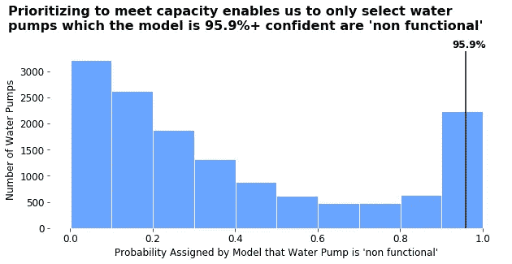
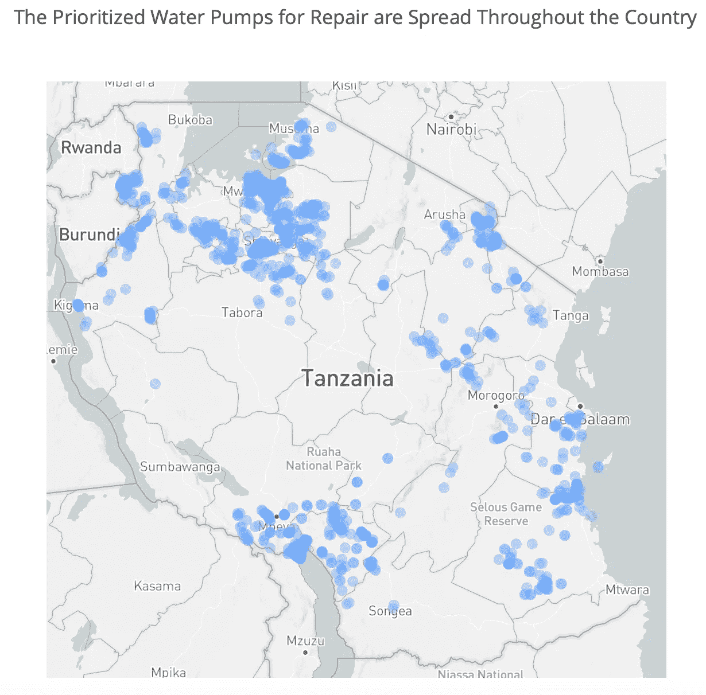

# 利用数据最大限度地利用稀缺的维护资源

> 原文：<https://towardsdatascience.com/maximizing-scarce-maintenance-resources-with-data-8f3491133050?source=collection_archive---------29----------------------->

政府和非政府组织面临的一个共同问题是如何将有限的资源发挥最大的作用。通常，这些组织必须在信息不完全透明的情况下做出决策。这篇文章展示了如何使用数据分析和建模来帮助组织在这种情况下最大化他们的资源。

为了将这些概念付诸实践，我们将使用以下场景:

> 坦桑尼亚的大部分人口依赖当地的水泵作为他们清洁水源的主要来源。不幸的是，这些水泵有时会坏掉——限制了清洁水的获取，直到水泵修好。坦桑尼亚农业部负责维护这个由数千台水泵组成的网络；然而，该部门几乎没有能力主动跟踪任何单个水泵的状态。 **部门主管要求我们帮助她确定下一年应该修理哪些油井的优先顺序。她估计她的部门每天最多可以部署五名员工，每人每天可以访问一个站点。**

好消息是，自 2002 年以来，该部门一直在记录他们在全国各地访问的每台水泵的数据(包括水泵是否正常工作)。这些数据使我们能够建立一个模型，该模型可用于预测水泵是否正常工作，是否正常工作但需要维护，或者是否正常工作。有了这个模型，我们可以开始帮助该部门在未来优先安排维护行程。为此，我们获得了描述约 14K 水泵位置的数据，该部门希望我们预测这些位置内的维护需求。

# 第 1 部分:构建预测模型

初始基线模型利用 RandomForest 估计值，在使用未用于建立模型的数据进行预测时，大约 70%的时间正确地将水泵分类为功能性/需要维修/非功能性。经过一些进一步的工作，模型的准确性增加到了大约 80%(如果您对模型构建过程感兴趣，模型背后的所有代码都可以在 Github 上找到[)。请注意，我们可以探索进一步改进我们的模型；然而，80%的准确率将足以解决这个问题(稍后将详细介绍)。](https://github.com/mbrady4/Maximizing-Scarce-Maintenance-Resources)

如下所示，我们的模型使用该部门提供的数据进行了以下预测:

此时，我们可以向部门报告，我们的模型已经识别出 4，774 台可能需要维修的水泵，并对自己的出色工作表示满意。对吗？我们可以这样做，但是部门可能会不太高兴…

如上所述，该部门每天只能修理 5 口井，假设 252 个工作日(美国时间表)，该部门在下一年只能修理 1260 台水泵。这意味着我们需要优先服务哪些泵。

# 第 2 部分:对我们的预测进行优先排序

鉴于我们无法维修我们的模型预测需要维修的所有水泵，我们应该优先维修我们的模型最有把握实际损坏的水泵。这样做相对来说是微不足道的，我们只需查看我们的模型分配给数据集中表示的每个水泵的“非功能性”概率。对这些概率进行排序，可以让我们确定 1260 个我们最有把握损坏的水泵。

这种方法将我们的关注点从最大化我们的模型的整体精度分数转移到一个称为 k 处的[精度的度量。这就是为什么我们的模型“足够好”,有 80%的精确度。考虑到我们有限的资源，我们真的只关心我们的模型对我们有能力修复的水泵的预测。因此，我们在 k 处测量的准确度，在这种情况下 k=1，260，大大高于我们的总体准确度分数。投入到将模型的准确性提高到 80%以上的努力将会被放错地方。](https://medium.com/@m_n_malaeb/recall-and-precision-at-k-for-recommender-systems-618483226c54)

有了我们的预测优先级，我们现在可以自信地向部门提交我们的建议。要做到这一点，我们可能应该将我们的优先预测可视化如下:

幸运的是，当我们即将把最后的演示文稿发送给印刷商时，一个想法悄悄潜入我们的脑海……'*我不想成为一个维护团队，开车走遍全国各地去访问这些分散的站点。也许还有其他因素需要考虑。*

# 第 3 部分:最大化影响

虽然准确性很重要，但在确定服务水泵的优先级时，我们可能还需要考虑许多其他因素。例如，考虑以下情况可能是有意义的:

*   **人口:**多少人被水泵影响？
*   **距离:**这个水泵离其他不工作的水泵有多近？

通过将这些指标与油井失效的预测概率相结合，我们可以得出每个水泵的“影响分数”。得出我们的影响分数的公式可能如下所示:

根据影响评分对水泵访问进行优先排序，这使我们建议该部门维修以下水泵:

此外，除了对部门的维护访问进行优先排序，我们还可以量化它们的潜在影响:

> *下一年对优先水泵的维修将* ***增加约 60 万人获得清洁水的机会***

最后一点，重要的是要考虑我们的影响评分可能会有偏差或产生意想不到的结果。例如，如上图所示，我们的影响得分公式明显偏向于水泵和人口密集的地区，这意味着偏远地区的人口更有可能得不到服务。优先井的变化如下图所示:

在现实世界中，这种意外后果可能需要我们调整影响评分公式，以更好地代表我们的意图。

# 结论

在这篇文章中，我们回答了几乎每个组织都面临的一个关键问题:我们如何部署稀缺资源以产生最大影响。在这个人为的例子中，我们考虑了如何对我们的模型所识别的机会进行优先级排序。此外，我们探讨了为什么最大化准确性本身可能不是正确的答案。为此，我们研究了如何将准确性之外的因素融入到优先推荐中。

我希望你喜欢这篇文章，我很乐意在推特上与你联系。如果你想深入这篇文章背后的代码，所有这些都可以在[的公共知识库](https://github.com/mbrady4/Maximizing-Scarce-Maintenance-Resources)中找到。

# 脚注

[1]该场景基于[驱动数据](https://www.drivendata.org/competitions/7/pump-it-up-data-mining-the-water-table/)描述的情况。分析使用由[驱动数据](https://www.drivendata.org/competitions/7/pump-it-up-data-mining-the-water-table/)提供的数据。

[2]每个地点的人口在 0，1 的范围内缩放，与预测的概率大小相同。

[3]根据经度和纬度，使用 KMeans 估计量，通过创建 5 个聚类来确定距离。这五个集群各自“代表”该部门维修水泵的一名可用工人。然后，从每个地点所属的质心的纬度和经度中减去该地点的纬度和经度。然后计算该位置坐标和质心坐标之间差值的绝对值的平均值。最后，该值在范围 0，1 内进行缩放，与预测概率的大小相同。