# 机器学习基础(二)

> 原文：<https://towardsdatascience.com/maximum-likelihood-estimation-984af2dcfcac?source=collection_archive---------6----------------------->

## 最大似然估计

这是我认为机器学习基础的一系列主题的第二部分。第一部分介绍了概率论，我们将在这篇文章中重点介绍它。如果您需要复习概率，请查看第一部分:

 [## 概率——机器学习的基础(第一部分)

### 机器学习所需的概率论概念概述

towardsdatascience.com](/probability-fundamentals-of-machine-learning-part-1-a156b4703e69) 

# 介绍

**最大似然估计** (MLE)是一种在给定一些观测数据的情况下估计模型参数的频率主义方法。使用 MLE 的一般方法是:

1.  观察一些数据。
2.  写下我们认为数据是如何产生的模型。
3.  将我们模型的参数设置为在给定数据的情况下最大化参数可能性的值。

我们将涵盖创建模型、理解似然性以及使用最大似然估计过程来拟合参数的基础知识。

# 模型

一个**模型**是我们对一些事件或过程的信念、假设和简化的正式表示。让我们看几个例子来阐明这个观点。

## 示例:抛硬币

我们想要建立一个投掷特定硬币的模型。我们知道些什么？

*   硬币有两面和一条边。
*   这些面有不同的设计。
*   硬币可以放在正面或边缘(见下图，硬币放在边缘)。
*   硬币的重量。
*   硬币的直径和厚度。

Photo by [Ryan Thomas Ang](https://unsplash.com/@ryanthomasang?utm_source=medium&utm_medium=referral) on [Unsplash](https://unsplash.com?utm_source=medium&utm_medium=referral)

我们可以做出什么样的假设？

*   不同的设计可能导致硬币的重心稍微偏向一边。
*   没有办法测量硬币翻转时受到的力或角度。

让我们先试着写下一个没有简化的模型:

*   硬币的初始位置来自伯努利分布。这代表脚蹼手更喜欢开始时硬币正面朝上，而不是正面朝下。
*   施加在硬币上的力是按指数分布的。
*   力施加的角度是从区间[-π，π]上的截尾正态分布画出的。
*   硬币的质心在一个以硬币中心为原点的系统中的某个坐标(x，y，z)上。
*   重力是…好了，我想你明白了。

现实世界可能很复杂。有时候，一个简化的模型可以做得一样好或者更好。让我们做一个简化的模型:

*   掷硬币的结果来自伯努利分布，正面概率为 *p* ，反面概率为(1- *p* )。

我们的简化模型只有一个参数！在第一部分中，我们了解到，我们可以通过简单地抛几次硬币并计算得到的人头数来估计这个参数。拟合复杂的模型需要更多的翻转和困难的计算。那么哪个模型是对的呢？我最喜欢引用乔治·博克斯的话:

> “所有的模型都是错的，但有些是有用的。”

有用性是设计模型时的关键指标。在这种情况下，我宁愿使用简化模型，尽管我知道它是错误的。我怎么知道这是错的？我给硬币边缘着地的概率赋值为 0。我从未在现实生活中见过这种情况，所以我做了一个简单的假设，认为这种情况不会发生。

## 示例:线性模型

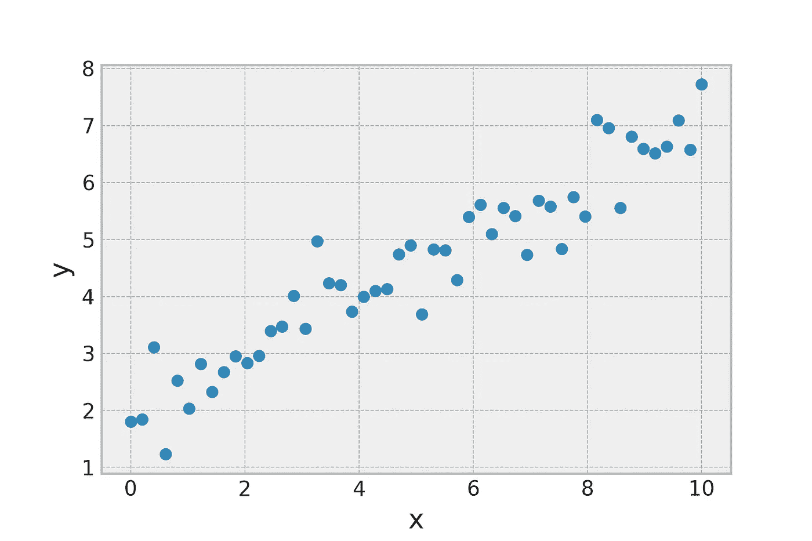

在本例中，我们将使用上图。我们希望建立一个数据模型，以便在给定 x 的情况下预测 y 的未来值。数据看起来几乎像一条线，所以让我们从它开始作为我们的模型。

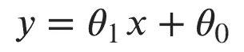

Equation of a line.

如果潜在的关系实际上是线性的，我们如何解释我们观察到的偏差？想象一下，我们正在使用一个传感器来收集这些数据。大多数传感器的测量都有一定的误差。类似地，我们可以认为与模型的偏差是由易出错的传感器引起的。通常将误差建模为均值为零、方差为σ的高斯分布。平均值为零会将误差平均分布在线的两侧。方差越大，偏差越大。让我们在模型中加入一个高斯噪声项。得到的模型有三个参数:高斯的斜率、截距和方差。

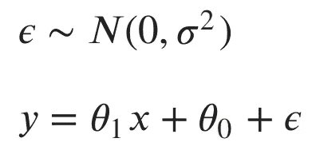

Linear model with Gaussian error.

# 可能性

在这两个例子中，我们根据一些参数写下了我们的模型。一般来说，我们可能有任意数量的参数，所以让我们将它们的整个集合称为 **θ** (theta)。我们怎么知道 **θ** 的值应该是多少？这就是**可能性**发挥作用的地方。在第一部分中，我们讨论了连续随机变量取特定值的可能性。我们从参数固定在某个值的分布的概率密度函数(PDF)中得到这种可能性。给定我们观察到的数据，让我们将可能性视为 **θ** 的函数，而不是固定参数。对于 PDF*f*(*x*|**θ**)的连续分布，似然函数变为:

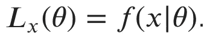

类似地，对于具有概率质量函数(PMF) P( *x* | **θ** )的离散分布，似然函数变为:

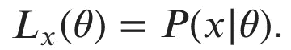

我们通常有不止一个数据点来为我们的决策提供信息。我们如何计算整个数据集合 X 的可能性？让我们看一下典型的情况，数据是独立同分布的( **iid** )。同分布意味着每个数据点来自具有相同参数的相同分布。第一部分介绍了独立性，这意味着对于任意两个数据点 *x* 和 *y* ，P( *x，y*)= P(*x*)P(*y*)。抛硬币是 iid 数据的一个很好的例子。每一次翻转都使用相同的硬币，并且翻转的结果与之前的翻转无关。对于 iid X，我们将似然函数重写为:

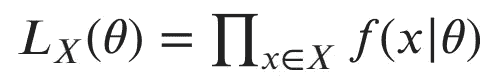

Likelihood is the product of probability density for each data point.

请注意似然函数中的乘积运算符。很多时候，个体可能性是非常小的数字。取小数字的乘积会产生更小的数字，计算机很难用有限的精度来表示这些数字。为了缓解这些数字问题(以及后面提到的其他便利)，我们经常使用似然函数的对数，恰当地命名为**对数似然**。为什么记录日志会有帮助？对数的乘积法则说 log(x⋅y) = log(x) + log(y)。所以取对数就把我们的乘积变成了总和！对数似然可以写成:

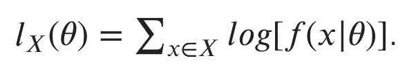

Log-likelihood is the sum over the log of the likelihood for each point.

对数也是单调的，这意味着更大的输入产生更大的输出。因此，对数似然函数的最大值将出现在与似然函数的最大值相同的位置。许多概率分布被写成指数形式或包含指数。对数和指数相互抵消，对数允许我们将指数转化为乘积。这两者都留给我们更简单的方程来最大化。

# 最大概似法

你可能已经把这些碎片拼在一起了，但是让我们再一次回顾我们的目标。我们可以根据概率分布为我们的数据写一个模型。接下来，我们可以在模型的参数上写下一个函数，该函数输出这些参数生成我们的数据的可能性(或对数可能性)。MLE 的目的是找到该函数的最大值，即最有可能产生观察数据的参数。

假设我们有一些从方差为 4 的高斯分布生成的数据，但是我们不知道平均值。我喜欢把最大似然法想象成取高斯，在所有可能的平均值上滑动，并选择使模型最适合数据的平均值。我在下面创建了这个过程的可视化，我们看到对数似然的最大值出现在平均值为 2 处。事实上，这是创建直方图的分布的真实平均值！

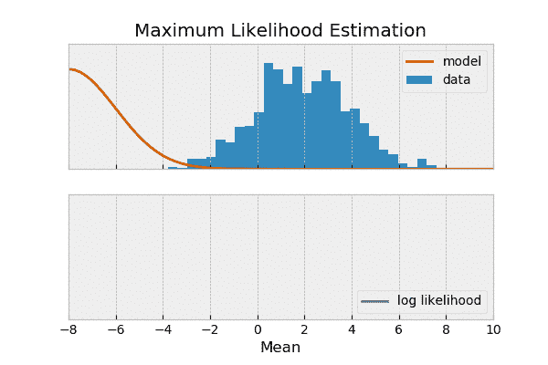

我们如何用数学方法来完成这个过程？如果你熟悉微积分，你会知道你可以通过求导并设置它等于 0 来找到一个函数的最大值。函数的导数代表原函数的变化率。如果你看上面的对数似然曲线，我们会发现最初它是正向变化的(向上移动)。它达到一个峰值，然后开始向负方向变化(向下移动)。关键是在峰值时，变化率为 0。因此，如果我们知道导数的函数形式，我们可以将它设为 0，并求解最佳参数。

# 抛硬币 MLE

让我们从之前的抛硬币模型中推导出 MLE 估计量。我将在以后关于线性回归的文章中讨论线性模型的 MLE 估计量。

回想一下，我们通过伯努利分布来模拟抛硬币的结果，其中参数 *p* 代表获得正面的概率。首先，让我们写下单次翻转的可能性函数:

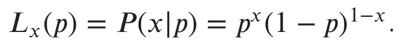

Likelihood function for Bernoulli distribution.

我已经用数学上方便的方式写出了伯努利分布的概率质量函数。花一秒钟自己验证一下，当 *x* =1(正面)时，概率是 *p* ，当 *x* =0(反面)时，概率是(1-p)。

现在，让我们假设我们看到下面的翻转序列:

X =正面，正面，反面，正面，反面，反面，反面，正面，反面，反面。

因为掷硬币是 iid 的，我们可以把看到一个特定序列的可能性写成每一次单独掷硬币的乘积:

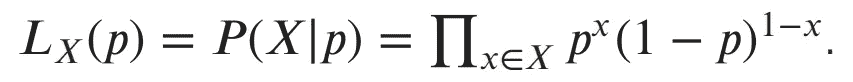

Likelihood of a sequence of flips.

插入我们的数据，我们得到:

*l*(*p*)=*p*⋅*p*⋅(1-*p*)⋅*p*⋅(1-*p*)⋅(1-*p*)⋅(1-*p*)⋅*p*⋅(1-*p【1*

注意，对于每个正面，我们得到一个因子 *p* ，对于每个反面，我们得到一个因子(1- *p* )。让我们把这个归纳为用 *h* 正面掷硬币:

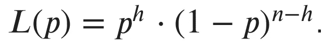

Likelihood for n coin flips with h heads.

我们想找到最大化这个函数的 *p* 。为了使我们的工作容易些，让我们把双方的情况都记录下来。这将降低指数，并将乘积转化为总和。求和的导数比求积更容易(对数似然的另一个便利之处)。记住，我们可以这样做，因为最大化对数似然的 *p* 与最大化似然的 *p* 是相同的。我们的对数可能性是:

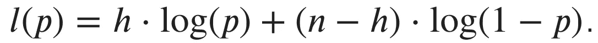

Log-likelihood of n coin flips with h heads.

为了找到最大值，我们要对这个函数相对于 *p* 求导。如果你对微积分不太熟悉，重要的是你知道导数是函数的变化率。在这种情况下，导数是:

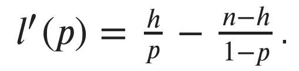

Derivative of the log-likelihood with respect to *p*.

我们将导数设置为 0，以找到函数的最大值(其中变化率为 0)。设上面的等式等于 0，求解 *p* (自己试试)给我们:

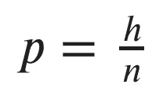

The MLE estimate of p is the number of heads divided by the number of flips!

事实证明，我们硬币的最大似然估计就是正面数除以翻转数！这非常直观，如果你掷一枚公平硬币( *p* = 0.5) 100 次，你会得到大约 50 个正面和 50 个反面。

# 结论

最大似然估计是一种将我们的模型与数据拟合的强大技术。MLE 提供的解决方案通常非常直观，但它们完全由数据驱动。这意味着，我们拥有的数据越多，我们的解决方案就越精确，反之亦然。在以后的文章中，我们将会看到包含我们先前对模型的信念的方法，这将在低数据情况下帮助我们。

准备好第三部分了吗？：

 [## 机器学习基础(三)

### 信息论

towardsdatascience.com](/fundamentals-of-machine-learning-part-3-b305933f00cd) 

下次见！