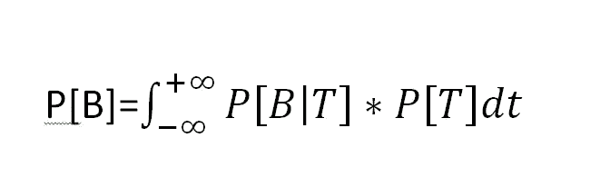

# 贝叶斯定理的最大似然估计

> 原文：<https://towardsdatascience.com/maximum-likelihood-estimation-from-bayes-theorem-6cc7f0db9adb?source=collection_archive---------13----------------------->

可能最流行和最简单的参数估计方法之一是最大似然估计，贝叶斯定理作为一个独立的天才，有许多应用。但是有没有可能把 ML(不是机器学习)看成是贝叶斯定理的一个应用呢？让我看看。

让我们用一个非常基本和简单的瓮和球选择问题来概括贝叶斯定理，这种问题是贝叶斯定理应用的第一个问题。问题陈述如下:

假设你有三个相同的罐子，里面装着相同的球。第一个瓮包含 3 个黑球和 3 个红球，第二个瓮包含 4 个黑球和 2 个红球，第三个瓮包含 1 个黑球和 5 个红球。蒙上眼睛，从三个瓮中随机选择一个，然后随机抽取一个球。让抽出的球是红色的球。那你一开始选的是哪个骨灰盒？

The setup of urn and balls

一个典型的贝叶斯定理问题。不是吗？让我们解决它。

设 A1、A2、A3 分别是选择第一、第二和第三 urn 的事件。设 B 是选择一个红球的事件。由于骨灰盒是相同的，其中一个是随机选择的，因此

P[A1]=P[A2]=P[A3] …(1)

因为只有这三个 urn，所以选择其中任何一个都是必然的，我们得到 P[A1]+P[A2]+P[A3]=1 …(2)

从(1)和(2)可以清楚地看出，P[A1]=P[A2]=P[A3]=1/3

现在 P[B | A1]= P[从 3 个红球和 3 个黑球中选择一个红球]=3/(3+3)=3/6

P[B | A2]= P[从 2 个红球和 4 个黑球中选择一个红球]=2/(2+4)=2/6

P[B | A3]= P[从 5 个红球和 1 个黑球中选择一个红球]=5/(5+1)=5/6

但是你蒙着眼睛抽了球，所以你不知道 B|A1，B|A2，B|A3 这三个事件发生了哪一个。或者具体地说，A1、A2 和 A3 中的哪一个已经实际发生。现在给定手头的附加信息，即所选球是红色的，让我们使用贝叶斯定理计算 P[A1|B]，P[A2|B]和 P[A3|B]。

所以，P[A1 | B]=(P[B | A1]* P[A1]/(P[B | A1]* P[A1]+P[B | A2]* P[A2]+P[B | A3]* P[A3])

或者，P[A1 | B]=(3/6)*(1/3)/[(3/6)*(1/3)+(2/6)*(1/3)+(5/6)*(1/3)]= 3/10

同样，P[A2 | B]=(P[B | A2]* P[A2]/(P[B | A1]* P[A1]+P[B | A2]* P[A2]+P[B | A3]* P[A3])

或者，P[A2 | B]=(2/6)*(1/3)/[(3/6)*(1/3)+(2/6)*(1/3)+(5/6)*(1/3)]= 2/10

最后，

P[A3 | B]=(P[B | A3]* P[A3])/(P[B | A1]* P[A1]+P[B | A2]* P[A2]+P[B | A3]* P[A3])

或者，P[A3 | B]=(5/6)*(1/3)/[(3/6)*(1/3)+(2/6)*(1/3)+(5/6)*(1/3)]= 5/10

我们发现事件 A3|B 在 3 个事件中概率最高。

因此可以得出结论，最有可能的是第三个瓮被选中。这也很明显，因为第三个瓮有最多的红球。

到目前为止还好，没什么特别的，没什么有趣的。

让我们集中注意力。

我们为什么不按照时间顺序来安排与问题相关的不同行动呢？我们去吧。

Time wise ordering of actions

这个简单问题的主要吸引力在于，在状态 C 中，你必须猜测在状态 a 中发生了什么。蒙住眼睛发生的动作实际上对你来说是未知的。所以基本上**这是一个根据手头的数据(球的颜色)知道所选的未知骨灰盒的过程。**

让我们停止贝叶斯问题，转到统计推断。什么是统计推断？是认识未知的过程。比如:估计一个总体的一些参数。那么什么是参数呢？描述一个群体并且对我们来说**未知的感兴趣的量。那么我们如何估计参数呢？有几种方法可以做到这一点(一种这样的方法是最大似然估计或 MLE)，但对于每一种这样的方法，你至少需要一个**样本**。样本只不过是你所知道的总体的一部分。**

现在让我们把注意力集中到 MLE 上。MLE 的下划线理论是什么？**给定手头的样本，下划线参数的估计值是多少，以使观察到的样本最有可能获得，即获得给定样本的可能性最大。**

不是 ML 估计也是时光倒流吧？因为群体是由一些参数指定的。当从总体中选择样本时，样本是由于一个或多个参数而生成的，但不幸的是，您并不了解它，因此需要基于生成的样本来获取关于它的知识。

找到与贝叶斯问题的相似之处？我希望如此。让我们处理一个简单的最大似然估计问题。

假设你有一个样本 X1，X2，X3，X4 和 X5 be 5 iid 观测值(**抽球**)来自一个 N(t，1)分布(**某瓮**)t 未知(**但是哪个瓮，你不知道**)。基于样本的给定值(**所选球的颜色**)提供 t 的最大似然估计值(**哪个瓮最有可能包含所选球)。**

上面给出了一个真正的 ML 估计问题。但是让我们再次解决瓮和球的问题，唯一的区别是现在有无限多个瓮，因为 t 可以取-无穷大到+无穷大之间的任何值。

设 B 是已经产生给定的 5 个观察样本的事件。

因为 t 可以取无穷多个值，并且它们是不可数的无穷个，所以我们不能定义 A1 是事先选择 N(t1，1)的事件，A2 是事先选择 N(t2，1)的事件，等等。取而代之，让我们定义一个 t 的连续分布，因为所有的正态分布都被假定为是等可能性的，所以概率陈述是

对于所有允许的 t 值，f(t)=c。

并且 T 是选择 N(t，1)的事件。

现在类似于球和瓮的问题，我们需要找到

P[T|B],然后推断出 P[T|B]最大的特定 T。

根据贝叶斯定理，

P[T | B]= P[T]* P[T]/P[B]…..(*)

我们有，

由于这里的 t 既不是有限的，也不是不可数无限的，所以在 P[B]通过全概率定理的表达式中，用积分代替求和。

所以，

因此从(*)，

显然，分母是一个常数，因为它不含 t，并且手头的样本是固定的。

所以要找到使 P[T|B]最大化的 T，数学公式是

但实际上是什么呢？不就是 ML 估计的提法吗？是的，的确如此。(我知道我们通常最大化对数似然，但这仅仅是出于计算目的)。

答对了。！！

一开始，在真正的瓮和球问题中，假设每个瓮被选中的可能性是相等的，因此答案将是拥有最多红色球的瓮？同样的假设在 MLE 中是有效的。但是如果骨灰盒被选中的概率不同呢？然后仅仅通过看球的颜色，你不能给出任何解决方案。

类似地，在参数估计中，如果你预先假设参数的分布对于参数的所有允许值都不是常数，那么仅仅通过观察手头的样本，你不能得出关于参数估计值的结论。

在统计学或机器学习领域，贝叶斯方法起着非常重要的作用，而所有这些方法的基础都是贝叶斯定理。这个定理非常简单容易。那它有什么特别的？我的意思是用条件概率规则，P[A|B]=P[A 和 B]/P[B]

类似地，P[B|A]= P[A 和 B]/P[A]，因此 P[A 和 B]=P[B|A]*P[A]

替换上式中的，P[A|B]=P[B|A]*P[A]/P[B]。就是这样。这只是一些条件概率的数学公式。

但是这个定理的美妙之处在于，你是**，实际上在改变一个确定事件的概率**。什么是确定的事件？如果 P[A]=1，则调用 A 的事件是确定事件。任何已经发生的事件都是确定的事件。2014 年国际足联 WC 德国夺冠的概率有多大？是 1。当你掷两次 6 面无偏骰子，第一次输出是 5，第二次输出是 1 的概率是多少？答案是(1/6)*(1/6)=1/36。但是当你掷两次 6 面无偏骰子，第一次输出是 5，第二次输出是 1 的概率是多少？答案是 1/6，因为 P[第一个输出是 5]=1，因为它已经发生了。

现在想想，在骨灰盒问题中，你已经选择了一个骨灰盒，所以它是一个确定的事件。P[B|A1]=1 或 P[B|A2]=1 或 P[B|A3]=1 中的任何一个必须为真。但是因为你不知道是哪一个，这个定理实际上允许你**回到过去**并且弄清楚。

因此，这个定理在统计学上是一个独立的天才，因为它提供的突破性思想是无与伦比的。

感谢您的阅读，任何批评或反馈都欢迎在评论区，或者您可以通过我的 LinkedIn 个人资料联系我

 [## SOUMALYA NANDI -联合健康组织助理数据科学家| LinkedIn

### 查看 SOUMALYA NANDI 在全球最大的职业社区 LinkedIn 上的个人资料。SOUMALYA 有 4 份工作列在…

www.linkedin.com](https://www.linkedin.com/in/soumalya-nandi-95176569/)