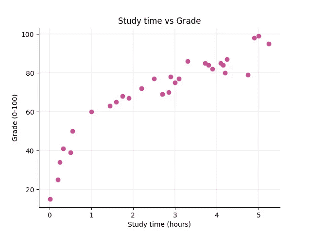
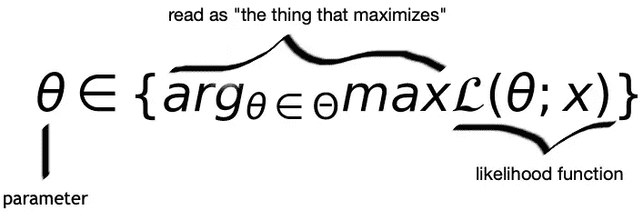

# 现实生活中的最大似然估计:优化学习时间

> 原文：<https://towardsdatascience.com/maximum-likelihood-estimation-in-real-life-optimizing-study-time-d5cc083d25b4?source=collection_archive---------15----------------------->

Photo by [Mika Baumeister](https://unsplash.com/photos/Wpnoqo2plFA?utm_source=unsplash&utm_medium=referral&utm_content=creditCopyText) on [Unsplash](https://unsplash.com/?utm_source=unsplash&utm_medium=referral&utm_content=creditCopyText)

[最大似然估计](https://en.wikipedia.org/wiki/Maximum_likelihood_estimation)是一种广泛应用于机器学习的统计技术。它用于选择模型的参数。

考试季节到了，这一次你想更有效地利用你的学习时间。你提前做了计划，并确保跟踪你在过去几轮中为每场考试学习了多少，以及你得了多少分。你最终得到了这个数据集

Beautiful dummy data 😁

绘制数据可以更容易地看出你花在考试学习上的时间和最终成绩之间的相关性。

和前几轮考试一样，你面临的最大挑战是，你有多场考试，每场考试相隔几天。你想制定一个学习计划，让你最大限度地提高成绩，但保证你有足够的时间投入到每场考试中。

你是做什么的？

## **线性模型来救援了！**

根据每次考试的学习时间，思考一种最大化成绩的方法，你记得上面散点图中的相关性。你可以使用[线性回归](/linear-regression-in-real-life-4a78d7159f16)来帮助计算出你会得到多少分数，给定你可以为考试投入的学习时间。

这是最能描述当前问题的模型

你是根据你学习的时间来预测考试成绩的。你可以使用自己选择的统计软件，对数据集进行线性模型拟合。

现在你可以*输入*你计划学习多长时间，并根据模型的方程式检查你可能获得的分数。

这里是我们模型的总结，使用 Python 的 [statsmodels 模块](https://www.statsmodels.org/dev/generated/statsmodels.regression.linear_model.OLS.html)获得。

我们可以看到,[最小二乘法](https://en.wikipedia.org/wiki/Ordinary_least_squares)用于将模型(粉色线)拟合到数据集。参数*β0*和*β1，*也称为模型的系数，分别对应于 *const* 和 *time* 。

因此，我们有了模型，并用 Python 计算了参数，但问题仍然存在:**我们实际上是如何估计参数的？**

# 幕后的数学

很棒的是，我们可以使用统计软件来完成所有繁重的工作，并为我们的数据集拟合一个线性模型。

但是参数是怎么得到**预估**的呢？

这些值是随机选取的吗？

这就是统计学家 R. A .菲舍尔想出一个好主意的地方！他发现，我们可以建立一个模型，然后**估计参数，使它们最大化获得数据集中观察到的值的可能性。**

换句话说，我们正在估计参数，以使观察到数据集中的值的概率(即可能性)尽可能高。

但在我们开始钻研数学之前，这里有一些关于我们数据集的假设:

*   每个数据点都是独立的
*   我们的数据集遵循正态分布
*   我们模型中的误差也遵循正态分布
*   我们的产出是连续的

在计算参数时，这些假设非常方便。它们促进了某些数学属性的使用，最终简化了计算！

## 1.解码似然函数

到目前为止，我们知道参数必须最大化似然函数

可能性函数实际上是一种条件概率。它依赖于参数，因为我们将只选择最大化观察数据概率的参数值。

让我们用*θ*来表示参数。

我们的线性模型，有两个未知参数—*β0，β1*。

所以我们可以将似然函数改写为

迄今为止，我们

*   解读可能性的含义
*   写下线性模型的可能性表达式，作为条件概率

## 2.概率密度函数

现在我们知道可能性是一个条件概率，是时候开始深入数学了。

根据我们的假设，我们的数据集遵循正态分布，我们正在处理连续数据。因此，我们将使用正态分布的[概率密度函数](https://en.wikipedia.org/wiki/Probability_density_function)来定义可能性。

因为每个数据点都是相互独立的，所以通过使用概率密度函数中的 Pi 符号，数据集中所有点的概率被表示为乘积。

为了简化即将到来的计算，我们可以将可能性转化为对数可能性。

当选择每个参数的值时，这是我们想要最大化的！

但是我们可以让这个表达式更简单。由于我们最大化了与参数 *beta 0* 和 *beta 1* 相关的可能性，我们实际上可以忽略其中不包含 *beta 0* 或 *beta 1* 的任何术语。

可能性表达式就变成了

*这个求和看起来眼熟吗？*

大家回想一下，我们的线性模型定义为 *y = beta0 + beta1x +误差。*如果我们求解这个误差方程，我们得到*误差= y-β0-β1。*

**以上是** [**误差平方和**](https://en.wikipedia.org/wiki/Residual_sum_of_squares) **！**

而且，因为我们也假设我们模型中的误差遵循正态分布，在这种情况下使用最大似然法进行参数估计与计算[普通最小二乘法](https://en.wikipedia.org/wiki/Ordinary_least_squares)完全相同！

**在实践中，在这些假设下，最大化可能性与最小化误差平方和是相同的。**

这就是为什么大多数时候我们会看到普通的最小二乘法用于将线性模型拟合到数据集。

## 3.(最后)估计参数

这是我们停下来的地方

为了得到参数值，我们将计算关于*β0*和*β1 的偏导数。*

从相对于*β0 的偏导数开始。*

搞定一个，还剩一个！

计算关于*β1*的偏导数，我们得到

每当我们使用一些统计软件将线性模型拟合到我们的数据集时，这些都是在幕后发生的计算。

如果我们计算数据集的每个表达式，我们将确认 *beta 0= 37.4571* 和 *beta 1= 12.0495* ，这是模型摘要中显示的确切值。

*感谢阅读！*