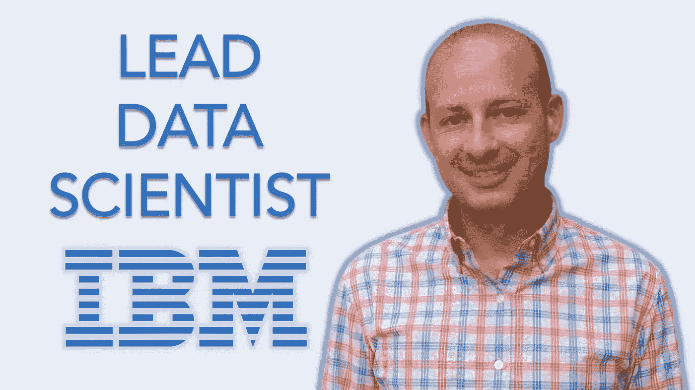

# 从 MBA 到 IBM 数据科学家:格雷格·拉弗蒂专访

> 原文：<https://towardsdatascience.com/mba-to-ibm-data-scientist-exclusive-interview-with-greg-rafferty-8eebdc689c05?source=collection_archive---------9----------------------->

## [独家 TDS 采访](https://towardsdatascience.com/tagged/tds-interview)

## TDS 与 IBM 的首席数据科学家讨论公司的工作流程、内部 NLP 项目以及获得第一份数据科学工作。

TLDR: TDS 采访了 IBM 首席数据科学家 Greg Rafferty。Greg 深入研究了 IBM 的数据科学工作流，他负责的具体项目类型，以及他在 TDS 上写的 TwitterBot 文章，这篇文章让他获得了 NLP 专家的声誉，这在他获得 IBM 职位的过程中发挥了很小的作用。

> ***面试官:****[*Haebichan Jung*](https://www.linkedin.com/in/haebichan)*，Recurly 数据科学家，TowardsDataScience.com 编辑助理**
> 
> ****受访者:****[*Greg raff erty*](https://www.linkedin.com/in/gregrafferty)*，IBM 首席数据科学家***

## **专注于你以前在国际领域的工作，你能告诉我们你在国外做了什么吗？**

**格雷格:我大部分时间都在为美国政府做援助工作。我在亚美尼亚生活了几年，在俄罗斯生活了几年。最初它不是数据科学。我主要做项目管理。我在清洁能源项目中工作。我有机械工程的背景，所以我在这些项目上做了一点机械工程。但主要是管理。在亚美尼亚呆了几年后，我去了俄罗斯，继续我的工作。后来，我在一家初创公司做商业分析师。那是我进入科技行业的时候。之后，我来到旧金山，进入了数据科学领域。**

## **最初是什么让你想到了我们的亚美尼亚和俄罗斯？这些是你感兴趣的地区吗？**

**这既是个人的也是职业的。我提到过我以前是机械工程师。我在采矿业工作，我们在俄罗斯有几个客户，所以我和他们一起工作，为了更好地交流，我开始学习语言。当我获得工商管理硕士学位时，我们与圣彼得堡州立大学有一所姐妹学校。所以我有了一个很好的机会去那里上课。我在圣彼得堡呆了几个月，我喜欢那里，所以我的职业生涯开始与俄罗斯和前苏联国家建立这种势头。2008 年经济崩溃时，我有机会去了亚美尼亚，与政府合作这些援助项目。我真的很想尝试一下，这是一个很好的时机，我做到了。**

## **你在 1990 年开始是一名机械工程师，那么你是如何进入商界的呢？这是一个艰难的转变吗？**

**实际上非常顺利。我最初是一名机械工程师，后来我开始从事人事管理方面的项目工作，当时我的想法是继续在这家公司工作，并领导一些海外合资企业。在这家公司，他们有各自的 MBA，所以我通过这家公司获得了我的 MBA 学位。**

**他们实际上支持我，所以我在攻读 MBA 的同时继续工作，这很有回报，但也很紧张。全职在校期间有一份全职工作。这是一个两年的问题，做得很好，度过了一段美好的时光。当我完成的时候，经济正在崩溃，在这家公司做经理的机会真的很少，至少在接下来的几年里，所以这就是为什么我选择那个时间去尝试一些新的东西。**

## **数据和分析何时成为职业生活的一部分？**

**作为一名工程师，我使用大量的数据和分析。我会建立简单的回归模型，但没有超越 excel。我在莫斯科为一家初创公司工作时就开始编程了。这时候我建立了我的深度模型，不是深度学习，而是可以在 excel 中处理的模型。我确实非常喜欢它。所以当我回到美国时，我的工作非常繁重，这是我第一次接触 SQL。**

**在那个时候，我开始研究更多的机器学习模型，我真的很喜欢它。然后，我去了训练营“激励”,以便将自己推向极限，真正学习数据科学。**

## **什么是镀锌？**

**激励是一个训练营。3 个月的沉浸式课程，全日制，大约每天 8-12 小时，每周 5-6 天。只有 3 个月的时间，所以你可以真正摆脱困境，把自己推向边缘，进入数据科学。如果你有基础课程，那会很有帮助，因为它不像硕士课程那么紧张。所以你确实需要知道你会得到什么，这样你才能自己填补空白。**

## **你是如何在 IBM 找到自己的？**

**所以我一直在 Coursera 平台上工作，自己研究数据科学，并在 Gallup 上做了几个项目，做了另一个非常大的项目，观察特朗普的 Twitter 流。这让我在 NLP(自然语言处理)方面有点名气。IBM 正在寻找 NLP 数据科学家。通过一些关系，我被介绍给了招聘经理，这似乎是一个非常合适的机会。我直接从 galilep 转到 IBM，在 IBM 工作了大约 18 个月。**

**我一直在做大量的人工智能工作，大量的 NLP 工作，以及一些基于客户的基本分析工作。我是一个咨询团队的成员，所以我经常出差，并且只和客户打交道。我做的很多工作都是和一个客户一起完成的。**

## **在 IBM 你能做什么样的很酷的 NLP 项目？**

**我做过的最酷的项目之一，我们称之为“无监督注释”,实际上我已经申请了专利。我希望能通过。它所做的是收集成千上万的文档，并识别这些文档的内容。它对它们进行聚类，并对这些注释应用注释，这样您就可以围绕它们构建一个知识图表。**

**IBM 有一个名为 Knowledge Studio 的工具，这是一个手动注释过程，大约需要三周时间来建立一个手动注释模型。那是非常劳动密集的，不是有趣的工作，需要一个领域专家来做。所以你必须让一个律师给这些文件做三个星期的注释，这真的不是一个很好的时间利用。**

**所以这个工具做的是，我用 Word2Vec，我用聚类，然后我用一些 IBM Watson API 的特征提取工具。通过这个管道，它创建这些注释。它获取这些文档，并在知识工作室中创建这个知识图表。那是我参与的最大的项目。**

** [## 单词嵌入和 Word2Vec 简介

### 单词嵌入是最流行的文档词汇表示之一。它能够捕捉…的上下文

towardsdatascience.com](/introduction-to-word-embedding-and-word2vec-652d0c2060fa) 

## 这是你为 IBM 开发的内部软件，而不是为其他公司开发的咨询工作吗？

正确。这个项目是内部项目。我们正在寻找可能想要使用它的客户，如果我们能找到一个，那么我们当然会将其应用到我们更广泛的沃森产品中，然后提供给任何人。但目前它仍处于概念验证阶段。

## 这是 IBM 的正常工作流程吗(制造内部产品，然后吸引外部客户)？

那实际上是一个非常罕见的工作流程。只有少数团队使用这种方法将产品推向市场。大多数情况下，客户提出用例，IBM 确定解决方案，然后直接为客户构建解决方案。如果这个用例可以扩展到其他客户，那么每个合同都是不同的。有时客户拥有知识产权，有时 IBM 拥有，有时有一些共享。但如果 IBM 保持对知识产权的控制，那么我们将为一个客户构建它，但如果它适用于其他用例，我们将围绕其他客户销售它。

## 这些项目的时间表是什么？

我参与的一些项目只有一周，而有些项目可能长达数年。我做过的最长的项目大概有六个月。我现在正在做的项目是一个我们有两年合同的项目。我不知道我是否会全职参与这个项目，因为有很多不同的工作流，根据你的技能，不同的顾问会加入或离开来填补空缺。但我知道有些顾问做同一个项目做了 12 年。有各种不同类型的项目，不同的安排。这取决于你的技能。

## 团队是如何组建的？

我的团队，应用人工智能团队，我们经常一起工作，但有时我们会在不同的项目上完全独立地工作。我现在正在做的项目，实际上是我在领导这个团队。由我来决定是否出租。我在印度有三名离岸数据科学家，还有两名本地的岸上数据科学家。对于离岸公司，我想雇用我认识的人。我已经知道了他们技能的名声，所以我带了两个人去我的团队。

## 执行手头任务的重要特质/技能是什么？

作为一名数据科学家，有各种各样的技能，具体的数据科学技能取决于项目。这可以是从 NLP 到深度学习的任何东西，也可以只是基本的分析。但是 IBM 的每个人都有一个共同点，那就是他们都是顾问。他们需要能够与客户合作。他们需要与高管开会，并能够明智地讨论解决方案。他们需要销售产品。这不是向客户推销解决方案。了解客户的需求，了解我们如何更好地帮助客户。所以当我说卖的时候，这不是我们去找他们说你需要买这个的地方。但是我们深刻理解他们需要什么，以及我们如何改进他们。这不是真正的积极销售。这更像是被动销售，我们向他们展示价值，他们说他们想要。这是一项对顾问来说非常有价值的技能。

## 所以软硬技能都很重要。

你提起那件事很有趣。昨晚，我和我们的一个合伙人就此进行了一次谈话。他说，如果你是技术技能组合中的前百分之一，你将成为 IBM 的摇滚明星。如果你在以客户为中心的软技能中名列前茅，你也会成为摇滚明星。但是如果你不在前 1%，那么你真的需要具备这两种技能。所以大多数人确实需要有一套基于客户的技术技能。

## 切换齿轮，你能告诉我们更多关于你在 TDS 上写的 TwitterBot 吗？

这个想法是在川普刚刚解雇詹姆斯·科米的时候产生的。他解雇了他他在推特上说，很遗憾他不得不解雇迈克·弗林，因为弗林向联邦调查局撒谎。每个人都站出来说，那会妨碍司法公正。如果你知道他对联邦调查局撒谎并要求科米不要调查。特朗普对此的反驳是，嗯，我没有写推文，是我的律师写的，是他发的。

所以我说我要做的是分析他的推特流，并试图确定谁在写这些推文，是特朗普还是他的一个助手。我可以这样做的方式是，在他担任总统之前，特朗普总是从安卓设备上发推特，而他的工作人员总是从 iPhones 上发推特。我有推特的数据，你可以看到来源。我用这个来源作为标签，建立了一个模型来确定谁在发微博。在那之后，我建造了一个 TwitterBot，它可以监听特朗普的 Twitter 流，每当他发推文时，它都会捕捉到这条推文，并将其发送给模型。然后，它会再发一条推文，说特朗普刚刚发了这条推文，我有 90%的信心，这是特朗普实际写的。之后，我在 TowardsDataScience 上写了一篇长文，讲述了我构建的功能、结果，以及我如何构建 TwitterBot 并将其投入使用。

> 关于推特机器人的更多信息，请查看格雷格的原帖:

 [## 谁在椭圆形办公室发微博？

### 我如何建立一个机器学习模型来预测特朗普或他的一个助手是否通过他的账户发了推文

towardsdatascience.com](/whos-tweeting-from-the-oval-office-96ea5b60c03) 

## 对于 TDS 社区，尤其是那些从商业分析、管理等领域转型的人，你有什么至理名言或建议？？

我会说最重要的事情，尤其是如果你正在寻找你的第一份工作，是获得一个 Github 页面，并在其中填充真正有趣的项目。项目可能与公司没有直接关系，但你却迫不及待地想要告诉人们。这种热情真的会在面试中表现出来。这是我在面试人时寻找的关键因素之一。建立关系网，然后写博客也很有帮助，因为这真的显示了你的热情。确保你做的每一件事都体现了这一点。

> **再次感谢 Greg Rafferty 的采访。你可以在这里找到他的 TDS 帖子:**

 [## Greg Rafferty -走向数据科学

### 阅读 Greg Rafferty 在《走向数据科学》中的文章。我比烤肉酱还大胆。每天，格雷格·拉弗蒂和…

towardsdatascience.com](https://towardsdatascience.com/@raffg)  [## Haebichan Jung - Medium

### 阅读容格在媒介上的作品。数据科学家@ Recurly |编辑助理@ TDS。每天，Haebichan…

medium.com](https://medium.com/@haebichan) 

另外还要感谢[卢多维克·贝尼斯坦特](https://medium.com/u/895063a310f4?source=post_page-----8eebdc689c05--------------------------------)和[YK·苏吉](https://medium.com/u/539e9e1c30df?source=post_page-----8eebdc689c05--------------------------------)对项目的审核、指导和支持。**