# 每个人的直觉

> 原文：<https://towardsdatascience.com/mcmc-intuition-for-everyone-5ae79fff22b1?source=collection_archive---------1----------------------->

## 容易吗？我试过了。


我们都曾听说过蒙特卡洛马尔可夫链。有时在阅读贝叶斯统计时。有时在使用像 Prophet 这样的工具时。

但是 MCMC 很难理解。每当我读到它，我都注意到症结通常隐藏在数学噪音的深层，不容易破译。

我不得不花很多时间去理解这个概念。

***这篇博客旨在简单地解释***[***MCMC***](https://amzn.to/2SxJurV)***方法，并知道它们的用处。***我将在我的下一篇[文章](/applications-of-mcmc-for-cryptography-and-optimization-1f99222b7132)中深入探讨更多的应用。

所以让我们开始吧。

MCMC 由两项组成 ***蒙特卡罗*** 和 ***马尔可夫链*** 。让我们一个一个地谈论个别术语。

# 蒙特卡洛？


Simulation

简单来说，我们可以把蒙特卡罗方法看作简单的模拟。

[**蒙特卡洛**](https://en.wikipedia.org/wiki/Monte_Carlo_method) 方法得名于摩纳哥的蒙特卡洛赌场。许多纸牌游戏需要赢庄家的概率。

有时候，计算这种概率可能在数学上很复杂或者非常棘手。但是我们总是可以运行一个计算机模拟来多次模拟整个游戏，并且将概率视为赢的数目除以玩的游戏数目。

这就是你需要知道的蒙特卡罗方法。

***没错，只是一种简单的模拟技术，名字很花哨。***

# 马尔可夫链？


那么既然我们已经得到了 MCMC 的第一部分，我们还需要了解什么是 [***马尔可夫链***](https://en.wikipedia.org/wiki/Markov_chain) 。但是，在跳到马尔可夫链之前，让我们先了解一点关于**马尔可夫性质**的知识。

假设你有一个 M 个可能状态的系统，你从一个状态跳到另一个状态。

先不要迷茫。系统的一个具体例子是天气从热到冷再到温和状态的变化。或者另一个系统可能是股票市场，它从熊市跳到牛市，再跳到停滞状态。

*马尔可夫性质*表示，给定一个在特定时间点处于状态`Xn`的过程，概率`Xn+1` =k，其中 k 是该过程可以跳转到的 M 个状态中的任何一个，将仅取决于它在给定时刻处于哪个状态。而不是它是如何达到当前状态的。

从数学角度来说:

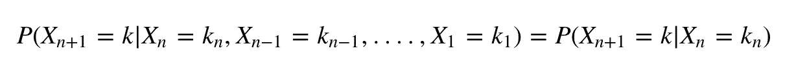

直觉上，你不关心市场到达牛市的状态顺序。下一个状态是“熊”状态的概率仅仅由市场当前处于“牛”状态的事实决定。

从实际情况来看，这也是有道理的。

如果一个过程表现出马尔可夫性质，那么它被称为马尔可夫过程。

为什么马尔可夫链很重要？

重要的是因为它的**静止** [**分布**](https://amzn.to/32AORLH) 。

那么什么是**平稳分布**

在下面的例子中，我将通过实际计算来解释平稳分布。假设你有一个股票市场的马尔可夫过程，如下所示。

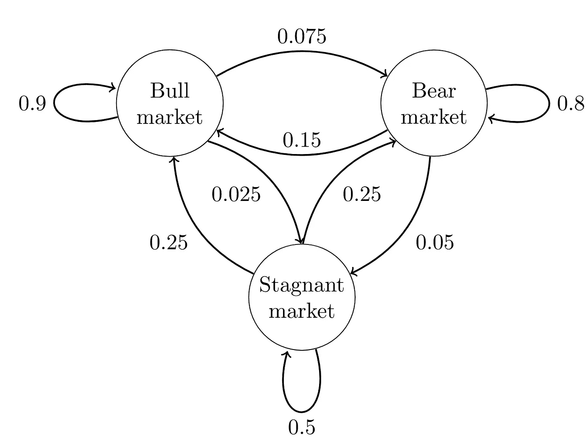

你有一个转移概率矩阵

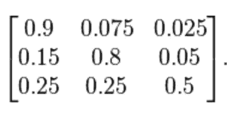

transition Probabilities, Q

***定义了从 Xi 状态到 Xj 状态的概率。在上面的转移矩阵 Q 中，***

给定当前状态，下一个状态为“牛市”的概率为“牛市”=0.9

给定当前状态，下一个状态将是“熊”的概率是“牛”=0.075

诸如此类。

现在，我们从一个特定的状态开始。让我们从熊市开始。我们可以用向量的形式把自己的状态定义为【牛、熊、停滞】。所以我们的起始状态是[0，1，0]

我们可以通过将当前状态向量乘以转移矩阵来计算下一个状态的概率分布。

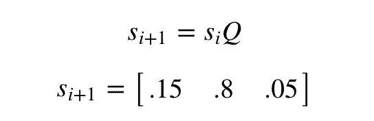

**看看概率加起来是怎样的 1。**下一个状态分布可以由下式求出

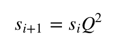

诸如此类。最终，你会到达一个稳定状态 s，在那里我们会收敛:

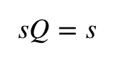

对于上述转移矩阵 Q，平稳分布 s 是:

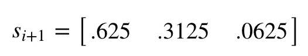

您可以通过编程获得静态分布，如下所示:

```
Q = np.matrix([[0.9,0.075,0.025],[0.15,0.8,0.05],[0.25,0.25,0.5]])
init_s = np.matrix([[0, 1 , 0]])
epsilon =1
while epsilon>10e-9:
    next_s = np.dot(init_s,Q)
    epsilon = np.sqrt(np.sum(np.square(next_s - init_s)))
    init_s = next_sprint(init_s)
------------------------------------------------------------------
matrix([[0.62499998, 0.31250002, 0.0625    ]])
```

***你也可以从任何其他状态开始；你会达到同样的平稳分布。*** 改变代码中的初始状态，如果你想看的话。

现在我们可以回答这个问题了- ***为什么平稳分布很重要？***

稳态分布很重要，因为它可以让你定义一个系统在随机时间的每个状态的概率。

对于这个特定的例子，你可以说 62.5%的时间市场将处于牛市状态，31.25%的时间将处于熊市，6.25%的时间将处于停滞状态。


Random Walk

直觉上，你可以把它想象成一个链条上的随机行走。 ***你处于一个状态，你在给定当前状态的情况下，通过看到下一个状态的概率分布来决定下一个状态。*** 根据节点概率，我们可能会比其他节点更频繁地访问一些节点。

这就是谷歌在早期互联网时代解决搜索问题的方式。问题是根据页面重要性对页面进行排序。谷歌用 Pagerank 算法解决了。

在 *Google Pagerank* 算法中，你可能认为一个州是一个页面，而一个页面在稳定分布中的概率是它的相对重要性。

***Woah！这是很多信息，我们还没有开始讨论 MCMC 方法。如果你现在还和我在一起，我们现在可以进入正题了。***

# 那么什么是蒙特卡罗马尔可夫链(MCMC)？

在回答这个关于 MCMC 的问题之前，我先问一个问题。我们都知道贝塔分布。我们知道它的 pdf 函数。但是我们能从这个分布中抽取一个样本吗？你能想出一个办法吗？


Think….

***MCMC 为我们提供了从任意概率分布中抽样的方法。当我们想从后验分布中取样时，这是最需要的。***

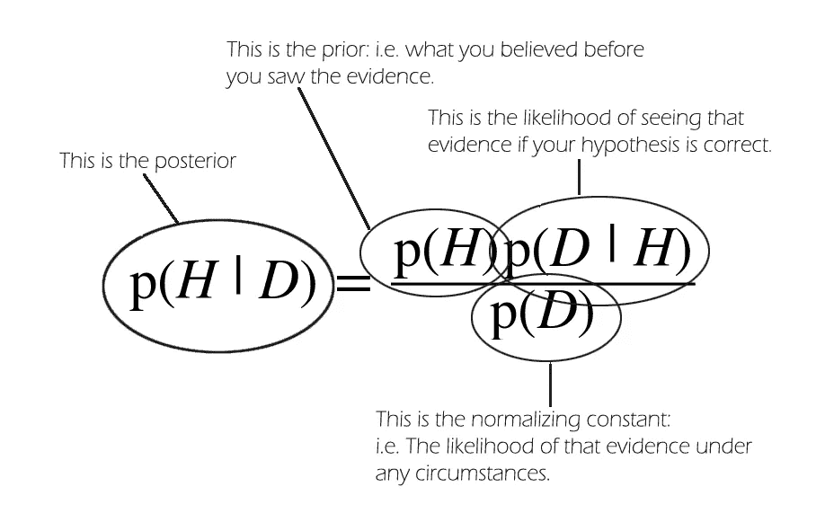

以上是贝叶斯定理。有时我们需要从后面取样。但是计算后验概率和归一化常数(也称为证据)容易吗？在大多数情况下，我们能够找到*可能性 x 先验的函数形式。*

但是我们无法计算证据(p(D))。为什么？

让我们扩大证据。

如果 H 只取 3 个值:

p(D) = p(H=H1)。p(D|H=H1) + p(H=H2)。p(D|H=H2) + p(H=H3)。H3

P(D)很容易计算。如果 H 的值是连续的呢？能不能像现在这样简单地写出来，H 可以取无穷大的值？这将是一个很难解决的积分。

我们想从后面取样，但我们想把 p(D)当作一个常数。

根据 [**维基百科**](https://en.wikipedia.org/wiki/Markov_chain_Monte_Carlo) :

> **马尔可夫链蒙特卡罗** *(MCMC)方法是一类基于构建以期望分布为其平稳分布的马尔可夫链，从概率分布 *中进行* **采样的算法。在许多步骤之后，链的状态被用作期望分布的样本。样品的质量随着步骤数的增加而提高。***

所以让我们用一个例子来解释这一点:

假设**我们要从** [**贝塔分布**](https://en.wikipedia.org/wiki/Beta_distribution) 中抽取样本。测试版的 *PDF 为:*

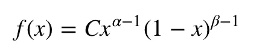

其中 C 是归一化常数。它实际上是α和β的一些函数，但我想说明我们并不真的需要它来从β分布中采样，所以我把它当作一个常数。

对于 Beta 版来说，这是一个有点棘手的问题。

实际上，你可能需要处理更难的分布函数，有时你不知道归一化常数。

MCMC 方法让我们的生活变得更容易，因为它为我们提供了可以创建马尔可夫链的算法，该马尔可夫链将 Beta 分布作为其**平稳分布**，因为我们可以从均匀分布中采样(这相对容易)。

如果我们从一个随机状态开始，并基于某种算法反复遍历下一个状态，我们将最终创建一个马尔可夫链，该马尔可夫链将贝塔分布作为其**平稳分布**，并且我们在很长时间后所处的状态可以用作贝塔分布的样本。

一种这样的 MCMC 算法是 [**Metropolis-Hastings 算法**](https://en.wikipedia.org/wiki/Metropolis%E2%80%93Hastings_algorithm)

# 大都会-黑斯廷斯算法


Hill Climbing

## 直觉:

第一，目标是什么？

*直觉上，我们想要做的是在某个(凹凸不平的)表面(我们的马尔可夫链)上走来走去，以这样一种方式，我们在每个位置花费的时间量与该位置的表面高度成正比(我们需要从中采样的期望 pdf)。*

例如，我们愿意在海拔 100 米的山顶上花费两倍于在附近海拔 50 米的山上花费的时间。好的一面是，即使我们不知道表面上点的绝对高度，我们也可以这样做:我们只需要知道相对高度。例如，如果一个山顶 A 的高度是山顶 B 的两倍，那么我们在 A 的时间将是在 B 的两倍。

*提出新地点的方案和接受新地点的规则更复杂，但基本思想仍然是:*

***(1)挑选一个新的“拟定”位置；***

***(2)算出那个位置比你现在的位置高多少或低多少；***

***(3)从概率上来说，按照与地点高度成比例地花费时间的总体目标，留在原地或移动到那个地点。***

*MCMC 的目标是* ***从某种概率分布*** *中抽取样本，而不必知道它在任何一点的确切高度(我们不需要知道 C)。*

*如果正确设置了“漫游”过程，您可以确保达到这一比例(花费的时间和分布的高度之间)。*

## 算法:

现在让我们更正式地定义这个问题。

设 s=(s1，s2，…)。sM)是期望的平稳分布。我们想创建一个具有这种平稳分布的马尔可夫链。我们从具有 M 个状态的任意马尔可夫链开始，转移矩阵为 P，因此 pij 表示从状态 I 到 j 的概率。

直觉上我们知道如何在这个马尔可夫链上徘徊，但是这个马尔可夫链并不具备所需的平稳分布。

这个链确实有一些平稳分布(这对我们没有用)

我们的目标是改变我们在这个马尔可夫链上徘徊的方式，使得这个链具有期望的平稳分布。

为此，我们:

1.  从随机的初始状态 I 开始。
2.  通过查看转移矩阵 p 的第 I 行中的转移概率，随机选择新的*提议状态*。
3.  计算称为*接受概率*的度量，其定义为:aij=min(sj.pji/si.pij，1)。
4.  现在掷一枚硬币，正面朝上。如果硬币正面朝上，接受提议，即移动到下一个状态，否则拒绝提议，即停留在当前状态。
5.  重复很长时间

很长一段时间后，这个链将会收敛，并且将会有一个稳定的分布 s。**然后我们可以使用这个链的状态作为来自任何分布的样本。**

在对 Beta 分布进行采样时，我们使用 PDF 的唯一时间是找到接受概率，在这种情况下，我们将 sj 除以 si，即**归一化常数** C **被取消**。

## 贝塔分布的抽样:


MCMC Sampler

现在让我们继续讨论贝塔分布的抽样问题。

贝塔分布是[0，1]上的连续分布，它在[0，1]上可以有无限个状态。

让我们假设在[0，1]上具有无限状态的任意马尔可夫链 P 具有转移矩阵 P，使得 pij = pji =矩阵中的所有元素。

我们不需要矩阵 P，正如我们将在后面看到的，但我想让问题描述尽可能接近我们建议的算法。

*   从 Unif(0，1)给定的随机初始状态 i 开始。
*   通过查看转移矩阵 p 的第 I 行中的转移概率，随机选取一个新的**提议状态**。假设我们选取另一个 Unif(0，1)状态作为提议状态 j。
*   计算一个称为**接受概率**的度量:

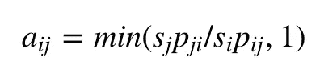

这简化为:

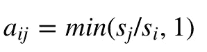

因为 pji=pij，并且在哪里

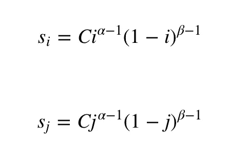

*   现在扔一枚硬币，很有可能击中头部。如果问题悬而未决，接受提议，即进入下一个州，否则拒绝提议，即停留在当前州。
*   长时间重复

## 代码:

理论已经讲够了，让我们继续讨论 python，来创建我们的 Beta 采样器。

让我们对照实际的β分布检查 MCMC 采样β分布的结果。

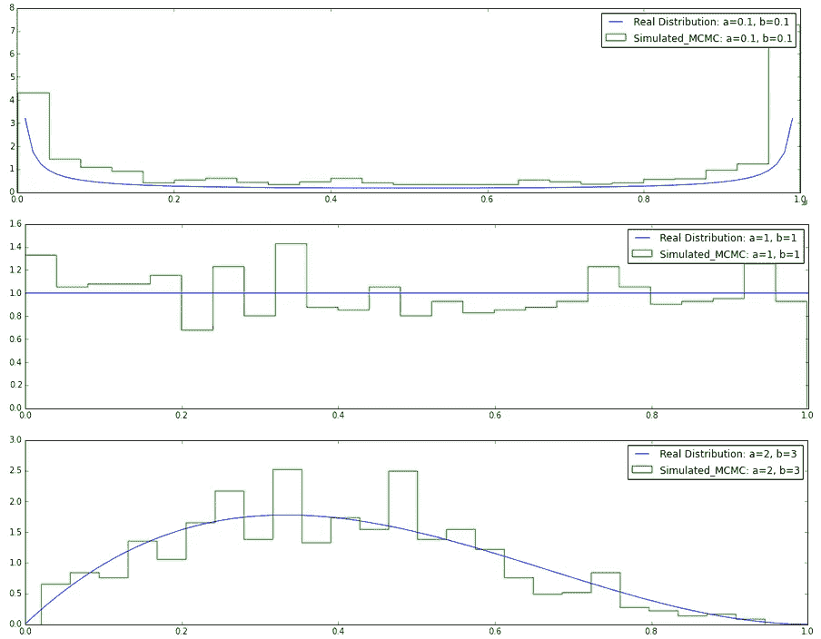

正如我们所看到的，我们的采样β值与β分布非常相似。因此，我们的 MCMC 链达到了稳定状态。

我们确实在上面的代码中创建了一个 beta 采样器，但是相同的概念普遍适用于我们想要从中采样的任何其他分布。

# 结论


那是一个大帖子。恭喜你走到了尽头。

本质上, [MCMC](https://amzn.to/2SxJurV) 方法可能比较复杂，但是它们给了我们很大的灵活性。您可以使用 MCMC Sampling 对任何分布函数进行采样。它们通常用于在推断时对后验分布进行采样。

您也可以使用 MCMC 来 ***求解具有大状态空间的问题。*** 例如:背包问题或解密。你可以在我的下一篇博文中看到一些有趣的例子。继续收听。

您可以关注的最新、最好的资源之一是加利福尼亚大学的[贝叶斯统计专业。](https://coursera.pxf.io/3PqL3r)

我将来也会写更多这样的帖子。让我知道你对这个系列的看法。在 [**中**](https://medium.com/@rahul_agarwal) 等我，或者订阅我的 [**博客**](https://mlwhiz.ck.page/a9b8bda70c) 了解他们。和往常一样，我欢迎反馈和建设性的批评，可以在推特[@ mlwish}](https://twitter.com/MLWhiz)上找到。

# 参考

1.  [**概率导论约瑟夫·K·布利茨坦，杰西卡·黄**](http://www.amazon.com/Introduction-Probability-Chapman-Statistical-Science-ebook/dp/B00MMOJ19I)
2.  [**维基**](https://en.wikipedia.org/wiki/)
3.  [**堆叠交换**](http://stats.stackexchange.com/a/12657)