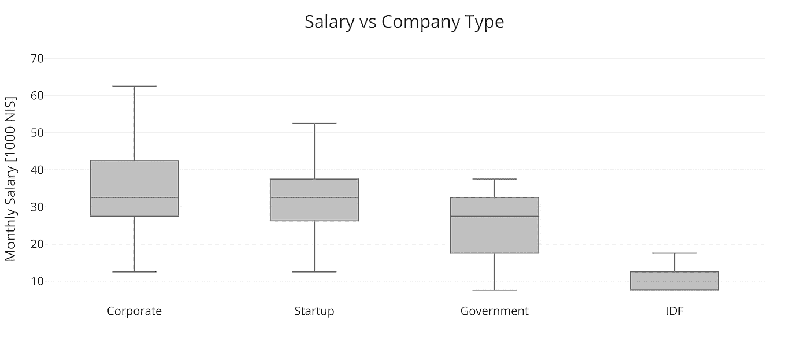

# MDLI 报告:2019 年以色列机器学习评论

> 原文：<https://towardsdatascience.com/mdli-report-the-israeli-machine-learning-review-2019-fdc408d31454?source=collection_archive---------19----------------------->

## 关于以色列机器学习前景的完整报告，包括平均工资、人口统计、最常用的图书馆等。

今年，就像去年一样，我们在[机器&深度学习以色列](https://www.facebook.com/groups/543283492502370/)社区成员中分发了一份全面的调查。该调查针对数据科学家和相邻角色，评估专业人员的工作条件、普遍面临的挑战、流行的开发工具等。令人印象深刻的是 **569 名受访者**参与了今年的调查(相比去年的 225 名受访者)，代表了该领域多元化的专业群体。在本报告中，我们将讨论调查结果，并为您提供由 [Omri Goldstein](https://www.linkedin.com/in/omri-goldstein-a46700b/) 完成的对这些结果的深入分析。调查由两部分组成:一部分是关于个人和职业信息，另一部分是关于职业和技术事务的更多信息。

调查的中心话题之一是平均工资，这是根据受访者的经验和教育水平来衡量的。今年，我们的调查得到了不少于 402 名全职工作人员的回复——这代表了该领域的现状。

# 人口统计数据

在 569 名受访者中，74.1%认为自己是男性，25.3%认为自己是女性。与去年的女性比例相比，这是一个重大进步。然而，这一数字似乎是我们努力接触更多女性参与者的结果，而不是因为有更多的妇女在实地工作。此外，调查受访者的平均年龄为 32.7 岁，其中 50%在 29 至 35 岁之间:

男女之间的年龄分布没有差别，尽管与年龄有关的其他变量描绘了一幅有趣的画面。在特拉维夫，平均年龄为 30 岁，而在中央区，平均年龄为 33 岁，如下图所示:

特拉维夫是最具代表性的城市，无论是作为家庭基地还是工作目的。特拉维夫吸引了近一半居住在中心区的受访者就业，四分之一居住在海法的受访者，三分之一居住在耶路撒冷的受访者，以及略少于一半来自南区的受访者。特拉维夫也是唯一一个被调查者更经常提到的工作城市，而不是他们生活的城市。

在雇主方面，我们研究了不同类型的组织——从公司到军队。正如所料，我们最年轻的受访者为 IDF(以色列国防军)工作。平均而言，年龄最大的受访者为政府工作，年龄中位数为 36 岁，而为初创公司工作的受访者年龄中位数仅为 32 岁:

最常见的职称是数据科学家、研究员或科学家、深度学习工程师、机器学习工程师、软件开发人员、算法开发人员、分析师和 CTO。这一结果并不令人惊讶，因为该调查是针对广义上的数据科学家的，但这些结果也没有反映高科技行业的整体情况。与此同时，调查受访者最常见的学位是计算机科学(包括电子工程、软件工程和生物信息学)、工程和精确科学(数学、物理、统计和其他工程学科)、生命科学(化学、生物和脑科学)和经济学。在学位科目方面，值得注意的是，学位科目与工作岗位之间有直接联系:

计算机科学毕业生真的可以在所有工作岗位上找到，而大多数精确科学、工程和生命科学毕业生的角色是数据科学家。此外，软件工程师通常是计算机科学毕业生，数据分析师大多来自精确科学，其他职位由生命科学和经济学毕业生分享。

如果我们在 MCA(PCA 的分类姐妹程序)的帮助下将每个回答者的工作职位、教育水平和学术专长可视化到 2D 地图中，它允许我们发现以下内容。我们可以发现变量之间的以下关系:

你可以看到几个集群的形成。在左下角，经济学毕业生和数据分析师角色之间有一个链接，尽管相当多的经济学毕业生也是数据科学家。在中间，您可以看到 STEM 毕业生和数据科学家角色之间的联系。在左侧，拥有计算机科学学士学位的受访者与软件工程师和深度学习工程师角色相关联。在右上角，在一个较小的集群中，您可以找到被聘为研究人员的博士学位持有者。在中心，CTO、算法开发人员和机器学习工程师之间还有另一种轻微的联系，他们的教育水平相似，但他们有不同的学术专长。由于这一群体的多样性，他们的职称也趋于多样化。

# 工作和招聘

招聘行业在过去几年发生了变化，这在我们的调查结果中非常明显。像 [Woo](https://www.themarker.com/technation/1.4604019) 和[幸灾乐祸](https://www.themarker.com/technation/1.7410082)这样的招聘公司已经改变了求职者寻找工作的方式，尽管大多数受访者似乎没有大规模使用这些公司的服务。LinkedIn 仍然是最受欢迎的招聘网站，超过 400 名受访者表示他们使用 LinkedIn。下一个最受欢迎的策略是通过朋友和家人找工作。最后，受访者还使用我们的[社区就业委员会](https://machinelearning.co.il/jobs/)，不到一半的受访者使用招聘机构。

# 工资范围

全职员工的平均工资为每月 31000 NIS(8830 美元)，比去年增加了 2000 NIS(568 美元)。50%的受访者认为他们的月工资在 22，500 至 37，500 NIS(6，408 至 10，681 美元)之间，这表明存在显著差异:

今年男女平均工资的差距是 2600 NIS(740.5 美元)，这意味着 8%的工资差距(与去年的数字相似)。男性平均月收入为 31500 NIS(8946 美元)，而女性为 29000 NIS(8236 美元)。

研究人员和科学家的工资最高，平均月薪为 36000 NIS(10224 美元)。紧随其后的是那些拥有 CTO 或机器学习工程师头衔的人，他们的平均月薪为 3.5 万 NIS(合 9940 美元)。另一方面，分析师的平均月薪为 19000 NIS(5396 美元)。

女性占人口样本的 23%，45%的分析师职位由女性担任，这可以部分解释工资差距。不管怎样，男性数据科学家每月收入 31000 NIS(8830 美元)，比女性高出 3000 NIS(284 美元)。从 37000 NIS(10508 美元)到 34000 NIS(9656 美元)，在男性和女性研究人员中也可以发现类似的工资差距。

教育水平是影响工资的一个重要因素。与去年的调查结果类似，**最常见的教育水平是硕士学位(51%的受访者)**，其次是学士学位(33%)，博士学位(12%)。同样显而易见的是，工资随着教育水平的提高而增长——学士学位持有者的平均收入为 27000 NIS(7668 美元)，硕士学位持有者的平均收入为 31000 NIS(8830 美元)，博士学位持有者的平均收入高达 38000 NIS(10792 美元)。这一趋势在下面的场景中尤其有趣:虽然硕士学位持有者的平均工资男女相似，但男女博士学位持有者的工资差距令人震惊——相比之下，男性平均工资为 41000 NIS(11644 美元)，女性平均工资仅为 27000 NIS(7668 美元)。

这种工资差距的部分原因似乎是，大约一半的女性拥有生物学、化学或脑科学的博士学位，而不是计算机科学或工程的博士学位。与此同时，拥有博士学位的男性 82%都是计算机科学或工程方面的专家:

这就把我们带到了下一个话题，即基于学术专业的工资范围。最常见的专业，伴随着巨大的工资差距，是计算机科学——超过 56%的受访者表示。另外 28%的人专攻工程、物理、数学或统计学，其余的人分布在生命科学、经济学和社会科学领域。在这些专业中，**计算机科学家的工资最高，平均月薪为 33000 NIS(&9372)**。紧随其后的是工科毕业生，平均月薪为 28000 NIS(7952 美元)。排在第二位的是经济学毕业生，平均月薪为 25000 NIS(7100 美元)。作为额外的观察，还值得注意的是，与计算机科学和工程毕业生不经常拥有博士学位相反，几乎所有生命科学毕业生都拥有博士学位。

当然，影响薪水的另一个因素是年龄。不出所料，薪水会随着年龄和经验的增长而增加。男性和女性都是如此，尽管工资差距仍然很突出——特别是在一些工作中最高级的职位持有者中。

从数字上看，工资差异较大的一个原因(除了教育水平或工作经验年限)是我们的受访者中有 14 人在为 IDF 工作。这降低了 20 多岁年龄段受访者的平均工资。薪资差距较大的另一个原因是，最高的薪资大多出现在公司和初创企业(被称为“高科技”行业)。与此同时，政府、金融、大学等部门的薪水都比较低。**注意，一些薪酬最高的公司是跨国公司，比如谷歌、亚马逊、脸书等等:**

如果我们考虑到跨国公司的公司规模，那么可以理解(尽管是推测性的)为什么这些公司的薪酬也可能是最高的。然而，无论公司规模如何扩大，公司内部员工的工资仍会波动。对于雇佣超过 10，000 名员工的公司来说尤其如此，25%的受访者月薪超过 46，000 NIS(13，064 美元):

请注意，当将工资分布作为一个变量的函数呈现时，可能会产生误导性的结果。例如，生命科学毕业生的平均工资与工程毕业生的工资一样高，尽管生命科学毕业生拥有的博士学位比工程师多。我们还看到，所有 20 多岁的受访者的平均工资都有下降的趋势，因为有一批受访者在为以色列国防军工作。很难完全抵消变量之间的各种相关性，如果我们设法做到这一点，将某些原因归因于这些相关性可能会被证明是额外的挑战。

# 职业和技术问题

数据科学家日常工作中不可分割的一部分是他或她处理的数据，以及他或她获取这些数据的方式。因此，我们将调查的很大一部分用于围绕数据的问题。 **62.7%的受访者表示他们独立收集数据，没有使用额外的数据源**。相比之下，26.8%从数据聚合器收集数据，17.8%从谷歌搜索收集数据，15.4%从大学或非营利组织运营的数据库收集数据。其余受访者从 GitHub 或政府网站收集数据。

当深入调查时，我们发现了关于所用数据类型的有趣结果: **46.3%的受访者使用关系数据**，而 43.7%的受访者使用视觉数据(即图像)。排在第三位的是文本数据，有 39.3%的受访者使用，其次是传感器数据，有 27.3%的受访者使用。排名最后的是视频数据，只有 19.8%的受访者使用过，而音频数据只有 8.8%的受访者使用过。

在了解了哪些类型的数据是受欢迎的以及它们是如何收集的之后，是时候进一步深入了解我们的调查受访者如何处理他们的数据了。我们的下一步是解决日常数据科学中使用的方法和技术。在这种情况下，结果也是千差万别，许多回答者使用了非常不同的技术。排在最前面的是 67.9%的受访者使用的**神经网络**，其次是 51%的受访者使用的 CNN 和逻辑回归。45.8%的受访者使用随机森林，36.6%使用决策树。然后，31.7%使用集合方法，30.1%使用 SVM，29.5%使用 RNN。排名最末的是 15.9%的受访者使用的 GANs。

现在的问题是，我们的调查对象使用哪些库来执行所有这些技术。 **TensorFlow 是使用最多的库，50.6%的受访者投票支持它**。第二是 Keras，有 46.6%的受访者使用，第三是 PyTorch，有 40.5%的受访者使用。排名第四的是 Gensim，只有 7.6%的受访者使用，排名最后的是 Matlab，有 7.3%的受访者使用。

我们以下面的问题结束:工作者在实践数据科学时面临的最大挑战或最大障碍是什么？不出所料，与去年的调查结果类似， **60.7%的受访者的主要问题是“脏数据”**，这对他们的工作流程和产出有害。

第二个问题是数据不可获得或不可用，35.1%的受访者指出了这一点。基于这些答案，当今数据科学的关键问题是数据本身，特别是如何收集高质量的数据。最后一个问题是该领域的人才短缺，29.3%的受访者提到了这个问题。数据和信息科学领域的人才短缺是众所周知的问题，该领域人力的缺乏阻碍了许多公司加速发展。

下面的问题涉及到本质上不一定是技术性的方面。24.7%的受访者表示，他们面临的非技术问题是收到难以找到答案的不清楚的问题，而 17.6%的受访者表示缺乏他们可以寻求建议的领域专家。最后，15.6%的受访者提到了定义数据科学家角色的困难以及在数据科学领域工作意味着什么。

# 摘要

总的来说，今年的调查结果与去年相比没有明显变化。随着该领域的需求越来越多，平均工资往往会增加，而且这种趋势似乎会持续到未来。尽管进入门槛很高，但我相信我们会看到更多人试图融入该领域，迈出机器学习的第一步。我们甚至可能会看到更多的人从非经典的切入点进入这个领域，例如，不同的工作路径和其他学术专业(这种模式已经变得很突出)。另一方面，我们也可能会看到传统公司或老牌创业公司进入该领域，研究他们如何才能最好地实施数据科学，以造福于他们的业务。

去年提出的另一个要点是，该领域的大多数雇主都集中在中央区(“Gush Dan”)，更具体地说，是特拉维夫。我倾向于认为大多数人才库都集中在这些领域。无论如何，我们正在看到更多的机器学习社区在耶路撒冷和海法出现，因此明年的调查结果有可能在这方面讲述一个不同的故事。

明年可能见证的最后一个变化是，TensorFlow 的主导地位可能会下降，转而支持 PyTorch，py torch 越来越受欢迎。现在判断谁将领导队伍以及以色列社区是否会证实这一点还为时过早，但我们可以相对肯定地说，PyTorch 的存在在未来一年将大幅增长。