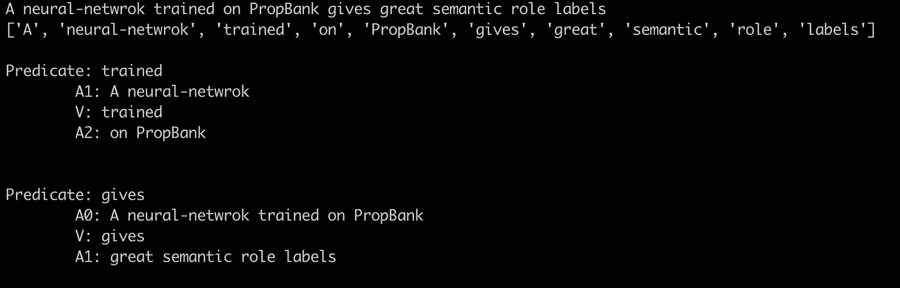
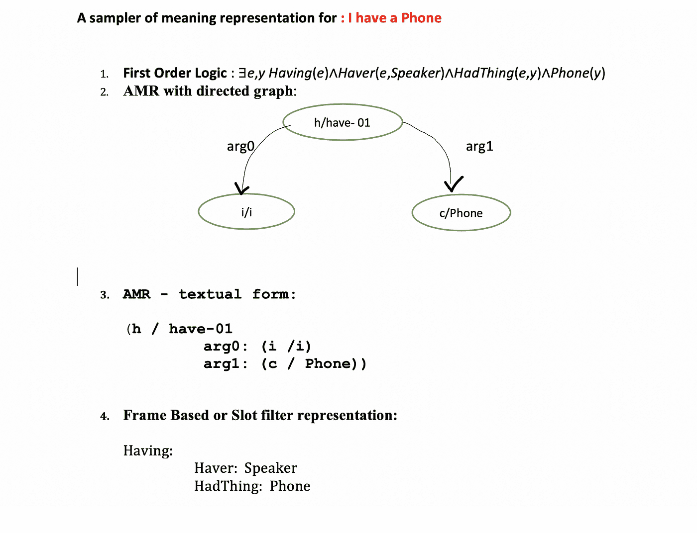
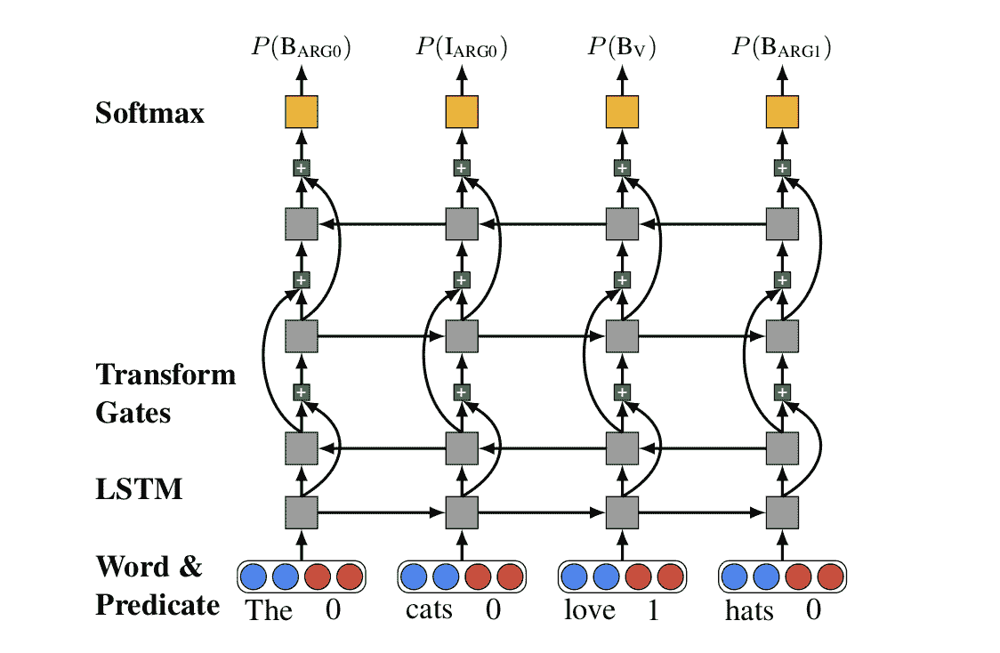

# 意义表征与 SRL:假设存在某种意义

> 原文：<https://towardsdatascience.com/meaning-representation-and-srl-assuming-there-is-some-meaning-741f35bfdd6?source=collection_archive---------9----------------------->

## 对意义表征及其需要的详细描述



# 什么是意义表征

意义表征可以被理解为微妙的语言细微差别和我们关于世界的常识性非语言知识之间的桥梁。它可以被看作是一种捕捉语言输入意义的形式结构。在这样做的时候，我们假设任何给定的语言结构都有一些可以用来表达世界状态的东西/信息。

我们如何意识到有人赞扬或侮辱了我们？这就是对意义表征的需求产生的地方。我们通过将语言输入分解成有意义的结构并将其与我们对现实世界的知识联系起来来理解这一点。在这种情况下，它可以是我们对一个特定的人的了解，我们对以前的经历和与那个人的关系的了解，我们对那个特定时刻的了解等等。

# 如何表达一个句子的意思

有四种常用的意义表示语言:

*   一阶逻辑
*   使用有向图的抽象意义表示
*   使用文本形式的抽象意义表示
*   基于帧或槽的过滤器表示

在下图中，句子“我有一部电话”有四个联系人。



这些方法之间没有太大的区别。他们都认为意义表征是由与对象相对应的结构、对象的属性以及它们之间的关系构成的。

# SRL——为什么还要学习和理解一种表现形式？

类似的事件可以用各种不同的结构和句子的混合体来表达。像语义角色标签这样的表征帮助我们捕捉表达相同思想的不同句子之间的共同结构。它帮助我们在我们描述事件的各种方式中识别和提取事件和参与者。我们也有像深层角色和主题角色这样的其他表现形式，但它们有其局限性。深层角色是特定于某个事件的，而主题角色则捕捉了深层角色的参与者之间的语义共性。尽管主题角色是最古老的语义概念之一，但是一致同意的规则要么是非常抽象的级别，即非常少的规则——仅代表少数高层次的想法，要么是非常低级的级别，即大量的规则——详细地代表特定的事件。语义规则可以被看作是一种在高层次和低层次的结构化表示中表示任何语言结构的方法。

SRL 或者如我们所知，语义角色标注帮助我们理解谓词和它的论元之间的语义关系。它帮助我们回答诸如谁在何时何地对谁做了什么之类的问题。语义角色标注是为每个谓词的每个论元自动找到语义角色的任务。

# 语义角色标记—随着时间的推移而进步

关于语义关系的最古老的工作可以追溯到公元前 8 世纪左右。as . t . a . ̄dhya ̄ȳı——8 本书的集合，描述了 3959 部佛经中梵语的语言结构——一个类似于现代形式语言理论机制的规则体系。̄dhya ̄y ̄ı也有一套规则来描述动词和名词论元之间的语义关系，回答诸如谁在何时何地对谁做了什么之类的问题。这是已知最古老的关于事件和参与者之间语义表达的著作。

如果没有各种语言资源的开发，获得训练 SRL 模型的特征是不可能的，例如，Fillmore(1968)和 Gruber(1965)的主题规则的现代表述，Levin-List 形式的 3100 个英语动词和相应语义类的列表(1993)，Kippler 等人的将 Levin-List 链接到 WordNet 和 FrameNet(2000)，如 Penn TreeBank(1993 和以后)的大型句法注释英语语言数据语料库， 用语义角色注释句子语料库，如 PropBank(语义注释的 Penn treebank 英语)和 FrameNet 一组定义的框架特定语义角色，称为框架元素，包括一组使用这些谓词的谓词。

当前大多数 SRL 方法都是基于有监督的基于特征的机器学习算法。以下伪代码给出了基于特征的 SRL 模型的更多见解:

```
*def SemanticRoleLabel(words):
     semantic_role_dict = {}
     ## parsing the words to get maximum coverage
     parsed_words = Parse(words) 
     for each predicate in parsed_words:
         for each node in parsed_words:
     #a feature extraction function to extract needed features
             node_feature = ExtractFeature(node, predicate, parse)
     #a 1 of N class classifier to get semantic role
             semantic_role = Classify_Node(node, parse, featurevector)

        semantic_role_dict[node] = semantic_role
     return semantic_role_dict*
```

大多数 SRL 系统是建立在语义角色自动标注(Gilda 和 Jurafsky，2000)的基础上的，它包括的特征有:支配谓词、短语类型、成分中心词、成分到谓词的路径等。研究人员也花了很多时间提出最佳的分类方法和优化技术。

# SRL 邮报第三波神经网络

语义角色标记的深度模型的大多数当前技术状态是基于使用双向 LSTM 网络处理生物标记的输入数据作为参数和相关的嵌入层。网络的深度一般在 6 到 8 LSTM 层左右。是由何等人提出的网络架构师模型。(2017)在他的作品《深层语义角色标签:什么起作用，下一步是什么》中。



```
The goal is to maximize the probaility of tag-sequence y -- given the input sequence of words.
y^ = argmaxP(y|w)y∈T
```

在此之后，最近的其他工作也引入了一些伟大的想法，并进一步提高了模型的准确性，看起来在不久的将来，这些网络还会有更多的迭代。[谭等](https://arxiv.org/abs/1712.01586)将自关注引入到基于 LSTMs 的网络中，以获得更好的准确性和更好的全局优化，【何】等将句法信息作为另一个输入点添加到网络中，以获得输入数据的更详细表示。来自[斯特鲁贝尔等人](https://arxiv.org/abs/1804.08199)的最新作品。结合了多头自我关注和语法信息，以实现最先进的结果。该模型 LISA 是一个结合了多头自我关注和多任务学习的神经网络模型，它采用仅使用原始标记作为输入的语法，仅对序列进行一次编码，以同时对所有谓词执行解析、谓词检测和角色标记。通过训练一个注意力头来关注每个单词的语法双亲来合并语法。

最后，语义角色标注是一种强大的方法，它弥合了人类语言和计算机理解之间的鸿沟。随着神经网络的快速发展和声控助手的快速发展，SRL 只会成为一个更重要的研究领域。

参考资料:

*   [伦纳德·布龙菲尔德选集](https://www.press.uchicago.edu/ucp/books/book/chicago/L/bo3618628.html)
*   语言科学史。1.泰尔班德
*   [宾州树木银行](https://catalog.ldc.upenn.edu/docs/LDC95T7/cl93.html)
*   [语义网络:它们的计算和用于理解英语句子](http://www.cs.cmu.edu/~dgovinda/pdf/semantics/Semantic%20Networks.pdf)
*   [语义角色的自动标注](https://www.cs.rochester.edu/~gildea/gildea-cl02.pdf)
*   [带自我关注的深层语义角色标注](https://arxiv.org/abs/1712.01586)
*   [语义角色标注语法，是，还是不是](https://aclweb.org/anthology/P18-1192)
*   [语义角色标注的语言信息自我注意](https://arxiv.org/abs/1804.08199)
*   伯克利框架网络项目
*   [CoNLL-2005 共享任务介绍:语义角色标注](https://aclweb.org/anthology/papers/W/W05/W05-0620/)
*   [语音和语言处理—第 14 章](https://web.stanford.edu/~jurafsky/slp3/)，第 18 章
*   [语义理论的结构](https://www.jstor.org/stable/411200?seq=1#page_scan_tab_contents)