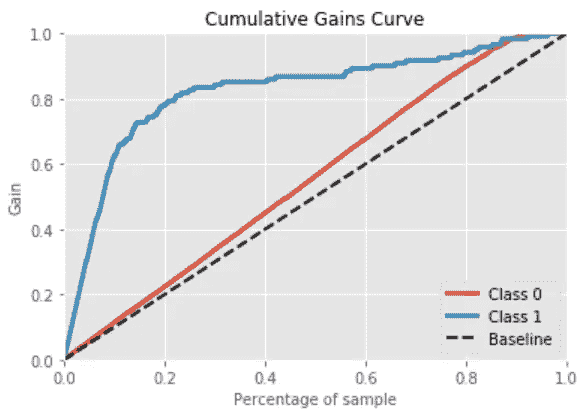
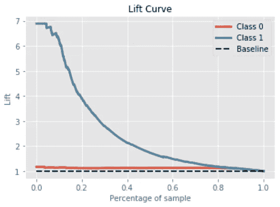

# 有意义的指标:累积收益和 Lyft 图表

> 原文：<https://towardsdatascience.com/meaningful-metrics-cumulative-gains-and-lyft-charts-7aac02fc5c14?source=collection_archive---------5----------------------->

*如今，所有大公司都非常依赖他们的数据科学能力。就分析的复杂性和多样性而言，业务数据单元变得越来越大，越来越复杂。然而，将数据科学解决方案成功交付到业务现实中很大程度上取决于调查结果的***。即使开发的模型提供了出色的准确性分数，如果它们不符合各种商业利益相关者的需求，它们也可能被忽略。**

**

*所有受欢迎的 ROC AUC 分数对于业务部门来说信息不足，因为它对于非技术经理来说是抽象的。出于后一个原因，我将提出两个有意义的指标，每个分析师在说明他们的模型结果时都应该考虑:累积收益和提升图。我将展示电信行业中客户流失案例研究的例子。*

*想象一个业务场景，当一家电信公司决定通过向其 20%的客户提供一个月的无限制数据使用来最小化客户流失率。其中一位经理建议，为了使促销不偏不倚，应该按照姓氏顺序向每五位顾客发送一份礼物。决定差不多了:除非有人为这次营销推广提出更好的策略。*

*有了客户的样本数据(实际上可以从我的 GitHub 访问)，我们将决定建立一个 RandomForestClassifier 模型来预测促销开始前的客户流失。然后我们会对数据进行预处理，去掉不必要的列，消除多重共线性，可视化。最后一步:用 GridSearchCV 进行模型训练和优化。然而，这篇文章不是关于这个项目的；这是关于你的发现的可解释性。这个案件的问题仍然没有答案。*

*为此，我将展示累积增益和升力曲线。累积收益曲线是一条评估曲线，用于评估模型的性能，并将结果与随机选择进行比较。它显示了根据该模型，当考虑到某一百分比的人口最有可能成为目标时，所达到的目标的百分比。在 python 中，我们提供了 [*scikitplot 库*](https://buildmedia.readthedocs.org/media/pdf/scikit-plot/stable/scikit-plot.pdf) ，它将为我们制作绘图。*

```
*import scikitplot as skplt# Deriving Class probabilities
predicted_probabilities = model_rf_best_params.predict_proba(x_test)# Creating the plot
skplt.metrics.plot_cumulative_gain(y_test, predicted_probabilities)*
```

*首先，我们根据模型的输出对所有的观察值进行排序。在水平轴的左侧，我们根据模型将最有可能成为目标的观察值放置在右侧，反之亦然。在我们的例子中，在水平轴的 20%点，具有最高概率的 80%观察值被定位。在垂直轴上，曲线指示该曲线中包括的所有目标的百分比。因此，如果我们可以瞄准 20%的观察值，模型将确保总共 80%的搅动者在这个组中，而随机选择将只提供 20%的目标。*

**

*除了累积增益曲线之外，升力曲线也是一种广泛使用的模型性能可视化方法。确切地说，lift 是对目标模型在预测或分类具有增强反应的病例(对于整个人群)方面的性能的一种度量，相对于随机选择目标模型进行测量。构建升力曲线遵循与形成累积增益曲线相似的过程。事实上，它是从增益图中推导出来的。首先，我们在水平轴上排列观察值，最有可能成为左边的目标，反之亦然。在垂直轴上，提升曲线指示该组中包括的目标比平均目标多多少倍。Lift 计算为分类和随机模型的累积收益之比。考虑 20%的提升(期望的提升目标)；我们可以注意到，前 20%的观察值包含了 80%的目标。如果目标的平均发生率是 20%，那么升力是 4。因此，与没有模型的随机寻址相比，该模型允许为该组寻址四倍多的目标。*

```
*#Scikitplot library is there to help
skplt.metrics.plot_lift_curve(y_test, predicted_probabilities)*
```

**

*最终，我们准备好展示营销策略的发现。借助我们的模型，如果公司向 20%的客户提供免费促销，我们可以锁定 80%的顾客。而在随机选择的情况下，我们只能关注 20%的搅拌器。*

*因此，我们能够观察到累积增益和升力图是决策和模型评估的有用工具。它们不仅相对容易被有技术背景的专业人士理解，也相对容易被其他人理解。最终，这些图表可以应用于各种领域，如市场细分目标、财务预算、人力资源评估等。*

*对于完整的实现，请参考我的 [GitHub 库](https://github.com/raffisahakyan/Plot_Templates/blob/master/Cumulative%20Gains%20and%20Lyft%20Charts.ipynb)并随意使用[该数据](https://github.com/raffisahakyan/Raw_Data/blob/master/Churn%20(1).xls)进行相同的分析，还包括其他分类模型:GradientBoostingClassifier、LogisticRegression 等。*

****尝试，失败，学习，成功。****