# 数据挖掘和机器学习中的相似性度量

> 原文：<https://towardsdatascience.com/measures-of-proximity-in-data-mining-machine-learning-e9baaed1aafb?source=collection_archive---------0----------------------->

## 在分析过程中执行数据转换

Video version of the story, if you are into that sort of thing

在 [*我之前的一个帖子*](/assessing-the-quality-of-data-e5e996a1681b) 里，我讲过 ***评估数据挖掘的数据质量&机器学习算法*** 。这个就继续那个，如果还没看的话，这里看一下**以便对我在文章中要讲的话题和概念有一个恰当的把握。**

**两个对象之间的接近度是两个对象的相应属性之间的接近度的函数。接近度是指**相似度和相异度**。相似性和不相似性很重要，因为它们被许多数据挖掘技术使用，如聚类、最近邻分类和异常检测。**

**我们将从高级定义开始讨论，并探索它们之间的关系。然后，我们继续讨论具有一个简单属性的两个数据对象中的**接近度**，并继续讨论具有多个属性的对象。**

> **请容忍我的概念部分，我知道这可能有点无聊，但如果你有强大的基础，那么没有什么可以阻止你成为一名伟大的数据科学家或机器学习工程师。**

> ****什么是相似性？****

**→这是两个对象相似程度的数字度量。**

**→对于更相似的一对对象，该值更高。**

**→通常为非负值，介于 0 和 1 之间。**

> **0 ~没有相似性，1 ~完全相似**

> **什么是不同？**

**→它是两个对象不同程度的数值度量。**

**→对于更相似的一对对象，较低。**

**→范围 0 至*无穷大*。**

## **变换函数**

**这是一个函数，用于将相似性转换为不相似性，反之亦然，或者将接近度转换为特定范围。例如:**

> **s' = (s-min(s)) / max(s)-min(s))**

**在哪里，**

***s’*=新转换的邻近测量值，**

***s* =当前接近度测量值，**

***最小值* =邻近测量值的最小值，**

***最大值* =最大接近度测量值**

**这个转换函数只是所有可用选项中的一个例子。**

## **简单属性之间的相似和相异**

**具有多个属性的对象的接近度通常通过组合单个属性的接近度来定义，因此，我们首先讨论具有单个属性的对象之间的接近度。**

**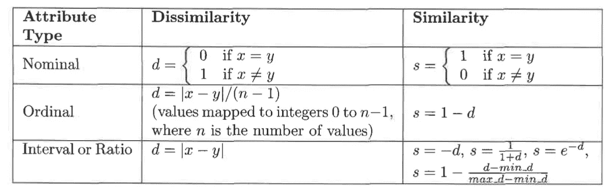**

**Introduction to Data Mining — Pang-Ning Tan, Michael Steinbach, Vipin Kumar**

**为了更好地理解它，让我们看一些例子。**

*   **考虑由一个**名义**属性描述的对象。如何像这样比较两个物体的相似度？名义属性只告诉我们对象的独特性。因此，在这种情况下，如果属性值匹配，则相似性被定义为 1，否则，相反定义的相似性为 0。**
*   **对于具有单个**序数**属性的对象，情况更复杂，因为需要考虑关于顺序的信息。考虑一个衡量产品质量的属性，等级为{差、一般、好、好、极好}。我们有三个产品 P1，P2，& P3，质量分别为极好，良好，&还行。为了比较有序的数量，它们被映射到连续的整数。在这种情况下，如果刻度分别映射到{0，1，2，3，4}。那么，不同(P1，P2)= 4–3 = 1。**
*   **对于**区间或比率**属性，两个对象之间相异度的自然度量是它们值的绝对差值。例如，我们可以通过说“我重了十磅”来比较我们现在的体重和一年前的体重**

**如果你不知道不同的属性类型，即**名义的、序数的、区间的和比率的**，那么让[阅读我以前的关于属性](/journey-into-data-mining-3b5ccfa5343)到不同类型的分布的文章。**

** [## 数据挖掘之旅

### 数据导论

towardsdatascience.com](/journey-into-data-mining-3b5ccfa5343)** 

**接下来，我们将分别讨论数据对象之间的相似性和不相似性。事不宜迟，让我们开始吧。**

## **数据对象之间的差异**

**我们从讨论距离开始，距离具有不同的性质。**

> ****欧几里德距离****

**在一维、二维、三维或更高维空间中，两点 x 和 y 之间的欧几里德距离 d 由以下公式给出:**

**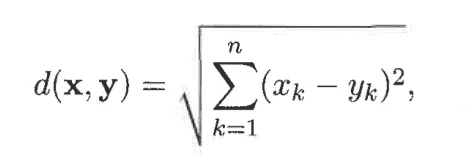**

**Introduction to Data Mining — Pang-Ning Tan, Michael Steinbach, Vipin Kumar**

**其中 n 是维数， *x(k)* 和 *y(k)* 分别是 *x* 和 *y* 的*k*属性(组件)。**

*****举例:*****

**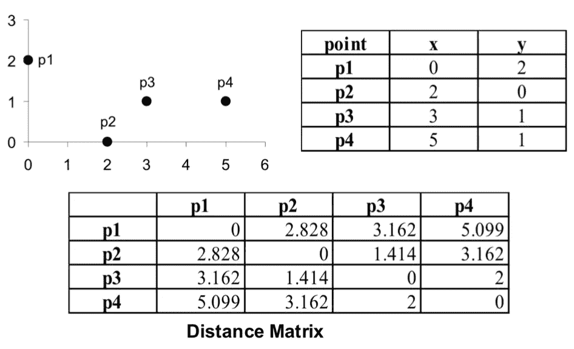**

**Introduction to Data Mining — Pang-Ning Tan, Michael Steinbach, Vipin Kumar**

> ****闵可夫斯基距离****

**它是欧几里得距离的推广。它由以下公式给出:**

**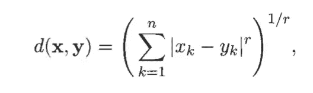**

**其中 *r* 是一个参数。以下是闵可夫斯基距离的三个最常见的例子。**

**→ *r = 1* 。城市街区(曼哈顿、出租车、*、L1 定额*)距离。一个常见的例子是**汉明距离**，它是仅具有二进制属性的两个对象之间，即两个二进制向量之间不同的位数。**

**→ *r = 2* 。欧几里德距离( *L2 范数*)。**

**→ *r =无穷大*。上确界( *L(最大)，或 L(无穷大)范数*)距离。这是对象的任何属性之间的最大差异。这由以下公式定义:**

**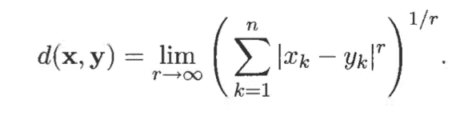**

*****举例:*****

**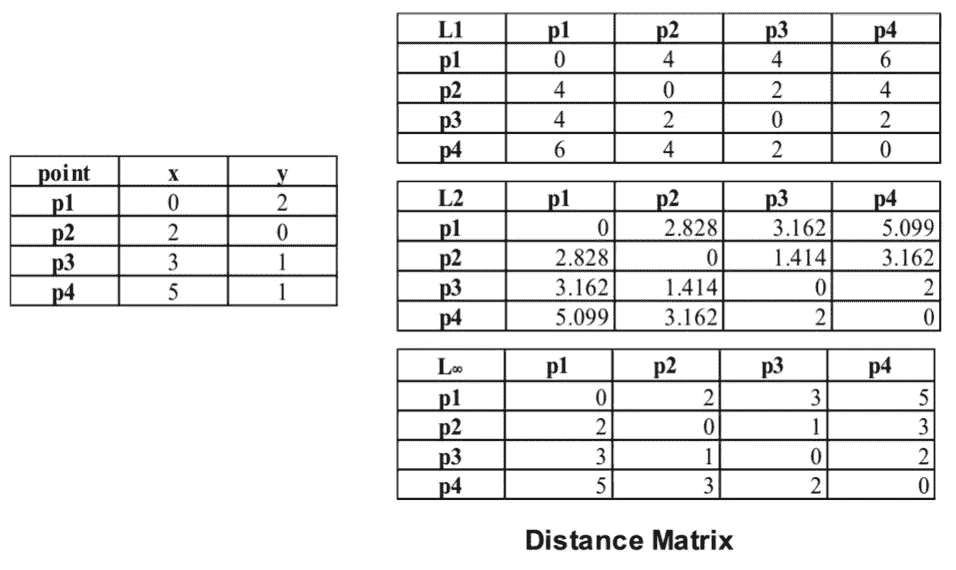**

**Introduction to Data Mining — Pang-Ning Tan, Michael Steinbach, Vipin Kumar**

**距离，如欧几里德距离，有一些众所周知的性质。如果 *d(x，y)* 是两点之间的距离， *x* 和 *y* ，那么以下性质成立。**

1.  ****积极性****

**a) *d(x，y) > 0* 对于所有 *x* 和 *y* ，**

**b) *d(x，y) = 0* 仅当 *x = y***

**2.**对称**
*d(x，y) = d(y，x)* 对于所有 *x* 和 *y***

**3.**三角形不等式****

***d(x，z) ≤ d(x，y) + d(y，z)* 对于所有点 *x，y* 和 *z***

**满足所有这三个属性的度量被称为**度量。****

## **数据对象之间的相似性**

**对于相似性，三角形不等式通常不成立，但对称性和正性通常成立。明确地说，如果 *s(x，y)* 是点 *x* 和 *y* 之间的相似性，那么相似性的典型性质如下:**

1.  ***s(x，y) = 1* 仅当 *x = y* 时。(0 ≤ *s* ≤ 1)**
2.  ***s(x，y) = s(y，x)* 对于所有 *x* 和 *y* 。(对称)**

**对于相似性度量，没有三角形不等式的一般模拟。**

****二进制数据**的相似性度量被称为**相似性系数**，其值通常在 0 和 1 之间。两个二进制对象之间的比较使用以下四个量来完成:**

**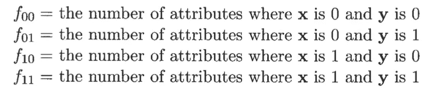**

**Introduction to Data Mining — Pang-Ning Tan, Michael Steinbach, Vipin Kumar**

> ****简单匹配系数****

**其定义如下:**

**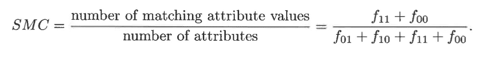**

**Introduction to Data Mining — Pang-Ning Tan, Michael Steinbach, Vipin Kumar**

> ****雅克卡系数****

**其定义如下:**

**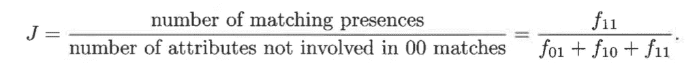**

**Introduction to Data Mining — Pang-Ning Tan, Michael Steinbach, Vipin Kumar**

**比较这两种相似性方法的示例:**

**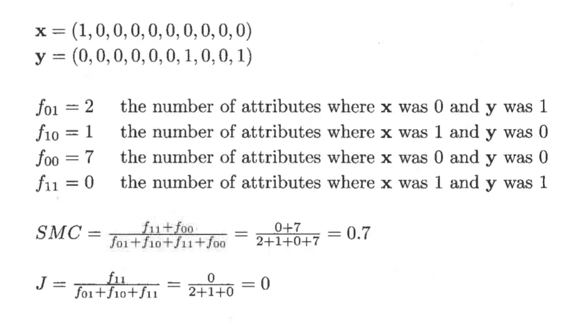**

**Introduction to Data Mining — Pang-Ning Tan, Michael Steinbach, Vipin Kumar**

> ****余弦相似度****

**文档通常表示为向量，其中每个属性表示特定术语(单词)在文档中出现的频率。**余弦相似度**，是一种最常见的度量文档相似度的方法。如果 *x* 和 *y* 是两个文档向量，那么**

**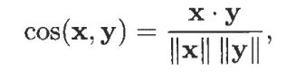**

**Introduction to Data Mining — Pang-Ning Tan, Michael Steinbach, Vipin Kumar**

**在哪里？表示*点积*和 *||x||* 定义向量 *x* 的长度。**

****余弦相似度**度量的一个例子如下:**

**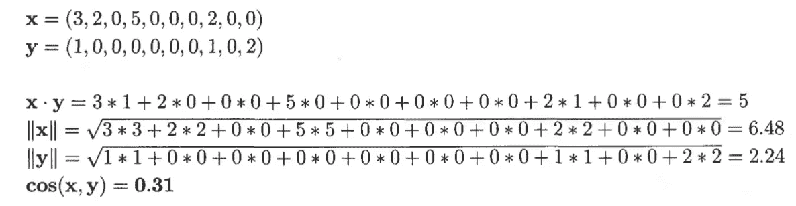**

**Introduction to Data Mining — Pang-Ning Tan, Michael Steinbach, Vipin Kumar**

> ****相关性****

**它是对具有二元或连续变量的对象的属性之间的线性关系的度量。**两个对象 *x* 和 *y* 之间的相关性**定义如下:**

**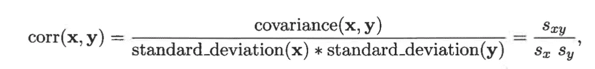**

**Introduction to Data Mining — Pang-Ning Tan, Michael Steinbach, Vipin Kumar**

**其中使用的符号在标准中定义为:**

**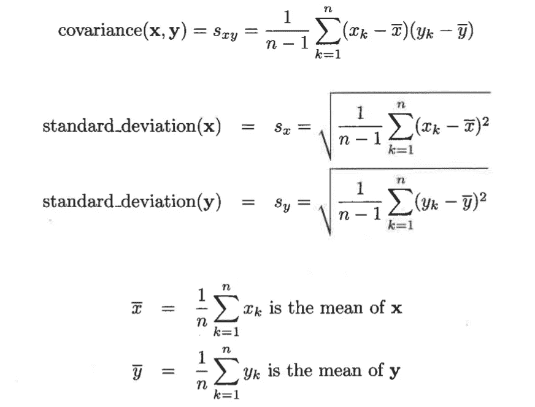**

**Introduction to Data Mining — Pang-Ning Tan, Michael Steinbach, Vipin Kumar**

**直到现在我们已经定义并理解了数据对象之间的相似性和不相似性度量。现在，让我们讨论一下邻近计算面临的问题。**

> ****邻近度计算中的问题****

1.  **如何处理具有不同尺度和/或相关属性的酪蛋白，**
2.  **如何计算由不同类型的属性(例如，定量和定性属性)组成的对象之间的接近度，以及**
3.  **当属性具有不同的权重时，即当并非所有属性对对象的邻近性的贡献相等时，如何处理邻近性计算。**

## **选择正确的邻近测量**

**以下是一些可能有帮助的一般观察。首先，邻近度量的类型应该适合数据的类型。对于许多类型的密集、连续数据，通常使用公制距离度量，如**欧几里德距离**。**

**连续属性之间的接近度通常用**差异**来表示，而**距离**度量提供了一种将这些差异组合成整体接近度的明确方法。**

**对于通常由不对称属性组成的稀疏数据，我们通常采用忽略 0–0 匹配的相似性度量。从概念上讲，这反映了这样一个事实:对于一对复杂的对象来说，相似性取决于它们共有的特征的数量，而不是它们都缺少的特征的数量。对于这类数据，可以使用**余弦相似度**或**雅克卡系数**。**

**以上只是一些需要坚持或者可以遵循的建议。它们没有涵盖所有类型的现有[数据集](/types-of-data-sets-in-data-science-data-mining-machine-learning-eb47c80af7a)。**接近度测量**的最终确定取决于问题。**

**我们对邻近度的讨论到此结束。**

**这个帖子的后续是[这里](/data-preprocessing-in-data-mining-machine-learning-79a9662e2eb)。**

** [## 数据挖掘和机器学习中的数据预处理

### 有了详细的概念…

towardsdatascience.com](/data-preprocessing-in-data-mining-machine-learning-79a9662e2eb)** 

**我将免费赠送一本关于一致性的电子书。在这里获得你的免费电子书。**

**如果你喜欢阅读这样的故事，那么你应该 [**在你的收件箱**](https://tarun-gupta.medium.com/subscribe) 中收到我的帖子，如果你想支持我成为一名作家，考虑[注册成为一名媒体成员](https://tarun-gupta.medium.com/membership)。每月 5 美元，你可以无限制地阅读媒体上的故事。如果你注册使用我的链接，我会赚一小笔佣金，不需要你额外付费。**

** [## 加入我的推荐链接-塔伦古普塔

### 作为一个媒体会员，你的会员费的一部分会给你阅读的作家，你可以完全接触到每一个故事…

tarun-gupta.medium.com](https://tarun-gupta.medium.com/membership) 

感谢阅读。如果你喜欢这个，去看看我在这个索引中的其他文章。

 [## 标记故事列表的快速链接—感谢您的访问

### 我也有一份以快节奏出版为目标的出版物。读书成为作家。

tarun-gupta.medium.com](https://tarun-gupta.medium.com/thank-you-for-visiting-my-profile-9f708062c75e)**