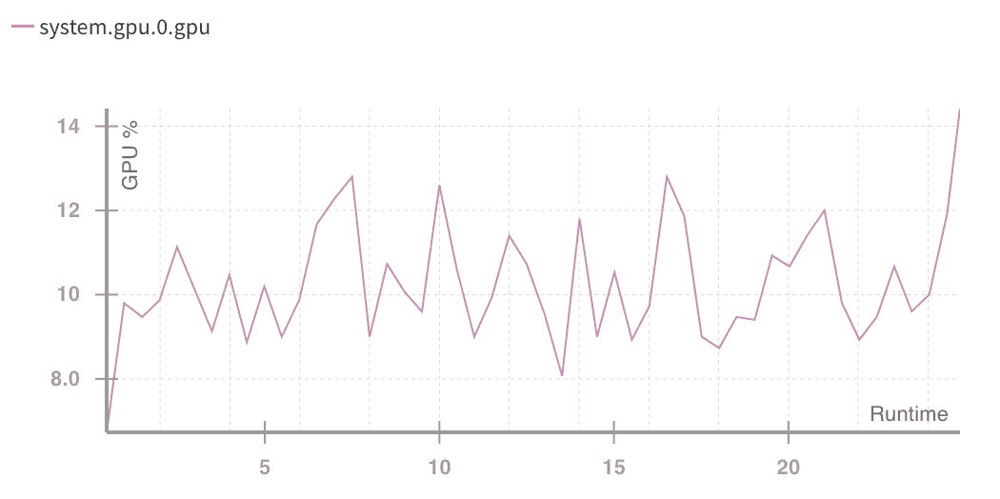

# 监控和改进用于训练深度学习模型的 GPU 的使用

> 原文：<https://towardsdatascience.com/measuring-actual-gpu-usage-for-deep-learning-training-e2bf3654bcfd?source=collection_archive---------7----------------------->

关于运行权重和偏差的一个令人兴奋的事情是，我们可以研究模型如何在真实世界场景中实际使用它们的计算资源，并且，由于我们正在使监控 GPU 和内存变得容易，我们希望通过查看人们如何利用他们的计算资源来帮助我们的用户。


对于接受 GPU 培训的用户，我查看了他们在所有运行中的平均利用率。自发布以来，我们已经跟踪了大量用例、技术和框架的运行。近三分之一的用户平均利用率低于 15%。平均 GPU 内存使用量非常相似。我们的用户往往是经验丰富的深度学习实践者，GPU 是一种昂贵的资源，所以我很惊讶地看到如此低的平均使用率。

这里有几个简单、具体的建议来提高 GPU 的使用率，几乎适用于所有人:

1.  **在整个训练过程中持续测量您的 GPU 使用情况**

不测量就无法提高 GPU 使用率。使用 nvidia-smi 等有用的工具来捕捉您的使用情况并不难，但发现问题的一个简单方法是跟踪一段时间的使用情况。任何人都可以使用我们构建的 wandb python 包，通过添加两行代码来跟踪 GPU、CPU、内存使用和其他指标

```
import wandb
wandb.init()
```

wandb.init()函数将创建一个轻量级子进程，该子进程将收集系统指标并将它们发送到 wandb 服务器，您可以在服务器上查看这些指标，并使用如下图形进行比较:



进行单一测量的危险在于 GPU 的使用会随着时间而变化。这是我们在用户 Boris 训练 RNN 时看到的常见模式；训练中期，他的使用率从 80%骤降到 25%左右。


你可以在 https://app.wandb.ai/borisd13/char-RNN/runs/cw9gnx9z/system 的[看到他完整的数据和训练日志。](https://app.wandb.ai/borisd13/char-RNN/runs/cw9gnx9z/system)

我们经常看到的一个与多 GPU 相关的情况是，在训练过程中，一些 GPU 停止处理任何负载。在这个示例中，两个 GPU 都开始进行计算，但几分钟后，所有负载都被发送到一个 GPU。这可能是有意的，但这通常是代码中难以捕捉的 bug 的迹象。


我们看到的另一个常见问题是，有很长一段时间没有使用 GPU，这通常与培训中的测试或验证阶段或一些数据预处理的瓶颈相对应。这是一个典型的图表，在 8 个 GPU 上进行训练，其中所有的 GPU 都在固定的时间间隔内关闭并等待一段时间。


**2)确保你的 GPU 是瓶颈**

这是我们看到的一种常见情况——系统内存被大量使用，并且内存使用量似乎在逐渐增加。随着内存使用率的上升，GPU 使用率下降。当人们试图在本地不可用的数据集上进行训练时，我们也经常看到网络成为瓶颈。


**3)尝试增加你的批量**

这并不是在所有情况下都有效，但是一种可能提高 GPU 利用率的简单方法是增加批处理大小。批处理的梯度通常在 GPU 上并行计算，因此只要有足够的内存将整个批处理和神经网络的多个副本放入 GPU 内存，增加批处理大小就可以提高计算速度。

如果我增加批处理大小，而其他什么都不改变，我可能会得出结论，增加批处理大小会加快计算速度，但会降低模型性能。以下是我用批量 32、64 和 128 训练 CIFAR 的结果。


事实上，在 StackOverflow 上有许多[的论文](https://arxiv.org/pdf/1609.04836.pdf)和一个[的置顶帖](https://stats.stackexchange.com/questions/164876/tradeoff-batch-size-vs-number-of-iterations-to-train-a-neural-networ)警告大批量生产。有一种简单的方法可以让更大的批量工作得相当好。随着批量的增加，提高学习速度。直观地说，这是有意义的，批量大小是训练算法在进行一步之前查看的样本数量，学习率大致是该步的大小。因此，如果模型看更多的例子，它可能会舒服地迈出一大步。这是在论文[中推荐的一个并行化卷积神经网络的奇怪技巧](https://arxiv.org/pdf/1404.5997.pdf)以及随后的[精确、大型迷你批处理 SGD:在 1 小时内训练 ImageNet](https://arxiv.org/pdf/1706.02677.pdf)中，作者在看到性能损失之前设法将批处理大小增加到 8000。

我尝试在我自己的模型上增加批量的学习率，并得到了相同的结论。当我将学习率乘以 4，将批量增加 4 时，我的模型训练得更快，每一步学习得也更快。


脸书的论文做了一些奇特的事情，使模型在非常大的批量下工作良好，他们能够获得相同的性能，但速度要快得多，每批高达 8000 个样本。


这些巨大的批量对于分布式训练来说是有意义的，论文中从较低的学习率开始，然后逐步提高的方案在这种情况下看起来非常有价值。如果你正在一个 GPU 上训练，并且没有最大化你的利用率，我有一个快速的建议:加倍你的批量大小和加倍你的学习速度。

您可以在[批量报告](https://app.wandb.ai/l2k2/cifar/reports?view=l2k2%2FBatch%20Size%20Comparison)中深入了解我运行的更多数据。

**结论**

GPU 变得越来越快，但如果训练代码没有完全使用它们也没关系。好消息是，对于大多数训练机器学习模型的人来说，仍然有许多简单的事情要做，这将显著提高效率。

还有另一种可能更大的资源浪费:闲置的 GPU。我们没有衡量这一点，但我从许多与我们合作的公司那里听说过。很难有效地为 GPU 排队工作，在典型的工作流程中，研究人员将设置大量的实验，等待它们完成，然后花相当多的时间消化结果，而 GPU 却处于闲置状态。这超出了 wandb 的范围，但是像 [Paperspace](https://www.paperspace.com/) 和亚马逊的 [Sagemaker](https://aws.amazon.com/sagemaker/) 这样的工具可以很容易地根据需要上下旋转资源。

**感谢**

感谢萨姆·波廷杰、凯里·菲尔普斯、詹姆斯·查姆、焰炟·厄尔利希、斯蒂芬妮·谢尔的编辑和反馈。