# 贝塔几何负二项分布— CLTV 预测模型

> 原文：<https://towardsdatascience.com/measuring-customers-value-using-python-lifetimes-d8b19a04e9c1?source=collection_archive---------14----------------------->

## 与 CLTV 相关的近期、频率和货币

## 使用概率建模方法的 CLTV

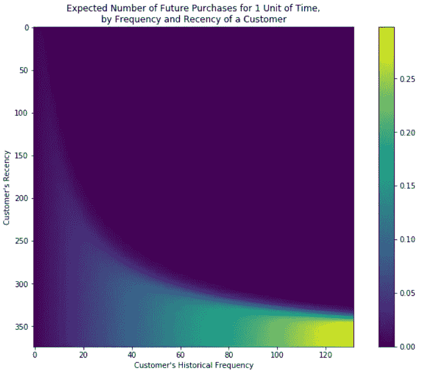

Image by author

[https://sarit-maitra.medium.com/membership](https://sarit-maitra.medium.com/membership)

C 客户生命周期价值(CLTV)是现代以客户为中心的商业场景中最重要的指标之一。它是一个指标，表明在整个关系中，一个企业可以从单个客户那里合理期望的总收入。与 CLTV 的业务不仅量化的关系，但优先考虑的 CRM 活动，并采取必要的步骤，以保持现有的客户满意。这也有助于公司关注那些未来能带来更多收入的潜在客户。

> 80%的结果来自 20%的原因，这就是所谓的 80/20 法则或帕累托法则……维尔弗雷多·帕累托。

如果我们把帕累托法则放在商业环境中，我们可以有把握地假设 20%的关键客户贡献了 80%的业务收入。许多研究开发了评分机制(例如预测客户未来行为的回归模型)。在所有的实证分析中，对客户过去行为的衡量是他们未来行为的关键预测指标。通常的做法是通过调查近期、频率和货币(RFM)特征来总结客户过去的行为。

让我们使用下面一些简单的等式:


*客户价值=平均订单价值(AOV)*购买频率*


*   *流失率:流失率是没有再次订购的客户的百分比。*
*   *客户寿命= 1/流失率*
*   *流失率= 1-重复率*

上面的公式看起来很简单；然而，在给定历史数据的情况下，预测未来销售额和美元值的 CLTV 测量涉及预测分析方面的复杂性。这可以使用回归技术或概率建模方法来完成。

## 目标:

我们的目标是建立一个概率模型，在非合同环境下预测个人业务层面的 CLTV。利用本练习的结果，经理应该能够:

*   *区分活跃客户和不活跃客户，*
*   *为个人客户生成交易预测，*
*   *预测整个客户群的购买量。*

## 方法:

此处展示的随机模型以贝塔几何负二项分布(BG/NBD)框架为特色，以捕捉一段时间内的交易流。BG/NBD 讲述了客户如何/何时变得不活跃的故事。

BG/NBD 只需要关于每个客户过去购买历史的两条信息:“最近”(最近一次交易发生的时间)和“频率”(在特定时间段内进行了多少次交易)。用于表示该信息的符号是[X = x，t(x)，T]，其中 X 是在时间段(0，T)和 t(x) (0 < t(x) ≤T) is the time of the last transaction. Using these two key summary statistics, SMC(2) derive expressions for a number of managerially relevant quantities, such as:

> E[X(t)], the expected number of transactions in a time period of length t, which is central to computing the expected transaction volume for the whole customer base over time.
> 
> P[X(t) = x], the probability of observing x transactions in a time period of length t.
> 
> E[Y (t)| X = x, t(x), T], the expected number of transactions in the period (T,T + t] for an individual with observed behavior (X = x, tx, T).

Therefore, customers will purchase at a randomly distributed interval within a time range. After each purchase they have a certain probability of dying or becoming inactive. Each customer is different and have varying purchase intervals and probability of going inactive.

Let’s explore the data.

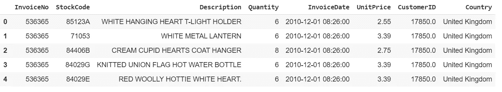

# BG/NBD Model:

*   Frequency (F) is the number of repeat purchases the customer has made.
*   T represents the age of the customer which is equal to the duration between a customer’s first purchase and the end of the period under study.
*   Recency (R) is the age of the customer when they made their most recent purchases. This is equal to the duration between a customer’s first purchase and their latest purchase.
*   Monetary Value

After doing the necessary cleaning and creating a new data frame containing CustomerID, InvoiceDate (remove the time) and adding a new column (‘sales’) :

```
data[‘InvoiceDate’] = pd.to_datetime(data[‘InvoiceDate’]).dt.date
data = data[pd.notnull(data[‘CustomerID’])]
data = data[(data[‘Quantity’]>0)]
data[‘Sales’] = data[‘Quantity’] * data[‘UnitPrice’]
cols_of_interest = [‘CustomerID’, ‘InvoiceDate’, ‘Sales’]
data = data[cols_of_interest]
print(data.head())
print(data[‘CustomerID’].nunique())
```

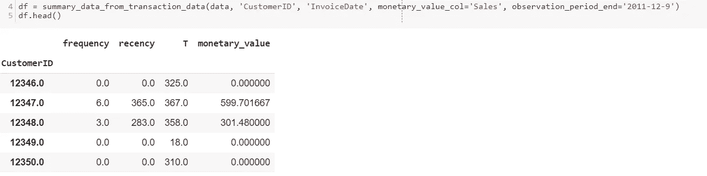

We can make some observations here. There are 4339 customers and 12346 made single purchase, so the F and R are 0, and the T is 325 days.

```
df[‘frequency’].plot(kind=’hist’, bins=50)
print(df[‘frequency’].describe())
print(sum(df[‘frequency’] == 0)/float(len(data)))
```

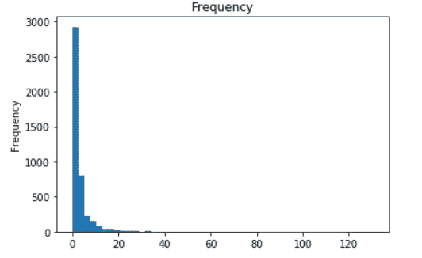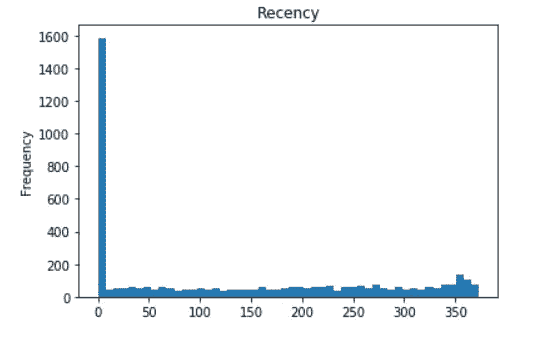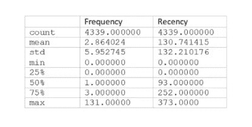

As shown, both frequency and recency are distributed quite near 0\. Among all customers, >)中观察到的交易数量，其中 38%的人只进行了零次重复购买，而其余的样本(62%)被分成两个相等的部分:31%的客户群进行了一次重复购买，而另外 31%的客户群进行了一次以上的重复购买。类似地，就近期而言，大多数消费者在他们一生中的早期进行了最后一次购买，然后变得不活跃。事实上，我们一半的客户的最后一次重复购买是在不到一年的时间内(准确地说是 252 天)，因为他们第一次购买了 75 个分位数。

## 现在让我们开始讨论模型:

我们首先需要将客户概率模型与数据相匹配，以便它能够反映他们的行为和模式。这是通过查看每个人的频率、最近和年龄并调整其参数来实现的，以便更好地反映我们的客户群购买的时间间隔。

不同客户的参数也各不相同，因此它是通过两种分布计算的，以便更准确、更灵活地拟合数据。从数学上讲，这是通过在两个分布上取方程的期望值来完成的。

```
bgf = BetaGeoFitter(penalizer_coef=0.0)
bgf.fit(df[‘frequency’], df[‘recency’], df[‘T’], )
print (bgf)

# Plot
gbd = beta.rvs(bgf.params_[‘a’], bgf.params_[‘b’], size = 50000)
ggd = gamma.rvs(bgf.params_[‘r’], scale=1./bgf.params_[‘alpha’], size = 50000)
plt.figure(figsize=(14,4))
plt.subplot(121)
plt.title(‘Heterogenity of $p$’)
temp = plt.hist(gbd, 20, alpha=0.75)
plt.subplot(122) 
plt.title(‘Heterogenity of $\lambda$’)
temp = plt.hist(ggd, 20, alpha=0.75)
```

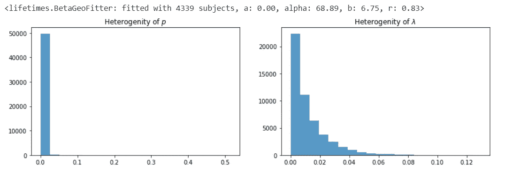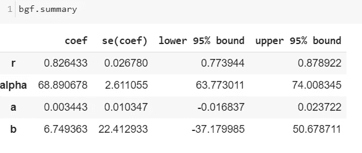

## 可视化 F/R 矩阵；

给定 R(上次购买的年龄)和 F(重复交易的次数),频率/最近矩阵计算客户在下一个时间段的预期交易次数。

该矩阵在 Y 轴上具有客户的最近度，在 X 轴上具有频率，并且热图组件显示了在交叉点处客户在一个单位时间内将进行的未来购买的预测数量。最有可能点餐的顾客是那些之前下过很多订单，最近才被看到的顾客。

```
plot_frequency_recency_matrix(bgf)
```


RF 图描绘了客户在下一年的预期购买量，以及在给定频率/近期的情况下，他们仍然存在的可能性。直观上，我们可以看到，高频率和新近性的客户有望在未来购买更多，并有更高的机会活着。白色区域的客户也很感兴趣，因为他们离开公司的几率是 50/50，但我们仍然可以预计他们在接下来的一年中会购买大约 2 到 2.5 次。这些客户可能需要一些客户服务才能回来购买更多。有趣的是，对于一个固定的近期，更频繁的客户更有可能被认为是死了。这是模型的一个属性，说明了一个清晰的行为故事:

> 如果我们观察到一个更长时间的不活动，而不是顾客以前的间隔时间，那么一个更频繁购物的顾客就更有可能死去。

我们可以看到，如果客户购买了 120 次，而他们最近一次购买(R)是在 120 天之前，那么他们就是你的最佳客户(右下角)。最冷漠的顾客是那些在右上角的顾客:他们很快买了很多东西，几个星期都没见过他们。(20，50)周围的尾部代表不经常购买，但最近没有看到的客户，所以他们可能会再次购买-我们不确定他们是已经死亡还是只是在购买之间。

## 每个客户活着的概率:

我们可以根据每个客户的频率和新近度来想象他们活着的概率。

```
plot_probability_alive_matrix(bgf)
```


最近购买的客户几乎肯定是“活着”的。那些大量购买但不是最近购买的顾客，很可能已经退出。他们过去买的越多，就越有可能辍学。它们被显示在右上方。

## 从最佳到最差排列客户:

让我们将客户从“下期最高预期购买量”到最低进行排序。模型揭示了一种方法，该方法将使用客户的历史记录来预测客户在下一时期的预期购买量。

```
t = 31*3
df[‘predicted_purchases’] = bgf.conditional_expected_number_of_purchases_up_to_time(t, df[‘frequency’], df[‘recency’], df[‘T’])
df.sort_values(by=’predicted_purchases’).tail(10)
```

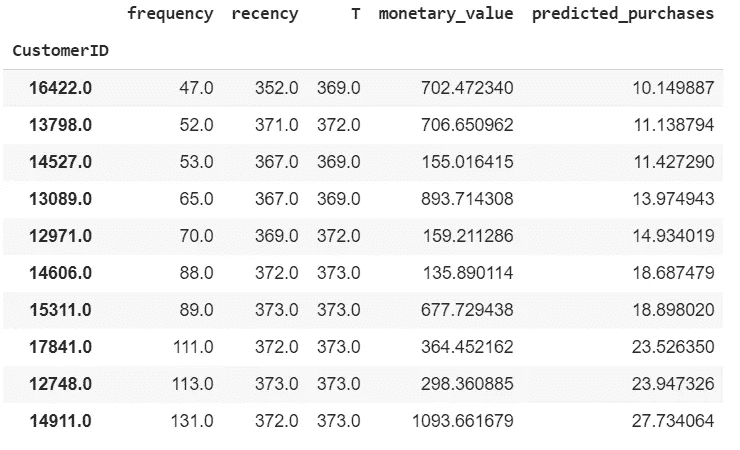

此处列出了我们的前 10 名客户，该模型预计他们将在未来 3 个月内购买。我们可以看到，已经进行了 131 次购买的客户，并且是最近购买的，很可能会在下一期再次购买。predicted_purchases 列显示他们的预期购买数量，而其他三列表示他们当前的 RFM 指标。BG/NBD 模型认为，这些人在不久的将来会进行更多的购买，因为他们是当前的最佳客户。

## 评估模型拟合度(**纳入异质性):**

拟合模型后，我们有兴趣看看它与我们的数据有多相关。首先是将我们的数据与用我们拟合的模型参数模拟的人工数据进行比较。

```
plot_period_transactions(bgf)
```


这两者几乎相同，表明该模型非常适合，并且相当好地预测了校准周期中的周期数。未来会重复购买 0、1、2、3 … 6 次的预期顾客数量。对于每次重复购买的数量(x 轴)，我们绘制出模型预测的数量和实际数量。正如我们所看到的，在最多 6 次重复购买的情况下，fit 几乎没有错误。让我们做下一个事实检查。

但是，计算总误差百分比(预测交易/实际交易-1)和校准期间完成的每笔交易的误差百分比总是一个好主意。这将有助于我们量化模型与现实的接近程度。

## 模型测试:

```
summary_cal_holdout = calibration_and_holdout_data(data, ‘CustomerID’, ‘InvoiceDate’,
 calibration_period_end=’2011–06–08',
 observation_period_end=’2011–12–9' )
print(summary_cal_holdout.head())
```

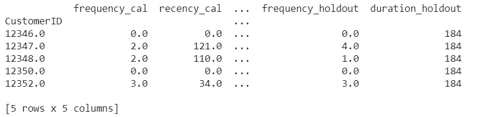

```
bgf.fit(summary_cal_holdout[‘frequency_cal’], summary_cal_holdout[‘recency_cal’], summary_cal_holdout[‘T_cal’])
plot_calibration_purchases_vs_holdout_purchases(bgf, summary_cal_holdout)
```

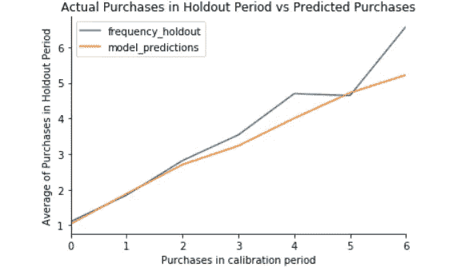

在该图中，我们将数据分为采样(校准)和验证(维持)两个阶段。样本期从年初至 2011 年 6 月 8 日；验证期跨越剩余的持续时间(2011 年 6 月 9 日至 2011 年 12 月 9 日)。该图根据重复购买的次数(x 轴)对校准期内的所有客户进行分组，然后对维持期内的重复购买进行平均(y 轴)。该图根据重复购买的次数(x 轴)对校准期内的所有客户进行分组，然后对维持期内的重复购买进行平均(y 轴)。橙色和蓝色线分别表示 y 轴的模型预测和实际结果。这些线彼此非常接近，这表明该模型在预测每个客户的订单数量方面相差不远。

该模型能够准确预测样本外客户群的行为，该模型低估了 4 次购买和 5 次购买后的行为。

## 客户交易预测:

根据客户历史，我们现在可以预测个人未来的购买情况:

```
t = 10
individual = df.loc[12347]
bgf.predict(t, individual[‘frequency’], individual[‘recency’], individual[‘T’])
```

0.15727742663038222

模型预测客户(id:12347)未来 10 天的交易为 0.157。

# 关键要点:

客户是企业最重要的资产，CLTV 允许在客户群中评估他们当前和未来的价值。CRM 策略和营销资源分配是基于这一指标。如果我们考虑以客户为中心的业务，企业不仅需要预测客户的保留率，还需要分析客户的购买行为。BG/NBD 是与帕累托/NBD 相关的行为故事中的一个微小变化，但是更容易实现。从指数分布过渡到几何过程(以捕捉顾客流失)不需要任何不同的心理学理论，也没有任何值得注意的管理含义。

**我可以到达**[***这里***](https://www.linkedin.com/in/saritmaitra/) ***。***