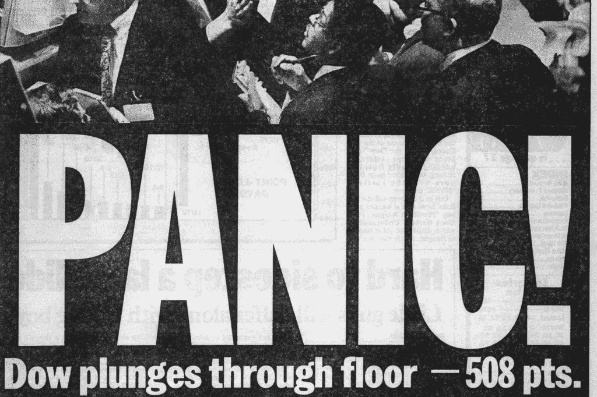
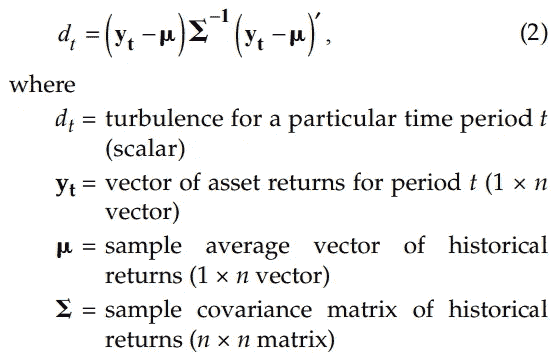
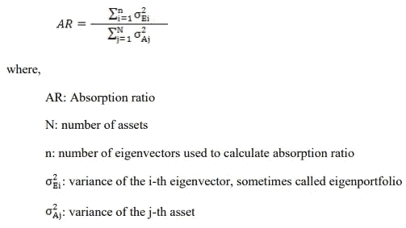
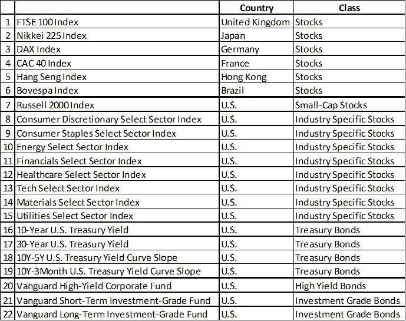
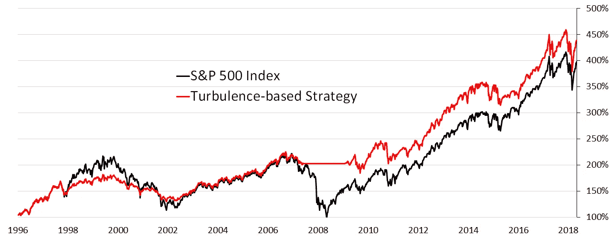
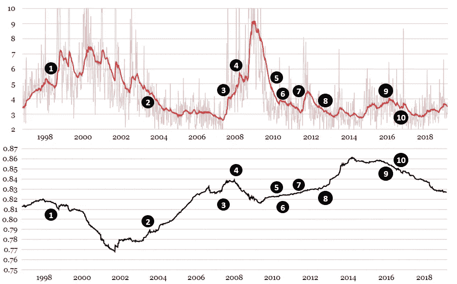
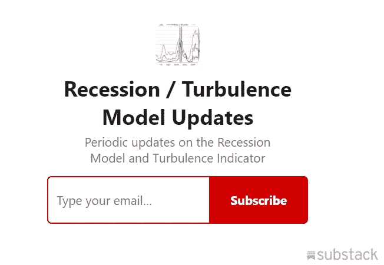

# 衡量金融动荡和系统风险

> 原文：<https://towardsdatascience.com/measuring-financial-turbulence-and-systemic-risk-9d9688f6eec1?source=collection_archive---------9----------------------->

## 这个项目展示了两种测量金融风险的独特方法。

*   要通过电子邮件接收指标值的定期更新，[请点击此处](https://terrencezhang.substack.com/subscribe)。
*   金融动荡和系统性风险指标目前都在这里[主持](https://terrencez.com/financial-turbulence-and-systemic-risk-charts/)。
*   Python 脚本和文档[可以在这里找到](https://github.com/tzhangwps/Turbulence-and-Systemic-Risk)。

# 内容

*   [简单地说](https://medium.com/@tzhangwps/measuring-financial-turbulence-and-systemic-risk-9d9688f6eec1#65ce)
*   [金融动荡指标](https://medium.com/@tzhangwps/measuring-financial-turbulence-and-systemic-risk-9d9688f6eec1#e8a1)
*   [系统性风险指标](https://medium.com/@tzhangwps/measuring-financial-turbulence-and-systemic-risk-9d9688f6eec1#7f93)
*   [数据集](https://medium.com/@tzhangwps/measuring-financial-turbulence-and-systemic-risk-9d9688f6eec1#6eac)
*   [销售宣传(或“这两个指标如何为您赚钱/省钱”)](https://medium.com/@tzhangwps/measuring-financial-turbulence-and-systemic-risk-9d9688f6eec1#28a2)

# 简单地

这个项目展示了两种测量金融风险的独特方法。

**金融动荡指标**衡量全球金融市场随时间的波动。这很重要，因为:

1.  **我们可以预测金融动荡的未来路径，**因为金融动荡在时间上是高度持续的。
2.  在金融动荡时期，你可以通过规避风险资产来省钱，因为金融资产价格在动荡时期往往会下跌(相对于非动荡时期而言)。

马克·克里茨曼和李元镇在他们题为[“头骨、金融动荡和风险管理”](https://www.top1000funds.com/wp-content/uploads/2010/11/FAJskulls.pdf) (2010)的论文中讨论了这两种说法。

**系统性风险指标**衡量全球金融市场长期以来的系统性风险。这很重要，因为如果系统性风险很高，那么全球金融市场就彼此“紧密耦合”，这表明金融冲击往往会传播得更快、更广。马克·克里兹曼、李元镇、塞巴斯蒂安·佩奇和罗伯托·里戈本在[“作为系统风险衡量标准的主要成分”](http://citeseerx.ist.psu.edu/viewdoc/download?doi=10.1.1.466.5471&rep=rep1&type=pdf) (2010)中支持这一观点。

## 一个有用的类比:[《三只小猪》](https://en.wikipedia.org/wiki/The_Three_Little_Pigs)

使用这个类比，系统风险处理的是你的房子是用稻草、树枝还是砖块建造的。湍流处理大坏狼在你家吹得有多厉害。因此，系统性风险并不一定表明金融危机迫在眉睫，只是表明全球市场更容易受到动荡的影响。

本文的其余部分将如下进行。

*   对于这两个指标，我们将讨论它们的原始计算和用例(正如它们的创建者所建议的)，以及我个人对计算的修改。
*   [接下来，我们将回顾用于计算这两个指标的数据集。](https://medium.com/@tzhangwps/measuring-financial-turbulence-and-systemic-risk-9d9688f6eec1#6eac)
*   [最后，我们将分析这两个指标在之前的金融危机中的表现。](https://medium.com/@tzhangwps/measuring-financial-turbulence-and-systemic-risk-9d9688f6eec1#28a2)本练习将展示投资者如何通过谨慎解读这两个指标来减轻其在之前危机中的损失。

# 金融动荡指标

Kritzman 和李(2010)提出了基于马氏距离的“金融动荡的数学度量”。

**定性:**金融动荡是指

*   资产价格的波动异常之大。
*   资产价格变动违反了现有的相关性结构(相关资产的“脱钩”和不相关资产的“趋同”)。

如果两个条件都满足，湍流将比仅满足其中一个条件时更高。

**定量:**

From [“Skulls, Financial Turbulence, and Risk Management”](https://www.top1000funds.com/wp-content/uploads/2010/11/FAJskulls.pdf) (2010)

**金融动荡的用例**包括对投资组合进行压力测试，构建抗动荡的投资组合，以及扩大风险敞口。更多详情请见 [Kritzman 和李(2010)](https://www.top1000funds.com/wp-content/uploads/2010/11/FAJskulls.pdf) 。

> 本文主要关注“扩大风险敞口”用例。

我个人对计算的修改。在上面的方程(2)中，方程的左手边在[我的湍流图](https://terrencez.com/financial-turbulence-and-systemic-risk-charts/)中被称为“原始湍流”。为了创建一个更平滑，更可解释的湍流度量，我计算了“原始湍流”系列的指数加权移动平均(EWMA)，并将其称为“湍流”。这意味着“湍流”系列中的每个数据点都等于*所有*先前“原始湍流”值的 EWMA，其中较新的“原始湍流”值被赋予较高的权重。衰减因子“alpha”设置为每个值权重的半衰期为 12 周(12 周大约相当于一个财政季度的长度)。

# 系统风险指标

Kritzman、Li、Page 和 Rigobon (2010)引入了“一种衡量隐含系统风险的方法，称为吸收比率”。

**定性:**如果全球资产价格变动可以*大部分*由少数独立因素解释，那么就存在高系统性风险。

**定量:**吸收比(AR)等于(资产收益协方差矩阵的)固定数量的特征向量所解释或“吸收”的一组资产收益的总方差的分数。

From [“Principal Components as a Measure of Systemic Risk”](http://citeseerx.ist.psu.edu/viewdoc/download?doi=10.1.1.466.5471&rep=rep1&type=pdf) (2010)

**AR**的主要用例是以各种方式表明市场脆弱性。更多详情见 [Kritzman 等人(2010)](http://citeseerx.ist.psu.edu/viewdoc/download?doi=10.1.1.466.5471&rep=rep1&type=pdf) 。

> 本文着重于使用 AR 来提供解释湍流指数的上下文。

**我个人对计算的修改。**首先，我计算 250 周(250 周大约是 5 年)的资产回报协方差矩阵。对于每个新的数据点，该窗口向前移动。第二，[我的系统性风险图](https://terrencez.com/financial-turbulence-and-systemic-risk-charts/)中的“系统性风险”系列不是使用上面的 AR 公式，而是资产收益协方差矩阵的所有特征值的基尼系数。这样我们就不用任意选择上面 AR 公式分子中的特征向量个数了。

# 数据集

理论上，这两个指标都可以在任何金融资产池中进行计算。为了给我的资产池选择资产，我使用了以下标准:

1.  **涵盖全球所有主要金融市场**。因此，我的资产池包括 6 个国际股市指数。
2.  **包括描述多个投资者风险回报维度的资产类别。**例如:

*   **美国资产**对**国际资产**
*   **股票**(有风险)对**美国国债**(“无风险”)
*   **侵略性行业**(周期性)vs. **防御性行业**(反周期性)
*   **小市值**(风险较大)与**大市值**(风险较小)
*   **长期债务**(风险较大)与**短期债务**(风险较小)
*   **高收益债券**(风险较高)与**投资级债券**(风险较低)

考虑到这些因素，最终的资产池是:

**我使用雅虎财经获得了资产池中每项资产的每周价格/回报**，因为较高频率(每日数据)包含太多的噪音(随机性)，而较低频率(每月数据)包含的信息远远少于每周数据。

# 销售宣传(或者，“这两个指标如何为您赚钱/省钱”)

> 利用这两个指标作为金融危机的“预警信号”，投资者可以获得**更高的绝对收益**和**更低的波动性**(如下图所示)。

本文的剩余部分将追踪上图中假设的“基于湍流的策略”的主要决策点。

考虑一个可以做出以下三种选择的投资者:

1.  100%投资于美国股市(标准普尔 500 指数)。
2.  50%投资于美国股票市场。
3.  0%投资于美国股市(投资者持有现金)。

让我们从这位投资者的角度出发，从 1996 年 11 月开始。他 100%投资于美国股市。决策点在以下图表中进行了编号。上图是动荡，下图是系统性风险。

Top chart is Turbulence, bottom chart is Systemic Risk

**第 1 号决定:**1998 年 8 月 28 日。1997 年亚洲金融危机发生在去年。动荡指数已经飙升至 5.53(高于一个月前的 4.85)，所以现在可能是从桌上拿走一些钱的好时机。将股票市场敞口降至 50%。

**第 2 号决定:**2003 年 6 月 6 日。此前几年经历了几次动荡(1998 年俄罗斯金融危机和 LTCM 救助，科技股泡沫)。既然震荡像再次跌破 4.50，现在是重新进入市场的好时机。不断上升的系统性风险并不令人担忧，因为动荡一直在稳步下行。将股票市场敞口增加到 100%。

第 3 号决定:2007 年 8 月 24 日。湍流指数飙升至 4.07(高于 5 周前的 3.05)。这一点*再加上几年来累积的系统性风险*，凸显了谨慎的必要性。**将股票市场敞口降至 50%。**

**第 4 号决定:**2008 年 3 月 28 日。湍流指数飙升至 5.72，(高于两周前的 5.05)。系统性风险最近也有所上升。事情可能很快会变得糟糕，所以**将股票市场敞口降至 0%。**

2009 年 10 月 23 日第 5 号决定。随着次贷危机最糟糕的时期过去，动荡指数降至 5.00 以下，并似乎呈下降趋势。**将股票市场敞口提高至 50%。**

**第 6 号决定:**2010 年 5 月 3 日。动荡跌破 4.00，继续其下降趋势。**将股票市场敞口提高至 100%。**

**第 7 号决定:**2011 年 19 月 8 日。我们正处于欧洲债务危机的阵痛之中。动荡指数跃升至 4.10(高于 4 周前的 3.33)，系统性风险仍在上升。将股票市场敞口降至 50%。

**第 8 号决定:**2012 年 4 月 27 日。欧洲债务危机似乎暂时得到了控制。尽管系统性风险继续增加，但动荡已降至 3.50 以下，因此**将股票市场敞口提高至 100%。**

**第 9 号决定:**2016 年 5 月 2 日。动荡在 4.00 以上蔓延，而系统性风险已经积累了几年。与此同时，经济乐观情绪开始降温。现在似乎是将股票市场敞口降至 50%的好时机。

**第 10 号决定:**2016 年 2 月 9 日。随着市场紧张情绪的消退，动荡回落到 3.50 以下，这表明**将股票市场敞口增加到 100%是安全的。**

要通过电子邮件定期接收指标值更新，[请点击此处](https://terrencezhang.substack.com/subscribe)。

如果您还有任何问题，请随时[联系我](https://terrencez.com/get-in-touch/)。