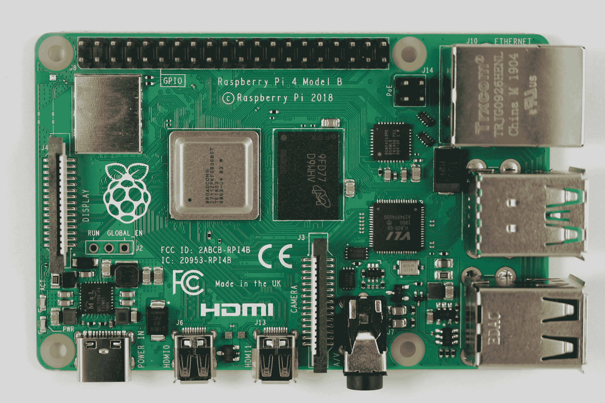
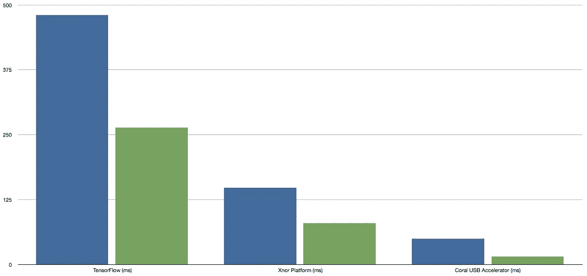

# 测量机器学习

> 原文：<https://towardsdatascience.com/measuring-machine-learning-945a47bd3750?source=collection_archive---------12----------------------->

## 从台式机，到单板机，再到微控制器

Talking at *Crowd Supply’s* [*Teardown*](https://www.crowdsupply.com/teardown/portland-2019) *conference in Portland, OR, on Saturday the 22nd of June 2019.*

*这是我 2019 年 6 月在俄勒冈州波特兰市举行的 Crowd Supply*[*拆机*](https://www.crowdsupply.com/teardown/portland-2019) *大会上的演讲记录。虽然视频是给定的谈话，但文字稿已经扩展了一些自它出现以来发生的事件的细节。*

机器学习传统上与重型、耗电的处理器联系在一起。它是在大型服务器上完成的。即使采集数据的传感器、摄像头和麦克风本身是本地的，控制它们的计算机却在远处，决策过程都托管在云中。但这正在改变，事情正在走向边缘。

现在，对于任何已经存在一段时间的人来说，这不会是一个惊喜，因为在整个行业的历史中，取决于技术的状态，我们似乎在瘦客户端和胖客户端架构之间摇摆不定。要么我们的大部分计算能力和存储隐藏在机架中，有时是远程服务器，要么是在离家更近的大量分布式系统中。我们又回到了分布式系统。或者至少是两者的混合体。这并不奇怪，机器学习有一个相当好的划分，可以在开发和部署之间进行。

最初，算法是在一大组样本数据上训练的，这通常需要一个快速强大的机器或集群，但然后将训练好的网络部署到需要实时解释真实数据的应用程序中，这非常适合低功耗的分布式系统。毫无疑问，在这个部署或“推理”阶段，我们看到了向本地处理或边缘计算的转变，如果你想用最新的术语来说，就是现在。

这是一件好事。最近，马萨诸塞大学阿姆赫斯特分校的研究人员为训练几种常见的大型人工智能模型进行了生命周期评估。他们发现，这一过程可以排放相当于超过 62.6 万磅的二氧化碳——几乎是普通美国汽车一生排放量的五倍。

[](https://www.datawrapper.de/_/VQEvf/)

Source: Strubell et al. (📊: MIT Technology)

现在我已经听到了很多关于这项研究的消息，我对它有一些问题，以及它如何看待机器学习。首先，它关注的机器学习类型是自然语言处理(NLP)模型，这是社区中正在发生的事情的一小部分。

但这也是基于他们自己的学术工作，他们的[最后一篇论文](https://arxiv.org/abs/1804.08199)，他们发现建立和测试最终论文价值模型的过程需要在六个月的时间内训练 4789 个模型。这不是我在现实世界中训练和建立任务模型的经验。这种分析到目前为止还不错，但是它忽略了一些关于如何使用模型的事情，关于开发和部署这两个阶段。

因为使用一个经过训练的模型并不需要花费任何资源来训练它，就像软件一样，一旦经过训练，模型就不再是实物了。它不是一个物体。

一个人使用它并不能阻止其他人使用它。

你必须将沉没成本分摊给使用它的每个人或每个对象——可能是数千甚至数百万个实例。在一些会被大量使用的东西上投入很多是可以的。这也忽略了这些模型可能存在多久的事实。

我成年后的第一份工作是在一家现已倒闭的国防承包商工作，当时我刚从大学毕业。在那里，除了其他事情，我建立了视频压缩的神经网络软件。要明确的是，这是在第一次，也许是第二次，机器学习流行的时候，回到 90 年代初，那时机器学习还被称为神经网络。

我围绕神经网络构建的压缩软件在视频流中留下了相当具体的假象，如今我仍不时在视频中看到某些大型制造商的产品中出现这些假象，这些制造商可能在国防承包商破产后以低价收购了该承包商的知识产权。

那些网络，大概现在被埋在一个包裹在黑盒子里的软件堆栈的底部，外面写着“*这里是魔法*”——我留下的文档可能是那么糟糕——因此仍然存在，大约 25 到 30 年后。

这使得接近预先训练好的模型变得相当重要，也就是俗称的“模型动物园”。因为当你在一个训练过的模型和一个二进制文件，模型被训练过的数据集和源代码之间做类比时。事实证明，这些数据对你——或者至少对大多数人——没有训练好的模型有用。

因为让我们现实一点。机器学习最近成功背后的秘密不是算法，这种东西已经潜伏在后台几十年了，等待计算赶上来。相反，机器学习的成功在很大程度上依赖于谷歌等公司设法建立的训练数据语料库。

在很大程度上，这些训练数据集是秘方，由拥有它们的公司和个人紧密持有。但这些数据集也变得如此之大，以至于大多数人，即使他们有，也无法存储它们，或基于它们训练新的模型。

所以不像软件，我们想要源代码而不是二进制代码，我实际上认为对于机器学习，我们大多数人想要模型，而不是数据。我们大多数人——开发人员、硬件人员——应该着眼于推理，而不是训练。

公平地说，我现在先声明这是一个相当有争议的观点。

然而，正是预训练模型的存在，让我们能够在机器学习的基础上轻松快速地构建原型和项目。这是那些不关注机器学习，而只想把事情做好的人真正想要的。

A [retro-rotary phone](https://medium.com/@aallan/a-retro-rotary-phone-powered-by-aiy-projects-and-the-raspberry-pi-e516b3ff1528) powered by AIY Projects Voice Kit and a Raspberry Pi. (📹: Alasdair Allan)

直到去年，中端单板计算机，如 Raspberry Pi，还在努力达到其能力的极限，在不与云通信的情况下，执行相当简单的任务，如热词语音检测。然而，在过去的一年里，事情发生了很大的变化。

因为在过去一年左右的时间里，人们意识到并不是所有的事情都可以或者应该在云中完成。旨在以大幅提高的速度运行机器学习模型的硬件的到来，以及在相对较低的功耗范围内，不需要连接到云，开始使基于边缘的计算对许多人来说更具吸引力。

围绕边缘计算的生态系统实际上已经[开始感觉到足够成熟，真正的工作终于可以完成了。这就是加速器硬件的用武之地，比如谷歌的 Coral Dev Board，这些都是领先的指标。](https://petewarden.com/2018/06/11/why-the-future-of-machine-learning-is-tiny/)


The [Coral Dev Board](https://medium.com/@aallan/hands-on-with-the-coral-dev-board-adbcc317b6af) from Google. (📷: Alasdair Allan)

在这个可笑大小的散热器下面是一个叫做边缘 TPU 的东西。这是我们在过去六个月左右看到的定制硅[浪潮的一部分。旨在加速边缘的机器学习推理，不需要云。不需要网络。拿数据来说。根据数据采取行动。把数据扔掉。](https://en.wikipedia.org/wiki/Application-specific_integrated_circuit)

但这是一个关于数据隐私的完全不同的话题。


The Edge TPU performance demo. On the left we have MobileNet SSD model running on the Edge TPU, on the right we have the same model running on the CPU of the Dev Board, a quad-core ARM Cortex A53\. The difference is dramatic, inferencing at around 75 frames per second, compared to 2 frames per second.

新一代定制硅的差异是巨大的，目前市场上有谷歌、英特尔和英伟达的硬件，较小公司的硬件即将推出，或已经投入生产。

其中一些旨在加速现有的嵌入式硬件，如 Raspberry Pi，而另一些则设计为模块上系统(SoM)单元的评估板，将于今年晚些时候量产。


An edge computing hardware zoo. Here we have the [Intel Neural Compute Stick 2](https://blog.hackster.io/getting-started-with-the-nvidia-jetson-nano-developer-kit-43aa7c298797) (left, top), a [Movidus Neural Compute Stick](https://blog.hackster.io/getting-started-with-the-nvidia-jetson-nano-developer-kit-43aa7c298797) (left, bottom), the [NVIDIA Jetson Nano](https://blog.hackster.io/getting-started-with-the-nvidia-jetson-nano-developer-kit-43aa7c298797) (middle, top), a [Raspberry Pi 3, Model B+](https://blog.hackster.io/meet-the-new-raspberry-pi-3-model-b-2783103a147) (middle, bottom), a [Coral USB Accelerator](https://medium.com/@aallan/hands-on-with-the-coral-usb-accelerator-a37fcb323553) (right, top), and finally the [Coral Dev Board](https://medium.com/@aallan/hands-on-with-the-coral-dev-board-adbcc317b6af) (right, bottom).

但在我们研究定制芯片之前，我们应该先看看树莓派。直到最近树莓 Pi 3 的型号 B+ 是你能买到的最快的树莓 Pi，它是围绕 64 位四核 ARM Cortex-A53 构建的，主频为 1.4GHz。你应该记住 Cortex-A53 不是一个性能核心，它被设计为一个中档核心，为了提高效率。

在[上安装 TensorFlow 的树莓 Pi](https://amzn.to/2UOSpcV) 曾经是一个困难的过程，然而到了去年年中，一切[都变得容易多了](https://medium.com/tensorflow/tensorflow-1-9-officially-supports-the-raspberry-pi-b91669b0aa0)。

```
**$** sudo apt-get install libatlas-base-dev
**$** sudo apt-get install python3-pip
**$** pip3 install tensorflow
```

然而，它实际上有点有趣，很难找到一个关于如何做推理的好教程。你会发现很多关于“如何开始张量流”的教程都在谈论训练模型，有些甚至在你训练完模型后就停止了。他们懒得用它。

我觉得这有点令人费解，大概这说明了目前围绕机器学习的社区文化。仍然有点模糊，学术性质的。你会在密码学中看到类似的怪异之处，很多关于数学的讨论，却很少使用它

无论如何，当你使用一个物体检测模型，比如 MobileNet，你期望返回一个边界框时，这大概就是你对一幅图像进行推理的方式。

```
def inference_tf(image, model, label):
  labels = ReadLabelFile(label) with tf.gfile.FastGFile(model, 'rb') as f:
  graph_def = tf.GraphDef()
  graph_def.ParseFromString(f.read()) with tf.Session(config=tf_config) as sess:
  sess.graph.as_default()
  tf.import_graph_def(graph_def, name='') picture = cv2.imread(image)
  initial_h, initial_w, channels = picture.shape
  frame = cv2.resize(picture, (300, 300))
  frame = frame[:, :, [2, 1, 0]]  # BGR2RGB
  frame = frame.reshape(1, frame.shape[0], frame.shape[1], 3) **out = sess.run([sess.graph.get_tensor_by_name('num_detections:0'),
              sess.graph.get_tensor_by_name('detection_scores:0'),
              sess.graph.get_tensor_by_name('detection_boxes:0'),
              sess.graph.get_tensor_by_name('detection_classes:0')],
              feed_dict={'image_tensor:0': frame})** num_detections = int(out[0][0])
  for i in range(num_detections):
    classId = int(out[3][0][i])
    score = float(out[1][0][i])
    print(labels[classId], 'score = ', score)
```

给我们的代码一个包含两个可识别对象[的](https://gist.github.com/aallan/fbdf008cffd1e08a619ad11a02b74fa8)测试图像[，一个香蕉和一个苹果，给了我们合理形状的边界框。](https://www.dropbox.com/sh/osmt73s6f0uuw5k/AACYOaB1ezJUC2JuWA4wQg4Wa?dl=0&preview=fruit.jpg)


Our [test image](https://www.dropbox.com/sh/osmt73s6f0uuw5k/AACYOaB1ezJUC2JuWA4wQg4Wa?dl=0&preview=fruit.jpg) 🍎🍌and resulting bounding boxes.

当[使用谷歌的 MobileNet 模型 v2 和 v1 对](https://medium.com/@aallan/benchmarking-edge-computing-ce3f13942245)进行基准测试时，运行代码给我们[大约每秒 2 帧](https://medium.com/@aallan/benchmarking-edge-computing-ce3f13942245)。现在，v1 模型的处理器密集程度比 v2 稍低，通常返回的检测结果可信度也稍低。我还使用了一种叫做“深度方向可分离卷积”的东西来减少模型的大小和复杂性，这样会降低检测的可信度，但会加快速度。无论如何，每秒 2 帧并不太好。但是它给了我们一个码尺来查看加速器硬件。

现在，英特尔率先向市场推出旨在加速机器学习的定制芯片。他们实际上远远领先于其他人，因为他们[收购了](https://www.vox.com/2016/9/6/12810246/intel-buying-movidius)一家名为 Movidius 的初创公司，然后在 2016 年重新命名了他们的芯片。采用有点缓慢，但定制硅已经在许多地方出现，大多数你看到宣传自己为机器学习加速器的板、卡、棒和其他部件实际上都基于它。

我们来看看英特尔自己的产品，叫做[神经计算棒](https://software.intel.com/en-us/neural-compute-stick)。事实上，已经有两代英特尔硬件围绕两代 Movidius 芯片发展起来。

我的桌子上有这两个，不出所料，我是一个早期采用者。


The Intel Neural Compute Stick 2\. (📷: Alasdair Allan)

现在事情开始变得有点棘手了。因为不幸的是，你不能只在英特尔的硬件上使用 TensorFlow。你必须使用他们的 [OpenVINO](https://software.intel.com/en-us/openvino-toolkit) 框架，当然这意味着你不能只是使用现成的 TensorFlow 模型。

幸运的是，你可以[将](https://medium.com/@aallan/benchmarking-edge-computing-ce3f13942245) TensorFlow 模型[转换为 OpenVINO 的 IR 格式](https://docs.openvinotoolkit.org/latest/_docs_MO_DG_prepare_model_convert_model_Convert_Model_From_TensorFlow.html)，这很好，因为如果你试图比较事情的时间，你可能会希望所有东西都或多或少保持相同，这意味着我真的需要在这里和其他地方使用相同的模型。然而，这被证明是一个症结，因为我们需要转换 TensorFlow 模型的软件不包括在安装在树莓 Pi 上[的 OpenVINO 工具包的精简版本中。](https://medium.com/@aallan/getting-started-with-the-intel-neural-compute-stick-2-and-the-raspberry-pi-6904ccfe963?fbclid=IwAR11EWFWPwAW6tB2x58h1dbqI3NSwSqnnAixzaerEIqsdKWYOq2im69DQrY)

这意味着我们需要一台运行 Ubuntu Linux 并安装了 OpenVINO 的 x86 机器。幸运的是，我们不需要连接神经计算棒。我们只需要一个完整的 OpenVINO 安装，我们可以在云中完成。因此，最简单的方法是在像数字海洋这样的云提供商上启动一个实例[，然后在云实例上安装 OpenVINO 工具包并运行模型优化器，这是一款可以将我们的 TensorFlow 模型转换为英特尔的 OpenVINO IR 格式的软件。](https://m.do.co/c/d0ab0d416e54)

不幸的是，事实证明将模型从 TensorFlow 转换到 OpenVINO 是一种黑色艺术，并且除了最基本的模型之外，说明[并没有真正涵盖如何转换任何东西。不是公式化的。据我所知，获得这方面帮助的最好也是唯一的地方是英特尔开发人员专区的](https://docs.openvinotoolkit.org/latest/_docs_MO_DG_prepare_model_convert_model_Convert_Model_From_TensorFlow.html#Convert_From_TF)[计算机视觉](https://software.intel.com/en-us/forums/computer-vision)论坛。整个事情非常令人沮丧，需要对你要转换的模型的细节有一个适度深入的理解。

但是一旦你最终转换了你的模型，你就可以用你的图像来反对它。代码略有不同，但只有在细节上，基本内容是一样的。

```
def inference_openvino(image, model, weights, label):
  labels = ReadLabelFile(label) plugin = IEPlugin(device="MYRIAD")
  net = IENetwork(model=model, weights=weights) input_blob = next(iter(net.inputs))
  out_blob = next(iter(net.outputs)) exec_net = plugin.load(network=net) picture = cv2.imread(image)
  initial_h, initial_w, channels = picture.shape
  frame = cv2.resize(picture, (w, h))
  frame = frame.transpose((2, 0, 1)) 
  frame = frame.reshape((n, c, h, w)) **res = exec_net.infer(inputs={input_blob: frame})** if res:
   res = res[out_blob]
   for obj in res[0][0]:
     if ( obj[2] > 0.6):
       class_id = int(obj[1])
       print(labels[class_id], 'score = ', obj[2])
```

这里我们得到了更好的性能，大约每秒 10 帧。因此，通过将您的推理卸载到英特尔的 Movidius 芯片上，我们看到了 5 倍的改进。尽管你应该记住我们在这里对神经计算棒并不完全公平，但 Raspberry Pi 3 只有 USB 2，而神经计算棒是 USB 3 设备。会有节流问题，所以你看不到全速优势，你可以看到。


The [NVIDIA Jetson Nano](https://blog.hackster.io/getting-started-with-the-nvidia-jetson-nano-developer-kit-43aa7c298797). (📷: Alasdair Allan)

接下来是 [NVIDIA Jetson Nano](https://blog.hackster.io/getting-started-with-the-nvidia-jetson-nano-developer-kit-43aa7c298797) 。围绕一个 64 位四核 Arm [Cortex-A57](https://developer.arm.com/products/processors/cortex-a/cortex-a57) CPU 运行在 1.43GHz，旁边是一个 NVIDIA [Maxwell](https://en.wikipedia.org/wiki/Maxwell_%28microarchitecture%29) GPU 和 128 [CUDA 核心](https://en.wikipedia.org/wiki/CUDA)。这是一个相当重的硬件，它真的需要可笑大小的散热器。

现在，理论上我们可以将 TensorFlow 模型放在 NVIDIA 硬件上，但事实证明，虽然它可以工作，但一切都运行得非常慢。傻乎乎地慢慢。看着计时，我有点怀疑“本地”TensorFlow 是否真的被卸载到 GPU 上。如果你想让事情快速运行，你需要使用 NVIDIA 的 TensorRT 框架优化你的 TensorFlow 模型，可以预见的是[这是愚蠢的困难](https://gist.github.com/aallan/69333770aec3023b6cb304698fd1dbb1)。虽然实际上不像试图使用英特尔的 OpenVINO 工具包那样不透明。


TensorFlow (on the left, dark blue bars) and TensorRT models (on the right, the light blue bars).

然而，在使用 TensorRT 优化您的模型后，事情进行得更快了，Jetson Nano 具有大约每秒 15 帧的[推理性能](https://medium.com/@aallan/benchmarking-edge-computing-ce3f13942245)。


The [Coral Dev Board](https://medium.com/@aallan/hands-on-with-the-coral-dev-board-adbcc317b6af) from Google. (📷: Alasdair Allan)

回到 [Coral Dev 板](https://medium.com/@aallan/hands-on-with-the-coral-dev-board-adbcc317b6af)。该板是围绕 ARM 四核 Cortex-A53 构建的，带有一个可移动的模块上系统，带有谷歌的 [Edge TPU](https://cloud.google.com/edge-tpu/) 。这是他们的加速器硬件做所有的工作。Dev 板本质上是 EdgeTPU 的演示板。但是，与英特尔和 Movidius 不同的是，看起来谷歌并不打算只销售硅片。如果你想在 TPU 边缘地区制造产品，你必须在 SoM 上购买，今年晚些时候它将会大量上市。


The [Coral USB Accelerator](https://medium.com/@aallan/hands-on-with-the-coral-usb-accelerator-a37fcb323553). (📷: Alasdair Allan)

然而，你也可以在类似神经计算棒的形状因子中获得 EdgeTPU，尽管谷歌的 [USB 加速器](https://medium.com/@aallan/hands-on-with-the-coral-usb-accelerator-a37fcb323553)棒有一个 USB-C 连接器。

可以预见的是，你当然不能只使用现成的张量流模型。Coral hardware 希望 TensorFlow Lite 模型能够在 Edge TPU 上运行。


这是量化第一次出现。TensorFlow Lite 旨在在移动和嵌入式硬件上运行特别优化(量化)的模型。神经网络的量化使用允许降低权重的精度表示的技术，并且可选地，激活 **s** 用于存储和计算。

本质上，我们用 8 位来表示张量，而不是 32 位数字。这使得低端硬件上的事情更容易，但也使得硬件上的事情更容易优化，因此有了边缘 TPU。


一旦您将 TensorFlow 模型转换为 TensorFlow Lite，这与您的预期一样痛苦，并且只适用于以“量化感知”方式训练的模型。你必须把模型扔给 EdgeTPU 编译器。这曾是网络版，但现在也有了离线版。

```
def inference_edgetpu(image, model):
   engine = DetectionEngine(model)
   labels = ReadLabelFile(label) img = Image.open(image)
   initial_h, initial_w = img.size
   frame = img.resize((300, 300)) **ans = engine.DetectWithImage(frame, threshold=0.05,
                                relative_coord=False, top_k=10)** if ans:
     for obj in ans:
       print(labels[obj.label_id], 'score = ', obj.score)
```

另一方面，一旦你有了 TensorFlow Lite 格式的模型，使用推理机的代码就非常简单了。运行速度也快了很多，我们在这里看到的是每秒 50 到 60 帧。

我们也是吗？嗯，看起来[这个](http://bit.ly/edge-benchmark) …


谷歌的 EdgeTPU 击败了所有竞争者，甚至当我通过 Raspberry Pi 上的 USB 2 连接 USB 加速器而不是使用完整的 USB 3 连接来抑制它时。当连接到 USB 3 时，我希望它的性能或多或少与开发板相当。

不出所料，Jetson Nano 位居第二，两代英特尔硬件都在后面，虽然他们有先发优势，但这也意味着硬件时代开始显现。


Inferencing speeds in milli-seconds for MobileNet SSD V1 (orange) and MobileNet SSD V2 (red) across all tested platforms. Low numbers are good!

那么，优势 TPU 硬件胜出？

不，这么快。Coral 硬件的一大优势是量化，如果我们在其他平台上使用 TensorFlow Lite 会发生什么。嗯，它在英特尔硬件上根本不能工作，只有 OpenVINO 支持。

然而，尽管现在还为时尚早，TensorFlow Lite 最近[引入了对 GPU 推理加速的支持](https://medium.com/tensorflow/tensorflow-lite-now-faster-with-mobile-gpus-developer-preview-e15797e6dee7)。使用具有 GPU 支持的 TensorFlow Lite 运行模型应该可以减少在 Jetson Nano 上进行推理所需的时间。这使得 NIVIDIA 和 Google 平台之间的差距有可能在未来缩小。据我所知，大约一周前，他们在努力追捕。

但我们能做的，是再看看树莓派。

可惜 Google 维护的官方 TensorFlow wheel 没有收录 TensorFlow Lite，真的不知道为什么。但幸运的是，有一个[社区维护的轮子](https://github.com/PINTO0309/Tensorflow-bin)可以做到这一点。

```
**$** sudo apt-get update
**$** sudo apt-get install build-essential
**$** sudo apt-get install git
**$** sudo apt-get install libatlas-base-dev
**$** sudo apt-get install python3-pip
**$** git clone [https://github.com/PINTO0309/Tensorflow-bin.git](https://github.com/PINTO0309/Tensorflow-bin.git)
**$** cd Tensorflow-bin
**$** pip3 install tensorflow-1.13.1-cp35-cp35m-linux_armv7l.whl
```

使用 TensorFlow Lite 的代码[与 TensorFlow 有些不同，比它的老大哥更深入底层。但是看起来差不多。](http://bit.ly/rpi-tflite-benchmark)

```
def inference_tf(image, model, label):
 labels = ReadLabelFile(label) interpreter = tf.lite.Interpreter(model_path=model)
 interpreter.allocate_tensors() input_details = interpreter.get_input_details()
 output_details = interpreter.get_output_details()
 height = input_details[0]['shape'][1]
 width = input_details[0]['shape'][2]
 floating_model = False picture = cv2.imread(image)
 initial_h, initial_w, channels = picture.shape
 frame = cv2.resize(picture, (width, height))
 input_data = np.expand_dims(frame, axis=0) interpreter.set_num_threads(4)
 interpreter.set_tensor(input_details[0]['index'], input_data)
 **interpreter.invoke()** detected_boxes = interpreter.get_tensor(output_details[0]['index'])
 detected_class = interpreter.get_tensor(output_details[1]['index'])
 detected_score = interpreter.get_tensor(output_details[2]['index'])
 num_boxes = interpreter.get_tensor(output_details[3]['index']) for i in range(int(num_boxes)):
   classId = int(detected_class[0][i])
   score = detected_score[0][i]
   print(labels[classId], 'score = ', score)
```

我们[看到原始 TensorFlow 图和使用 TensorFlow Lite 的新结果之间的推理速度增加了大约 2 倍。](https://blog.hackster.io/benchmarking-tensorflow-and-tensorflow-lite-on-the-raspberry-pi-43f51b796796)


左边的黄色条是 TensorFlow Lite 结果，右边的红色条是我们的原始 TensorFlow 结果。似乎对物体检测的可信度没有任何影响。


这让你怀疑是否有量化的东西。因为看起来你真的不需要更多的准确性。

就在上个月，Xnor.ai 终于发布了他们的 AI2GO 平台公测版。他们一直在进行封闭测试，但我听到关于他们的传言已经有一段时间了。他们做的不是 TensorFlow，甚至不是很接近。这是新一代的二进制体重模型。有一些技术[白皮书](https://arxiv.org/abs/1603.05279)，我目前正在费力地阅读它们。


但是测试这些东西很容易。您可以在线配置一个模型“包”,然后将其下载并安装为 Python wheel。

```
**$** pip3 install xnornet-1.0-cp35-abi3-linux_armv7l.whl
Processing ./xnornet-1.0-cp35-abi3-linux_armv7l.whl
Installing collected packages: xnornet
Successfully installed xnornet-1.0
**$**
```

推理就是这么简单，一个图像进去，一个检测到的物体列表和相关的边界框出来。

```
def inference_xnor(image):
  model = xnornet.Model.load_built_in()
  img = Image.open(image)
  initial_w, initial_h = img.size 
  picture = img.resize((300, 300)) **boxes = model.evaluate(xnornet.Input.rgb_image(picture.size,
                                                 picture.tobytes()))** for box in boxes:
    label = box.class_label.label
    print ('Found', label)
```

然而，给 AI2GO 我们的[测试图像](https://www.dropbox.com/sh/osmt73s6f0uuw5k/AACYOaB1ezJUC2JuWA4wQg4Wa?dl=0&preview=fruit.jpg)包含两个[可识别的物体](https://gist.github.com/aallan/fbdf008cffd1e08a619ad11a02b74fa8)，一个香蕉和一个苹果，与我们习惯于 TensorFlow 的边界框相比，确实给了我们一些奇怪的边界框。


Our [test image](https://www.dropbox.com/sh/osmt73s6f0uuw5k/AACYOaB1ezJUC2JuWA4wQg4Wa?dl=0&preview=fruit.jpg) 🍎🍌and resulting bounding boxes for TensorFlow (left) and AI2GO binary weight models (right).

这有点不同。没有错。不疯狂。但绝对不一样。


但是把它放在一边，它真的很快，比 TensorFlow Lite 快 2 倍，TensorFlow Lite 比 tensor flow 快 2 倍。


将此结果与我们的[原始结果](https://medium.com/@aallan/benchmarking-edge-computing-ce3f13942245)进行比较，这使得树莓 Pi 3，模型 B+几乎可以与除 Edge TPU 之外的所有产品相竞争，当然，Edge 也使用量化模型。

这让你想知道我们是否已经提前开始优化硬件，只是有点太快了。如果我们可以从软件中获得那么多的杠杆作用，那么也许我们需要等到嵌入式领域的软件足够成熟，这样我们才知道优化什么？这也使得微软决定暂时坚持使用 FPGA，而不是像其他人一样推出自己的定制 ASIC，看起来更加明智。

只是一些值得思考的东西…



The new [Raspberry Pi 4](https://www.element14.com/community/view-product.jspa?fsku=3051885,3051886,3051887&nsku=02AH3161,02AH3162,02AH3164&COM=noscript-sw), Model B. (📷: [Alasdair Allan](http://twitter.com/aallan))

这也使得最近刚刚发布的[新款树莓 Pi 4，Model B](https://blog.hackster.io/meet-the-new-raspberry-pi-4-model-b-9b4698c284) 的到来更加有趣。因为虽然我们还不能运行 TensorFlow Lite，但我们可以让 TensorFlow 和 Xnor.ai AI2GO 框架在新板上工作。



Inferencing time in milli-seconds for the Raspberry Pi 3 (blue, left) and Raspberry Pi 4 (green, right).

NEON 的容量大约是 Raspberry Pi 3 的两倍，对于编写良好的 NEON 内核来说，我们可以期待这样的性能提升。正如预期的那样，我们[看到原始 TensorFlow 基准测试和 Raspberry Pi 4 的新结果之间的推理速度](https://blog.hackster.io/benchmarking-machine-learning-on-the-new-raspberry-pi-4-model-b-88db9304ce4)提高了大约 2 倍，同时使用 [Xnor AI2GO 平台](https://blog.hackster.io/benchmarking-the-xnor-ai2go-platform-on-the-raspberry-pi-628a82af8aea)的推理速度也有类似的提高。


然而，当我们从谷歌的 [Coral USB 加速器](https://medium.com/@aallan/hands-on-with-the-coral-usb-accelerator-a37fcb323553)的结果中看到一个更大的变化。Raspberry Pi 4 增加了 USB 3.0，这意味着我们看到原始结果和新结果之间的推理速度提高了大约 3 倍。


Inferencing time in milli-seconds for the for [MobileNet v1 SSD 0.75 depth model](http://download.tensorflow.org/models/object_detection/ssd_mobilenet_v1_0.75_depth_300x300_coco14_sync_2018_07_03.tar.gz) (left hand bars) and the [MobileNet v2 SSD model](http://download.tensorflow.org/models/object_detection/ssd_mobilenet_v2_coco_2018_03_29.tar.gz) (right hand bars), both trained using the [Common Objects in Context](http://cocodataset.org/#home) (COCO) dataset with an input size of 300×300\. The (single) bars for the Xnor AI2GO platform use their proprietary [binary weight model](https://www.xnor.ai/technical-papers/). All measurements on the Raspberry Pi 3, Model B+, are in **yellow**, measurements on the Raspberry Pi 4, Model B, in **red**. Other platforms are in **green**.

相反， [Coral USB 加速器](https://medium.com/@aallan/hands-on-with-the-coral-usb-accelerator-a37fcb323553)通过 USB 2 而不是新的 USB 3 总线连接时的推理时间实际上增加了 2 倍。这个有点令人惊讶的结果很可能是由于新的 Raspberry Pi 的架构变化。随着 [XHCI 主机](https://en.wikipedia.org/wiki/Extensible_Host_Controller_Interface)现在位于 PCI Express 总线的远端，系统中潜在地存在更多的延迟。根据流量模式，您可以想象，与流相反，阻塞使用通道可能会更慢。

新的 Raspberry Pi 4 的性能提升使其成为一个非常有竞争力的边缘机器学习推理平台，与所有定制芯片相比，它的表现相当好。

当然，在加速器硬件出现的同时，我们也看到了机器学习在低功耗硬件上的出现。

微控制器，不是微处理器，我到目前为止谈论的定制硅实际上是嵌入式硬件堆栈的高端。

今年早些时候在 TensorFlow 开发峰会上正式宣布的[是](https://blog.hackster.io/introducing-the-sparkfun-edge-34c9eb80a000)[面向微控制器的 TensorFlow Lite】。这是专门为裸机系统设计的 TensorFlow 发行版，核心库只有 16KB。绝对清楚。虽然玩加速器硬件很有趣，而且它确实很快，但我实际上有点认为这是边缘计算的未来。](https://www.tensorflow.org/lite/microcontrollers/overview)

现在还为时尚早，但我开始认为，未来一两年，机器学习实践中最大的增长领域很可能是推理，而不是训练。


The [OpenMV Cam H7 with an IR camera](https://blog.hackster.io/machine-vision-with-micropython-and-the-openmv-h7-camera-board-a815c6c6f65) running blob tracking during [ARM Dev Day](https://pages.arm.com/devday-resources.html). (📷: Alasdair Allan)

世界上有很多相机，这可能是我们最好的传感器，加入机器学习会让这些传感器变得更好。在微控制器上运行的 TensorFlow Lite 使这一点变得非常重要，它使这一点在那些相机中已经可用的功率和处理范围内变得容易实现。

你是否认为那是一个好主意是另一回事。


The SparkFun Edge board, top (left) and bottom (right).

[SparkFun Edge](https://blog.hackster.io/introducing-the-sparkfun-edge-34c9eb80a000) 是一块旋转起来充当微控制器 TensorFlow Lite 演示板的板。它是围绕 Ambiq Micro 的最新 [Apollo 3](https://ambiqmicro.com/static/mcu/files/Apollo3_Blue_MCU_Data_Sheet_v0_9_1.pdf) 微控制器构建的。这是一款 ARM Cortex-M4F，运行频率为 48MHz，采用 96MHz 突发模式，内置蓝牙。

它使用每 MHz 6 到 10 μA 的电流。因此，在深度睡眠模式下，蓝牙关闭时，功耗仅为 1 μA。这是非常低的功耗，Raspberry Pi 的功耗约为 400 mA，相比之下，ESP32 的功耗在 20 到 120 mA 之间。可能是最接近的比较，北欧的 nRF52840 大约消耗 17mA。该主板的核心芯片运行速度最快，功耗预算低于许多微控制器在深度睡眠模式下的功耗，它运行 TensorFlow Lite。

The TensorFlow Lite for Micro-controllers “Yes/No” demo.

在由单个硬币电池供电的微控制器板上进行实时机器学习，应该可以持续几个月，甚至几年。不需要云，不需要网络，没有私人信息离开董事会。

至少在公开市场上，目前这是在我们当前硬件能力的绝对极限下的机器学习，它不会比这更便宜或更弱，至少在最近[到](https://blog.hackster.io/say-hello-to-the-sparkfun-artemis-2af46ecfddec)之前。


The SparFun Artemis.

这是 [SparkFun Artemis](https://blog.hackster.io/say-hello-to-the-sparkfun-artemis-2af46ecfddec) 。同样的 Ambiq Apollo 3 芯片，在一个 10 × 15 mm 的模块中，应该在下个月的某个时候通过 FCC/CE 的批准，如果一切顺利，在那之后很快就可以量产了。

它完全兼容[Arduino](https://github.com/sparkfun/Arduino_Apollo3)，因为 SparkFun 已经在 Ambiq 的硬件抽象层之上构建了自己的内部 Arduino 内核。现在，您可以在 Arduino 开发环境中使用这款低功耗芯片，如果您需要更低的级别，可以从您的 Arduino 代码进入 HAL。


The “official” Google port of TensorFlow Lite for Micro-controllers.

当然，有人[将 TensorFlow 演示和用于微控制器的 TensorFlow Lite 一起移植到 Arduino 开发环境只是时间问题。结果是阿达果先到达那里。](https://blog.hackster.io/tensorflow-lite-ported-to-arduino-5e851c094ddc)

从 Arduino 环境中提供用于微控制器的 TensorFlow Lite 是一件大事，就像更多预训练模型的可用性一样，这将是新兴边缘计算市场中机器学习可访问性的巨大变化。可以说，或许推动 Espressif [ESP8266](https://www.espressif.com/en/products/hardware/esp8266ex/overview) 成功的主要因素之一是 Arduino 兼容性[的到来。](https://makezine.com/2015/04/01/esp8266-5-microcontroller-wi-fi-now-arduino-compatible/)

看看机器学习是否也会发生同样的事情，这将是一件令人着迷的事情。

## 链接到以前的基准

如果您对之前基准测试的细节感兴趣。

[](https://medium.com/@aallan/benchmarking-edge-computing-ce3f13942245) [## 基准边缘计算

### 比较 Google、Intel 和 NVIDIA 加速器硬件

medium.com](https://medium.com/@aallan/benchmarking-edge-computing-ce3f13942245) [](https://blog.hackster.io/benchmarking-tensorflow-and-tensorflow-lite-on-the-raspberry-pi-43f51b796796) [## 在 Raspberry Pi 上测试 TensorFlow 和 TensorFlow Lite

### 我最近坐下来对市场上出现的新加速器硬件进行了基准测试，旨在加快…

blog.hackster.io](https://blog.hackster.io/benchmarking-tensorflow-and-tensorflow-lite-on-the-raspberry-pi-43f51b796796) [](https://blog.hackster.io/benchmarking-the-xnor-ai2go-platform-on-the-raspberry-pi-628a82af8aea) [## 在 Raspberry Pi 上测试 Xnor AI2GO 平台

### 我最近坐下来对市场上出现的新加速器硬件进行了基准测试，旨在加快…

blog.hackster.io](https://blog.hackster.io/benchmarking-the-xnor-ai2go-platform-on-the-raspberry-pi-628a82af8aea) [](https://blog.hackster.io/benchmarking-machine-learning-on-the-new-raspberry-pi-4-model-b-88db9304ce4) [## 在新的 Raspberry Pi 4，Model B 上对机器学习进行基准测试

### 新的树莓派快了多少？这样快多了。

blog.hackster.io](https://blog.hackster.io/benchmarking-machine-learning-on-the-new-raspberry-pi-4-model-b-88db9304ce4) 

## 入门指南的链接

如果你对我在[基准测试](https://medium.com/@aallan/benchmarking-edge-computing-ce3f13942245)期间使用的任何加速器硬件感兴趣，我已经为我在分析期间查看的谷歌、英特尔和英伟达硬件整理了入门指南。

[](https://medium.com/@aallan/hands-on-with-the-coral-dev-board-adbcc317b6af) [## 手动珊瑚开发板

### 开始使用谷歌新的 Edge TPU 硬件

medium.com](https://medium.com/@aallan/hands-on-with-the-coral-dev-board-adbcc317b6af) [](https://medium.com/@aallan/how-to-use-a-raspberry-pi-to-flash-new-firmware-onto-the-coral-dev-board-503aacf635b9) [## 如何使用 Raspberry Pi 将新固件刷新到 Coral Dev 板上

### 开始使用谷歌新的 Edge TPU 硬件

medium.com](https://medium.com/@aallan/how-to-use-a-raspberry-pi-to-flash-new-firmware-onto-the-coral-dev-board-503aacf635b9) [](https://medium.com/@aallan/hands-on-with-the-coral-usb-accelerator-a37fcb323553) [## 亲手操作 Coral USB 加速器

### 开始使用谷歌新的 Edge TPU 硬件

medium.com](https://medium.com/@aallan/hands-on-with-the-coral-usb-accelerator-a37fcb323553) [](https://blog.hackster.io/getting-started-with-the-intel-neural-compute-stick-2-and-the-raspberry-pi-6904ccfe963) [## 开始使用英特尔神经计算棒 2 和 Raspberry Pi

### 英特尔 Movidius 硬件入门

blog.hackster.io](https://blog.hackster.io/getting-started-with-the-intel-neural-compute-stick-2-and-the-raspberry-pi-6904ccfe963) [](https://blog.hackster.io/getting-started-with-the-nvidia-jetson-nano-developer-kit-43aa7c298797) [## NVIDIA Jetson Nano 开发套件入门

### 英伟达基于 GPU 的硬件入门

blog.hackster.io](https://blog.hackster.io/getting-started-with-the-nvidia-jetson-nano-developer-kit-43aa7c298797)